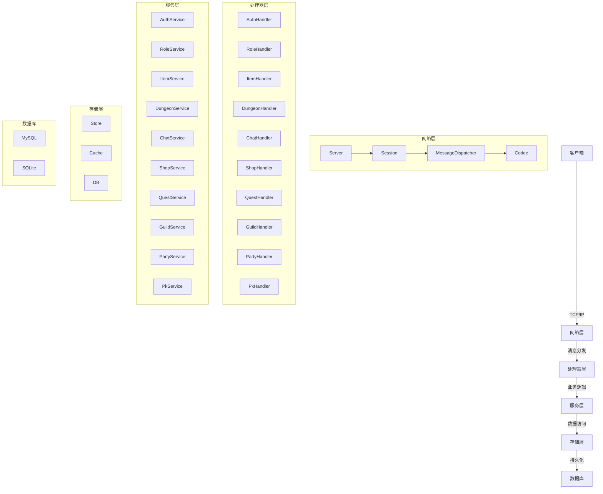
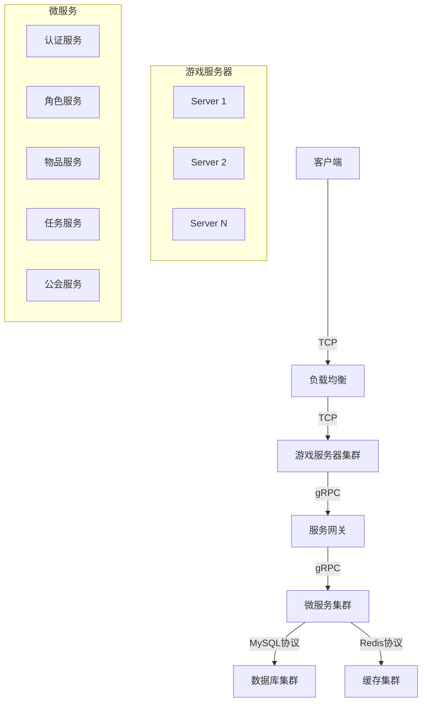

# Go 服务端技术架构文档

## 1. 系统架构

### 1.1 整体架构

Go 服务端采用分层架构设计，清晰分离不同职责的代码，提高代码的可维护性和可测试性。



### 1.2 核心架构组件

| 组件 | 职责 | 位置 | 说明 |
|------|------|------|------|
| 网络层 | 处理客户端连接、消息编解码 | internal/network/ | 基于TCP实现的自定义协议 |
| 处理器层 | 处理具体的业务请求 | internal/game/handlers/ | 按模块划分的处理器 |
| 服务层 | 实现核心业务逻辑 | internal/game/*_service/ | 封装业务规则和流程 |
| 存储层 | 数据访问和持久化 | store/ | 统一的数据访问接口 |
| 数据库 | 数据持久化 | - | 支持MySQL和SQLite |
| 配置管理 | 系统配置 | internal/utils/config/ | 基于YAML的配置管理 |
| 日志系统 | 系统日志 | internal/utils/logger/ | 结构化日志 |

## 2. 模块划分

### 2.1 核心模块

| 模块 | 主要职责 | 关键文件 | 依赖关系 |
|------|----------|----------|----------|
| 认证系统 | 玩家登录、注册 | internal/game/auth_service/auth.go | - |
| 角色系统 | 角色管理、属性计算 | internal/game/handlers/role.go | 认证系统 |
| 背包系统 | 物品管理、背包操作 | internal/game/handlers/item.go | 角色系统 |
| 副本系统 | 副本管理、战斗系统 | internal/game/handlers/dungeon.go | 角色系统 |
| 聊天系统 | 玩家通信、社交 | internal/game/handlers/chat.go | 角色系统 |
| 商店系统 | NPC商店、物品购买 | internal/game/handlers/shop.go | 背包系统 |
| 任务系统 | 任务管理、进度跟踪 | internal/game/handlers/quest.go | 角色系统 |
| 公会系统 | 公会管理、社交功能 | internal/game/handlers/guild.go | 角色系统 |
| 进入游戏 | 登录流程、数据加载 | - | 认证系统 |
| 组队系统 | 队伍管理、多人游戏 | internal/game/handlers/party_handler.go | 角色系统 |
| PK系统 | 玩家对战、竞技场 | internal/game/handlers/pk.go | 角色系统 |
| 成就系统 | 成就管理、奖励 | internal/game/handlers/achievement.go | 角色系统 |
| 冒险系统 | 冒险任务、探索 | internal/game/handlers/adventure.go | 角色系统 |
| 制作系统 | 物品制作、合成 | internal/game/handlers/make.go | 背包系统 |
| 市场系统 | 玩家交易、市场 | internal/game/handlers/market.go | 背包系统 |
| 在线商城 | 游戏内商城、购买 | internal/game/handlers/onlinemall.go | 背包系统 |
| 排名系统 | 玩家排行榜、竞争 | internal/game/handlers/rank.go | 角色系统 |
| 事件系统 | 游戏事件、活动 | internal/game/handlers/event.go | 角色系统 |
| 日志系统 | 游戏日志、记录 | internal/game/handlers/tlog.go | - |
| 拍卖系统 | 拍卖行、竞价 | internal/game/handlers/auction.go | 背包系统 |

### 2.2 目录结构

```
dnf-go-server/
├── cmd/                    # 命令行入口
│   └── server/             # 服务器命令
│       ├── cmd/            # 命令定义
│       └── main.go         # 主入口
├── internal/               # 内部代码
│   ├── game/               # 游戏逻辑
│   │   ├── handlers/       # 处理器
│   │   ├── auth_service/   # 认证服务
│   │   ├── party_service/  # 组队服务
│   │   ├── pk_service/     # PK服务
│   │   ├── adventure_service/ # 冒险服务
│   │   └── achievement_service/ # 成就服务
│   ├── db/                 # 数据库
│   │   └── models/         # 数据模型
│   ├── network/            # 网络
│   │   ├── message/        # 消息处理
│   │   ├── server.go       # 服务器
│   │   ├── session.go      # 会话
│   │   └── codec.go        # 编解码
│   └── utils/              # 工具
│       ├── config/         # 配置
│       └── logger/         # 日志
├── proto/                  # Protobuf定义
│   └── dnf/                # 游戏消息
│       └── v1/             # 版本
├── server/                 # 服务器
│   ├── router/             # 路由
│   └── auth/               # 认证
├── store/                  # 存储
│   ├── db/                 # 数据库实现
│   ├── item.go             # 物品存储
│   ├── account.go          # 账户存储
│   └── store.go            # 存储接口
├── tests/                  # 测试
├── configs/                # 配置文件
├── scripts/                # 脚本
├── docs/                   # 文档
├── Makefile                # 构建脚本
├── go.mod                  # 依赖管理
└── README.md               # 说明文档
```

## 3. 核心技术选型

### 3.1 编程语言

| 技术 | 版本 | 选型理由 |
|------|------|----------|
| Go | 1.20+ | 编译型语言，性能优异，并发支持好，生态成熟，适合高并发后端服务 |

### 3.2 网络通信

| 技术 | 版本 | 选型理由 |
|------|------|----------|
| TCP/IP | - | 可靠的传输协议，适合游戏服务器的实时通信需求 |
| Protobuf | 3.0+ | 高效的二进制序列化协议，压缩率高，序列化速度快，适合游戏数据传输 |
| gRPC | 1.50+ | 高性能的RPC框架，基于HTTP/2，支持流式传输，适合服务间通信 |

### 3.3 数据存储

| 技术 | 版本 | 选型理由 |
|------|------|----------|
| MySQL | 5.7+ | 成熟的关系型数据库，适合存储结构化游戏数据，支持事务 |
| SQLite | 3.30+ | 轻量级嵌入式数据库，适合开发和测试环境，部署简单 |
| Redis | 7.0+ | 高性能内存数据库，适合缓存热点数据，提高查询速度 |

### 3.4 开发工具

| 工具 | 版本 | 选型理由 |
|------|------|----------|
| Go Modules | - | 官方依赖管理工具，简化依赖管理 |
| Make | - | 构建工具，自动化构建和测试流程 |
| Docker | 20.04+ | 容器化部署，简化环境配置和部署流程 |
| golangci-lint | 1.50+ | 代码质量检查工具，提高代码质量 |

### 3.5 第三方库

| 库 | 版本 | 用途 | 选型理由 |
|-----|------|------|----------|
| gorm.io/gorm | 1.25+ | ORM框架 | 功能强大，API友好，支持多种数据库 |
| google.golang.org/protobuf | 1.30+ | Protobuf支持 | 官方库，与gRPC无缝集成 |
| google.golang.org/grpc | 1.50+ | gRPC框架 | 高性能RPC，适合服务间通信 |
| github.com/spf13/viper | 1.16+ | 配置管理 | 支持多种配置格式，热加载 |
| github.com/rs/zerolog | 1.30+ | 日志库 | 结构化日志，性能优异 |
| github.com/go-redis/redis/v8 | 8.11+ | Redis客户端 | 功能完整，API友好 |
| github.com/golang-migrate/migrate/v4 | 4.15+ | 数据库迁移 | 支持多种数据库，迁移管理 |

## 4. 核心功能实现

### 4.1 网络层

#### 4.1.1 服务器

```go
// internal/network/server.go
func NewServer(addr string) *Server {
    return &Server{
        addr:    addr,
        sessions: make(map[uint64]*Session),
        dispatcher: message.NewDispatcher(),
    }
}

func (s *Server) Start() error {
    // 启动TCP服务器
    // 处理客户端连接
    // 管理会话
}
```

#### 4.1.2 会话管理

```go
// internal/network/session.go
type Session struct {
    conn      net.Conn
    id        uint64
    roleID    uint64
    closed    bool
    sendQueue chan []byte
    server    *Server
}

func (s *Session) Start() {
    // 启动读写goroutine
    // 处理消息收发
}
```

#### 4.1.3 消息编解码

```go
// internal/network/codec.go
type Codec struct {}

func (c *Codec) Encode(msg proto.Message) ([]byte, error) {
    // Protobuf编码
}

func (c *Codec) Decode(data []byte, msg proto.Message) error {
    // Protobuf解码
}
```

### 4.2 处理器层

#### 4.2.1 认证处理器

```go
// internal/game/handlers/auth.go
func (h *AuthHandler) LoginHandler(sess *network.Session, msg proto.Message) {
    // 处理登录请求
    // 验证用户身份
    // 创建会话
}
```

#### 4.2.2 角色处理器

```go
// internal/game/handlers/role.go
func (h *RoleHandler) CreateRoleHandler(sess *network.Session, msg proto.Message) {
    // 处理角色创建
    // 验证参数
    // 创建角色数据
}
```

### 4.3 服务层

#### 4.3.1 认证服务

```go
// internal/game/auth_service/auth.go
type AuthService struct {
    store *store.Store
}

func (s *AuthService) Login(ctx context.Context, openID string) (*models.Account, error) {
    // 验证用户
    // 生成token
    // 返回账户信息
}
```

#### 4.3.2 背包服务

```go
// internal/game/item_service/item.go
type ItemService struct {
    store *store.Store
}

func (s *ItemService) AddItem(ctx context.Context, roleID uint64, itemIndex, count uint32, bind bool) error {
    // 检查背包空间
    // 添加物品
    // 更新背包
}
```

### 4.4 存储层

#### 4.4.1 存储接口

```go
// store/store.go
type Store struct {
    db    *gorm.DB
    redis *redis.Client
    cache *Cache
}

func NewStore(db *gorm.DB, redis *redis.Client) *Store {
    return &Store{
        db:    db,
        redis: redis,
        cache: NewCache(),
    }
}
```

#### 4.4.2 物品存储

```go
// store/item.go
func (s *Store) GetItems(ctx context.Context, roleID uint64) ([]*models.Item, error) {
    // 查询角色物品
    // 从缓存或数据库获取
}

func (s *Store) CreateItem(ctx context.Context, item *models.Item) error {
    // 创建物品
    // 写入数据库
    // 更新缓存
}
```

## 5. 关键设计模式

### 5.1 依赖注入

使用构造函数注入依赖，提高代码的可测试性和可维护性。

```go
// 示例：依赖注入
func NewAuthHandler(authService *auth_service.AuthService) *AuthHandler {
    return &AuthHandler{
        authService: authService,
    }
}
```

### 5.2 工厂模式

使用工厂方法创建对象，封装创建逻辑，提高代码的灵活性。

```go
// 示例：工厂模式
func NewStore(driver string, dsn string) (*Store, error) {
    switch driver {
    case "mysql":
        return newMySQLStore(dsn)
    case "sqlite":
        return newSQLiteStore(dsn)
    default:
        return nil, errors.New("unsupported driver")
    }
}
```

### 5.3 观察者模式

使用观察者模式处理事件通知，解耦事件发布者和订阅者。

```go
// 示例：观察者模式
type EventManager struct {
    observers map[EventType][]Observer
}

func (em *EventManager) Subscribe(eventType EventType, observer Observer) {
    em.observers[eventType] = append(em.observers[eventType], observer)
}

func (em *EventManager) Publish(eventType EventType, data interface{}) {
    for _, observer := range em.observers[eventType] {
        observer.OnEvent(eventType, data)
    }
}
```

### 5.4 策略模式

使用策略模式封装不同的算法，提高代码的可扩展性。

```go
// 示例：策略模式
type SortStrategy interface {
    Sort(items []*Item) []*Item
}

type PriceSortStrategy struct{}
func (s *PriceSortStrategy) Sort(items []*Item) []*Item {
    // 按价格排序
}

type LevelSortStrategy struct{}
func (s *LevelSortStrategy) Sort(items []*Item) []*Item {
    // 按等级排序
}
```

## 6. 性能优化策略

### 6.1 内存管理

- **对象池**：复用频繁创建的对象，减少GC压力
- **内存分配**：避免频繁的小内存分配，使用缓冲区
- **数据结构**：选择合适的数据结构，如使用map代替切片进行查找

### 6.2 并发优化

- **goroutine池**：限制goroutine数量，避免资源耗尽
- **通道**：使用带缓冲的通道，避免阻塞
- **互斥锁**：减少锁的范围，使用读写锁
- **原子操作**：对于简单的计数器，使用原子操作

### 6.3 数据库优化

- **索引**：为常用查询字段创建索引
- **缓存**：缓存热点数据，减少数据库查询
- **批量操作**：合并多个操作，减少数据库交互
- **连接池**：使用数据库连接池，减少连接建立开销

### 6.4 网络优化

- **消息压缩**：使用Protobuf等高效的序列化协议
- **批量发送**：合并小消息，减少网络包数量
- **心跳机制**：定期检测连接状态，及时清理无效连接
- **流量控制**：限制客户端消息频率，防止洪水攻击

## 7. 安全性设计

### 7.1 认证与授权

- **JWT**：使用JSON Web Token进行身份验证
- **权限检查**：对每个请求进行权限验证
- **防重放**：使用时间戳和nonce防止重放攻击

### 7.2 数据安全

- **加密传输**：使用TLS加密网络传输
- **敏感数据加密**：对敏感数据进行加密存储
- **输入验证**：对所有输入进行严格验证，防止注入攻击

### 7.3 防护措施

- **速率限制**：限制客户端请求频率，防止DoS攻击
- **防火墙**：配置防火墙规则，限制访问
- **日志审计**：记录所有关键操作，便于审计和排查

## 8. 部署与扩展性

### 8.1 部署架构



### 8.2 扩展性设计

- **水平扩展**：支持通过增加服务器节点扩展系统容量
- **服务拆分**：将大型服务拆分为小型微服务，提高系统的可维护性和扩展性
- **配置中心**：使用配置中心管理配置，支持动态配置更新
- **服务发现**：使用服务发现机制，支持服务的自动注册和发现

### 8.3 容器化部署

使用Docker容器化部署，简化部署流程，提高环境一致性。

```yaml
# docker-compose.yml示例
version: '3'
services:
  game-server:
    build: .
    ports:
      - "8080:8080"
    depends_on:
      - mysql
      - redis
  mysql:
    image: mysql:5.7
    environment:
      MYSQL_ROOT_PASSWORD: root
      MYSQL_DATABASE: game
  redis:
    image: redis:7.0
```

## 9. 监控与维护

### 9.1 监控系统

- **Prometheus**：收集系统指标，如CPU、内存、网络等
- **Grafana**：可视化监控数据，创建仪表盘
- **ELK Stack**：收集和分析日志
- **Alertmanager**：基于规则的告警系统

### 9.2 日志系统

- **结构化日志**：使用JSON格式记录日志，便于分析
- **日志级别**：根据消息重要性设置不同的日志级别
- **日志轮转**：定期轮转日志，防止磁盘空间耗尽
- **日志聚合**：将分布式系统的日志聚合到中央系统

### 9.3 维护工具

- **管理后台**：提供Web界面管理游戏数据
- **数据迁移工具**：支持数据库结构和数据的迁移
- **备份工具**：定期备份游戏数据，防止数据丢失
- **性能分析工具**：分析系统性能瓶颈

## 10. 技术挑战与解决方案

### 10.1 并发处理

**挑战**：游戏服务器需要处理大量并发连接，每个连接都需要实时响应。

**解决方案**：
- 使用goroutine处理每个连接
- 使用通道进行goroutine间通信
- 实现连接池和工作池
- 使用非阻塞I/O

### 10.2 数据一致性

**挑战**：分布式系统中，多个服务可能同时修改同一份数据，导致数据不一致。

**解决方案**：
- 使用数据库事务
- 实现乐观锁或悲观锁
- 使用分布式锁
- 实现最终一致性

### 10.3 性能瓶颈

**挑战**：随着用户量增加，系统可能出现性能瓶颈。

**解决方案**：
- 性能分析，找出瓶颈
- 数据库优化
- 缓存优化
- 代码优化
- 水平扩展

### 10.4 跨平台兼容性

**挑战**：需要支持不同平台的客户端。

**解决方案**：
- 使用跨平台的网络协议
- 统一的消息格式
- 抽象平台差异
- 充分测试

## 11. 未来技术规划

### 11.1 技术演进路线

| 阶段 | 目标 | 技术选型 | 时间估计 |
|------|------|----------|----------|
| 阶段1 | 基础功能实现 | Go 1.20, MySQL, Protobuf | 3个月 |
| 阶段2 | 性能优化 | Redis, 并发优化, 数据库优化 | 2个月 |
| 阶段3 | 微服务化 | gRPC, Kubernetes, 服务网格 | 3个月 |
| 阶段4 | 智能化 | 机器学习, 数据分析 | 4个月 |

### 11.2 潜在技术探索

- **WebAssembly**：使用WebAssembly提高游戏逻辑性能
- **边缘计算**：将部分计算任务迁移到边缘节点，减少延迟
- **区块链**：探索使用区块链技术实现游戏内资产的去中心化管理
- **AI**：使用AI技术优化游戏体验，如智能NPC、个性化推荐

## 12. 总结

Go 服务端采用现代化的技术栈和架构设计，具有以下优势：

1. **高性能**：Go语言的并发特性和编译型语言的优势，使得服务器能够处理大量并发连接
2. **可维护性**：清晰的分层架构和模块化设计，提高代码的可维护性
3. **可扩展性**：支持水平扩展，能够应对不断增长的用户量
4. **安全性**：多层次的安全设计，保障系统和数据的安全
5. **可靠性**：完善的错误处理和监控机制，提高系统的可靠性

通过本技术架构文档，开发团队可以清晰了解系统的整体设计和技术选型，为后续的开发和维护工作提供指导。同时，文档也为新成员快速熟悉系统提供了参考。