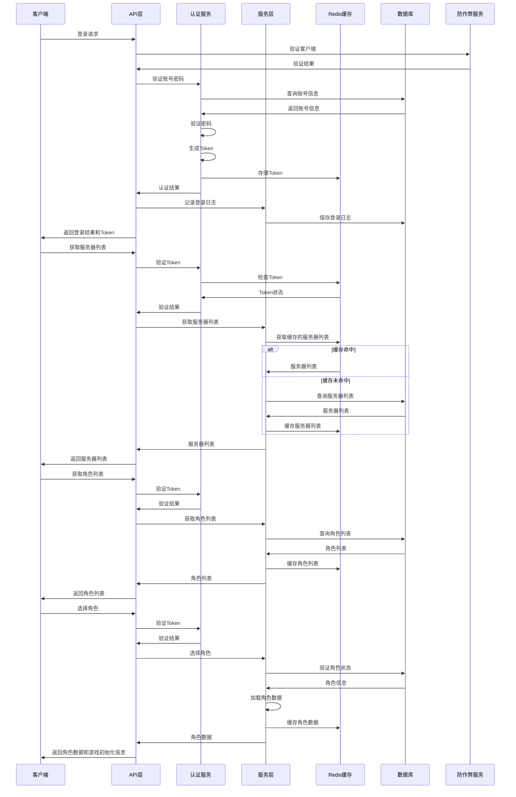
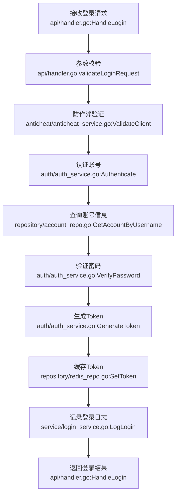
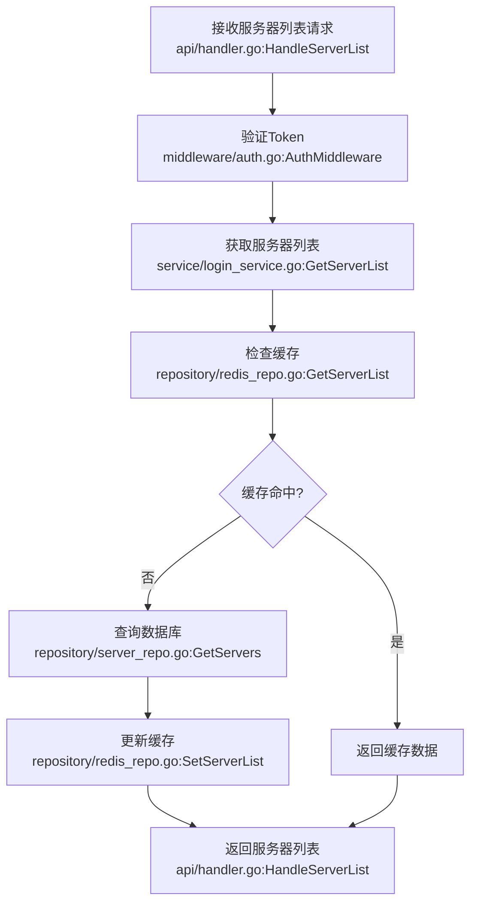
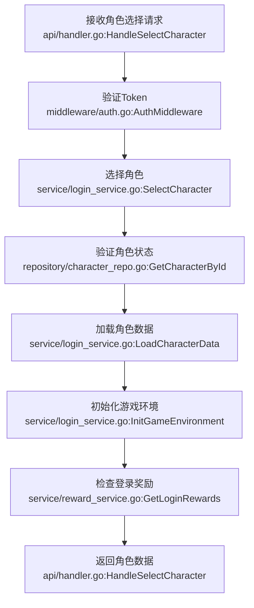

# 进入游戏系统Go实现方案

## 1. 技术选型

| 分类 | 技术 | 版本 | 选型理由 |
| :--- | :--- | :--- | :--- |
| 语言 | Golang | 1.20+ | 编译型语言，性能优异，生态成熟，适合高并发后端服务。 |
| 框架 | Gin | v1.9.0+ | 轻量级Web框架，性能出色，路由灵活，中间件丰富，适合构建RESTful API。 |
| 数据库 | MySQL | 8.0+ | 稳定可靠，适合存储结构化数据，支持事务，适合玩家数据存储。 |
| 缓存 | Redis | 7.0+ | 用于缓存热点数据（如Token、服务器列表、角色列表）和管理Session。 |
| 认证 | JWT | - | 无状态认证，便于水平扩展。 |
| 日志 | zap | v1.24.0+ | 高性能、结构化日志库，适合生产环境。 |
| 配置管理 | viper | v1.15.0+ | 灵活的配置管理库，支持多种配置格式。 |
| 监控 | prometheus | v2.37.0+ | 用于系统监控和指标收集。 |

## 2. 关键设计

### 2.1 架构设计

- **架构风格**: 分层架构
- **模块划分**:
  - `api`: 处理HTTP请求，参数校验，响应处理
  - `service`: 业务逻辑层，实现核心功能
  - `repository`: 数据访问层，处理数据库操作
  - `model`: 数据模型定义
  - `config`: 配置管理
  - `utils`: 工具函数
  - `middleware`: 中间件
  - `auth`: 认证相关功能
  - `anticheat`: 防作弊功能

- **核心流程图**:



### 2.2 目录结构

```plaintext
pkg/
  login/
    api/
      handler.go        # HTTP请求处理器
      router.go         # 路由配置
      dto/              # 数据传输对象
        request.go      # 请求结构
        response.go     # 响应结构
    service/
      login_service.go  # 登录服务
      server_service.go # 服务器管理服务
      character_service.go # 角色管理服务
      reward_service.go # 登录奖励服务
    repository/
      account_repo.go   # 账号数据访问
      character_repo.go # 角色数据访问
      server_repo.go    # 服务器数据访问
      log_repo.go       # 日志数据访问
    model/
      account.go        # 账号模型
      character.go      # 角色模型
      server.go         # 服务器模型
      login_log.go      # 登录日志模型
    config/
      login_config.go   # 登录系统配置
    utils/
      validator.go      # 数据验证
      response.go       # 响应工具
    middleware/
      auth.go           # 认证中间件
      anticheat.go      # 防作弊中间件
      logger.go         # 日志中间件
    auth/
      jwt.go           # JWT认证
      password.go       # 密码处理
    anticheat/
      detector.go       # 作弊检测器
      validator.go      # 客户端验证
```

* 说明：
  * `api/`（新增）：对外接口入口，处理HTTP请求和响应。
  * `service/`（新增）：业务逻辑层，实现核心功能如登录、服务器管理、角色管理等。
  * `repository/`（新增）：数据访问层，处理数据库操作。
  * `model/`（新增）：数据模型定义，对应数据库表结构。
  * `config/`（新增）：配置管理，包括登录系统的各项参数。
  * `utils/`（新增）：工具函数，如数据验证、响应处理等。
  * `middleware/`（新增）：中间件，如认证、防作弊、日志等。
  * `auth/`（新增）：认证相关功能，如JWT处理、密码验证等。
  * `anticheat/`（新增）：防作弊功能，如客户端验证、作弊检测等。

### 2.3 关键类与函数设计

#### 2.3.1 登录服务

| 类/函数名 | 说明 | 参数（类型/含义） | 成功返回结构/类型 | 失败返回结构/类型 | 所属文件/模块 | 溯源 |
|----------|------|-----------------|-----------------|-----------------|-------------|------|
| `LoginService.Login()` | 处理登录请求 | username: string 用户名<br>password: string 密码<br>clientInfo: ClientInfo 客户端信息<br>deviceInfo: string 设备信息<br>ipAddress: string IP地址 | `{token: string, expiresAt: int64}` | `{error: string, code: int}` | service/login_service.go | Java代码分析.md:2.1 登录流程 |
| `LoginService.Logout()` | 处理登出请求 | token: string 认证Token | `{status: string}` | `{error: string, code: int}` | service/login_service.go | Java代码分析.md:1.1 登录控制器 |
| `LoginService.GetServerList()` | 获取服务器列表 | token: string 认证Token | `{servers: []ServerInfo}` | `{error: string, code: int}` | service/login_service.go | Java代码分析.md:2.2 服务器列表获取 |
| `LoginService.GetCharacterList()` | 获取角色列表 | token: string 认证Token<br>serverId: int 服务器ID | `{characters: []CharacterInfo}` | `{error: string, code: int}` | service/login_service.go | Java代码分析.md:2.3 角色列表获取 |
| `LoginService.SelectCharacter()` | 选择角色 | token: string 认证Token<br>characterId: int64 角色ID | `{character: CharacterInfo, initData: GameInitData}` | `{error: string, code: int}` | service/login_service.go | Java代码分析.md:2.4 角色选择 |
| `LoginService.CreateCharacter()` | 创建角色 | token: string 认证Token<br>serverId: int 服务器ID<br>name: string 角色名称<br>jobId: int 职业ID<br>factionId: int 阵营ID | `{character: CharacterInfo}` | `{error: string, code: int}` | service/login_service.go | Java代码分析.md:2.5 角色创建 |
| `LoginService.DeleteCharacter()` | 删除角色 | token: string 认证Token<br>characterId: int64 角色ID<br>verificationCode: string 验证码 | `{status: string}` | `{error: string, code: int}` | service/login_service.go | Java代码分析.md:2.6 角色删除 |

#### 2.3.2 认证服务

| 类/函数名 | 说明 | 参数（类型/含义） | 成功返回结构/类型 | 失败返回结构/类型 | 所属文件/模块 | 溯源 |
|----------|------|-----------------|-----------------|-----------------|-------------|------|
| `AuthService.Authenticate()` | 验证账号密码 | username: string 用户名<br>password: string 密码 | `{accountId: int, username: string}` | `{error: string, code: int}` | auth/auth_service.go | Java代码分析.md:1.2 认证服务 |
| `AuthService.GenerateToken()` | 生成认证Token | accountId: int 账号ID<br>username: string 用户名 | `{token: string, expiresAt: int64}` | `{error: string, code: int}` | auth/auth_service.go | Java代码分析.md:1.2 认证服务 |
| `AuthService.ValidateToken()` | 验证Token有效性 | token: string 认证Token | `{accountId: int, username: string}` | `{error: string, code: int}` | auth/auth_service.go | Java代码分析.md:1.2 认证服务 |
| `AuthService.RefreshToken()` | 刷新Token | token: string 认证Token | `{token: string, expiresAt: int64}` | `{error: string, code: int}` | auth/auth_service.go | Java代码分析.md:1.2 认证服务 |
| `AuthService.InvalidateToken()` | 使Token无效 | token: string 认证Token | `{status: string}` | `{error: string, code: int}` | auth/auth_service.go | Java代码分析.md:1.2 认证服务 |

#### 2.3.3 防作弊服务

| 类/函数名 | 说明 | 参数（类型/含义） | 成功返回结构/类型 | 失败返回结构/类型 | 所属文件/模块 | 溯源 |
|----------|------|-----------------|-----------------|-----------------|-------------|------|
| `AntiCheatService.ValidateClient()` | 验证客户端 | clientInfo: ClientInfo 客户端信息 | `{valid: bool}` | `{error: string, code: int}` | anticheat/anticheat_service.go | Java代码分析.md:1.5 防作弊服务 |
| `AntiCheatService.DetectCheat()` | 检测作弊行为 | playerId: int 玩家ID<br>action: string 行为类型<br>data: map[string]interface{} 行为数据 | `{cheat: bool, reason: string}` | `{error: string, code: int}` | anticheat/anticheat_service.go | Java代码分析.md:1.5 防作弊服务 |
| `AntiCheatService.LogSuspiciousActivity()` | 记录可疑活动 | playerId: int 玩家ID<br>activity: string 活动类型<br>details: string 活动详情 | `{status: string}` | `{error: string, code: int}` | anticheat/anticheat_service.go | Java代码分析.md:1.5 防作弊服务 |

#### 2.3.4 登录奖励服务

| 类/函数名 | 说明 | 参数（类型/含义） | 成功返回结构/类型 | 失败返回结构/类型 | 所属文件/模块 | 溯源 |
|----------|------|-----------------|-----------------|-----------------|-------------|------|
| `LoginRewardService.GetLoginRewards()` | 获取登录奖励 | playerId: int 玩家ID | `{rewards: []RewardInfo}` | `{error: string, code: int}` | service/reward_service.go | Java代码分析.md:1.6 登录奖励服务 |
| `LoginRewardService.ClaimLoginReward()` | 领取登录奖励 | playerId: int 玩家ID<br>rewardId: int 奖励ID | `{status: string, reward: RewardInfo}` | `{error: string, code: int}` | service/reward_service.go | Java代码分析.md:1.6 登录奖励服务 |
| `LoginRewardService.Check连续登录()` | 检查连续登录天数 | playerId: int 玩家ID | `{days: int, rewards: []RewardInfo}` | `{error: string, code: int}` | service/reward_service.go | Java代码分析.md:1.6 登录奖励服务 |

### 2.4 数据库与数据结构设计

#### 2.4.1 数据库表结构

**`accounts`表**
| 字段名 | 数据类型 | 约束 | 描述 |
| :--- | :--- | :--- | :--- |
| `id` | `INT` | `PRIMARY KEY AUTO_INCREMENT` | 账号ID |
| `username` | `VARCHAR(50)` | `UNIQUE NOT NULL` | 用户名 |
| `password_hash` | `VARCHAR(100)` | `NOT NULL` | 密码哈希 |
| `email` | `VARCHAR(100)` | `UNIQUE NOT NULL` | 邮箱 |
| `status` | `TINYINT` | `NOT NULL DEFAULT 1` | 账号状态 |
| `created_at` | `TIMESTAMP` | `NOT NULL DEFAULT CURRENT_TIMESTAMP` | 创建时间 |
| `last_login_at` | `TIMESTAMP` | `NULL` | 最后登录时间 |
| `login_count` | `INT` | `NOT NULL DEFAULT 0` | 登录次数 |

**`characters`表**
| 字段名 | 数据类型 | 约束 | 描述 |
| :--- | :--- | :--- | :--- |
| `id` | `BIGINT` | `PRIMARY KEY AUTO_INCREMENT` | 角色ID |
| `account_id` | `INT` | `NOT NULL` | 账号ID |
| `server_id` | `INT` | `NOT NULL` | 服务器ID |
| `name` | `VARCHAR(30)` | `NOT NULL` | 角色名称 |
| `level` | `INT` | `NOT NULL DEFAULT 1` | 角色等级 |
| `job_id` | `INT` | `NOT NULL` | 职业ID |
| `job_level` | `INT` | `NOT NULL DEFAULT 1` | 职业等级 |
| `faction_id` | `INT` | `NOT NULL` | 阵营ID |
| `exp` | `BIGINT` | `NOT NULL DEFAULT 0` | 经验值 |
| `gold` | `INT` | `NOT NULL DEFAULT 0` | 金币 |
| `strength` | `INT` | `NOT NULL DEFAULT 10` | 力量 |
| `intelligence` | `INT` | `NOT NULL DEFAULT 10` | 智力 |
| `vitality` | `INT` | `NOT NULL DEFAULT 10` | 体力 |
| `spirit` | `INT` | `NOT NULL DEFAULT 10` | 精神 |
| `fatigue` | `INT` | `NOT NULL DEFAULT 156` | 疲劳值 |
| `max_fatigue` | `INT` | `NOT NULL DEFAULT 156` | 最大疲劳值 |
| `position_x` | `FLOAT` | `NOT NULL DEFAULT 0` | 位置X坐标 |
| `position_y` | `FLOAT` | `NOT NULL DEFAULT 0` | 位置Y坐标 |
| `position_z` | `FLOAT` | `NOT NULL DEFAULT 0` | 位置Z坐标 |
| `map_id` | `INT` | `NOT NULL DEFAULT 1` | 地图ID |
| `created_at` | `TIMESTAMP` | `NOT NULL DEFAULT CURRENT_TIMESTAMP` | 创建时间 |
| `last_login_at` | `TIMESTAMP` | `NULL` | 最后登录时间 |
| `deleted` | `BOOLEAN` | `NOT NULL DEFAULT FALSE` | 是否删除 |

**`servers`表**
| 字段名 | 数据类型 | 约束 | 描述 |
| :--- | :--- | :--- | :--- |
| `id` | `INT` | `PRIMARY KEY AUTO_INCREMENT` | 服务器ID |
| `name` | `VARCHAR(50)` | `NOT NULL` | 服务器名称 |
| `status` | `TINYINT` | `NOT NULL DEFAULT 1` | 服务器状态 |
| `ip_address` | `VARCHAR(50)` | `NOT NULL` | 服务器IP地址 |
| `port` | `INT` | `NOT NULL` | 服务器端口 |
| `max_online_count` | `INT` | `NOT NULL DEFAULT 5000` | 最大在线人数 |
| `current_online_count` | `INT` | `NOT NULL DEFAULT 0` | 当前在线人数 |
| `created_at` | `TIMESTAMP` | `NOT NULL DEFAULT CURRENT_TIMESTAMP` | 创建时间 |
| `updated_at` | `TIMESTAMP` | `NOT NULL DEFAULT CURRENT_TIMESTAMP ON UPDATE CURRENT_TIMESTAMP` | 更新时间 |

**`login_logs`表**
| 字段名 | 数据类型 | 约束 | 描述 |
| :--- | :--- | :--- | :--- |
| `id` | `INT` | `PRIMARY KEY AUTO_INCREMENT` | 日志ID |
| `account_id` | `INT` | `NOT NULL` | 账号ID |
| `username` | `VARCHAR(50)` | `NOT NULL` | 用户名 |
| `ip_address` | `VARCHAR(50)` | `NOT NULL` | IP地址 |
| `device_info` | `VARCHAR(255)` | `NULL` | 设备信息 |
| `login_time` | `TIMESTAMP` | `NOT NULL DEFAULT CURRENT_TIMESTAMP` | 登录时间 |
| `success` | `BOOLEAN` | `NOT NULL` | 是否成功 |
| `error_message` | `VARCHAR(255)` | `NULL` | 错误信息 |

**`login_rewards`表**
| 字段名 | 数据类型 | 约束 | 描述 |
| :--- | :--- | :--- | :--- |
| `id` | `INT` | `PRIMARY KEY AUTO_INCREMENT` | 奖励ID |
| `name` | `VARCHAR(100)` | `NOT NULL` | 奖励名称 |
| `type` | `TINYINT` | `NOT NULL` | 奖励类型 |
| `value` | `INT` | `NOT NULL` | 奖励值 |
| `day` | `INT` | `NOT NULL` | 登录天数 |
| `created_at` | `TIMESTAMP` | `NOT NULL DEFAULT CURRENT_TIMESTAMP` | 创建时间 |
| `updated_at` | `TIMESTAMP` | `NOT NULL DEFAULT CURRENT_TIMESTAMP ON UPDATE CURRENT_TIMESTAMP` | 更新时间 |

**`player_login_rewards`表**
| 字段名 | 数据类型 | 约束 | 描述 |
| :--- | :--- | :--- | :--- |
| `id` | `INT` | `PRIMARY KEY AUTO_INCREMENT` | 记录ID |
| `account_id` | `INT` | `NOT NULL` | 账号ID |
| `reward_id` | `INT` | `NOT NULL` | 奖励ID |
| `claimed_at` | `TIMESTAMP` | `NOT NULL DEFAULT CURRENT_TIMESTAMP` | 领取时间 |
| `server_id` | `INT` | `NOT NULL` | 服务器ID |

#### 2.4.2 数据传输对象 (DTOs)

```go
// api/dto/request.go
type LoginRequest struct {
    Username   string      `json:"username" binding:"required"`
    Password   string      `json:"password" binding:"required"`
    ClientInfo ClientInfo  `json:"clientInfo" binding:"required"`
    DeviceInfo string      `json:"deviceInfo"`
    IpAddress  string      `json:"ipAddress"`
}

type ClientInfo struct {
    Version     string `json:"version" binding:"required"`
    DeviceId    string `json:"deviceId"`
    OsVersion   string `json:"osVersion"`
    AppVersion  string `json:"appVersion"`
    MacAddress  string `json:"macAddress"`
}

type ServerListRequest struct {
    Token string `json:"token" binding:"required"`
}

type CharacterListRequest struct {
    Token   string `json:"token" binding:"required"`
    ServerId int    `json:"serverId" binding:"required"`
}

type SelectCharacterRequest struct {
    Token      string `json:"token" binding:"required"`
    CharacterId int64  `json:"characterId" binding:"required"`
}

type CreateCharacterRequest struct {
    Token     string `json:"token" binding:"required"`
    ServerId  int    `json:"serverId" binding:"required"`
    Name      string `json:"name" binding:"required,max=30"`
    JobId     int    `json:"jobId" binding:"required"`
    FactionId int    `json:"factionId" binding:"required"`
}

type DeleteCharacterRequest struct {
    Token            string `json:"token" binding:"required"`
    CharacterId      int64  `json:"characterId" binding:"required"`
    VerificationCode string `json:"verificationCode" binding:"required"`
}

// api/dto/response.go
type LoginResponse struct {
    Code      int    `json:"code"`
    Message   string `json:"message"`
    Token     string `json:"token,omitempty"`
    ExpiresAt int64  `json:"expiresAt,omitempty"`
}

type ServerListResponse struct {
    Code    int          `json:"code"`
    Message string       `json:"message"`
    Servers []ServerInfo `json:"servers,omitempty"`
}

type ServerInfo struct {
    ServerId        int    `json:"serverId"`
    ServerName      string `json:"serverName"`
    Status          int    `json:"status"`
    OnlineCount     int    `json:"onlineCount"`
    MaxOnlineCount  int    `json:"maxOnlineCount"`
    IpAddress       string `json:"ipAddress"`
    Port            int    `json:"port"`
}

type CharacterListResponse struct {
    Code       int             `json:"code"`
    Message    string          `json:"message"`
    Characters []CharacterInfo `json:"characters,omitempty"`
}

type CharacterInfo struct {
    CharacterId  int64  `json:"characterId"`
    CharacterName string `json:"characterName"`
    Level        int    `json:"level"`
    JobId        int    `json:"jobId"`
    JobLevel     int    `json:"jobLevel"`
    FactionId    int    `json:"factionId"`
    Exp          int64  `json:"exp"`
    Gold         int    `json:"gold"`
    Strength     int    `json:"strength"`
    Intelligence int    `json:"intelligence"`
    Vitality     int    `json:"vitality"`
    Spirit       int    `json:"spirit"`
    Fatigue      int    `json:"fatigue"`
    MaxFatigue   int    `json:"maxFatigue"`
    LastLoginTime string `json:"lastLoginTime"`
}

type SelectCharacterResponse struct {
    Code      int          `json:"code"`
    Message   string       `json:"message"`
    Character CharacterInfo `json:"character,omitempty"`
    InitData  GameInitData `json:"initData,omitempty"`
}

type GameInitData struct {
    GameSettings map[string]interface{} `json:"gameSettings"`
    Inventory    []ItemInfo             `json:"inventory"`
    Skills       []SkillInfo            `json:"skills"`
    Quests       []QuestInfo            `json:"quests"`
    Buffs        []BuffInfo             `json:"buffs"`
    Position     PositionInfo           `json:"position"`
}
```

#### 2.4.3 配置结构

| 配置项 | 类型 | 默认值 | 说明 | 所属文件/模块 | 类型 | 溯源 |
| --- | --- | --- | --- | --- | --- | --- |
| `JWTSecret` | string | "your-secret-key" | JWT签名密钥 | config/login_config.go | 新增 | Java代码分析.md:1.2 认证服务 |
| `JWTExpiration` | time.Duration | 24h | JWT过期时间 | config/login_config.go | 新增 | Java代码分析.md:1.2 认证服务 |
| `RedisExpiration` | time.Duration | 24h | Redis缓存过期时间 | config/login_config.go | 新增 | Java代码分析.md:5.1 性能优化 |
| `MaxLoginAttempts` | int | 5 | 最大登录尝试次数 | config/login_config.go | 新增 | Java代码分析.md:5.2 安全性优化 |
| `LoginCooldown` | time.Duration | 1m | 登录冷却时间 | config/login_config.go | 新增 | Java代码分析.md:5.2 安全性优化 |
| `CharacterNamePattern` | string | "^[\\u4e00-\\u9fa5a-zA-Z0-9]{2,12}$" | 角色名称正则表达式 | config/login_config.go | 新增 | Java代码分析.md:2.5 角色创建 |
| `MaxCharactersPerAccount` | int | 8 | 每个账号最大角色数 | config/login_config.go | 新增 | Java代码分析.md:2.5 角色创建 |
| `ServerListCacheTTL` | time.Duration | 5m | 服务器列表缓存时间 | config/login_config.go | 新增 | Java代码分析.md:5.1 性能优化 |
| `CharacterListCacheTTL` | time.Duration | 10m | 角色列表缓存时间 | config/login_config.go | 新增 | Java代码分析.md:5.1 性能优化 |

### 2.5 API 接口设计

| API路径 | 方法 | 模块 | 类型 | 功能描述 | 请求体 (JSON) | 成功响应 (200 OK) |
| :--- | :--- | :--- | :--- | :--- | :--- | :--- |
| `/api/login` | `POST` | 登录模块 | `Router` | 用户登录 | `{"username": "test", "password": "123456", "clientInfo": {...}}` | `{"code": 200, "message": "success", "token": "xxx", "expiresAt": 1620000000}` |
| `/api/logout` | `POST` | 登录模块 | `Router` | 用户登出 | `{"token": "xxx"}` | `{"code": 200, "message": "success"}` |
| `/api/servers` | `GET` | 服务器模块 | `Router` | 获取服务器列表 | N/A (使用Authorization头) | `{"code": 200, "message": "success", "servers": [{"serverId": 1, "serverName": "服务器1", "status": 1}]}` |
| `/api/characters` | `GET` | 角色模块 | `Router` | 获取角色列表 | N/A (使用查询参数和Authorization头) | `{"code": 200, "message": "success", "characters": [{"characterId": 1, "characterName": "角色1", "level": 1}]}` |
| `/api/characters` | `POST` | 角色模块 | `Router` | 创建角色 | `{"serverId": 1, "name": "角色1", "jobId": 1, "factionId": 1}` | `{"code": 200, "message": "success", "character": {...}}` |
| `/api/characters/:id` | `DELETE` | 角色模块 | `Router` | 删除角色 | `{"verificationCode": "xxx"}` | `{"code": 200, "message": "success"}` |
| `/api/characters/:id/select` | `POST` | 角色模块 | `Router` | 选择角色 | N/A | `{"code": 200, "message": "success", "character": {...}, "initData": {...}}` |
| `/api/rewards/login` | `GET` | 奖励模块 | `Router` | 获取登录奖励 | N/A (使用Authorization头) | `{"code": 200, "message": "success", "rewards": [{"id": 1, "name": "奖励1", "type": 1, "value": 100}]}` |
| `/api/rewards/login/:id/claim` | `POST` | 奖励模块 | `Router` | 领取登录奖励 | N/A | `{"code": 200, "message": "success", "reward": {...}}` |
| `/api/health` | `GET` | 健康检查 | `Router` | 系统健康检查 | N/A | `{"status": "ok"}` |

### 2.6 主业务流程与调用链

**登录流程**:



**服务器列表获取流程**:



**角色选择流程**:



**调用链示例**:

- 登录: `api/handler.go:HandleLogin` → `auth/auth_service.go:Authenticate` → `repository/account_repo.go:GetAccountByUsername` → `DB`
- 获取服务器列表: `api/handler.go:HandleServerList` → `service/login_service.go:GetServerList` → `repository/redis_repo.go:GetServerList` → `Redis`
- 选择角色: `api/handler.go:HandleSelectCharacter` → `service/login_service.go:SelectCharacter` → `repository/character_repo.go:GetCharacterById` → `DB`

## 3. 部署与集成方案

### 3.1 依赖与环境

| 依赖 | 版本/范围 | 用途 | 安装命令 | 所属文件/配置 |
| :--- | :--- | :--- | :--- | :--- |
| `github.com/gin-gonic/gin` | `v1.9.0` | Web框架 | `go get -u github.com/gin-gonic/gin` | go.mod |
| `github.com/golang-jwt/jwt/v5` | `v5.0.0` | JWT库 | `go get -u github.com/golang-jwt/jwt/v5` | go.mod |
| `github.com/go-redis/redis/v8` | `v8.11.5` | Redis客户端 | `go get -u github.com/go-redis/redis/v8` | go.mod |
| `github.com/go-sql-driver/mysql` | `v1.7.0` | MySQL驱动 | `go get -u github.com/go-sql-driver/mysql` | go.mod |
| `github.com/jinzhu/gorm` | `v1.9.16` | ORM框架 | `go get -u github.com/jinzhu/gorm` | go.mod |
| `go.uber.org/zap` | `v1.24.0` | 日志库 | `go get -u go.uber.org/zap` | go.mod |
| `github.com/spf13/viper` | `v1.15.0` | 配置管理 | `go get -u github.com/spf13/viper` | go.mod |
| `github.com/prometheus/client_golang` | `v1.14.0` | Prometheus客户端 | `go get -u github.com/prometheus/client_golang` | go.mod |
| `github.com/gin-contrib/cors` | `v1.4.0` | CORS中间件 | `go get -u github.com/gin-contrib/cors` | go.mod |

### 3.3 集成与启动方案

- **配置文件 (`config/config.yaml`)**:

```yaml
# 服务器配置
server:
  port: 8080
  host: 0.0.0.0

# 数据库配置
database:
  dsn: "root:password@tcp(localhost:3306)/dnf_game?charset=utf8mb4&parseTime=True&loc=Local"
  max_idle_conns: 10
  max_open_conns: 100

# Redis配置
redis:
  addr: "localhost:6379"
  password: ""
  db: 0

# 认证配置
auth:
  jwt_secret: "your-secret-key"
  jwt_expiration: "24h"
  redis_expiration: "24h"

# 登录配置
login:
  max_login_attempts: 5
  login_cooldown: "1m"
  character_name_pattern: "^[\\u4e00-\\u9fa5a-zA-Z0-9]{2,12}$"
  max_characters_per_account: 8

# 服务器列表配置
server_list:
  cache_ttl: "5m"

# 角色列表配置
character_list:
  cache_ttl: "10m"

# 防作弊配置
anticheat:
  enabled: true
  log_suspicious: true

# 日志配置
log:
  level: "info"
  encoding: "json"

# 监控配置
monitoring:
  enabled: true
  port: 9090
```

- **启动脚本 (`cmd/login/main.go`)**:

```go
package main

import (
    "fmt"
    "log"

    "github.com/gin-contrib/cors"
    "github.com/gin-gonic/gin"

    "dnf-game-server/pkg/api"
    "dnf-game-server/pkg/config"
    "dnf-game-server/pkg/repository"
    "dnf-game-server/pkg/service"
    "dnf-game-server/pkg/middleware"
    "dnf-game-server/pkg/auth"
    "dnf-game-server/pkg/anticheat"
)

func main() {
    // 加载配置
    cfg, err := config.LoadConfig()
    if err != nil {
        log.Fatalf("Failed to load config: %v", err)
    }

    // 初始化数据库
    db, err := repository.InitDB(cfg.Database)
    if err != nil {
        log.Fatalf("Failed to initialize database: %v", err)
    }

    // 初始化Redis
    redisClient, err := repository.InitRedis(cfg.Redis)
    if err != nil {
        log.Fatalf("Failed to initialize Redis: %v", err)
    }

    // 初始化存储库
    repo := repository.NewRepository(db, redisClient)

    // 初始化认证服务
    authService := auth.NewAuthService(repo, cfg.Auth)

    // 初始化防作弊服务
    antiCheatService := anticheat.NewAntiCheatService(repo, cfg.AntiCheat)

    // 初始化服务
    loginService := service.NewLoginService(repo, authService, antiCheatService, cfg.Login)
    rewardService := service.NewLoginRewardService(repo, cfg.Login)

    // 初始化API处理器
    handler := api.NewHandler(loginService, rewardService, authService)

    // 设置Gin模式
    if cfg.Log.Level == "debug" {
        gin.SetMode(gin.DebugMode)
    } else {
        gin.SetMode(gin.ReleaseMode)
    }

    // 创建Gin引擎
    r := gin.New()

    // 使用中间件
    r.Use(gin.Recovery())
    r.Use(middleware.LoggerMiddleware())
    r.Use(cors.Default())

    // 设置路由
    api.SetupRoutes(r, handler, authService)

    // 启动服务器
    addr := fmt.Sprintf("%s:%d", cfg.Server.Host, cfg.Server.Port)
    log.Printf("Server starting on %s", addr)
    if err := r.Run(addr); err != nil {
        log.Fatalf("Failed to start server: %v", err)
    }
}
```

- **编译与运行**:

```bash
# 编译
cd /path/to/project
go build -o output/login-server cmd/login/main.go

# 运行
./output/login-server
```

## 4. 代码安全性

### 4.1 注意事项

1. **密码安全**: 密码存储必须加密，防止密码泄露。
2. **Token安全**: Token必须安全存储，防止Token被窃取。
3. **防作弊**: 必须实现客户端验证，防止作弊行为。
4. **SQL注入**: 所有数据库操作必须使用参数化查询，防止SQL注入。
5. **XSS攻击**: 所有用户输入必须经过验证和转义，防止XSS攻击。
6. **CSRF攻击**: 必须实现CSRF保护，防止CSRF攻击。
7. **拒绝服务攻击**: 必须实现速率限制，防止拒绝服务攻击。
8. **敏感信息泄露**: 不得在日志中记录敏感信息。
9. **权限控制**: 必须实现严格的权限控制，防止未授权访问。
10. **数据验证**: 所有用户输入必须经过严格验证，防止恶意输入。

### 4.2 解决方案

1. **密码安全解决方案**:
   - 使用bcrypt加密存储密码
   - 实现密码强度验证
   - 定期提醒用户修改密码

2. **Token安全解决方案**:
   - 使用HTTPS传输Token
   - 实现Token过期机制
   - 实现Token刷新策略
   - 实现Token黑名单

3. **防作弊解决方案**:
   - 实现客户端完整性验证
   - 实现行为分析，检测异常登录模式
   - 实现设备指纹，防止多开
   - 实现IP限制，防止多账号登录

4. **SQL注入解决方案**:
   - 使用GORM等ORM框架，自动防止SQL注入
   - 所有SQL查询使用参数化查询
   - 避免使用原始SQL语句

5. **XSS攻击解决方案**:
   - 使用HTML转义，防止XSS攻击
   - 实现内容安全策略(CSP)
   - 验证所有用户输入

6. **CSRF攻击解决方案**:
   - 实现CSRF令牌
   - 验证请求来源
   - 使用SameSite cookie属性

7. **拒绝服务攻击解决方案**:
   - 实现速率限制中间件
   - 限制单个IP的请求频率
   - 实现请求大小限制

8. **敏感信息泄露解决方案**:
   - 使用结构化日志，避免记录敏感信息
   - 实现日志脱敏，对敏感信息进行处理
   - 定期审计日志，确保没有敏感信息泄露

9. **权限控制解决方案**:
   - 实现基于角色的访问控制(RBAC)
   - 验证所有请求的权限
   - 实现最小权限原则

10. **数据验证解决方案**:
    - 使用Gin的binding标签进行请求验证
    - 实现自定义验证器，处理复杂验证逻辑
    - 验证所有用户输入的类型、长度、格式等
