# 进入游戏系统业务流程文档

## 1. 概述

本文档详细描述了DNF游戏进入游戏系统的业务流程，包括登录流程、服务器选择流程、角色管理流程、游戏初始化流程等核心业务流程。通过本文档，可以全面了解进入游戏系统的运作机制，为开发、测试和运维提供参考。

### 1.1 文档目的

- 详细描述进入游戏系统的业务流程
- 提供流程步骤的清晰说明
- 明确各流程的输入、输出和处理逻辑
- 为开发和测试提供参考依据

### 1.2 术语定义

| 术语 | 解释 |
| :--- | :--- |
| 账号 | 玩家在游戏中注册的账号，用于登录和身份识别 |
| 角色 | 玩家在游戏中创建的游戏角色，用于在游戏世界中活动 |
| 服务器 | 运行游戏服务的计算机，玩家需要选择服务器进行游戏 |
| Token | 用于身份验证的令牌，由服务端生成并返回给客户端 |
| JWT | JSON Web Token，一种无状态的认证机制 |
| 防作弊 | 防止玩家使用作弊手段获取不公平优势的措施 |
| 登录奖励 | 玩家每日登录游戏可获得的奖励 |
| 疲劳值 | 限制玩家每日游戏时间的机制 |

## 2. 核心业务流程

### 2.1 登录流程

**流程描述**：玩家通过账号密码登录游戏，获取认证Token。

**流程步骤**：

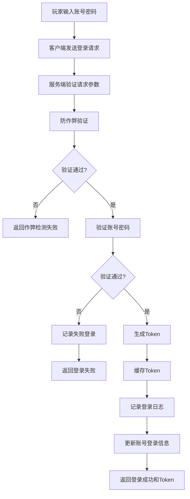

**详细说明**：

1. **玩家输入账号密码**：玩家在客户端输入账号和密码。

2. **客户端发送登录请求**：客户端将账号、密码、客户端信息等发送给服务端。

3. **服务端验证请求参数**：服务端验证请求参数是否完整、格式是否正确。

4. **防作弊验证**：服务端验证客户端版本、设备信息等，检测是否存在作弊行为。

5. **验证账号密码**：服务端根据用户名查询账号信息，验证密码是否正确。

6. **记录失败登录**：如果账号密码错误，记录失败登录尝试，超过次数限制则暂时禁止登录。

7. **生成Token**：验证通过后，服务端生成JWT Token。

8. **缓存Token**：将Token存储到Redis中，设置过期时间。

9. **记录登录日志**：记录本次登录的详细信息，包括时间、IP、设备等。

10. **更新账号登录信息**：更新账号的最后登录时间、登录次数、最后登录IP等信息。

11. **返回登录成功和Token**：服务端返回登录成功的消息和生成的Token。

**输入**：
- 账号：字符串
- 密码：字符串
- 客户端信息：对象
- 设备信息：字符串
- IP地址：字符串

**输出**：
- 登录结果：成功/失败
- Token：字符串（登录成功时）
- 错误信息：字符串（登录失败时）

### 2.2 服务器选择流程

**流程描述**：玩家获取服务器列表，选择游戏服务器。

**流程步骤**：

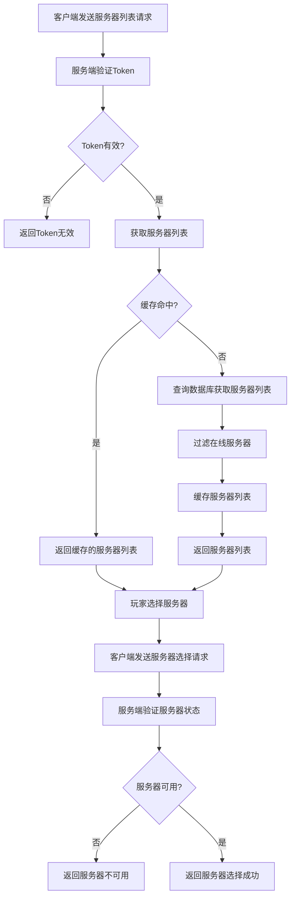

**详细说明**：

1. **客户端发送服务器列表请求**：客户端携带Token发送获取服务器列表的请求。

2. **服务端验证Token**：服务端验证Token是否有效。

3. **获取服务器列表**：验证通过后，服务端尝试从缓存获取服务器列表。

4. **查询数据库获取服务器列表**：如果缓存未命中，服务端从数据库查询服务器列表。

5. **过滤在线服务器**：过滤出状态为在线的服务器。

6. **缓存服务器列表**：将服务器列表缓存到Redis中，设置过期时间。

7. **返回服务器列表**：服务端返回服务器列表给客户端。

8. **玩家选择服务器**：玩家在客户端选择要进入的服务器。

9. **客户端发送服务器选择请求**：客户端发送服务器选择请求。

10. **服务端验证服务器状态**：服务端验证所选服务器的状态是否可用。

11. **返回服务器选择结果**：服务端返回服务器选择成功或失败的消息。

**输入**：
- Token：字符串
- 服务器ID：整数（选择服务器时）

**输出**：
- 服务器列表：数组（获取服务器列表时）
- 选择结果：成功/失败（选择服务器时）

### 2.3 角色管理流程

#### 2.3.1 角色列表获取流程

**流程描述**：玩家获取指定服务器上的角色列表。

**流程步骤**：

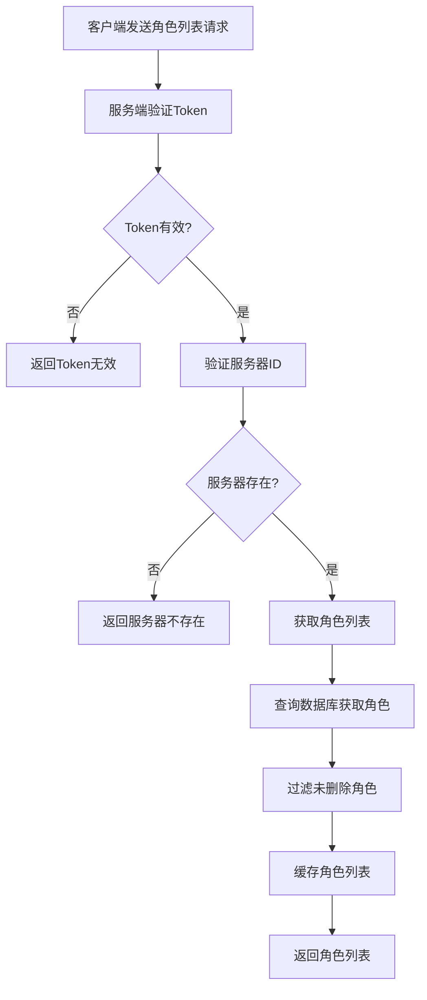

**详细说明**：

1. **客户端发送角色列表请求**：客户端携带Token和服务器ID发送获取角色列表的请求。

2. **服务端验证Token**：服务端验证Token是否有效。

3. **验证服务器ID**：服务端验证服务器ID是否存在。

4. **获取角色列表**：验证通过后，服务端从数据库查询该账号在指定服务器上的角色列表。

5. **过滤未删除角色**：过滤出未删除的角色。

6. **缓存角色列表**：将角色列表缓存到Redis中，设置过期时间。

7. **返回角色列表**：服务端返回角色列表给客户端。

**输入**：
- Token：字符串
- 服务器ID：整数

**输出**：
- 角色列表：数组

#### 2.3.2 角色创建流程

**流程描述**：玩家在指定服务器上创建新角色。

**流程步骤**：

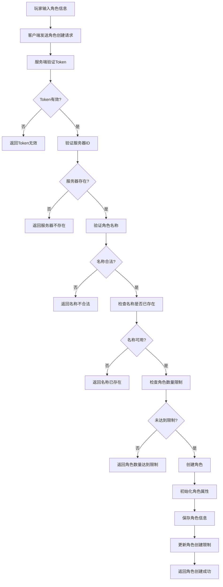

**详细说明**：

1. **玩家输入角色信息**：玩家在客户端输入角色名称、选择职业和阵营。

2. **客户端发送角色创建请求**：客户端携带Token、服务器ID、角色名称、职业ID、阵营ID发送角色创建请求。

3. **服务端验证Token**：服务端验证Token是否有效。

4. **验证服务器ID**：服务端验证服务器ID是否存在。

5. **验证角色名称**：服务端验证角色名称是否符合命名规则。

6. **检查名称是否已存在**：服务端检查该服务器上是否已存在同名角色。

7. **检查角色数量限制**：服务端检查该账号在该服务器上的角色数量是否达到限制。

8. **创建角色**：验证通过后，服务端创建新角色。

9. **初始化角色属性**：初始化角色的等级、经验、金币、属性等。

10. **保存角色信息**：将角色信息保存到数据库。

11. **更新角色创建限制**：更新该账号在该服务器上的角色创建限制。

12. **返回角色创建成功**：服务端返回角色创建成功的消息和角色信息。

**输入**：
- Token：字符串
- 服务器ID：整数
- 角色名称：字符串
- 职业ID：整数
- 阵营ID：整数

**输出**：
- 创建结果：成功/失败
- 角色信息：对象（创建成功时）

#### 2.3.3 角色选择流程

**流程描述**：玩家选择角色进入游戏世界。

**流程步骤**：

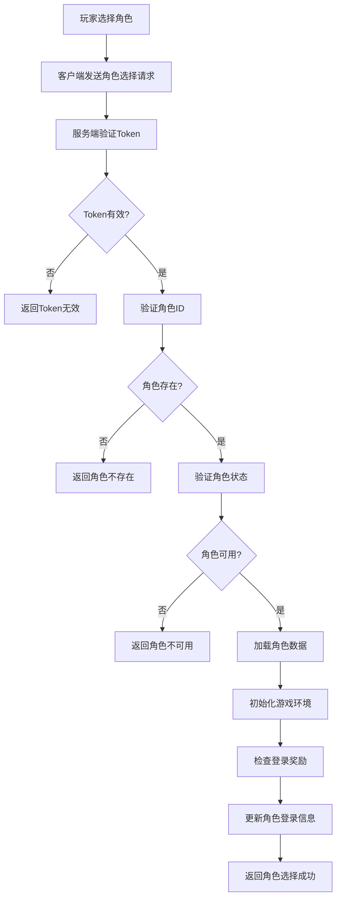

**详细说明**：

1. **玩家选择角色**：玩家在客户端选择要进入游戏的角色。

2. **客户端发送角色选择请求**：客户端携带Token和角色ID发送角色选择请求。

3. **服务端验证Token**：服务端验证Token是否有效。

4. **验证角色ID**：服务端验证角色ID是否存在。

5. **验证角色状态**：服务端验证角色是否已删除、是否被封禁等。

6. **加载角色数据**：验证通过后，服务端加载角色的详细数据，包括装备、技能、任务等。

7. **初始化游戏环境**：初始化游戏环境，包括地图、NPC、怪物等。

8. **检查登录奖励**：检查玩家是否有未领取的登录奖励。

9. **更新角色登录信息**：更新角色的最后登录时间等信息。

10. **返回角色选择成功**：服务端返回角色选择成功的消息、角色信息和游戏初始化数据。

**输入**：
- Token：字符串
- 角色ID：整数

**输出**：
- 选择结果：成功/失败
- 角色信息：对象（选择成功时）
- 游戏初始化数据：对象（选择成功时）

#### 2.3.4 角色删除流程

**流程描述**：玩家删除指定角色。

**流程步骤**：

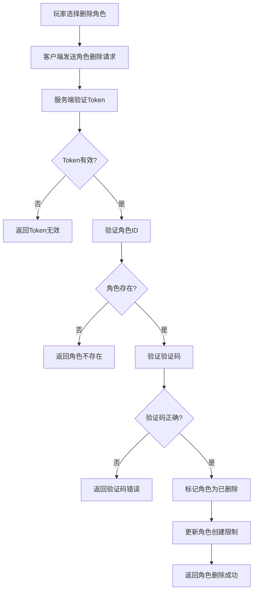

**详细说明**：

1. **玩家选择删除角色**：玩家在客户端选择要删除的角色。

2. **客户端发送角色删除请求**：客户端携带Token、角色ID和验证码发送角色删除请求。

3. **服务端验证Token**：服务端验证Token是否有效。

4. **验证角色ID**：服务端验证角色ID是否存在。

5. **验证验证码**：服务端验证客户端发送的验证码是否正确。

6. **标记角色为已删除**：验证通过后，服务端将角色标记为已删除（软删除）。

7. **更新角色创建限制**：更新该账号在该服务器上的角色创建限制。

8. **返回角色删除成功**：服务端返回角色删除成功的消息。

**输入**：
- Token：字符串
- 角色ID：整数
- 验证码：字符串

**输出**：
- 删除结果：成功/失败

### 2.4 游戏初始化流程

**流程描述**：玩家选择角色后，系统加载游戏数据，初始化游戏环境。

**流程步骤**：

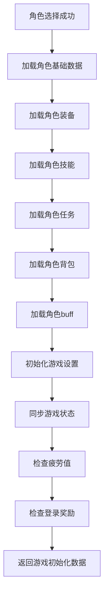

**详细说明**：

1. **角色选择成功**：玩家成功选择角色。

2. **加载角色基础数据**：加载角色的基础属性，如等级、经验、金币等。

3. **加载角色装备**：加载角色穿戴的装备。

4. **加载角色技能**：加载角色学习的技能。

5. **加载角色任务**：加载角色接取的任务。

6. **加载角色背包**：加载角色背包中的物品。

7. **加载角色buff**：加载角色当前的buff效果。

8. **初始化游戏设置**：初始化玩家的游戏设置，如音效、画面质量等。

9. **同步游戏状态**：同步角色的游戏状态，如位置、状态等。

10. **检查疲劳值**：检查角色的疲劳值状态。

11. **检查登录奖励**：检查玩家是否有未领取的登录奖励。

12. **返回游戏初始化数据**：服务端返回游戏初始化数据给客户端。

**输入**：
- 角色ID：整数

**输出**：
- 游戏初始化数据：对象

### 2.5 登录奖励流程

**流程描述**：玩家领取登录奖励。

**流程步骤**：

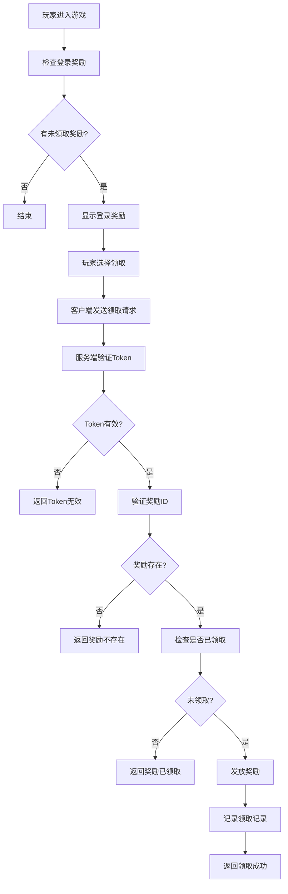

**详细说明**：

1. **玩家进入游戏**：玩家选择角色进入游戏。

2. **检查登录奖励**：服务端检查玩家是否有未领取的登录奖励。

3. **显示登录奖励**：如果有未领取的奖励，客户端显示登录奖励界面。

4. **玩家选择领取**：玩家在客户端选择领取奖励。

5. **客户端发送领取请求**：客户端携带Token和奖励ID发送领取请求。

6. **服务端验证Token**：服务端验证Token是否有效。

7. **验证奖励ID**：服务端验证奖励ID是否存在。

8. **检查是否已领取**：服务端检查该奖励是否已被领取。

9. **发放奖励**：验证通过后，服务端发放奖励给玩家。

10. **记录领取记录**：服务端记录奖励领取记录。

11. **返回领取成功**：服务端返回领取成功的消息。

**输入**：
- Token：字符串
- 奖励ID：整数

**输出**：
- 领取结果：成功/失败
- 奖励信息：对象（领取成功时）

## 3. 辅助业务流程

### 3.1 防作弊流程

**流程描述**：服务端检测客户端是否存在作弊行为。

**流程步骤**：

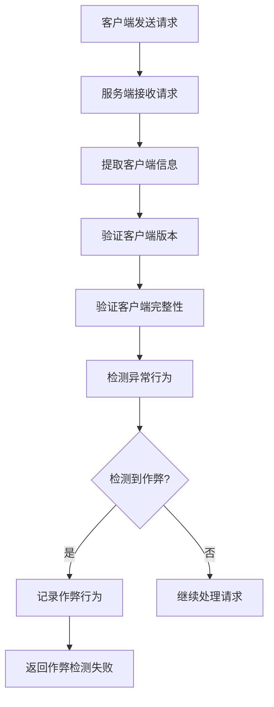

**详细说明**：

1. **客户端发送请求**：客户端发送登录或其他请求。

2. **服务端接收请求**：服务端接收客户端请求。

3. **提取客户端信息**：服务端提取客户端版本、设备信息等。

4. **验证客户端版本**：服务端验证客户端版本是否合法。

5. **验证客户端完整性**：服务端验证客户端是否被修改。

6. **检测异常行为**：服务端检测是否存在异常行为，如异常的请求频率、异常的参数等。

7. **记录作弊行为**：如果检测到作弊行为，服务端记录作弊行为。

8. **返回作弊检测失败**：服务端返回作弊检测失败的消息。

9. **继续处理请求**：如果未检测到作弊行为，服务端继续处理请求。

**输入**：
- 客户端信息：对象

**输出**：
- 检测结果：通过/失败

### 3.2 密码找回流程

**流程描述**：玩家通过邮箱找回密码。

**流程步骤**：

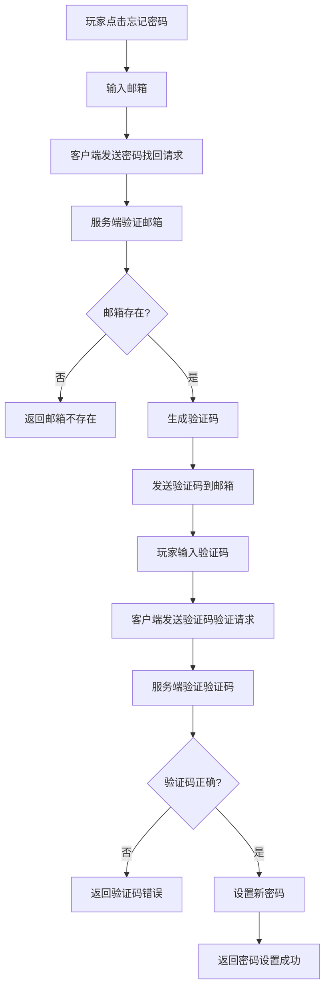

**详细说明**：

1. **玩家点击忘记密码**：玩家在登录界面点击忘记密码。

2. **输入邮箱**：玩家输入注册时使用的邮箱。

3. **客户端发送密码找回请求**：客户端发送密码找回请求。

4. **服务端验证邮箱**：服务端验证邮箱是否存在。

5. **生成验证码**：验证通过后，服务端生成验证码。

6. **发送验证码到邮箱**：服务端将验证码发送到玩家邮箱。

7. **玩家输入验证码**：玩家在客户端输入邮箱收到的验证码。

8. **客户端发送验证码验证请求**：客户端发送验证码验证请求。

9. **服务端验证验证码**：服务端验证验证码是否正确。

10. **设置新密码**：验证通过后，玩家设置新密码。

11. **返回密码设置成功**：服务端返回密码设置成功的消息。

**输入**：
- 邮箱：字符串
- 验证码：字符串
- 新密码：字符串

**输出**：
- 操作结果：成功/失败

### 3.3 账号注册流程

**流程描述**：新玩家注册游戏账号。

**流程步骤**：

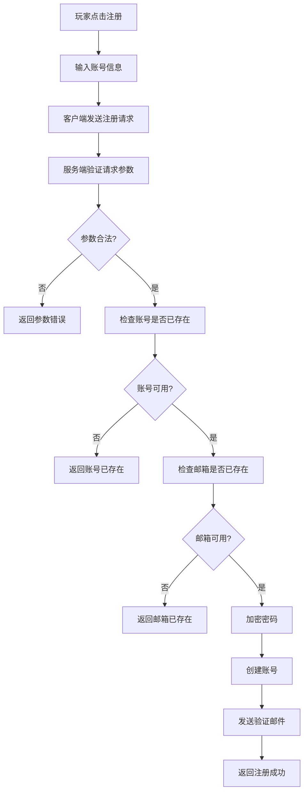

**详细说明**：

1. **玩家点击注册**：玩家在登录界面点击注册。

2. **输入账号信息**：玩家输入用户名、密码、邮箱等账号信息。

3. **客户端发送注册请求**：客户端发送注册请求。

4. **服务端验证请求参数**：服务端验证请求参数是否完整、格式是否正确。

5. **检查账号是否已存在**：服务端检查用户名是否已存在。

6. **检查邮箱是否已存在**：服务端检查邮箱是否已存在。

7. **加密密码**：服务端对密码进行加密处理。

8. **创建账号**：验证通过后，服务端创建新账号。

9. **发送验证邮件**：服务端发送验证邮件到玩家邮箱。

10. **返回注册成功**：服务端返回注册成功的消息。

**输入**：
- 用户名：字符串
- 密码：字符串
- 邮箱：字符串

**输出**：
- 注册结果：成功/失败

## 4. 异常处理流程

### 4.1 登录失败处理

**流程描述**：处理登录失败的情况。

**流程步骤**：

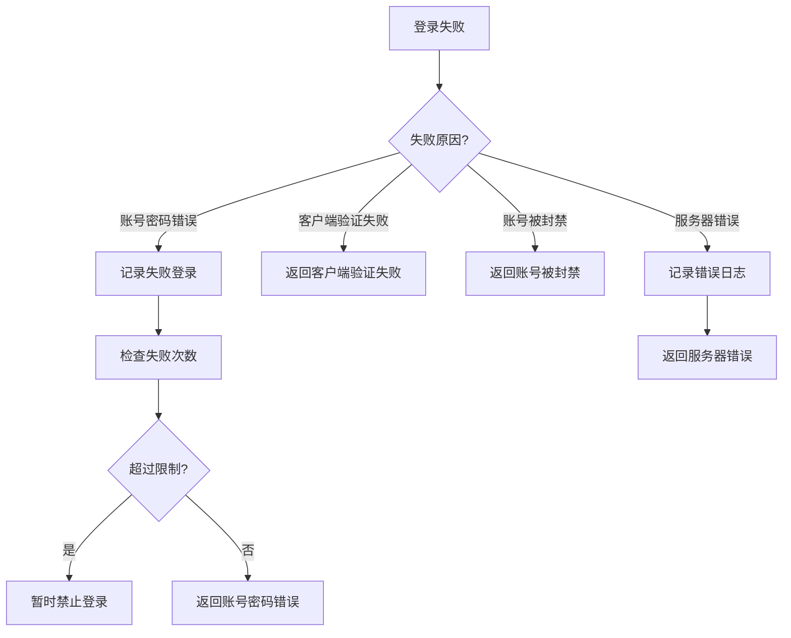

**详细说明**：

1. **登录失败**：玩家登录失败。

2. **账号密码错误**：如果是账号密码错误，记录失败登录尝试。

3. **检查失败次数**：检查失败登录尝试次数是否超过限制。

4. **暂时禁止登录**：如果超过限制，暂时禁止该账号登录。

5. **返回账号密码错误**：如果未超过限制，返回账号密码错误的消息。

6. **客户端验证失败**：如果是客户端验证失败，返回客户端验证失败的消息。

7. **账号被封禁**：如果是账号被封禁，返回账号被封禁的消息。

8. **服务器错误**：如果是服务器错误，记录错误日志，返回服务器错误的消息。

### 4.2 角色创建失败处理

**流程描述**：处理角色创建失败的情况。

**流程步骤**：

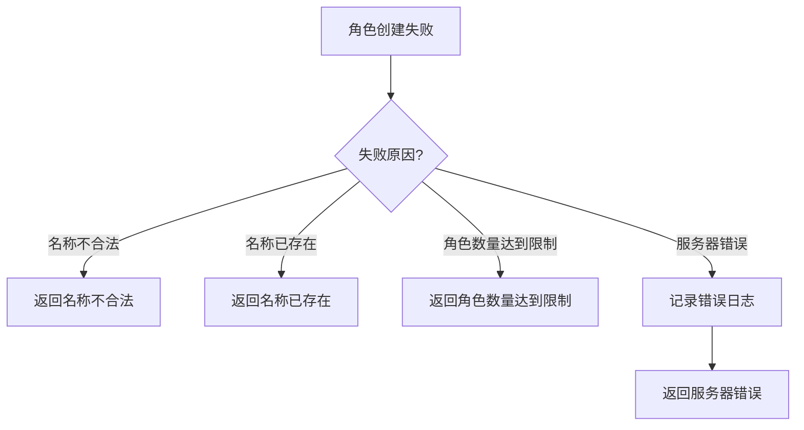

**详细说明**：

1. **角色创建失败**：玩家创建角色失败。

2. **名称不合法**：如果是角色名称不合法，返回名称不合法的消息。

3. **名称已存在**：如果是角色名称已存在，返回名称已存在的消息。

4. **角色数量达到限制**：如果是角色数量达到限制，返回角色数量达到限制的消息。

5. **服务器错误**：如果是服务器错误，记录错误日志，返回服务器错误的消息。

### 4.3 服务器不可用处理

**流程描述**：处理服务器不可用的情况。

**流程步骤**：

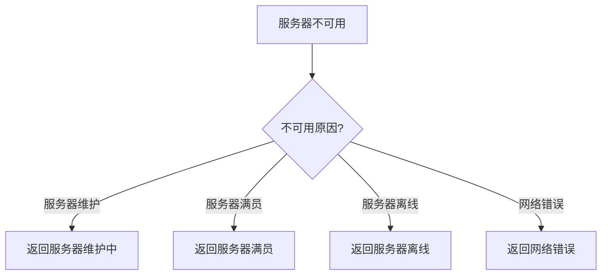

**详细说明**：

1. **服务器不可用**：玩家选择的服务器不可用。

2. **服务器维护**：如果是服务器维护中，返回服务器维护中的消息。

3. **服务器满员**：如果是服务器满员，返回服务器满员的消息。

4. **服务器离线**：如果是服务器离线，返回服务器离线的消息。

5. **网络错误**：如果是网络错误，返回网络错误的消息。

## 5. 流程优化建议

### 5.1 登录流程优化

1. **缓存优化**：
   - 缓存热点账号的登录信息，减少数据库查询
   - 使用Redis缓存Token，提高Token验证速度

2. **并发优化**：
   - 使用线程池处理登录请求，提高并发处理能力
   - 减少同步代码块，提高并发性能

3. **安全优化**：
   - 实现更严格的密码验证机制
   - 增加双因素认证选项
   - 实现更完善的防作弊检测

### 5.2 服务器列表优化

1. **缓存优化**：
   - 缓存服务器列表，减少数据库查询
   - 设置合理的缓存过期时间

2. **负载均衡优化**：
   - 实现服务器负载均衡，将玩家分配到负载较低的服务器
   - 提供服务器推荐功能，根据玩家网络状况推荐服务器

3. **状态同步优化**：
   - 实现服务器状态的实时同步
   - 提供更详细的服务器状态信息

### 5.3 角色管理优化

1. **查询优化**：
   - 使用索引优化角色列表查询
   - 分页查询大量角色数据

2. **事务优化**：
   - 优化角色创建和删除的事务处理
   - 减少事务锁定时间

3. **限制优化**：
   - 实现更灵活的角色数量限制策略
   - 提供角色扩展服务

### 5.4 游戏初始化优化

1. **加载优化**：
   - 实现增量加载，优先加载必要数据
   - 使用缓存加速数据加载

2. **同步优化**：
   - 实现异步同步非关键数据
   - 减少初始化过程中的网络传输

3. **错误处理优化**：
   - 实现更完善的错误处理机制
   - 提供更友好的错误提示

## 6. 总结

本文档详细描述了DNF游戏进入游戏系统的业务流程，包括登录流程、服务器选择流程、角色管理流程、游戏初始化流程等核心业务流程，以及防作弊流程、密码找回流程、账号注册流程等辅助业务流程。同时，本文档还描述了异常处理流程和流程优化建议。

通过本文档，可以全面了解进入游戏系统的运作机制，为开发、测试和运维提供参考。在实际开发过程中，应根据具体情况对流程进行适当调整和优化，以确保系统的稳定性、安全性和用户体验。