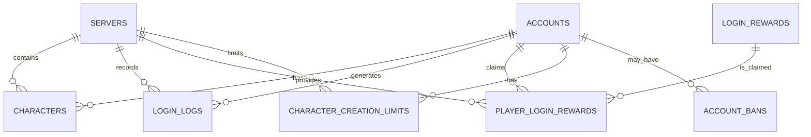

# 进入游戏系统数据库设计文档

## 1. 概述

本文档描述了进入游戏系统的数据库设计，包括表结构、索引设计、数据关系等内容。该设计旨在支持账号验证、角色管理、服务器选择等核心功能，确保系统能够高效、可靠地处理玩家的登录请求和游戏初始化过程。

### 1.1 设计目标

- **高性能**: 优化查询性能，确保登录过程快速响应
- **可靠性**: 确保数据一致性和完整性
- **可扩展性**: 支持系统未来功能扩展
- **安全性**: 保护用户敏感数据

### 1.2 设计范围

- 账号管理相关表结构
- 角色管理相关表结构
- 服务器管理相关表结构
- 登录日志相关表结构
- 登录奖励相关表结构

## 2. 数据库表结构

### 2.1 账号表 (`accounts`)

| 字段名 | 数据类型 | 约束 | 描述 |
| :--- | :--- | :--- | :--- |
| `id` | `INT` | `PRIMARY KEY AUTO_INCREMENT` | 账号ID |
| `username` | `VARCHAR(50)` | `UNIQUE NOT NULL` | 用户名 |
| `password_hash` | `VARCHAR(100)` | `NOT NULL` | 密码哈希值 |
| `email` | `VARCHAR(100)` | `UNIQUE NOT NULL` | 邮箱 |
| `status` | `TINYINT` | `NOT NULL DEFAULT 1` | 账号状态 (1:正常, 2:封禁, 3:待验证) |
| `created_at` | `TIMESTAMP` | `NOT NULL DEFAULT CURRENT_TIMESTAMP` | 创建时间 |
| `last_login_at` | `TIMESTAMP` | `NULL` | 最后登录时间 |
| `login_count` | `INT` | `NOT NULL DEFAULT 0` | 登录次数 |
| `last_login_ip` | `VARCHAR(50)` | `NULL` | 最后登录IP |
| `failed_login_attempts` | `INT` | `NOT NULL DEFAULT 0` | 失败登录尝试次数 |
| `last_failed_login_at` | `TIMESTAMP` | `NULL` | 最后失败登录时间 |

### 2.2 角色表 (`characters`)

| 字段名 | 数据类型 | 约束 | 描述 |
| :--- | :--- | :--- | :--- |
| `id` | `BIGINT` | `PRIMARY KEY AUTO_INCREMENT` | 角色ID |
| `account_id` | `INT` | `NOT NULL` | 账号ID |
| `server_id` | `INT` | `NOT NULL` | 服务器ID |
| `name` | `VARCHAR(30)` | `NOT NULL` | 角色名称 |
| `level` | `INT` | `NOT NULL DEFAULT 1` | 角色等级 |
| `job_id` | `INT` | `NOT NULL` | 职业ID |
| `job_level` | `INT` | `NOT NULL DEFAULT 1` | 职业等级 |
| `faction_id` | `INT` | `NOT NULL` | 阵营ID |
| `exp` | `BIGINT` | `NOT NULL DEFAULT 0` | 经验值 |
| `gold` | `INT` | `NOT NULL DEFAULT 0` | 金币 |
| `strength` | `INT` | `NOT NULL DEFAULT 10` | 力量 |
| `intelligence` | `INT` | `NOT NULL DEFAULT 10` | 智力 |
| `vitality` | `INT` | `NOT NULL DEFAULT 10` | 体力 |
| `spirit` | `INT` | `NOT NULL DEFAULT 10` | 精神 |
| `fatigue` | `INT` | `NOT NULL DEFAULT 156` | 疲劳值 |
| `max_fatigue` | `INT` | `NOT NULL DEFAULT 156` | 最大疲劳值 |
| `position_x` | `FLOAT` | `NOT NULL DEFAULT 0` | 位置X坐标 |
| `position_y` | `FLOAT` | `NOT NULL DEFAULT 0` | 位置Y坐标 |
| `position_z` | `FLOAT` | `NOT NULL DEFAULT 0` | 位置Z坐标 |
| `map_id` | `INT` | `NOT NULL DEFAULT 1` | 地图ID |
| `created_at` | `TIMESTAMP` | `NOT NULL DEFAULT CURRENT_TIMESTAMP` | 创建时间 |
| `last_login_at` | `TIMESTAMP` | `NULL` | 最后登录时间 |
| `deleted` | `BOOLEAN` | `NOT NULL DEFAULT FALSE` | 是否删除 |

### 2.3 服务器表 (`servers`)

| 字段名 | 数据类型 | 约束 | 描述 |
| :--- | :--- | :--- | :--- |
| `id` | `INT` | `PRIMARY KEY AUTO_INCREMENT` | 服务器ID |
| `name` | `VARCHAR(50)` | `NOT NULL` | 服务器名称 |
| `status` | `TINYINT` | `NOT NULL DEFAULT 1` | 服务器状态 (1:在线, 2:满员, 3:维护, 4:离线) |
| `ip_address` | `VARCHAR(50)` | `NOT NULL` | 服务器IP地址 |
| `port` | `INT` | `NOT NULL` | 服务器端口 |
| `max_online_count` | `INT` | `NOT NULL DEFAULT 5000` | 最大在线人数 |
| `current_online_count` | `INT` | `NOT NULL DEFAULT 0` | 当前在线人数 |
| `version` | `VARCHAR(20)` | `NOT NULL DEFAULT '1.0.0'` | 服务器版本 |
| `start_time` | `TIMESTAMP` | `NULL` | 服务器启动时间 |
| `last_restart_time` | `TIMESTAMP` | `NULL` | 最后重启时间 |
| `created_at` | `TIMESTAMP` | `NOT NULL DEFAULT CURRENT_TIMESTAMP` | 创建时间 |
| `updated_at` | `TIMESTAMP` | `NOT NULL DEFAULT CURRENT_TIMESTAMP ON UPDATE CURRENT_TIMESTAMP` | 更新时间 |

### 2.4 登录日志表 (`login_logs`)

| 字段名 | 数据类型 | 约束 | 描述 |
| :--- | :--- | :--- | :--- |
| `id` | `INT` | `PRIMARY KEY AUTO_INCREMENT` | 日志ID |
| `account_id` | `INT` | `NOT NULL` | 账号ID |
| `username` | `VARCHAR(50)` | `NOT NULL` | 用户名 |
| `ip_address` | `VARCHAR(50)` | `NOT NULL` | IP地址 |
| `device_info` | `VARCHAR(255)` | `NULL` | 设备信息 |
| `client_version` | `VARCHAR(20)` | `NULL` | 客户端版本 |
| `login_time` | `TIMESTAMP` | `NOT NULL DEFAULT CURRENT_TIMESTAMP` | 登录时间 |
| `success` | `BOOLEAN` | `NOT NULL` | 是否成功 |
| `error_message` | `VARCHAR(255)` | `NULL` | 错误信息 |
| `server_id` | `INT` | `NULL` | 登录服务器ID |

### 2.5 登录奖励表 (`login_rewards`)

| 字段名 | 数据类型 | 约束 | 描述 |
| :--- | :--- | :--- | :--- |
| `id` | `INT` | `PRIMARY KEY AUTO_INCREMENT` | 奖励ID |
| `name` | `VARCHAR(100)` | `NOT NULL` | 奖励名称 |
| `type` | `TINYINT` | `NOT NULL` | 奖励类型 (1:金币, 2:经验, 3:物品, 4:装备) |
| `value` | `INT` | `NOT NULL` | 奖励值 |
| `item_id` | `INT` | `NULL` | 物品ID (当type为3或4时使用) |
| `count` | `INT` | `NOT NULL DEFAULT 1` | 奖励数量 |
| `day` | `INT` | `NOT NULL` | 登录天数 |
| `created_at` | `TIMESTAMP` | `NOT NULL DEFAULT CURRENT_TIMESTAMP` | 创建时间 |
| `updated_at` | `TIMESTAMP` | `NOT NULL DEFAULT CURRENT_TIMESTAMP ON UPDATE CURRENT_TIMESTAMP` | 更新时间 |

### 2.6 玩家登录奖励表 (`player_login_rewards`)

| 字段名 | 数据类型 | 约束 | 描述 |
| :--- | :--- | :--- | :--- |
| `id` | `INT` | `PRIMARY KEY AUTO_INCREMENT` | 记录ID |
| `account_id` | `INT` | `NOT NULL` | 账号ID |
| `reward_id` | `INT` | `NOT NULL` | 奖励ID |
| `server_id` | `INT` | `NOT NULL` | 服务器ID |
| `claimed_at` | `TIMESTAMP` | `NOT NULL DEFAULT CURRENT_TIMESTAMP` | 领取时间 |
| `character_id` | `BIGINT` | `NULL` | 角色ID (如果奖励发放到特定角色) |

### 2.7 角色创建限制表 (`character_creation_limits`)

| 字段名 | 数据类型 | 约束 | 描述 |
| :--- | :--- | :--- | :--- |
| `id` | `INT` | `PRIMARY KEY AUTO_INCREMENT` | 限制ID |
| `account_id` | `INT` | `NOT NULL` | 账号ID |
| `server_id` | `INT` | `NOT NULL` | 服务器ID |
| `character_count` | `INT` | `NOT NULL DEFAULT 0` | 当前角色数量 |
| `last_character_created_at` | `TIMESTAMP` | `NULL` | 最后创建角色时间 |
| `created_at` | `TIMESTAMP` | `NOT NULL DEFAULT CURRENT_TIMESTAMP` | 创建时间 |
| `updated_at` | `TIMESTAMP` | `NOT NULL DEFAULT CURRENT_TIMESTAMP ON UPDATE CURRENT_TIMESTAMP` | 更新时间 |

### 2.8 账号封禁表 (`account_bans`)

| 字段名 | 数据类型 | 约束 | 描述 |
| :--- | :--- | :--- | :--- |
| `id` | `INT` | `PRIMARY KEY AUTO_INCREMENT` | 封禁ID |
| `account_id` | `INT` | `NOT NULL` | 账号ID |
| `ban_reason` | `VARCHAR(255)` | `NOT NULL` | 封禁原因 |
| `ban_start_time` | `TIMESTAMP` | `NOT NULL DEFAULT CURRENT_TIMESTAMP` | 封禁开始时间 |
| `ban_end_time` | `TIMESTAMP` | `NULL` | 封禁结束时间 (NULL表示永久封禁) |
| `banned_by` | `VARCHAR(50)` | `NOT NULL` | 封禁操作者 |
| `active` | `BOOLEAN` | `NOT NULL DEFAULT TRUE` | 是否有效 |

## 3. 索引设计

### 3.1 账号表 (`accounts`)

| 索引名 | 索引类型 | 索引字段 | 描述 |
| :--- | :--- | :--- | :--- |
| `PRIMARY` | `PRIMARY KEY` | `id` | 主键索引 |
| `idx_username` | `UNIQUE` | `username` | 用户名唯一索引，加速登录验证 |
| `idx_email` | `UNIQUE` | `email` | 邮箱唯一索引，加速邮箱验证 |
| `idx_status` | `INDEX` | `status` | 状态索引，加速状态查询 |
| `idx_last_login_at` | `INDEX` | `last_login_at` | 最后登录时间索引，加速登录时间查询 |

### 3.2 角色表 (`characters`)

| 索引名 | 索引类型 | 索引字段 | 描述 |
| :--- | :--- | :--- | :--- |
| `PRIMARY` | `PRIMARY KEY` | `id` | 主键索引 |
| `idx_account_server` | `INDEX` | `account_id, server_id` | 账号和服务器联合索引，加速角色列表查询 |
| `idx_server_id` | `INDEX` | `server_id` | 服务器ID索引，加速服务器角色查询 |
| `idx_name` | `INDEX` | `name` | 角色名称索引，加速角色名称查询 |
| `idx_deleted` | `INDEX` | `deleted` | 删除状态索引，加速未删除角色查询 |
| `idx_level` | `INDEX` | `level` | 等级索引，加速等级相关查询 |

### 3.3 服务器表 (`servers`)

| 索引名 | 索引类型 | 索引字段 | 描述 |
| :--- | :--- | :--- | :--- |
| `PRIMARY` | `PRIMARY KEY` | `id` | 主键索引 |
| `idx_status` | `INDEX` | `status` | 状态索引，加速状态查询 |
| `idx_current_online` | `INDEX` | `current_online_count` | 当前在线人数索引，加速在线人数查询 |

### 3.4 登录日志表 (`login_logs`)

| 索引名 | 索引类型 | 索引字段 | 描述 |
| :--- | :--- | :--- | :--- |
| `PRIMARY` | `PRIMARY KEY` | `id` | 主键索引 |
| `idx_account_id` | `INDEX` | `account_id` | 账号ID索引，加速账号登录日志查询 |
| `idx_login_time` | `INDEX` | `login_time` | 登录时间索引，加速时间范围查询 |
| `idx_ip_address` | `INDEX` | `ip_address` | IP地址索引，加速IP相关查询 |
| `idx_success` | `INDEX` | `success` | 登录结果索引，加速成功/失败登录查询 |

### 3.5 登录奖励表 (`login_rewards`)

| 索引名 | 索引类型 | 索引字段 | 描述 |
| :--- | :--- | :--- | :--- |
| `PRIMARY` | `PRIMARY KEY` | `id` | 主键索引 |
| `idx_day` | `INDEX` | `day` | 登录天数索引，加速天数相关查询 |
| `idx_type` | `INDEX` | `type` | 奖励类型索引，加速类型相关查询 |

### 3.6 玩家登录奖励表 (`player_login_rewards`)

| 索引名 | 索引类型 | 索引字段 | 描述 |
| :--- | :--- | :--- | :--- |
| `PRIMARY` | `PRIMARY KEY` | `id` | 主键索引 |
| `idx_account_server_reward` | `UNIQUE` | `account_id, server_id, reward_id` | 账号、服务器、奖励联合唯一索引，确保奖励不重复领取 |
| `idx_account_id` | `INDEX` | `account_id` | 账号ID索引，加速账号奖励查询 |
| `idx_server_id` | `INDEX` | `server_id` | 服务器ID索引，加速服务器奖励查询 |

### 3.7 角色创建限制表 (`character_creation_limits`)

| 索引名 | 索引类型 | 索引字段 | 描述 |
| :--- | :--- | :--- | :--- |
| `PRIMARY` | `PRIMARY KEY` | `id` | 主键索引 |
| `idx_account_server` | `UNIQUE` | `account_id, server_id` | 账号和服务器联合唯一索引，确保每个账号在每个服务器只有一条限制记录 |

### 3.8 账号封禁表 (`account_bans`)

| 索引名 | 索引类型 | 索引字段 | 描述 |
| :--- | :--- | :--- | :--- |
| `PRIMARY` | `PRIMARY KEY` | `id` | 主键索引 |
| `idx_account_id` | `INDEX` | `account_id` | 账号ID索引，加速账号封禁查询 |
| `idx_active` | `INDEX` | `active` | 有效性索引，加速有效封禁查询 |
| `idx_ban_end_time` | `INDEX` | `ban_end_time` | 封禁结束时间索引，加速时间相关查询 |

## 4. 数据关系

### 4.1 实体关系图



### 4.2 关系说明

1. **账号与角色关系**:
   - 一个账号可以在多个服务器上创建多个角色
   - 一个角色属于且仅属于一个账号

2. **账号与登录日志关系**:
   - 一个账号可以产生多条登录日志
   - 一条登录日志属于且仅属于一个账号

3. **账号与玩家登录奖励关系**:
   - 一个账号可以领取多个登录奖励
   - 一个登录奖励领取记录属于且仅属于一个账号

4. **账号与角色创建限制关系**:
   - 一个账号在每个服务器上有且仅有一条角色创建限制记录
   - 一条角色创建限制记录属于且仅属于一个账号

5. **账号与账号封禁关系**:
   - 一个账号可以有多个封禁记录
   - 一条封禁记录属于且仅属于一个账号

6. **服务器与角色关系**:
   - 一个服务器可以包含多个角色
   - 一个角色属于且仅属于一个服务器

7. **服务器与登录日志关系**:
   - 一个服务器可以记录多条登录日志
   - 一条登录日志属于且仅属于一个服务器

8. **服务器与玩家登录奖励关系**:
   - 一个服务器可以提供多个登录奖励
   - 一个登录奖励领取记录属于且仅属于一个服务器

9. **服务器与角色创建限制关系**:
   - 一个服务器可以有多个角色创建限制记录
   - 一条角色创建限制记录属于且仅属于一个服务器

10. **登录奖励与玩家登录奖励关系**:
    - 一个登录奖励可以被多个玩家领取
    - 一条玩家登录奖励记录对应且仅对应一个登录奖励

## 5. 数据完整性

### 5.1 主键约束

- 所有表都有主键，确保记录唯一性
- 主键使用自增整数，提高插入性能

### 5.2 外键约束

| 表名 | 外键字段 | 引用表 | 引用字段 | 约束 |
| :--- | :--- | :--- | :--- | :--- |
| `characters` | `account_id` | `accounts` | `id` | `ON DELETE CASCADE` |
| `characters` | `server_id` | `servers` | `id` | `ON DELETE CASCADE` |
| `login_logs` | `account_id` | `accounts` | `id` | `ON DELETE CASCADE` |
| `login_logs` | `server_id` | `servers` | `id` | `ON DELETE SET NULL` |
| `player_login_rewards` | `account_id` | `accounts` | `id` | `ON DELETE CASCADE` |
| `player_login_rewards` | `reward_id` | `login_rewards` | `id` | `ON DELETE CASCADE` |
| `player_login_rewards` | `server_id` | `servers` | `id` | `ON DELETE CASCADE` |
| `character_creation_limits` | `account_id` | `accounts` | `id` | `ON DELETE CASCADE` |
| `character_creation_limits` | `server_id` | `servers` | `id` | `ON DELETE CASCADE` |
| `account_bans` | `account_id` | `accounts` | `id` | `ON DELETE CASCADE` |

### 5.3 唯一性约束

- `accounts.username` 和 `accounts.email` 字段设置为唯一，确保账号唯一性
- `player_login_rewards` 表的 `account_id, server_id, reward_id` 字段设置为联合唯一，确保奖励不重复领取
- `character_creation_limits` 表的 `account_id, server_id` 字段设置为联合唯一，确保每个账号在每个服务器只有一条限制记录

### 5.4 非空约束

- 所有关键字段设置为非空，确保数据完整性
- 如 `accounts.username`, `accounts.password_hash`, `characters.name` 等字段

### 5.5 默认值约束

- 为部分字段设置默认值，简化插入操作
- 如 `accounts.status` 默认值为 1，表示正常状态
- 如 `characters.level` 默认值为 1，表示初始等级

## 6. 性能优化

### 6.1 查询优化

1. **登录验证优化**:
   - 使用 `idx_username` 索引加速用户名查询
   - 只查询必要字段，减少数据传输

2. **角色列表优化**:
   - 使用 `idx_account_server` 联合索引加速角色列表查询
   - 避免使用 `SELECT *`，只查询必要字段

3. **服务器列表优化**:
   - 使用 `idx_status` 索引加速在线服务器查询
   - 考虑使用缓存，减少数据库查询

4. **登录日志优化**:
   - 定期归档旧日志，减少表大小
   - 使用分区表，按时间分区

### 6.2 插入优化

1. **批量插入**:
   - 对于登录奖励等批量操作，使用批量插入

2. **延迟写入**:
   - 对于非关键日志，考虑使用延迟写入

3. **连接池**:
   - 使用数据库连接池，减少连接开销

### 6.3 存储优化

1. **数据压缩**:
   - 对于大字段，考虑使用压缩

2. **字段类型优化**:
   - 使用合适的字段类型，如 `TINYINT` 代替 `INT`

3. **索引优化**:
   - 定期分析索引使用情况，优化索引
   - 避免过多索引，影响插入性能

## 7. 安全考虑

### 7.1 密码安全

- **密码存储**:
  - 使用 `bcrypt` 等安全哈希算法存储密码
  - 不在数据库中存储明文密码

- **密码验证**:
  - 在应用层进行密码验证，不将密码传输到数据库

### 7.2 敏感数据保护

- **IP地址**:
  - 考虑对 IP 地址进行脱敏处理

- **设备信息**:
  - 只存储必要的设备信息
  - 避免存储敏感设备信息

### 7.3 访问控制

- **最小权限原则**:
  - 数据库用户只授予必要的权限

- **连接安全**:
  - 使用 SSL 连接数据库
  - 限制数据库访问 IP

### 7.4 审计日志

- **登录日志**:
  - 详细记录登录行为，便于审计

- **操作日志**:
  - 记录管理员操作，便于审计

## 8. 扩展性考虑

### 8.1 水平扩展

- **分库分表**:
  - 考虑使用分库分表，支持大规模用户

- **读写分离**:
  - 考虑使用读写分离，提高查询性能

### 8.2 功能扩展

- **预留字段**:
  - 在表中预留部分字段，便于未来功能扩展

- **可配置项**:
  - 将部分配置项存储在数据库中，便于动态调整

### 8.3 数据迁移

- **迁移策略**:
  - 制定详细的数据迁移策略，确保数据平滑迁移

- **备份策略**:
  - 定期备份数据，确保数据安全

## 9. 数据库初始化

### 9.1 初始数据

1. **服务器数据**:
   - 初始化默认服务器列表

2. **登录奖励数据**:
   - 初始化默认登录奖励

3. **账号数据**:
   - 初始化管理员账号

### 9.2 初始化脚本

```sql
-- 创建数据库
CREATE DATABASE IF NOT EXISTS `dnf_game` DEFAULT CHARACTER SET utf8mb4 COLLATE utf8mb4_unicode_ci;

USE `dnf_game`;

-- 创建账号表
CREATE TABLE IF NOT EXISTS `accounts` (
  `id` INT NOT NULL AUTO_INCREMENT,
  `username` VARCHAR(50) NOT NULL,
  `password_hash` VARCHAR(100) NOT NULL,
  `email` VARCHAR(100) NOT NULL,
  `status` TINYINT NOT NULL DEFAULT 1,
  `created_at` TIMESTAMP NOT NULL DEFAULT CURRENT_TIMESTAMP,
  `last_login_at` TIMESTAMP NULL,
  `login_count` INT NOT NULL DEFAULT 0,
  `last_login_ip` VARCHAR(50) NULL,
  `failed_login_attempts` INT NOT NULL DEFAULT 0,
  `last_failed_login_at` TIMESTAMP NULL,
  PRIMARY KEY (`id`),
  UNIQUE INDEX `idx_username` (`username`),
  UNIQUE INDEX `idx_email` (`email`),
  INDEX `idx_status` (`status`),
  INDEX `idx_last_login_at` (`last_login_at`)
) ENGINE=InnoDB DEFAULT CHARSET=utf8mb4 COLLATE=utf8mb4_unicode_ci;

-- 创建角色表
CREATE TABLE IF NOT EXISTS `characters` (
  `id` BIGINT NOT NULL AUTO_INCREMENT,
  `account_id` INT NOT NULL,
  `server_id` INT NOT NULL,
  `name` VARCHAR(30) NOT NULL,
  `level` INT NOT NULL DEFAULT 1,
  `job_id` INT NOT NULL,
  `job_level` INT NOT NULL DEFAULT 1,
  `faction_id` INT NOT NULL,
  `exp` BIGINT NOT NULL DEFAULT 0,
  `gold` INT NOT NULL DEFAULT 0,
  `strength` INT NOT NULL DEFAULT 10,
  `intelligence` INT NOT NULL DEFAULT 10,
  `vitality` INT NOT NULL DEFAULT 10,
  `spirit` INT NOT NULL DEFAULT 10,
  `fatigue` INT NOT NULL DEFAULT 156,
  `max_fatigue` INT NOT NULL DEFAULT 156,
  `position_x` FLOAT NOT NULL DEFAULT 0,
  `position_y` FLOAT NOT NULL DEFAULT 0,
  `position_z` FLOAT NOT NULL DEFAULT 0,
  `map_id` INT NOT NULL DEFAULT 1,
  `created_at` TIMESTAMP NOT NULL DEFAULT CURRENT_TIMESTAMP,
  `last_login_at` TIMESTAMP NULL,
  `deleted` BOOLEAN NOT NULL DEFAULT FALSE,
  PRIMARY KEY (`id`),
  INDEX `idx_account_server` (`account_id`, `server_id`),
  INDEX `idx_server_id` (`server_id`),
  INDEX `idx_name` (`name`),
  INDEX `idx_deleted` (`deleted`),
  INDEX `idx_level` (`level`),
  CONSTRAINT `fk_characters_account` FOREIGN KEY (`account_id`) REFERENCES `accounts` (`id`) ON DELETE CASCADE
) ENGINE=InnoDB DEFAULT CHARSET=utf8mb4 COLLATE=utf8mb4_unicode_ci;

-- 创建服务器表
CREATE TABLE IF NOT EXISTS `servers` (
  `id` INT NOT NULL AUTO_INCREMENT,
  `name` VARCHAR(50) NOT NULL,
  `status` TINYINT NOT NULL DEFAULT 1,
  `ip_address` VARCHAR(50) NOT NULL,
  `port` INT NOT NULL,
  `max_online_count` INT NOT NULL DEFAULT 5000,
  `current_online_count` INT NOT NULL DEFAULT 0,
  `version` VARCHAR(20) NOT NULL DEFAULT '1.0.0',
  `start_time` TIMESTAMP NULL,
  `last_restart_time` TIMESTAMP NULL,
  `created_at` TIMESTAMP NOT NULL DEFAULT CURRENT_TIMESTAMP,
  `updated_at` TIMESTAMP NOT NULL DEFAULT CURRENT_TIMESTAMP ON UPDATE CURRENT_TIMESTAMP,
  PRIMARY KEY (`id`),
  INDEX `idx_status` (`status`),
  INDEX `idx_current_online` (`current_online_count`)
) ENGINE=InnoDB DEFAULT CHARSET=utf8mb4 COLLATE=utf8mb4_unicode_ci;

-- 创建登录日志表
CREATE TABLE IF NOT EXISTS `login_logs` (
  `id` INT NOT NULL AUTO_INCREMENT,
  `account_id` INT NOT NULL,
  `username` VARCHAR(50) NOT NULL,
  `ip_address` VARCHAR(50) NOT NULL,
  `device_info` VARCHAR(255) NULL,
  `client_version` VARCHAR(20) NULL,
  `login_time` TIMESTAMP NOT NULL DEFAULT CURRENT_TIMESTAMP,
  `success` BOOLEAN NOT NULL,
  `error_message` VARCHAR(255) NULL,
  `server_id` INT NULL,
  PRIMARY KEY (`id`),
  INDEX `idx_account_id` (`account_id`),
  INDEX `idx_login_time` (`login_time`),
  INDEX `idx_ip_address` (`ip_address`),
  INDEX `idx_success` (`success`),
  CONSTRAINT `fk_login_logs_account` FOREIGN KEY (`account_id`) REFERENCES `accounts` (`id`) ON DELETE CASCADE,
  CONSTRAINT `fk_login_logs_server` FOREIGN KEY (`server_id`) REFERENCES `servers` (`id`) ON DELETE SET NULL
) ENGINE=InnoDB DEFAULT CHARSET=utf8mb4 COLLATE=utf8mb4_unicode_ci;

-- 创建登录奖励表
CREATE TABLE IF NOT EXISTS `login_rewards` (
  `id` INT NOT NULL AUTO_INCREMENT,
  `name` VARCHAR(100) NOT NULL,
  `type` TINYINT NOT NULL,
  `value` INT NOT NULL,
  `item_id` INT NULL,
  `count` INT NOT NULL DEFAULT 1,
  `day` INT NOT NULL,
  `created_at` TIMESTAMP NOT NULL DEFAULT CURRENT_TIMESTAMP,
  `updated_at` TIMESTAMP NOT NULL DEFAULT CURRENT_TIMESTAMP ON UPDATE CURRENT_TIMESTAMP,
  PRIMARY KEY (`id`),
  INDEX `idx_day` (`day`),
  INDEX `idx_type` (`type`)
) ENGINE=InnoDB DEFAULT CHARSET=utf8mb4 COLLATE=utf8mb4_unicode_ci;

-- 创建玩家登录奖励表
CREATE TABLE IF NOT EXISTS `player_login_rewards` (
  `id` INT NOT NULL AUTO_INCREMENT,
  `account_id` INT NOT NULL,
  `reward_id` INT NOT NULL,
  `server_id` INT NOT NULL,
  `claimed_at` TIMESTAMP NOT NULL DEFAULT CURRENT_TIMESTAMP,
  `character_id` BIGINT NULL,
  PRIMARY KEY (`id`),
  UNIQUE INDEX `idx_account_server_reward` (`account_id`, `server_id`, `reward_id`),
  INDEX `idx_account_id` (`account_id`),
  INDEX `idx_server_id` (`server_id`),
  CONSTRAINT `fk_player_login_rewards_account` FOREIGN KEY (`account_id`) REFERENCES `accounts` (`id`) ON DELETE CASCADE,
  CONSTRAINT `fk_player_login_rewards_reward` FOREIGN KEY (`reward_id`) REFERENCES `login_rewards` (`id`) ON DELETE CASCADE,
  CONSTRAINT `fk_player_login_rewards_server` FOREIGN KEY (`server_id`) REFERENCES `servers` (`id`) ON DELETE CASCADE
) ENGINE=InnoDB DEFAULT CHARSET=utf8mb4 COLLATE=utf8mb4_unicode_ci;

-- 创建角色创建限制表
CREATE TABLE IF NOT EXISTS `character_creation_limits` (
  `id` INT NOT NULL AUTO_INCREMENT,
  `account_id` INT NOT NULL,
  `server_id` INT NOT NULL,
  `character_count` INT NOT NULL DEFAULT 0,
  `last_character_created_at` TIMESTAMP NULL,
  `created_at` TIMESTAMP NOT NULL DEFAULT CURRENT_TIMESTAMP,
  `updated_at` TIMESTAMP NOT NULL DEFAULT CURRENT_TIMESTAMP ON UPDATE CURRENT_TIMESTAMP,
  PRIMARY KEY (`id`),
  UNIQUE INDEX `idx_account_server` (`account_id`, `server_id`),
  CONSTRAINT `fk_character_creation_limits_account` FOREIGN KEY (`account_id`) REFERENCES `accounts` (`id`) ON DELETE CASCADE,
  CONSTRAINT `fk_character_creation_limits_server` FOREIGN KEY (`server_id`) REFERENCES `servers` (`id`) ON DELETE CASCADE
) ENGINE=InnoDB DEFAULT CHARSET=utf8mb4 COLLATE=utf8mb4_unicode_ci;

-- 创建账号封禁表
CREATE TABLE IF NOT EXISTS `account_bans` (
  `id` INT NOT NULL AUTO_INCREMENT,
  `account_id` INT NOT NULL,
  `ban_reason` VARCHAR(255) NOT NULL,
  `ban_start_time` TIMESTAMP NOT NULL DEFAULT CURRENT_TIMESTAMP,
  `ban_end_time` TIMESTAMP NULL,
  `banned_by` VARCHAR(50) NOT NULL,
  `active` BOOLEAN NOT NULL DEFAULT TRUE,
  PRIMARY KEY (`id`),
  INDEX `idx_account_id` (`account_id`),
  INDEX `idx_active` (`active`),
  INDEX `idx_ban_end_time` (`ban_end_time`),
  CONSTRAINT `fk_account_bans_account` FOREIGN KEY (`account_id`) REFERENCES `accounts` (`id`) ON DELETE CASCADE
) ENGINE=InnoDB DEFAULT CHARSET=utf8mb4 COLLATE=utf8mb4_unicode_ci;

-- 插入默认服务器数据
INSERT INTO `servers` (`name`, `status`, `ip_address`, `port`, `max_online_count`) VALUES
('服务器1', 1, '192.168.1.100', 8080, 5000),
('服务器2', 1, '192.168.1.101', 8080, 5000),
('服务器3', 1, '192.168.1.102', 8080, 5000);

-- 插入默认登录奖励数据
INSERT INTO `login_rewards` (`name`, `type`, `value`, `day`) VALUES
('每日登录奖励', 1, 100, 1),
('连续登录2天奖励', 1, 200, 2),
('连续登录3天奖励', 1, 300, 3),
('连续登录4天奖励', 1, 400, 4),
('连续登录5天奖励', 1, 500, 5),
('连续登录6天奖励', 1, 600, 6),
('连续登录7天奖励', 1, 1000, 7);

-- 插入管理员账号 (密码: admin123)
INSERT INTO `accounts` (`username`, `password_hash`, `email`, `status`) VALUES
('admin', '$2a$10$EixZaYVK1fsbw1ZfbX3OXePaWxn96p36WQoeG6Lruj3vjPGga31lW', 'admin@example.com', 1);
```

## 10. 总结

本文档详细描述了进入游戏系统的数据库设计，包括表结构、索引设计、数据关系等内容。该设计考虑了性能、可靠性、可扩展性和安全性等因素，确保系统能够高效、可靠地处理玩家的登录请求和游戏初始化过程。

通过合理的表结构设计和索引优化，系统能够快速响应登录验证、角色选择等操作，提供良好的用户体验。同时，通过数据完整性约束和安全措施，确保用户数据的安全和完整性。

未来，随着系统功能的扩展，数据库设计可以根据实际需求进行调整和优化，以适应新的业务场景。