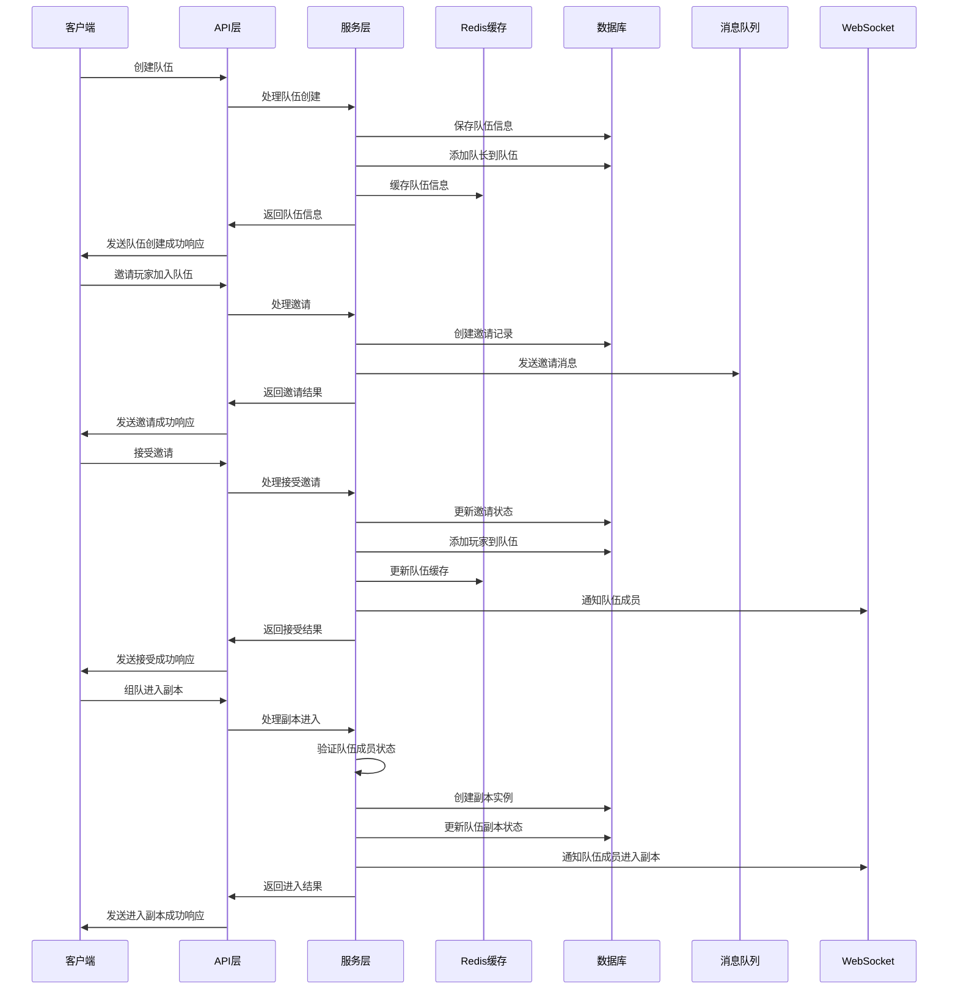
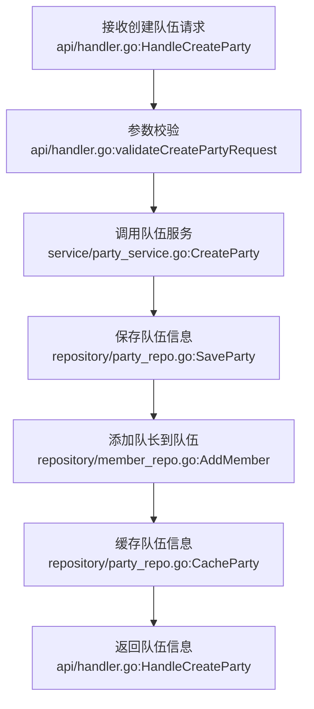
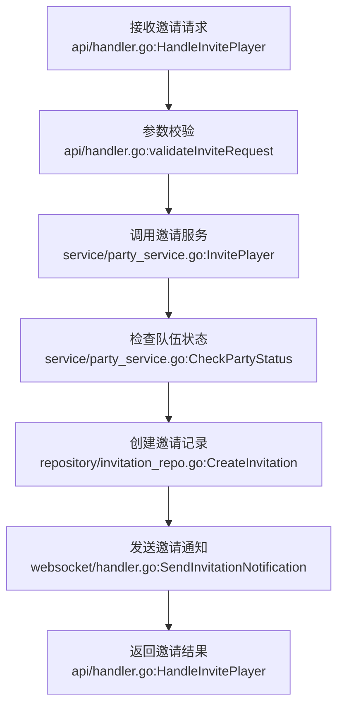
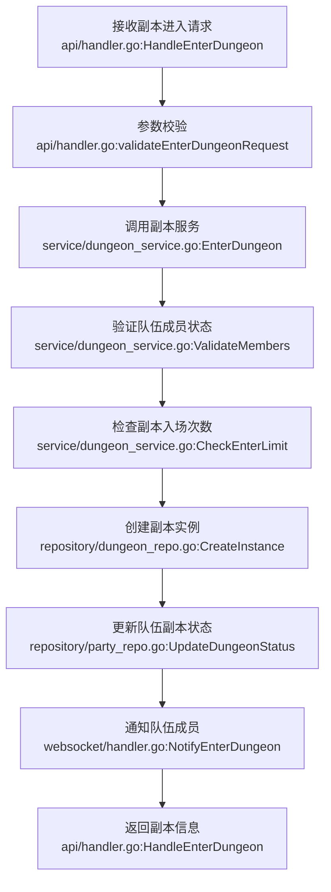

# 组队系统Go实现方案

## 1. 技术选型

| 分类 | 技术 | 版本 | 选型理由 |
| :--- | :--- | :--- | :--- |
| 语言 | Golang | 1.20+ | 编译型语言，性能优异，生态成熟，适合高并发后端服务。 |
| 框架 | Gin | v1.9.0+ | 轻量级Web框架，性能出色，路由灵活，中间件丰富，适合构建RESTful API。 |
| 数据库 | MySQL | 8.0+ | 稳定可靠，适合存储结构化数据，支持事务，适合队伍信息和成员数据存储。 |
| 缓存 | Redis | 7.0+ | 用于缓存热点数据（如队伍信息、在线状态）和管理Session/Token。 |
| 认证 | JWT | - | 无状态认证，便于水平扩展。 |
| 消息队列 | Kafka | 3.0+ | 用于异步处理队伍消息、副本进度更新等非实时任务。 |
|  WebSocket | gorilla/websocket | v1.5.0+ | 用于实时队伍聊天和状态同步。 |

## 2. 关键设计

### 2.1 架构设计

- **架构风格**: 分层架构
- **模块划分**:
  - `api`: 处理HTTP请求，参数校验，响应处理
  - `service`: 业务逻辑层，实现核心功能
  - `repository`: 数据访问层，处理数据库操作
  - `model`: 数据模型定义
  - `config`: 配置管理
  - `utils`: 工具函数
  - `middleware`: 中间件
  - `websocket`: 处理WebSocket连接

- **核心流程图**:



### 2.2 目录结构

```plaintext
pkg/
  party/
    api/
      handler.go        # HTTP请求处理器
      router.go         # 路由配置
      dto/              # 数据传输对象
        request.go      # 请求结构
        response.go     # 响应结构
    service/
      party_service.go  # 队伍管理服务
      match_service.go  # 匹配服务
      dungeon_service.go # 副本挑战服务
      chat_service.go   # 聊天服务
    repository/
      party_repo.go     # 队伍数据访问
      member_repo.go    # 成员数据访问
      invitation_repo.go # 邀请数据访问
      chat_repo.go      # 聊天数据访问
    model/
      party.go          # 队伍模型
      member.go         # 成员模型
      invitation.go     # 邀请模型
      chat.go           # 聊天模型
      dungeon.go        # 副本模型
    config/
      party_config.go   # 队伍系统配置
    utils/
      validator.go      # 数据验证
      response.go       # 响应工具
    middleware/
      auth.go           # 认证中间件
      rate_limit.go     # 限流中间件
    websocket/
      client.go         # WebSocket客户端
      hub.go            # WebSocket连接管理
      handler.go        # WebSocket消息处理
```

* 说明：
  * `api/`（新增）：对外接口入口，处理HTTP请求和响应。
  * `service/`（新增）：业务逻辑层，实现核心功能如队伍管理、匹配、副本挑战等。
  * `repository/`（新增）：数据访问层，处理数据库操作。
  * `model/`（新增）：数据模型定义，对应数据库表结构。
  * `config/`（新增）：配置管理，包括队伍系统的各项参数。
  * `utils/`（新增）：工具函数，如数据验证、响应处理等。
  * `middleware/`（新增）：中间件，如认证、限流等。
  * `websocket/`（新增）：处理WebSocket连接，实现实时聊天和状态同步。

### 2.3 关键类与函数设计

#### 2.3.1 队伍管理服务

| 类/函数名 | 说明 | 参数（类型/含义） | 成功返回结构/类型 | 失败返回结构/类型 | 所属文件/模块 | 溯源 |
|----------|------|-----------------|-----------------|-----------------|-------------|------|
| `PartyService.CreateParty()` | 创建队伍 | playerID: uint64 玩家ID<br>name: string 队伍名称 | `{partyID: uint64, name: string, leaderID: uint64}` | `{error: string, code: int}` | service/party_service.go | Java代码分析.md:2.1 队伍创建 |
| `PartyService.InvitePlayer()` | 邀请玩家 | partyID: uint64 队伍ID<br>playerID: uint64 玩家ID | `{invitationID: uint64, status: string}` | `{error: string, code: int}` | service/party_service.go | Java代码分析.md:2.2 队伍邀请 |
| `PartyService.AcceptInvitation()` | 接受邀请 | invitationID: uint64 邀请ID<br>playerID: uint64 玩家ID | `{partyID: uint64, status: string}` | `{error: string, code: int}` | service/party_service.go | Java代码分析.md:2.2 队伍邀请 |
| `PartyService.LeaveParty()` | 离开队伍 | partyID: uint64 队伍ID<br>playerID: uint64 玩家ID | `{status: string}` | `{error: string, code: int}` | service/party_service.go | Java代码分析.md:1.1 PartyService类 |
| `PartyService.TransferLeader()` | 转让队长 | partyID: uint64 队伍ID<br>currentLeaderID: uint64 当前队长ID<br>newLeaderID: uint64 新队长ID | `{status: string}` | `{error: string, code: int}` | service/party_service.go | Java代码分析.md:1.1 PartyService类 |

#### 2.3.2 匹配服务

| 类/函数名 | 说明 | 参数（类型/含义） | 成功返回结构/类型 | 失败返回结构/类型 | 所属文件/模块 | 溯源 |
|----------|------|-----------------|-----------------|-----------------|-------------|------|
| `MatchService.FindParties()` | 查找队伍 | minLevel: int 最低等级<br>maxLevel: int 最高等级<br>dungeonID: int 副本ID | `[]PartyInfo` | `{error: string, code: int}` | service/match_service.go | Java代码分析.md:2.3 队伍匹配 |
| `MatchService.FindPlayers()` | 查找玩家 | minLevel: int 最低等级<br>maxLevel: int 最高等级<br>dungeonID: int 副本ID | `[]PlayerInfo` | `{error: string, code: int}` | service/match_service.go | Java代码分析.md:2.3 队伍匹配 |
| `MatchService.RecommendParties()` | 推荐队伍 | playerID: uint64 玩家ID | `[]PartyInfo` | `{error: string, code: int}` | service/match_service.go | Java代码分析.md:1.2 MatchService类 |

#### 2.3.3 副本挑战服务

| 类/函数名 | 说明 | 参数（类型/含义） | 成功返回结构/类型 | 失败返回结构/类型 | 所属文件/模块 | 溯源 |
|----------|------|-----------------|-----------------|-----------------|-------------|------|
| `DungeonService.EnterDungeon()` | 进入副本 | partyID: uint64 队伍ID<br>dungeonID: int 副本ID | `{instanceID: uint64, status: string}` | `{error: string, code: int}` | service/dungeon_service.go | Java代码分析.md:2.4 副本进入 |
| `DungeonService.LeaveDungeon()` | 离开副本 | partyID: uint64 队伍ID<br>playerID: uint64 玩家ID | `{status: string}` | `{error: string, code: int}` | service/dungeon_service.go | Java代码分析.md:1.3 DungeonPartyService类 |
| `DungeonService.CompleteDungeon()` | 完成副本 | partyID: uint64 队伍ID<br>dungeonID: int 副本ID | `{rewards: []Reward, status: string}` | `{error: string, code: int}` | service/dungeon_service.go | Java代码分析.md:1.3 DungeonPartyService类 |
| `DungeonService.GetDungeonProgress()` | 获取副本进度 | partyID: uint64 队伍ID<br>dungeonID: int 副本ID | `{currentStage: int, completed: bool}` | `{error: string, code: int}` | service/dungeon_service.go | Java代码分析.md:3.5 队伍副本进度 |

#### 2.3.4 聊天服务

| 类/函数名 | 说明 | 参数（类型/含义） | 成功返回结构/类型 | 失败返回结构/类型 | 所属文件/模块 | 溯源 |
|----------|------|-----------------|-----------------|-----------------|-------------|------|
| `ChatService.SendMessage()` | 发送消息 | partyID: uint64 队伍ID<br>playerID: uint64 玩家ID<br>message: string 消息内容 | `{messageID: uint64, status: string}` | `{error: string, code: int}` | service/chat_service.go | Java代码分析.md:2.5 队伍聊天 |
| `ChatService.GetChatHistory()` | 获取聊天历史 | partyID: uint64 队伍ID<br>limit: int 消息数量限制 | `[]ChatMessage` | `{error: string, code: int}` | service/chat_service.go | Java代码分析.md:1.4 PartyChatService类 |

### 2.4 数据库与数据结构设计

#### 2.4.1 数据库表结构

**`t_party`表**
| 字段名 | 数据类型 | 约束 | 描述 |
| :--- | :--- | :--- | :--- |
| `id` | `BIGINT` | `PRIMARY KEY AUTO_INCREMENT` | 队伍ID |
| `leader_id` | `BIGINT` | `NOT NULL` | 队长ID |
| `name` | `VARCHAR(50)` | `NOT NULL` | 队伍名称 |
| `member_count` | `INT` | `NOT NULL DEFAULT 1` | 成员数量 |
| `in_dungeon` | `BOOLEAN` | `NOT NULL DEFAULT FALSE` | 是否在副本中 |
| `current_dungeon_id` | `INT` | `NULL` | 当前副本ID |
| `dungeon_instance_id` | `BIGINT` | `NULL` | 副本实例ID |
| `create_time` | `DATETIME` | `NOT NULL DEFAULT CURRENT_TIMESTAMP` | 创建时间 |
| `update_time` | `DATETIME` | `NOT NULL DEFAULT CURRENT_TIMESTAMP ON UPDATE CURRENT_TIMESTAMP` | 更新时间 |

**`t_party_member`表**
| 字段名 | 数据类型 | 约束 | 描述 |
| :--- | :--- | :--- | :--- |
| `id` | `BIGINT` | `PRIMARY KEY AUTO_INCREMENT` | 成员ID |
| `party_id` | `BIGINT` | `NOT NULL` | 队伍ID |
| `player_id` | `BIGINT` | `NOT NULL` | 玩家ID |
| `is_leader` | `BOOLEAN` | `NOT NULL DEFAULT FALSE` | 是否为队长 |
| `join_time` | `DATETIME` | `NOT NULL DEFAULT CURRENT_TIMESTAMP` | 加入时间 |
| `update_time` | `DATETIME` | `NOT NULL DEFAULT CURRENT_TIMESTAMP ON UPDATE CURRENT_TIMESTAMP` | 更新时间 |

**`t_party_invitation`表**
| 字段名 | 数据类型 | 约束 | 描述 |
| :--- | :--- | :--- | :--- |
| `id` | `BIGINT` | `PRIMARY KEY AUTO_INCREMENT` | 邀请ID |
| `party_id` | `BIGINT` | `NOT NULL` | 队伍ID |
| `player_id` | `BIGINT` | `NOT NULL` | 被邀请玩家ID |
| `status` | `VARCHAR(20)` | `NOT NULL DEFAULT 'PENDING'` | 邀请状态 |
| `send_time` | `DATETIME` | `NOT NULL DEFAULT CURRENT_TIMESTAMP` | 发送时间 |
| `respond_time` | `DATETIME` | `NULL` | 响应时间 |

**`t_party_chat`表**
| 字段名 | 数据类型 | 约束 | 描述 |
| :--- | :--- | :--- | :--- |
| `id` | `BIGINT` | `PRIMARY KEY AUTO_INCREMENT` | 消息ID |
| `party_id` | `BIGINT` | `NOT NULL` | 队伍ID |
| `player_id` | `BIGINT` | `NOT NULL` | 发送者ID |
| `message` | `VARCHAR(500)` | `NOT NULL` | 消息内容 |
| `send_time` | `DATETIME` | `NOT NULL DEFAULT CURRENT_TIMESTAMP` | 发送时间 |

**`t_party_dungeon_progress`表**
| 字段名 | 数据类型 | 约束 | 描述 |
| :--- | :--- | :--- | :--- |
| `id` | `BIGINT` | `PRIMARY KEY AUTO_INCREMENT` | 进度ID |
| `party_id` | `BIGINT` | `NOT NULL` | 队伍ID |
| `dungeon_id` | `INT` | `NOT NULL` | 副本ID |
| `current_stage` | `INT` | `NOT NULL DEFAULT 1` | 当前阶段 |
| `completed` | `BOOLEAN` | `NOT NULL DEFAULT FALSE` | 是否完成 |
| `enter_time` | `DATETIME` | `NOT NULL DEFAULT CURRENT_TIMESTAMP` | 进入时间 |
| `complete_time` | `DATETIME` | `NULL` | 完成时间 |

#### 2.4.2 数据传输对象 (DTOs)

```go
// api/dto/request.go
type CreatePartyRequest struct {
    PlayerID uint64 `json:"playerId" binding:"required"`
    Name     string `json:"name" binding:"required,max=50"`
}

type InvitePlayerRequest struct {
    PartyID  uint64 `json:"partyId" binding:"required"`
    PlayerID uint64 `json:"playerId" binding:"required"`
}

type AcceptInvitationRequest struct {
    InvitationID uint64 `json:"invitationId" binding:"required"`
    PlayerID     uint64 `json:"playerId" binding:"required"`
}

type EnterDungeonRequest struct {
    PartyID   uint64 `json:"partyId" binding:"required"`
    DungeonID int    `json:"dungeonId" binding:"required"`
}

type SendMessageRequest struct {
    PartyID  uint64 `json:"partyId" binding:"required"`
    PlayerID uint64 `json:"playerId" binding:"required"`
    Message  string `json:"message" binding:"required,max=500"`
}

// api/dto/response.go
type PartyResponse struct {
    PartyID    uint64      `json:"partyId"`
    Name       string       `json:"name"`
    LeaderID   uint64       `json:"leaderId"`
    Members    []MemberInfo `json:"members"`
    MemberCount int         `json:"memberCount"`
    InDungeon  bool         `json:"inDungeon"`
}

type InvitationResponse struct {
    InvitationID uint64 `json:"invitationId"`
    PartyID      uint64 `json:"partyId"`
    Status       string `json:"status"`
}

type DungeonResponse struct {
    InstanceID  uint64   `json:"instanceId"`
    DungeonID   int      `json:"dungeonId"`
    CurrentStage int     `json:"currentStage"`
    Completed   bool     `json:"completed"`
    Rewards     []Reward `json:"rewards,omitempty"`
}

type ChatMessageResponse struct {
    MessageID   uint64 `json:"messageId"`
    PartyID     uint64 `json:"partyId"`
    PlayerID    uint64 `json:"playerId"`
    PlayerName  string `json:"playerName"`
    Message     string `json:"message"`
    SendTime    int64  `json:"sendTime"`
}
```

#### 2.4.3 配置结构

| 配置项 | 类型 | 默认值 | 说明 | 所属文件/模块 | 类型 | 溯源 |
| --- | --- | --- | --- | --- | --- | --- |
| `MaxPartyMembers` | int | 4 | 队伍最大成员数 | config/party_config.go | 新增 | Java代码分析.md:3.1 队伍 |
| `InvitationExpiryTime` | time.Duration | 5m | 邀请过期时间 | config/party_config.go | 新增 | Java代码分析.md:3.3 队伍邀请 |
| `DungeonEnterLimit` | int | 3 | 每日副本进入次数限制 | config/party_config.go | 新增 | Java代码分析.md:2.4 副本进入 |
| `ChatHistoryLimit` | int | 100 | 聊天历史记录限制 | config/party_config.go | 新增 | Java代码分析.md:1.4 PartyChatService类 |
| `WebSocketPingInterval` | time.Duration | 30s | WebSocket心跳间隔 | config/party_config.go | 新增 | 技术选型WebSocket |

### 2.5 API 接口设计

| API路径 | 方法 | 模块 | 类型 | 功能描述 | 请求体 (JSON) | 成功响应 (200 OK) |
| :--- | :--- | :--- | :--- | :--- | :--- | :--- |
| `/api/party/create` | `POST` | 队伍模块 | `Router` | 创建队伍 | `{"playerId": 123, "name": "测试队伍"}` | `{"partyId": 1, "name": "测试队伍", "leaderId": 123, "memberCount": 1}` |
| `/api/party/invite` | `POST` | 队伍模块 | `Router` | 邀请玩家加入队伍 | `{"partyId": 1, "playerId": 456}` | `{"invitationId": 1, "partyId": 1, "status": "PENDING"}` |
| `/api/party/accept` | `POST` | 队伍模块 | `Router` | 接受邀请 | `{"invitationId": 1, "playerId": 456}` | `{"partyId": 1, "status": "ACCEPTED"}` |
| `/api/party/leave` | `POST` | 队伍模块 | `Router` | 离开队伍 | `{"partyId": 1, "playerId": 456}` | `{"status": "SUCCESS"}` |
| `/api/party/transfer` | `POST` | 队伍模块 | `Router` | 转让队长 | `{"partyId": 1, "currentLeaderId": 123, "newLeaderId": 456}` | `{"status": "SUCCESS"}` |
| `/api/party/info/:partyId` | `GET` | 队伍模块 | `Router` | 获取队伍信息 | N/A | `{"partyId": 1, "name": "测试队伍", "leaderId": 123, "members": [...], "memberCount": 2}` |
| `/api/party/match/parties` | `GET` | 匹配模块 | `Router` | 查找队伍 | N/A | `[{"partyId": 1, "name": "测试队伍", "leaderId": 123, "memberCount": 2}]` |
| `/api/party/match/players` | `GET` | 匹配模块 | `Router` | 查找玩家 | N/A | `[{"playerId": 789, "name": "玩家3", "level": 50, "class": "Warrior"}]` |
| `/api/party/dungeon/enter` | `POST` | 副本模块 | `Router` | 进入副本 | `{"partyId": 1, "dungeonId": 101}` | `{"instanceId": 1, "dungeonId": 101, "currentStage": 1, "completed": false}` |
| `/api/party/dungeon/leave` | `POST` | 副本模块 | `Router` | 离开副本 | `{"partyId": 1, "playerId": 123}` | `{"status": "SUCCESS"}` |
| `/api/party/dungeon/complete` | `POST` | 副本模块 | `Router` | 完成副本 | `{"partyId": 1, "dungeonId": 101}` | `{"instanceId": 1, "dungeonId": 101, "completed": true, "rewards": [...]}` |
| `/api/party/dungeon/progress` | `GET` | 副本模块 | `Router` | 获取副本进度 | N/A | `{"currentStage": 3, "completed": false}` |
| `/api/party/chat/message` | `POST` | 聊天模块 | `Router` | 发送消息 | `{"partyId": 1, "playerId": 123, "message": "大家好"}` | `{"messageId": 1, "status": "SUCCESS"}` |
| `/api/party/chat/history/:partyId` | `GET` | 聊天模块 | `Router` | 获取聊天历史 | N/A | `[{"messageId": 1, "playerId": 123, "playerName": "玩家1", "message": "大家好", "sendTime": 1620000000}]` |
| `/api/party/ws` | `GET` | WebSocket | `Router` | WebSocket连接 | N/A | WebSocket连接 |

### 2.6 主业务流程与调用链

**队伍创建流程**:



**邀请加入队伍流程**:



**组队进入副本流程**:



**调用链示例**:

- 创建队伍: `api/handler.go:HandleCreateParty` → `service/party_service.go:CreateParty` → `repository/party_repo.go:SaveParty` → `DB`
- 邀请玩家: `api/handler.go:HandleInvitePlayer` → `service/party_service.go:InvitePlayer` → `repository/invitation_repo.go:CreateInvitation` → `DB`
- 进入副本: `api/handler.go:HandleEnterDungeon` → `service/dungeon_service.go:EnterDungeon` → `repository/dungeon_repo.go:CreateInstance` → `DB`
- 发送消息: `api/handler.go:HandleSendMessage` → `service/chat_service.go:SendMessage` → `websocket/handler.go:BroadcastMessage` → `WebSocket`

## 3. 部署与集成方案

### 3.1 依赖与环境

| 依赖 | 版本/范围 | 用途 | 安装命令 | 所属文件/配置 |
| :--- | :--- | :--- | :--- | :--- |
| `github.com/gin-gonic/gin` | `v1.9.0` | Web框架 | `go get -u github.com/gin-gonic/gin` | go.mod |
| `github.com/jinzhu/gorm` | `v1.9.16` | ORM框架 | `go get -u github.com/jinzhu/gorm` | go.mod |
| `github.com/go-sql-driver/mysql` | `v1.7.0` | MySQL驱动 | `go get -u github.com/go-sql-driver/mysql` | go.mod |
| `github.com/go-redis/redis/v8` | `v8.11.5` | Redis客户端 | `go get -u github.com/go-redis/redis/v8` | go.mod |
| `github.com/golang-jwt/jwt/v5` | `v5.0.0` | JWT库 | `go get -u github.com/golang-jwt/jwt/v5` | go.mod |
| `github.com/Shopify/sarama` | `v1.38.1` | Kafka客户端 | `go get -u github.com/Shopify/sarama` | go.mod |
| `github.com/gorilla/websocket` | `v1.5.0` | WebSocket库 | `go get -u github.com/gorilla/websocket` | go.mod |
| `github.com/gin-contrib/cors` | `v1.4.0` | CORS中间件 | `go get -u github.com/gin-contrib/cors` | go.mod |

### 3.3 集成与启动方案

- **配置文件 (`config/config.yaml`)**:

```yaml
# 服务器配置
server:
  port: 8080
  host: 0.0.0.0

# 数据库配置
database:
  dsn: "root:password@tcp(localhost:3306)/dnf_game?charset=utf8mb4&parseTime=True&loc=Local"
  max_idle_conns: 10
  max_open_conns: 100

# Redis配置
redis:
  addr: "localhost:6379"
  password: ""
  db: 0

# Kafka配置
kafka:
  brokers: ["localhost:9092"]
  topic: "party-events"

# 队伍系统配置
party:
  max_members: 4
  invitation_expiry_time: "5m"
  dungeon_enter_limit: 3
  chat_history_limit: 100
  websocket_ping_interval: "30s"

# WebSocket配置
websocket:
  max_message_size: 4096
  write_wait: "10s"
  pong_wait: "60s"
  ping_period: "54s"
```

- **启动脚本 (`cmd/party/main.go`)**:

```go
package main

import (
    "fmt"
    "log"
    "os"

    "github.com/gin-contrib/cors"
    "github.com/gin-gonic/gin"
    "github.com/joho/godotenv"

    "dnf-game-server/pkg/api"
    "dnf-game-server/pkg/config"
    "dnf-game-server/pkg/repository"
    "dnf-game-server/pkg/service"
    "dnf-game-server/pkg/websocket"
)

func main() {
    // 加载配置
    if err := godotenv.Load(); err != nil {
        log.Println("No .env file found")
    }

    // 初始化配置
    cfg, err := config.LoadConfig()
    if err != nil {
        log.Fatalf("Failed to load config: %v", err)
    }

    // 初始化数据库
    db, err := repository.InitDB(cfg.Database)
    if err != nil {
        log.Fatalf("Failed to initialize database: %v", err)
    }

    // 初始化Redis
    redisClient, err := repository.InitRedis(cfg.Redis)
    if err != nil {
        log.Fatalf("Failed to initialize Redis: %v", err)
    }

    // 初始化Kafka
    kafkaProducer, err := repository.InitKafka(cfg.Kafka)
    if err != nil {
        log.Fatalf("Failed to initialize Kafka: %v", err)
    }

    // 初始化WebSocket Hub
    wsHub := websocket.NewHub()
    go wsHub.Run()

    // 初始化存储库
    repo := repository.NewRepository(db, redisClient, kafkaProducer)

    // 初始化服务
    services := service.NewService(repo, cfg)

    // 初始化API
    handler := api.NewHandler(services, wsHub)

    // 设置Gin模式
    if os.Getenv("GIN_MODE") == "release" {
        gin.SetMode(gin.ReleaseMode)
    }

    // 创建Gin引擎
    r := gin.Default()

    // 配置CORS
    r.Use(cors.Default())

    // 设置路由
    api.SetupRoutes(r, handler)

    // 启动服务器
    addr := fmt.Sprintf("%s:%d", cfg.Server.Host, cfg.Server.Port)
    log.Printf("Server starting on %s", addr)
    if err := r.Run(addr); err != nil {
        log.Fatalf("Failed to start server: %v", err)
    }
}
```

- **编译与运行**:

```bash
# 编译
cd /path/to/project
go build -o output/party-server cmd/party/main.go

# 运行
./output/party-server
```

## 4. 代码安全性

### 4.1 注意事项

1. **输入验证**: 所有客户端输入必须经过严格验证，防止注入攻击和参数篡改。
2. **认证授权**: 确保只有授权用户才能访问API，防止未授权操作。
3. **WebSocket安全**: 确保WebSocket连接的安全性，防止未授权访问和消息篡改。
4. **数据一致性**: 确保队伍数据的一致性，防止并发操作导致的数据冲突。
5. **邀请验证**: 验证邀请的有效性和过期时间，防止无效邀请。
6. **副本入场限制**: 严格执行副本入场次数限制，防止作弊。
7. **聊天内容过滤**: 过滤聊天内容，防止不良信息和XSS攻击。
8. **速率限制**: 对API请求和WebSocket消息进行速率限制，防止DoS攻击。
9. **敏感信息保护**: 保护玩家敏感信息，如密码、个人信息等。
10. **依赖安全**: 定期更新依赖库，避免使用有已知漏洞的版本。

### 4.2 解决方案

1. **输入验证解决方案**:
   - 使用Gin的binding标签进行请求参数验证
   - 实现自定义验证器处理复杂验证逻辑
   - 对所有用户输入进行边界检查

2. **认证授权解决方案**:
   - 使用JWT进行身份认证
   - 实现基于角色的访问控制(RBAC)
   - 为敏感操作添加额外的身份验证

3. **WebSocket安全解决方案**:
   - 使用JWT进行WebSocket连接认证
   - 实现消息签名验证，防止消息篡改
   - 定期清理无效WebSocket连接

4. **数据一致性解决方案**:
   - 使用数据库事务确保操作原子性
   - 实现乐观锁或悲观锁防止并发冲突
   - 使用Redis分布式锁处理跨服务的并发操作

5. **邀请验证解决方案**:
   - 实现邀请过期机制
   - 验证邀请的有效性和状态
   - 防止重复邀请和无效邀请

6. **副本入场限制解决方案**:
   - 实现服务器端副本入场次数检查
   - 使用Redis缓存每日入场次数
   - 定期重置入场次数

7. **聊天内容过滤解决方案**:
   - 实现敏感词过滤
   - 对消息内容进行HTML转义，防止XSS攻击
   - 限制消息长度和发送频率

8. **速率限制解决方案**:
   - 使用Redis实现分布式速率限制
   - 对不同API端点设置不同的速率限制策略
   - 实现渐进式速率限制，而非直接拒绝请求

9. **敏感信息保护解决方案**:
   - 使用HTTPS加密传输数据
   - 对数据库中的敏感字段使用AES加密
   - 密码使用bcrypt等安全哈希算法存储

10. **依赖安全解决方案**:
    - 使用Go Modules管理依赖
    - 定期运行`go get -u`更新依赖
    - 使用安全扫描工具检测依赖中的漏洞
    - 建立依赖审核流程，评估新增依赖的安全性