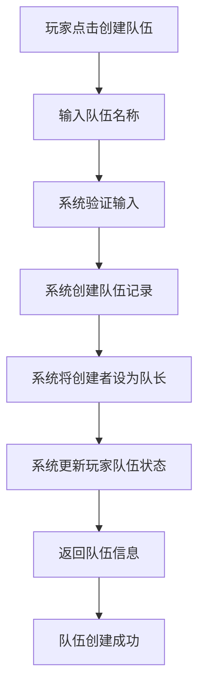
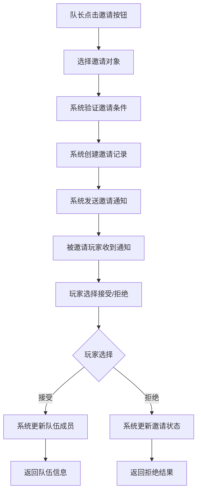
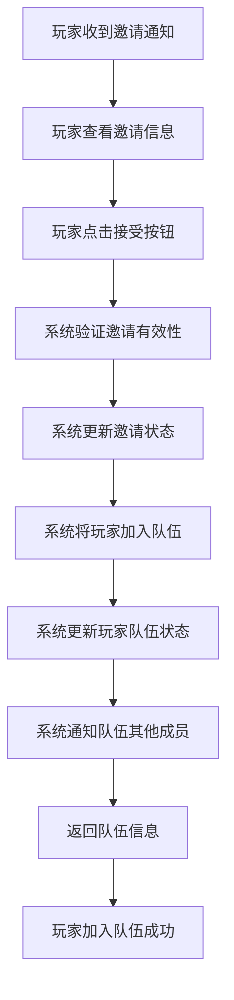
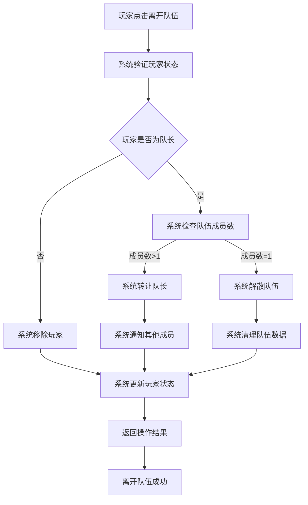
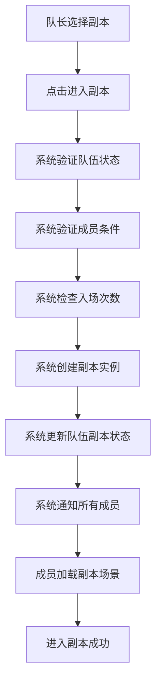
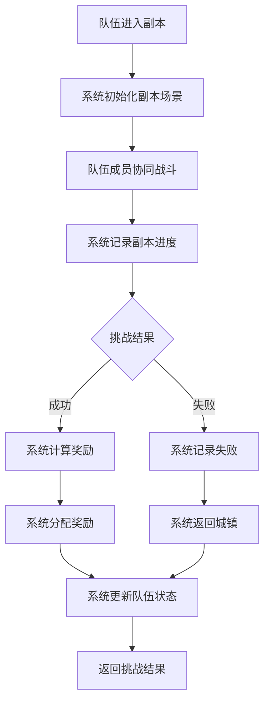
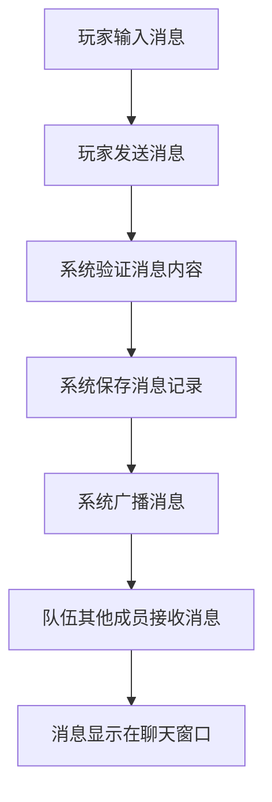
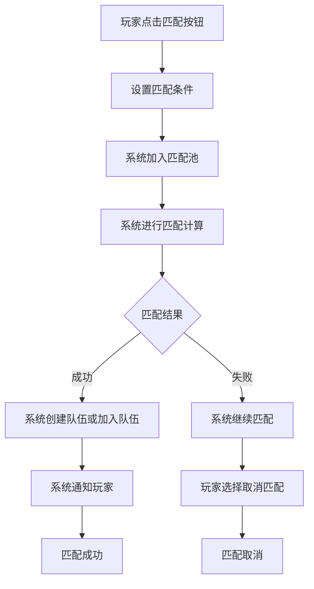
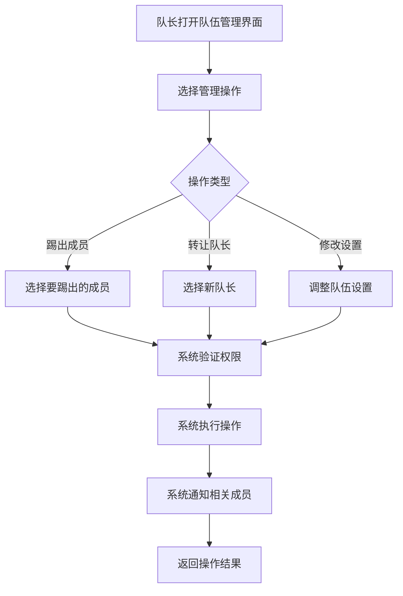
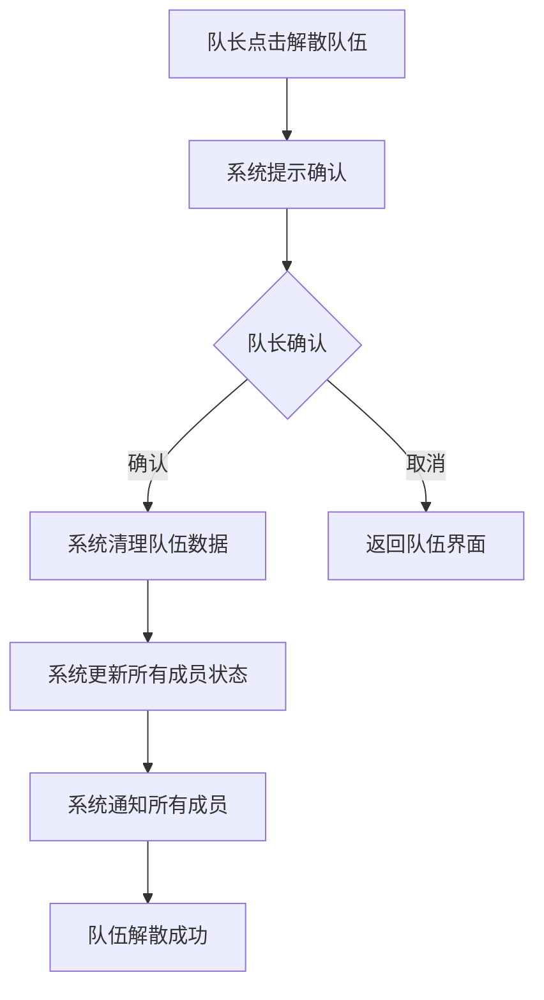

# 组队系统业务流程文档

## 1. 队伍创建流程

### 1.1 流程描述

队伍创建是组队系统的基础功能，允许玩家创建新的队伍并成为队长。

### 1.2 流程图

### 1.3 详细步骤

1. **玩家操作**：玩家在游戏界面点击"创建队伍"按钮，输入队伍名称。
2. **系统验证**：系统验证玩家输入的队伍名称是否合法（长度、字符等）。
3. **创建队伍**：系统在数据库中创建队伍记录，设置创建者为队长。
4. **更新状态**：系统更新玩家的队伍状态，将玩家加入队伍。
5. **返回结果**：系统返回新创建的队伍信息，包括队伍ID、名称、队长信息等。
6. **界面更新**：游戏界面更新为队伍界面，显示队伍信息和成员列表。

### 1.4 异常处理

1. **名称不合法**：队伍名称长度超过限制或包含非法字符，系统提示玩家重新输入。
2. **玩家已有队伍**：玩家已在其他队伍中，系统提示玩家先离开当前队伍。
3. **系统错误**：数据库操作失败等系统错误，系统提示玩家稍后重试。

## 2. 邀请加入队伍流程

### 2.1 流程描述

邀请加入队伍是队长或系统邀请其他玩家加入队伍的功能。

### 2.2 流程图

### 2.3 详细步骤

1. **队长操作**：队长在游戏界面点击"邀请"按钮，选择要邀请的玩家。
2. **系统验证**：系统验证邀请条件（队伍是否未满、被邀请玩家是否在线等）。
3. **创建邀请**：系统在数据库中创建邀请记录，状态为"待处理"。
4. **发送通知**：系统通过WebSocket向被邀请玩家发送邀请通知。
5. **玩家操作**：被邀请玩家收到邀请通知，选择接受或拒绝。
6. **处理响应**：
   - 若接受：系统将玩家加入队伍，更新队伍成员列表，通知队伍其他成员。
   - 若拒绝：系统更新邀请状态为"已拒绝"，通知队长邀请被拒绝。
7. **返回结果**：系统返回操作结果给相关玩家。

### 2.4 异常处理

1. **队伍已满**：队伍成员数量达到上限，系统提示队长队伍已满。
2. **玩家不在线**：被邀请玩家不在线，系统提示队长玩家不在线。
3. **玩家已有队伍**：被邀请玩家已在其他队伍中，系统提示队长玩家已有队伍。
4. **邀请过期**：邀请超过有效期，系统自动取消邀请。

## 3. 接受邀请流程

### 3.1 流程描述

接受邀请是玩家接受其他队伍邀请的功能。

### 3.2 流程图

### 3.3 详细步骤

1. **玩家操作**：玩家收到队伍邀请通知，查看邀请信息（邀请队伍名称、队长信息等）。
2. **接受邀请**：玩家点击"接受"按钮，确认加入队伍。
3. **系统验证**：系统验证邀请的有效性（邀请是否存在、是否过期、玩家是否已有队伍等）。
4. **更新状态**：系统更新邀请状态为"已接受"，将玩家加入队伍。
5. **通知成员**：系统通过WebSocket通知队伍其他成员有新成员加入。
6. **返回结果**：系统返回队伍信息给新加入的玩家，返回加入结果给队长。
7. **界面更新**：新加入玩家的游戏界面更新为队伍界面，显示队伍信息和成员列表。

### 3.4 异常处理

1. **邀请无效**：邀请不存在或已过期，系统提示玩家邀请无效。
2. **玩家已有队伍**：玩家已在其他队伍中，系统提示玩家先离开当前队伍。
3. **队伍已满**：队伍成员数量在玩家接受邀请前达到上限，系统提示玩家队伍已满。

## 4. 离开队伍流程

### 4.1 流程描述

离开队伍是玩家主动离开当前队伍的功能。

### 4.2 流程图

### 4.3 详细步骤

1. **玩家操作**：玩家在队伍界面点击"离开队伍"按钮。
2. **系统验证**：系统验证玩家是否在队伍中。
3. **判断身份**：系统判断玩家是否为队长。
   - **非队长**：系统直接将玩家从队伍中移除。
   - **队长**：系统检查队伍成员数量。
     - **成员数>1**：系统将队长职位转让给其他成员，然后将原队长从队伍中移除。
     - **成员数=1**：系统解散队伍。
4. **更新状态**：系统更新玩家的队伍状态，清除玩家的队伍信息。
5. **通知成员**：系统通过WebSocket通知队伍其他成员有玩家离开或队长变更。
6. **返回结果**：系统返回离开队伍的结果给玩家。
7. **界面更新**：玩家的游戏界面从队伍界面切换回单人界面。

### 4.4 异常处理

1. **玩家不在队伍中**：玩家未在任何队伍中，系统提示玩家当前不在队伍中。
2. **系统错误**：数据库操作失败等系统错误，系统提示玩家稍后重试。

## 5. 组队进入副本流程

### 5.1 流程描述

组队进入副本是队伍成员共同进入副本挑战的功能。

### 5.2 流程图

### 5.3 详细步骤

1. **队长操作**：队长在副本选择界面选择要挑战的副本，点击"进入副本"按钮。
2. **系统验证**：系统验证队伍状态（队伍是否完整、所有成员是否在线等）。
3. **成员验证**：系统验证所有队伍成员是否满足副本进入条件（等级、任务等）。
4. **次数检查**：系统检查所有队伍成员是否有足够的副本入场次数。
5. **创建实例**：系统创建副本实例，分配副本ID和场景。
6. **更新状态**：系统更新队伍的副本状态，标记队伍正在副本中。
7. **通知成员**：系统通过WebSocket通知所有队伍成员准备进入副本。
8. **加载场景**：所有队伍成员的游戏客户端加载副本场景。
9. **进入副本**：系统确认所有成员加载完成后，将队伍传入副本。
10. **副本开始**：副本挑战开始，系统开始计时和记录进度。

### 5.4 异常处理

1. **成员不满足条件**：部分成员等级不足或未完成前置任务，系统提示队长调整队伍或成员。
2. **入场次数不足**：部分成员副本入场次数已用完，系统提示队长更换成员或使用入场券。
3. **成员不在线**：部分成员离线，系统提示队长等待成员上线或踢出离线成员。
4. **系统错误**：副本实例创建失败等系统错误，系统提示玩家稍后重试。

## 6. 副本挑战流程

### 6.1 流程描述

副本挑战是队伍成员在副本中共同战斗、完成目标的过程。

### 6.2 流程图

### 6.3 详细步骤

1. **进入副本**：队伍成功进入副本，系统初始化副本场景和怪物。
2. **协同战斗**：队伍成员在副本中协同战斗，击败怪物，完成目标。
3. **进度记录**：系统实时记录副本进度，包括当前阶段、已击败的怪物等。
4. **挑战结果**：
   - **成功**：队伍击败最终BOSS，完成副本目标。
   - **失败**：队伍成员全部死亡或挑战时间结束。
5. **奖励计算**：若挑战成功，系统根据副本难度、队伍表现等计算奖励。
6. **奖励分配**：系统将奖励分配给队伍成员，包括经验、金币、物品等。
7. **状态更新**：系统更新队伍的副本状态，标记副本挑战完成或失败。
8. **返回城镇**：队伍成员返回城镇，系统清理副本实例。
9. **结果通知**：系统通知队伍成员挑战结果和获得的奖励。

### 6.4 异常处理

1. **成员掉线**：部分成员在副本中掉线，系统保留其位置，等待重新连接。
2. **副本崩溃**：副本实例崩溃，系统将队伍成员传送回城镇，记录失败。
3. **奖励分配失败**：奖励分配过程中出现错误，系统重试分配或记录错误日志。

## 7. 队伍聊天流程

### 7.1 流程描述

队伍聊天是队伍成员之间实时交流的功能。

### 7.2 流程图

### 7.3 详细步骤

1. **玩家操作**：玩家在队伍聊天窗口输入消息，点击"发送"按钮。
2. **系统验证**：系统验证消息内容是否合法（长度、敏感词等）。
3. **保存消息**：系统在数据库中保存消息记录，包括发送者、内容、时间等。
4. **广播消息**：系统通过WebSocket将消息广播给队伍其他成员。
5. **接收消息**：队伍其他成员的游戏客户端接收消息。
6. **显示消息**：消息显示在队伍聊天窗口，包括发送者名称、内容、时间等。

### 7.4 异常处理

1. **消息不合法**：消息长度超过限制或包含敏感词，系统提示玩家修改消息。
2. **玩家不在队伍中**：玩家已离开队伍，系统提示玩家无法发送队伍消息。
3. **网络延迟**：网络延迟导致消息发送失败，系统提示玩家稍后重试。

## 8. 队伍匹配流程

### 8.1 流程描述

队伍匹配是系统根据玩家条件自动匹配队伍或队员的功能。

### 8.2 流程图

### 8.3 详细步骤

1. **玩家操作**：玩家在游戏界面点击"匹配"按钮，设置匹配条件（等级范围、副本等）。
2. **加入匹配池**：系统将玩家加入匹配池，标记玩家为匹配中状态。
3. **匹配计算**：系统根据玩家设置的条件，在匹配池中寻找合适的队伍或队员。
4. **匹配结果**：
   - **成功**：系统找到合适的匹配对象，创建队伍或让玩家加入现有队伍。
   - **失败**：系统未找到合适的匹配对象，继续在匹配池中等待。
5. **通知玩家**：系统通知玩家匹配结果，匹配成功则返回队伍信息，匹配失败则继续等待。
6. **玩家选择**：玩家可以选择继续等待或取消匹配。
7. **匹配完成**：匹配成功后，系统将所有匹配到的玩家组成队伍，开始副本挑战或其他活动。

### 8.4 异常处理

1. **匹配超时**：长时间未找到匹配对象，系统提示玩家调整匹配条件或稍后再试。
2. **玩家离线**：匹配过程中玩家离线，系统将玩家从匹配池中移除。
3. **系统错误**：匹配算法出错等系统错误，系统提示玩家稍后重试。

## 9. 队伍管理流程

### 9.1 流程描述

队伍管理是队长对队伍进行管理的功能，包括踢出成员、转让队长、修改队伍设置等。

### 9.2 流程图

### 9.3 详细步骤

1. **队长操作**：队长在队伍界面点击"管理"按钮，打开队伍管理界面。
2. **选择操作**：队长选择要执行的管理操作（踢出成员、转让队长、修改队伍设置等）。
3. **系统验证**：系统验证队长权限，确保只有队长可以执行管理操作。
4. **执行操作**：
   - **踢出成员**：系统将指定成员从队伍中移除。
   - **转让队长**：系统将队长职位转让给指定成员。
   - **修改设置**：系统更新队伍设置（如队伍名称、招募状态等）。
5. **通知成员**：系统通过WebSocket通知相关成员操作结果。
6. **返回结果**：系统返回操作结果给队长。
7. **界面更新**：游戏界面更新队伍信息和成员状态。

### 9.4 异常处理

1. **权限不足**：非队长尝试执行管理操作，系统提示权限不足。
2. **操作对象无效**：选择的成员不存在或已离线，系统提示队长重新选择。
3. **系统错误**：数据库操作失败等系统错误，系统提示队长稍后重试。

## 10. 队伍解散流程

### 10.1 流程描述

队伍解散是队长解散整个队伍的功能。

### 10.2 流程图

### 10.3 详细步骤

1. **队长操作**：队长在队伍管理界面点击"解散队伍"按钮。
2. **系统提示**：系统弹出确认对话框，提示队长确认解散队伍。
3. **队长确认**：队长点击"确认"按钮，确认解散队伍。
4. **清理数据**：系统删除队伍记录，清理队伍相关数据。
5. **更新状态**：系统更新所有队伍成员的队伍状态，清除他们的队伍信息。
6. **通知成员**：系统通过WebSocket通知所有队伍成员队伍已解散。
7. **界面更新**：所有队伍成员的游戏界面从队伍界面切换回单人界面。

### 10.4 异常处理

1. **权限不足**：非队长尝试解散队伍，系统提示权限不足。
2. **系统错误**：数据库操作失败等系统错误，系统提示队长稍后重试。