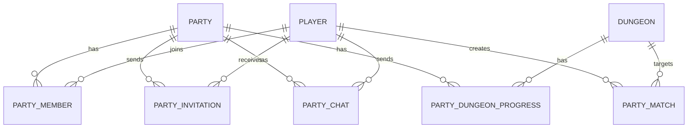

# 组队系统数据库设计文档

## 1. 数据库表结构

### 1.1 队伍表 (`t_party`)

| 字段名 | 数据类型 | 约束 | 描述 |
| :--- | :--- | :--- | :--- |
| `id` | `BIGINT` | `PRIMARY KEY AUTO_INCREMENT` | 队伍ID |
| `leader_id` | `BIGINT` | `NOT NULL` | 队长ID |
| `name` | `VARCHAR(50)` | `NOT NULL` | 队伍名称 |
| `member_count` | `INT` | `NOT NULL DEFAULT 1` | 成员数量 |
| `in_dungeon` | `BOOLEAN` | `NOT NULL DEFAULT FALSE` | 是否在副本中 |
| `current_dungeon_id` | `INT` | `NULL` | 当前副本ID |
| `dungeon_instance_id` | `BIGINT` | `NULL` | 副本实例ID |
| `create_time` | `DATETIME` | `NOT NULL DEFAULT CURRENT_TIMESTAMP` | 创建时间 |
| `update_time` | `DATETIME` | `NOT NULL DEFAULT CURRENT_TIMESTAMP ON UPDATE CURRENT_TIMESTAMP` | 更新时间 |

### 1.2 队伍成员表 (`t_party_member`)

| 字段名 | 数据类型 | 约束 | 描述 |
| :--- | :--- | :--- | :--- |
| `id` | `BIGINT` | `PRIMARY KEY AUTO_INCREMENT` | 成员ID |
| `party_id` | `BIGINT` | `NOT NULL` | 队伍ID |
| `player_id` | `BIGINT` | `NOT NULL` | 玩家ID |
| `is_leader` | `BOOLEAN` | `NOT NULL DEFAULT FALSE` | 是否为队长 |
| `join_time` | `DATETIME` | `NOT NULL DEFAULT CURRENT_TIMESTAMP` | 加入时间 |
| `update_time` | `DATETIME` | `NOT NULL DEFAULT CURRENT_TIMESTAMP ON UPDATE CURRENT_TIMESTAMP` | 更新时间 |

### 1.3 队伍邀请表 (`t_party_invitation`)

| 字段名 | 数据类型 | 约束 | 描述 |
| :--- | :--- | :--- | :--- |
| `id` | `BIGINT` | `PRIMARY KEY AUTO_INCREMENT` | 邀请ID |
| `party_id` | `BIGINT` | `NOT NULL` | 队伍ID |
| `player_id` | `BIGINT` | `NOT NULL` | 被邀请玩家ID |
| `status` | `VARCHAR(20)` | `NOT NULL DEFAULT 'PENDING'` | 邀请状态 |
| `send_time` | `DATETIME` | `NOT NULL DEFAULT CURRENT_TIMESTAMP` | 发送时间 |
| `respond_time` | `DATETIME` | `NULL` | 响应时间 |

### 1.4 队伍聊天消息表 (`t_party_chat`)

| 字段名 | 数据类型 | 约束 | 描述 |
| :--- | :--- | :--- | :--- |
| `id` | `BIGINT` | `PRIMARY KEY AUTO_INCREMENT` | 消息ID |
| `party_id` | `BIGINT` | `NOT NULL` | 队伍ID |
| `player_id` | `BIGINT` | `NOT NULL` | 发送者ID |
| `message` | `VARCHAR(500)` | `NOT NULL` | 消息内容 |
| `send_time` | `DATETIME` | `NOT NULL DEFAULT CURRENT_TIMESTAMP` | 发送时间 |

### 1.5 队伍副本进度表 (`t_party_dungeon_progress`)

| 字段名 | 数据类型 | 约束 | 描述 |
| :--- | :--- | :--- | :--- |
| `id` | `BIGINT` | `PRIMARY KEY AUTO_INCREMENT` | 进度ID |
| `party_id` | `BIGINT` | `NOT NULL` | 队伍ID |
| `dungeon_id` | `INT` | `NOT NULL` | 副本ID |
| `current_stage` | `INT` | `NOT NULL DEFAULT 1` | 当前阶段 |
| `completed` | `BOOLEAN` | `NOT NULL DEFAULT FALSE` | 是否完成 |
| `enter_time` | `DATETIME` | `NOT NULL DEFAULT CURRENT_TIMESTAMP` | 进入时间 |
| `complete_time` | `DATETIME` | `NULL` | 完成时间 |

### 1.6 队伍匹配表 (`t_party_match`)

| 字段名 | 数据类型 | 约束 | 描述 |
| :--- | :--- | :--- | :--- |
| `id` | `BIGINT` | `PRIMARY KEY AUTO_INCREMENT` | 匹配ID |
| `player_id` | `BIGINT` | `NOT NULL` | 玩家ID |
| `min_level` | `INT` | `NOT NULL DEFAULT 1` | 最低等级 |
| `max_level` | `INT` | `NOT NULL DEFAULT 999` | 最高等级 |
| `dungeon_id` | `INT` | `NULL` | 目标副本ID |
| `status` | `VARCHAR(20)` | `NOT NULL DEFAULT 'PENDING'` | 匹配状态 |
| `create_time` | `DATETIME` | `NOT NULL DEFAULT CURRENT_TIMESTAMP` | 创建时间 |
| `update_time` | `DATETIME` | `NOT NULL DEFAULT CURRENT_TIMESTAMP ON UPDATE CURRENT_TIMESTAMP` | 更新时间 |

## 2. 索引设计

### 2.1 队伍表索引

| 索引名 | 索引类型 | 索引字段 | 描述 |
| :--- | :--- | :--- | :--- |
| `PRIMARY` | 主键索引 | `id` | 队伍ID主键 |
| `idx_leader_id` | 普通索引 | `leader_id` | 加速队长查询 |
| `idx_in_dungeon` | 普通索引 | `in_dungeon` | 加速副本中队伍查询 |

### 2.2 队伍成员表索引

| 索引名 | 索引类型 | 索引字段 | 描述 |
| :--- | :--- | :--- | :--- |
| `PRIMARY` | 主键索引 | `id` | 成员ID主键 |
| `idx_party_id` | 普通索引 | `party_id` | 加速队伍成员查询 |
| `idx_player_id` | 普通索引 | `player_id` | 加速玩家队伍查询 |
| `idx_party_player` | 唯一索引 | `party_id, player_id` | 确保玩家在队伍中唯一 |

### 2.3 队伍邀请表索引

| 索引名 | 索引类型 | 索引字段 | 描述 |
| :--- | :--- | :--- | :--- |
| `PRIMARY` | 主键索引 | `id` | 邀请ID主键 |
| `idx_party_id` | 普通索引 | `party_id` | 加速队伍邀请查询 |
| `idx_player_id` | 普通索引 | `player_id` | 加速玩家邀请查询 |
| `idx_status` | 普通索引 | `status` | 加速待处理邀请查询 |

### 2.4 队伍聊天消息表索引

| 索引名 | 索引类型 | 索引字段 | 描述 |
| :--- | :--- | :--- | :--- |
| `PRIMARY` | 主键索引 | `id` | 消息ID主键 |
| `idx_party_id` | 普通索引 | `party_id` | 加速队伍聊天查询 |
| `idx_party_time` | 普通索引 | `party_id, send_time` | 加速队伍聊天历史查询 |

### 2.5 队伍副本进度表索引

| 索引名 | 索引类型 | 索引字段 | 描述 |
| :--- | :--- | :--- | :--- |
| `PRIMARY` | 主键索引 | `id` | 进度ID主键 |
| `idx_party_id` | 普通索引 | `party_id` | 加速队伍副本进度查询 |
| `idx_dungeon_id` | 普通索引 | `dungeon_id` | 加速副本进度查询 |
| `idx_party_dungeon` | 唯一索引 | `party_id, dungeon_id` | 确保队伍在副本中只有一条进度 |

### 2.6 队伍匹配表索引

| 索引名 | 索引类型 | 索引字段 | 描述 |
| :--- | :--- | :--- | :--- |
| `PRIMARY` | 主键索引 | `id` | 匹配ID主键 |
| `idx_player_id` | 普通索引 | `player_id` | 加速玩家匹配查询 |
| `idx_status` | 普通索引 | `status` | 加速待处理匹配查询 |
| `idx_dungeon_id` | 普通索引 | `dungeon_id` | 加速副本匹配查询 |

## 3. 表关系

## 4. 数据迁移与同步

### 4.1 从Java系统迁移

1. **队伍数据迁移**:
   - 从Java系统的队伍表迁移到新的`t_party`表
   - 确保队伍ID、队长ID、队伍名称等核心字段正确映射

2. **成员数据迁移**:
   - 从Java系统的队伍成员表迁移到新的`t_party_member`表
   - 确保成员状态、队长标识等正确迁移

3. **邀请数据迁移**:
   - 迁移待处理的邀请数据
   - 过期邀请可以选择性迁移

4. **副本进度迁移**:
   - 迁移队伍当前的副本进度
   - 确保进度状态、当前阶段等正确映射

### 4.2 数据同步策略

1. **实时同步**:
   - 对于活跃队伍，采用实时同步机制
   - 使用消息队列确保数据一致性

2. **批量同步**:
   - 对于非活跃队伍，采用批量同步
   - 定期将Java系统的数据同步到Go系统

3. **冲突处理**:
   - 采用时间戳机制解决数据冲突
   - 以最新更新时间的数据为准

## 5. 性能优化

### 5.1 查询优化

1. **常用查询优化**:
   - 为常用查询添加合适的索引
   - 使用覆盖索引减少回表操作
   - 合理使用联合索引

2. **分页查询优化**:
   - 对于聊天历史等分页查询，使用索引覆盖
   - 避免使用`OFFSET`进行大分页查询

3. **统计查询优化**:
   - 使用Redis缓存队伍成员数量等统计信息
   - 定期更新缓存，减少数据库压力

### 5.2 写入优化

1. **批量写入**:
   - 对于队伍成员更新等操作，使用批量写入
   - 减少数据库连接开销

2. **异步写入**:
   - 对于聊天消息等非关键数据，使用异步写入
   - 提高系统响应速度

3. **事务优化**:
   - 合理使用事务，避免长事务
   - 只在必要时使用事务

### 5.3 存储优化

1. **分区表**:
   - 对于聊天消息表，考虑使用分区表
   - 按时间分区，便于管理和查询

2. **数据清理**:
   - 定期清理过期的邀请数据
   - 清理历史聊天消息，只保留最近的记录

3. **缓存策略**:
   - 使用Redis缓存热点队伍数据
   - 设置合理的缓存过期时间

## 6. 安全考虑

### 6.1 数据安全

1. **数据加密**:
   - 对敏感数据进行加密存储
   - 使用HTTPS传输数据

2. **访问控制**:
   - 实现严格的数据库访问控制
   - 只允许授权服务访问数据库

3. **备份策略**:
   - 定期备份队伍数据
   - 实现灾备方案

### 6.2 防SQL注入

1. **参数化查询**:
   - 使用参数化查询防止SQL注入
   - 避免直接拼接SQL语句

2. **输入验证**:
   - 对所有用户输入进行严格验证
   - 限制输入长度和格式

3. **权限控制**:
   - 限制数据库用户权限
   - 遵循最小权限原则

## 7. 扩展性考虑

### 7.1 水平扩展

1. **分库分表**:
   - 考虑使用分库分表应对大规模队伍数据
   - 按队伍ID进行分片

2. **读写分离**:
   - 实现读写分离，提高系统吞吐量
   - 主库处理写操作，从库处理读操作

### 7.2 功能扩展

1. **预留字段**:
   - 在表结构中预留扩展字段
   - 便于后续功能扩展

2. **模块化设计**:
   - 采用模块化设计，便于添加新功能
   - 例如：队伍成就、队伍任务等

3. **API兼容性**:
   - 确保数据库设计兼容API变化
   - 支持向后兼容

## 8. 监控与维护

### 8.1 监控指标

1. **性能指标**:
   - 数据库查询响应时间
   - 写入操作延迟
   - 连接池使用情况

2. **业务指标**:
   - 队伍创建成功率
   - 邀请接受率
   - 副本挑战成功率

3. **错误指标**:
   - 数据库错误率
   - 事务失败率
   - 死锁发生次数

### 8.2 维护策略

1. **定期维护**:
   - 定期进行数据库优化
   - 更新统计信息
   - 重建索引

2. **故障处理**:
   - 制定数据库故障处理预案
   - 建立快速恢复机制

3. **容量规划**:
   - 定期评估数据库容量
   - 根据业务增长进行扩容

## 9. 数据库配置

### 9.1 MySQL配置优化

1. **连接池配置**:
   - 调整`max_connections`参数
   - 设置合理的`wait_timeout`

2. **缓存配置**:
   - 调整`innodb_buffer_pool_size`
   - 设置合理的`key_buffer_size`

3. **日志配置**:
   - 启用慢查询日志
   - 设置合理的日志级别

### 9.2 索引配置

1. **索引创建**:
   - 根据查询模式创建合适的索引
   - 避免过度索引

2. **索引维护**:
   - 定期检查索引使用情况
   - 删除无效索引

### 9.3 备份配置

1. **备份策略**:
   - 实现全量备份和增量备份
   - 定期测试备份恢复

2. **备份存储**:
   - 异地存储备份数据
   - 确保备份数据安全

## 10. 总结

本数据库设计文档详细描述了组队系统的数据库结构、索引设计、表关系、数据迁移策略、性能优化、安全考虑、扩展性考虑、监控与维护以及配置优化。设计遵循了高可用性、高性能、可扩展性的原则，确保组队系统在各种场景下都能稳定运行。

通过合理的表结构设计、索引优化和性能调优，组队系统的数据库能够支持大量队伍的创建、管理和副本挑战，为玩家提供流畅的组队体验。同时，设计考虑了从Java系统的迁移和后续功能的扩展，确保系统的可持续发展。