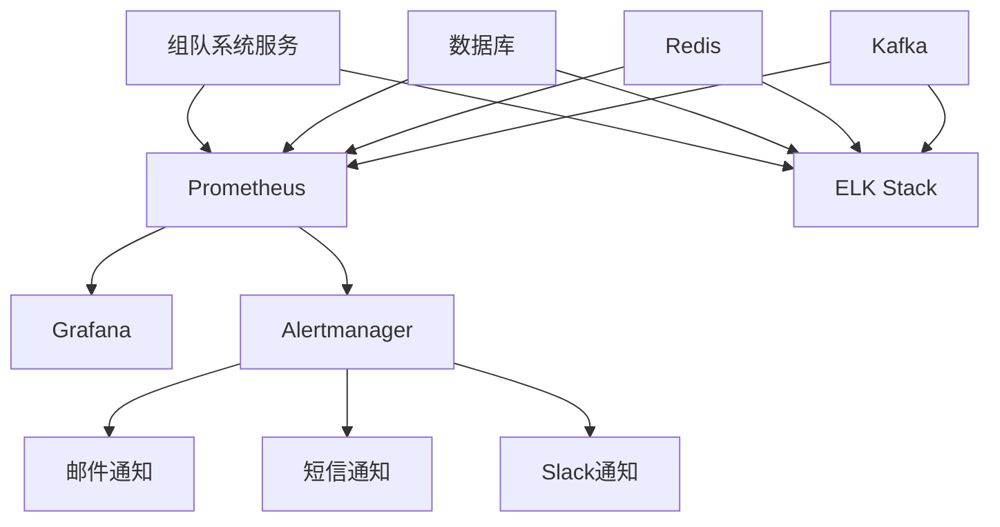
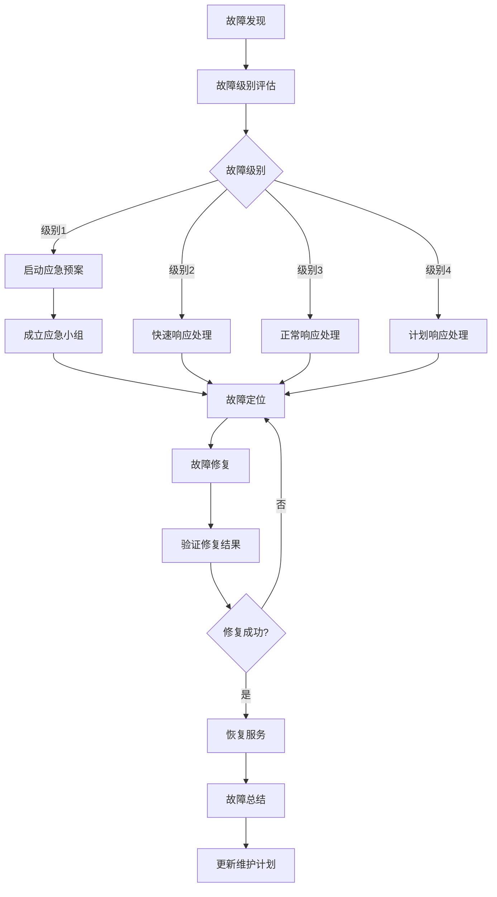

# 组队系统监控与维护文档

## 1. 监控系统设计

### 1.1 监控目标

- **服务可用性**：确保组队系统服务持续可用
- **性能监控**：监控系统响应时间、吞吐量等性能指标
- **资源使用**：监控服务器CPU、内存、磁盘等资源使用情况
- **数据库状态**：监控数据库连接、查询性能、存储空间等
- **消息队列状态**：监控Kafka消息队列的生产和消费情况
- **业务指标**：监控队伍创建、邀请、副本挑战等业务指标
- **异常检测**：及时发现和处理系统异常

### 1.2 监控架构



### 1.3 监控工具

| 工具 | 用途 | 版本 | 配置文件 |
| :--- | :--- | :--- | :--- |
| Prometheus | 监控指标采集 | 2.30+ | `prometheus.yml` |
| Grafana | 监控面板展示 | 8.0+ | `grafana.ini` |
| Alertmanager | 告警管理 | 0.23+ | `alertmanager.yml` |
| ELK Stack | 日志收集与分析 | 7.10+ | `logstash.conf`, `elasticsearch.yml`, `kibana.yml` |
| Node Exporter | 服务器资源监控 | 1.3+ | - |
| MySQL Exporter | 数据库监控 | 0.13+ | - |
| Redis Exporter | Redis监控 | 1.28+ | - |
| Kafka Exporter | Kafka监控 | 1.4+ | - |

## 2. 监控指标

### 2.1 服务指标

| 指标名称 | 类型 | 描述 | 告警阈值 |
| :--- | :--- | :--- | :--- |
| `party_server_requests_total` | Counter | 服务请求总数 | - |
| `party_server_request_duration_seconds` | Histogram | 请求处理时间 | P95 > 1s |
| `party_server_errors_total` | Counter | 服务错误总数 | 5分钟内 > 10 |
| `party_server_active_connections` | Gauge | 活跃连接数 | > 1000 |
| `party_server_websocket_connections` | Gauge | WebSocket活跃连接数 | > 500 |
| `party_server_memory_usage_bytes` | Gauge | 内存使用量 | > 80% |
| `party_server_cpu_usage_percent` | Gauge | CPU使用率 | > 80% |

### 2.2 业务指标

| 指标名称 | 类型 | 描述 | 告警阈值 |
| :--- | :--- | :--- | :--- |
| `party_creations_total` | Counter | 队伍创建总数 | - |
| `party_invitations_total` | Counter | 邀请总数 | - |
| `party_joins_total` | Counter | 加入队伍总数 | - |
| `party_leaves_total` | Counter | 离开队伍总数 | - |
| `party_dungeon_attempts_total` | Counter | 副本尝试总数 | - |
| `party_dungeon_successes_total` | Counter | 副本成功总数 | - |
| `party_dungeon_failures_total` | Counter | 副本失败总数 | - |
| `party_chat_messages_total` | Counter | 聊天消息总数 | - |
| `party_match_attempts_total` | Counter | 匹配尝试总数 | - |
| `party_match_successes_total` | Counter | 匹配成功总数 | - |
| `party_match_failures_total` | Counter | 匹配失败总数 | - |
| `party_match_wait_time_seconds` | Histogram | 匹配等待时间 | P95 > 30s |

### 2.3 数据库指标

| 指标名称 | 类型 | 描述 | 告警阈值 |
| :--- | :--- | :--- | :--- |
| `mysql_global_status_connections` | Gauge | 数据库连接数 | > 500 |
| `mysql_global_status_slow_queries` | Counter | 慢查询数 | 5分钟内 > 10 |
| `mysql_global_status_innodb_buffer_pool_pages_free` | Gauge | 缓冲池空闲页数 | < 10% |
| `mysql_global_status_uptime` | Counter | 数据库运行时间 | - |
| `mysql_info_schema_innodb_metrics_latch_wait_time` | Counter | 锁等待时间 | > 10s |

### 2.4 缓存指标

| 指标名称 | 类型 | 描述 | 告警阈值 |
| :--- | :--- | :--- | :--- |
| `redis_connected_clients` | Gauge | Redis连接数 | > 1000 |
| `redis_used_memory_rss` | Gauge | Redis内存使用量 | > 80% |
| `redis_keyspace_hits_total` | Counter | 缓存命中数 | - |
| `redis_keyspace_misses_total` | Counter | 缓存未命中数 | 命中率 < 90% |
| `redis_commands_processed_total` | Counter | 命令处理数 | - |

### 2.5 消息队列指标

| 指标名称 | 类型 | 描述 | 告警阈值 |
| :--- | :--- | :--- | :--- |
| `kafka_consumergroup_lag` | Gauge | 消费者组滞后数 | > 1000 |
| `kafka_topic_partitions` | Gauge | 主题分区数 | - |
| `kafka_topic_messages_in_total` | Counter | 消息入队总数 | - |
| `kafka_topic_messages_out_total` | Counter | 消息出队总数 | - |
| `kafka_server_brokers` | Gauge | broker数量 | < 预期数量 |

## 3. 告警配置

### 3.1 告警规则

#### 3.1.1 服务告警

```yaml
# party_server_alerts.yml

groups:
- name: party_server_alerts
  rules:
  - alert: PartyServerDown
    expr: up{job="party-server"} == 0
    for: 5m
    labels:
      severity: critical
    annotations:
      summary: "Party server down"
      description: "Party server {{ $labels.instance }} has been down for more than 5 minutes."

  - alert: HighRequestLatency
    expr: histogram_quantile(0.95, sum(rate(party_server_request_duration_seconds_bucket[5m])) by (le, instance)) > 1
    for: 5m
    labels:
      severity: warning
    annotations:
      summary: "High request latency"
      description: "95th percentile latency for party server {{ $labels.instance }} is above 1s for 5 minutes."

  - alert: HighErrorRate
    expr: rate(party_server_errors_total[5m]) > 10
    for: 5m
    labels:
      severity: warning
    annotations:
      summary: "High error rate"
      description: "Error rate for party server {{ $labels.instance }} is above 10 errors per minute for 5 minutes."

  - alert: HighWebSocketConnections
    expr: party_server_websocket_connections > 500
    for: 5m
    labels:
      severity: warning
    annotations:
      summary: "High WebSocket connections"
      description: "WebSocket connections for party server {{ $labels.instance }} is above 500 for 5 minutes."
```

#### 3.1.2 数据库告警

```yaml
# mysql_alerts.yml

groups:
- name: mysql_alerts
  rules:
  - alert: MySQLDown
    expr: mysql_up == 0
    for: 5m
    labels:
      severity: critical
    annotations:
      summary: "MySQL down"
      description: "MySQL instance {{ $labels.instance }} has been down for more than 5 minutes."

  - alert: HighMySQLConnections
    expr: mysql_global_status_connections > 500
    for: 5m
    labels:
      severity: warning
    annotations:
      summary: "High MySQL connections"
      description: "MySQL connections for {{ $labels.instance }} is above 500 for 5 minutes."

  - alert: ManySlowQueries
    expr: rate(mysql_global_status_slow_queries[5m]) > 10
    for: 5m
    labels:
      severity: warning
    annotations:
      summary: "Many slow queries"
      description: "MySQL instance {{ $labels.instance }} has more than 10 slow queries per minute for 5 minutes."
```

#### 3.1.3 业务告警

```yaml
# party_business_alerts.yml

groups:
- name: party_business_alerts
  rules:
  - alert: LowMatchSuccessRate
    expr: rate(party_match_successes_total[30m]) / rate(party_match_attempts_total[30m]) < 0.5
    for: 30m
    labels:
      severity: warning
    annotations:
      summary: "Low match success rate"
      description: "Match success rate for party system is below 50% for 30 minutes."

  - alert: HighMatchWaitTime
    expr: histogram_quantile(0.95, sum(rate(party_match_wait_time_seconds_bucket[30m])) by (le)) > 30
    for: 30m
    labels:
      severity: warning
    annotations:
      summary: "High match wait time"
      description: "95th percentile match wait time is above 30 seconds for 30 minutes."

  - alert: LowDungeonSuccessRate
    expr: rate(party_dungeon_successes_total[30m]) / rate(party_dungeon_attempts_total[30m]) < 0.3
    for: 30m
    labels:
      severity: warning
    annotations:
      summary: "Low dungeon success rate"
      description: "Dungeon success rate for party system is below 30% for 30 minutes."
```

### 3.2 告警通知

```yaml
# alertmanager.yml

global:
  resolve_timeout: 5m
  smtp_smarthost: 'smtp.example.com:587'
  smtp_from: 'alerts@example.com'
  smtp_auth_username: 'alerts@example.com'
  smtp_auth_password: 'password'

route:
  group_by: ['alertname', 'instance']
  group_wait: 30s
  group_interval: 5m
  repeat_interval: 4h
  receiver: 'email'
  routes:
  - match:
      severity: critical
    receiver: 'sms'
  - match:
      severity: warning
    receiver: 'slack'

receivers:
- name: 'email'
  email_configs:
  - to: 'devops@example.com'
    send_resolved: true

- name: 'sms'
  webhook_configs:
  - url: 'http://sms-notifier:8080/send'
    send_resolved: true

- name: 'slack'
  slack_configs:
  - api_url: 'https://hooks.slack.com/services/XXX/YYY/ZZZ'
    channel: '#alerts'
    send_resolved: true
```

## 4. 维护计划

### 4.1 日常维护

| 维护项 | 频率 | 负责人 | 操作步骤 |
| :--- | :--- | :--- | :--- |
| 监控面板检查 | 每日 | 运维工程师 | 检查Grafana面板，确认系统运行正常 |
| 日志分析 | 每日 | 运维工程师 | 分析ELK日志，查找异常信息 |
| 数据库备份 | 每日 | 数据库管理员 | 执行数据库全量备份 |
| 系统资源检查 | 每日 | 运维工程师 | 检查服务器CPU、内存、磁盘使用情况 |
| 告警记录 review | 每日 | 运维工程师 | 检查告警记录，分析问题原因 |

### 4.2 周维护

| 维护项 | 频率 | 负责人 | 操作步骤 |
| :--- | :--- | :--- | :--- |
| 数据库优化 | 每周 | 数据库管理员 | 分析慢查询，优化数据库索引 |
| 缓存清理 | 每周 | 运维工程师 | 清理Redis过期数据，优化内存使用 |
| 消息队列清理 | 每周 | 运维工程师 | 清理Kafka过期消息，优化存储空间 |
| 系统更新 | 每周 | 运维工程师 | 更新系统补丁，确保系统安全 |
| 性能测试 | 每周 | 测试工程师 | 执行性能测试，确保系统性能稳定 |

### 4.3 月维护

| 维护项 | 频率 | 负责人 | 操作步骤 |
| :--- | :--- | :--- | :--- |
| 数据库扩容 | 每月 | 数据库管理员 | 根据数据增长情况，评估是否需要扩容 |
| 服务器扩容 | 每月 | 运维工程师 | 根据业务增长情况，评估是否需要扩容服务器 |
| 系统架构 review | 每月 | 架构师 | 评估系统架构，提出优化建议 |
| 安全审计 | 每月 | 安全工程师 | 执行安全审计，发现并修复安全漏洞 |
| 灾备演练 | 每月 | 运维工程师 | 执行灾备演练，确保系统可恢复性 |

## 5. 故障处理

### 5.1 故障分类

| 故障级别 | 影响范围 | 响应时间 | 处理流程 |
| :--- | :--- | :--- | :--- |
| 级别1（严重） | 系统完全不可用 | 立即响应（15分钟内） | 启动应急预案，成立应急小组，24小时不间断处理 |
| 级别2（高） | 核心功能不可用 | 快速响应（30分钟内） | 启动应急响应，4小时内解决 |
| 级别3（中） | 部分功能不可用 | 正常响应（2小时内） | 安排人员处理，8小时内解决 |
| 级别4（低） | 功能可用但有异常 | 计划响应（24小时内） | 纳入日常维护计划，下次发布修复 |

### 5.2 常见故障处理

#### 5.2.1 服务宕机

| 故障现象 | 可能原因 | 处理步骤 |
| :--- | :--- | :--- |
| 服务无响应 | 内存溢出 | 1. 重启服务<br>2. 分析内存使用情况<br>3. 优化内存配置 |
| 服务崩溃 | 代码异常 | 1. 查看错误日志<br>2. 修复代码bug<br>3. 重启服务 |
| 端口占用 | 进程未正确关闭 | 1. 查找占用端口的进程<br>2. 关闭进程<br>3. 重启服务 |

#### 5.2.2 数据库故障

| 故障现象 | 可能原因 | 处理步骤 |
| :--- | :--- | :--- |
| 数据库连接失败 | 数据库服务宕机 | 1. 检查数据库状态<br>2. 重启数据库服务<br>3. 恢复数据连接 |
| 数据库性能下降 | 慢查询 | 1. 分析慢查询日志<br>2. 优化SQL语句<br>3. 添加或优化索引 |
| 数据库存储空间不足 | 数据增长过快 | 1. 清理过期数据<br>2. 扩容数据库存储<br>3. 优化数据存储策略 |

#### 5.2.3 缓存故障

| 故障现象 | 可能原因 | 处理步骤 |
| :--- | :--- | :--- |
| 缓存连接失败 | Redis服务宕机 | 1. 检查Redis状态<br>2. 重启Redis服务<br>3. 恢复缓存连接 |
| 缓存命中率低 | 缓存策略不当 | 1. 分析缓存使用情况<br>2. 优化缓存策略<br>3. 调整缓存过期时间 |
| 缓存内存不足 | 缓存数据过多 | 1. 清理过期数据<br>2. 扩容Redis内存<br>3. 优化缓存数据结构 |

#### 5.2.4 消息队列故障

| 故障现象 | 可能原因 | 处理步骤 |
| :--- | :--- | :--- |
| 消息堆积 | 消费者处理能力不足 | 1. 增加消费者实例<br>2. 优化消费者处理逻辑<br>3. 清理堆积消息 |
| 消息丢失 |  broker故障 | 1. 检查Kafka状态<br>2. 重启Kafka服务<br>3. 恢复消息生产和消费 |
| 消息重复 | 消费端处理不当 | 1. 优化消费端幂等性<br>2. 使用消息ID去重<br>3. 调整消费组配置 |

### 5.3 故障处理流程



## 5. 灾备方案

### 5.1 数据备份

| 备份类型 | 频率 | 存储位置 | 恢复时间 |
| :--- | :--- | :--- | :--- |
| 数据库全量备份 | 每日 | 异地存储 | < 1小时 |
| 数据库增量备份 | 每小时 | 本地存储 | < 30分钟 |
| 配置文件备份 | 每周 | 异地存储 | < 10分钟 |
| 代码备份 | 每次提交 | Git仓库 | < 5分钟 |

### 5.2 高可用方案

#### 5.2.1 服务高可用

- **多实例部署**：部署多个party-server实例
- **负载均衡**：使用Nginx或HAProxy进行负载均衡
- **自动故障转移**：当实例宕机时，自动将流量转移到其他实例

#### 5.2.2 数据库高可用

- **主从复制**：配置MySQL主从复制
- **自动故障转移**：使用Orchestrator或MHA实现主从自动切换
- **读写分离**：使用ProxySQL实现读写分离，提高系统性能

#### 5.2.3 缓存高可用

- **Redis集群**：部署Redis集群，提供高可用缓存服务
- **哨兵模式**：使用Redis Sentinel实现主从自动切换

#### 5.2.4 消息队列高可用

- **Kafka集群**：部署Kafka集群，提高消息队列可靠性
- **副本机制**：配置Kafka主题多副本，确保消息不丢失

### 5.3 灾难恢复

| 灾难类型 | 恢复策略 | 恢复时间 | 负责人 |
| :--- | :--- | :--- | :--- |
| 服务节点故障 | 启动备用节点 | < 5分钟 | 运维工程师 |
| 数据库节点故障 | 切换到从库 | < 30分钟 | 数据库管理员 |
| 数据中心故障 | 切换到异地灾备中心 | < 2小时 | 运维团队 |
| 数据丢失 | 从备份恢复 | < 4小时 | 数据库管理员 |

## 6. 问题排查

### 6.1 排查工具

| 工具 | 用途 | 使用方法 |
| :--- | :--- | :--- |
| `ps` | 查看进程状态 | `ps aux | grep party-server` |
| `top` | 查看系统资源使用情况 | `top` |
| `netstat` | 查看网络连接 | `netstat -tlnp` |
| `lsof` | 查看文件占用 | `lsof -i :8080` |
| `mysql` | 数据库操作 | `mysql -u root -p dnf_game` |
| `redis-cli` | Redis操作 | `redis-cli` |
| `kafka-console-consumer` | Kafka消息消费 | `kafka-console-consumer.sh --bootstrap-server localhost:9092 --topic party-events --from-beginning` |
| `curl` | HTTP请求测试 | `curl -X GET http://localhost:8080/api/party/info/1` |
| `tail` | 查看日志 | `tail -f logs/party-server.log` |

### 6.2 常见问题排查

#### 6.2.1 队伍创建失败

1. **排查步骤**:
   - 检查服务日志，查找错误信息
   - 检查数据库连接状态
   - 验证玩家是否已有队伍
   - 检查队伍名称是否符合要求

2. **可能原因**:
   - 数据库连接失败
   - 玩家已有队伍
   - 队伍名称不符合要求
   - 服务内部错误

#### 6.2.2 邀请发送失败

1. **排查步骤**:
   - 检查服务日志，查找错误信息
   - 验证队伍是否存在且未满
   - 验证被邀请玩家是否存在且在线
   - 检查Kafka消息队列状态

2. **可能原因**:
   - 队伍不存在或已满
   - 被邀请玩家不存在或离线
   - Kafka消息发送失败
   - 服务内部错误

#### 6.2.3 副本进入失败

1. **排查步骤**:
   - 检查服务日志，查找错误信息
   - 验证队伍状态是否正常
   - 检查所有成员是否满足副本要求
   - 验证所有成员是否有足够的入场次数

2. **可能原因**:
   - 队伍状态异常
   - 部分成员等级不足
   - 部分成员入场次数不足
   - 副本实例创建失败

#### 6.2.4 聊天消息发送失败

1. **排查步骤**:
   - 检查服务日志，查找错误信息
   - 验证玩家是否在队伍中
   - 检查WebSocket连接状态
   - 检查消息内容是否符合要求

2. **可能原因**:
   - 玩家不在队伍中
   - WebSocket连接断开
   - 消息内容不符合要求
   - 服务内部错误

## 7. 总结

### 7.1 监控与维护体系

- **全面监控**：覆盖服务、数据库、缓存、消息队列等各个组件
- **多维度告警**：基于服务、业务、资源等多维度设置告警
- **自动化运维**：实现监控、告警、故障处理的自动化
- **完善的维护计划**：建立日常、周、月维护计划，确保系统稳定运行
- **健全的灾备方案**：提供数据备份、高可用和灾难恢复方案

### 7.2 持续改进

1. **监控优化**:
   - 根据实际运行情况，调整监控指标和告警阈值
   - 新增业务相关的监控指标
   - 优化监控面板，提高可视化效果

2. **维护优化**:
   - 基于故障处理经验，更新维护计划
   - 优化维护流程，提高维护效率
   - 引入自动化维护工具，减少人工操作

3. **系统优化**:
   - 根据监控数据，优化系统性能
   - 改进系统架构，提高系统可靠性
   - 完善系统功能，提升用户体验

4. **知识积累**:
   - 建立故障处理知识库，记录常见问题和解决方案
   - 定期组织技术分享，提升团队运维能力
   - 持续学习新技术，保持监控与维护体系的先进性

通过建立完善的监控与维护体系，确保组队系统的稳定运行，为玩家提供流畅的组队体验。同时，通过持续改进，不断提升系统的可靠性、性能和可维护性。