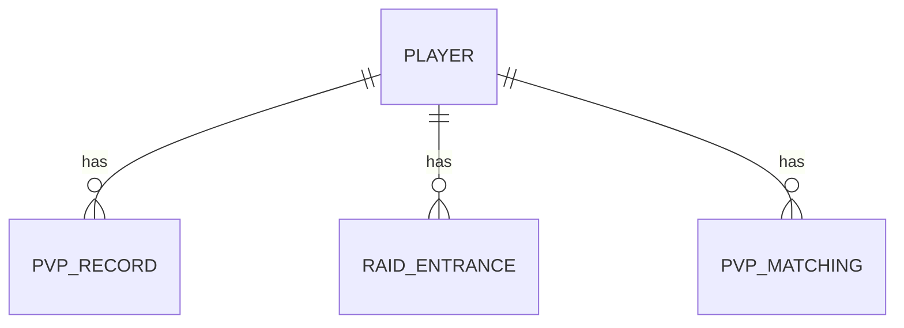

# PK 系统设计文档

## 文档导航

- [系统概述](03_PK系统/系统概述.md)
- [Java代码分析](03_PK系统/Java代码分析.md)
- [Go实现方案](03_PK系统/Go实现方案.md)
- [API文档](03_PK系统/API文档.md)
- [数据库设计文档](03_PK系统/数据库设计文档.md)
- [业务流程文档](03_PK系统/业务流程文档.md)
- [测试用例文档](03_PK系统/测试用例文档.md)
- [部署文档](03_PK系统/部署文档.md)
- [监控与维护](03_PK系统/监控与维护.md)
- [变更记录](03_PK系统/变更记录.md)

## 1. 系统概述

PK（Player Kill）系统是玩家对战的核心功能，支持玩家匹配、战斗、结算等功能。

### 1.1 系统简介

- **系统名称**: PK系统
- **系统功能**: 提供玩家匹配、战斗、结算、副本入场次数管理等功能
- **系统位置**: `internal/game/pk_service`

### 1.2 核心流程

1. 玩家请求多人游戏匹配
2. 系统进行匹配处理
3. 匹配成功后返回战斗服务器信息
4. 玩家连接战斗服务器进行战斗
5. 战斗结束后进行结算
6. 玩家返回城镇

## 2. Java 代码分析

### 2.1 核心控制器

- **文件位置**: `src/main/java/com/dnfm/game/pk/PkController.java`
- **处理器数量**: 9 个 @RequestMapping 方法

### 2.2 核心功能

#### 2.2.1 多人游戏请求匹配 (REQ_MULTI_PLAY_REQUEST_MATCH)
- **方法**: `reqMultiPlayRequestMatch(IoSession session, REQ_MULTI_PLAY_REQUEST_MATCH reqMultiPlayRequestMatch)`
- **功能**:
  - 请求多人游戏匹配
  - 返回匹配结果
  - 当前实现返回错误码 3（未实现）

#### 2.2.2 取消多人游戏请求匹配 (REQ_MULTI_PLAY_REQUEST_MATCH_CANCEL)
- **方法**: `reqMultiPlayRequestMatchCancel(IoSession session, REQ_MULTI_PLAY_REQUEST_MATCH_CANCEL reqMultiPlayRequestMatchCancel)`
- **功能**:
  - 取消多人游戏匹配请求
  - 返回取消结果
  - 当前实现返回错误码 3（未实现）

#### 2.2.3 历史遗迹通知 (REQ_HISTORICSITE_NOTI)
- **方法**: `REQ_HISTORICSITE_NOTI(IoSession session, REQ_HISTORICSITE_NOTI req_historicsite_noti)`
- **功能**:
  - 获取历史遗迹通知
  - 返回通知信息

#### 2.2.4 加载公会捐赠信息 (REQ_LOAD_GUILD_DONATION_INFO_2)
- **方法**: `REQ_LOAD_GUILD_DONATION_INFO_2(IoSession session, REQ_LOAD_GUILD_DONATION_INFO_2 req_load_guild_donation_info_2)`
- **功能**:
  - 加载公会捐赠信息
  - 返回捐赠配方列表
  - 返回数据示例：`{"recipe": [{"index": 5}, {"index": 13}, ...]}`

#### 2.2.5 梦境迷宫基本信息 (REQ_DREAM_MAZE_BASICINFO)
- **方法**: `REQ_DREAM_MAZE_BASICINFO(IoSession session, REQ_DREAM_MAZE_BASICINFO req_dream_maze_basicinfo)`
- **功能**:
  - 获取梦境迷宫基本信息
  - 返回迷宫信息

#### 2.2.6 副本入场次数 (REQ_RAID_ENTRANCE_COUNT)
- **方法**: `REQ_RAID_ENTRANCE_COUNT(IoSession session, REQ_RAID_ENTRANCE_COUNT req_raid_entrance_count)`
- **功能**:
  - 获取副本入场次数
  - 返回副本入场限制信息
  - 返回数据示例：
    ```json
    {
      "entrance": [
        {
          "raidindex": 1,
          "dailycharacter": 1,
          "character": 3,
          "account": 12,
          "dailyrewardcharacter": 1,
          "rewardcharacter": 3,
          "rewardaccount": 12
        }
      ]
    }
    ```

#### 2.2.7 加载进度 (REQ_LOADING_PROGRESS)
- **方法**: `REQ_LOADING_PROGRESS(IoSession session, REQ_LOADING_PROGRESS req_loading_progress)`
- **功能**:
  - 报告加载进度
  - 广播给所有 PVP 角色地图中的玩家
  - 返回匹配 GUID 和进度值

#### 2.2.8 返回城镇 (REQ_RETURN_TO_TOWN_AT_MULTI_PLAY)
- **方法**: `REQ_RETURN_TO_TOWN_AT_MULTI_PLAY(IoSession session, REQ_RETURN_TO_TOWN_AT_MULTI_PLAY req_return_to_town_at_multi_play)`
- **功能**:
  - 从多人游戏返回城镇
  - 返回确认信息

#### 2.2.9 自定义游戏房间设置 (REQ_CUSTOM_GAME_ROOM_SETTING)
- **方法**: `REQ_CUSTOM_GAME_ROOM_SETTING(IoSession session, REQ_CUSTOM_GAME_ROOM_SETTING req_custom_game_room_setting)`
- **功能**:
  - 设置自定义游戏房间
  - 队长可以设置房间参数
  - 返回房间信息和控制组通知
  - 包含队伍成员信息、战斗选项等

## 3. Go 实现方案

### 3.1 ProtoBuf 消息定义

#### pk.proto
```protobuf
syntax = "proto3";

package dnf.v1;

option go_package = "gen/dnf/v1";

import "dnf/v1/common.proto";

// 多人游戏请求匹配请求
message MultiPlayRequestMatchRequest {
    uint32 transId = 1;
    uint32 matchtype = 2;
    uint32 dungeonindex = 3;
}

// 多人游戏请求匹配响应
message MultiPlayRequestMatchResponse {
    uint32 transId = 1;
    uint32 error = 2;
    string message = 3;
    uint64 matchingguid = 4;
    string bip = 5;
    uint32 bport = 6;
}

// 取消多人游戏请求匹配请求
message MultiPlayRequestMatchCancelRequest {
    uint32 transId = 1;
    uint64 matchingguid = 2;
}

// 取消多人游戏请求匹配响应
message MultiPlayRequestMatchCancelResponse {
    uint32 transId = 1;
    uint32 error = 2;
    string message = 3;
}

// 历史遗迹通知请求
message HistoricSiteNotiRequest {
    uint32 transId = 1;
}

// 历史遗迹通知响应
message HistoricSiteNotiResponse {
    uint32 transId = 1;
    uint32 error = 2;
    string message = 3;
}

// 加载公会捐赠信息请求
message LoadGuildDonationInfoRequest {
    uint32 transId = 1;
}

// 加载公会捐赠信息响应
message LoadGuildDonationInfoResponse {
    uint32 transId = 1;
    repeated RecipeInfo recipe = 2;
    uint32 error = 3;
    string message = 4;
}

// 配方信息
message RecipeInfo {
    uint32 index = 1;
}

// 梦境迷宫基本信息请求
message DreamMazeBasicInfoRequest {
    uint32 transId = 1;
}

// 梦境迷宫基本信息响应
message DreamMazeBasicInfoResponse {
    uint32 transId = 1;
    uint32 error = 2;
    string message = 3;
}

// 副本入场次数请求
message RaidEntranceCountRequest {
    uint32 transId = 1;
}

// 副本入场次数响应
message RaidEntranceCountResponse {
    uint32 transId = 1;
    repeated RaidEntranceInfo entrance = 2;
    uint32 error = 3;
    string message = 4;
}

// 副本入场信息
message RaidEntranceInfo {
    uint32 raidindex = 1;
    uint32 dailycharacter = 2;
    uint32 character = 3;
    uint32 account = 4;
    uint32 dailyrewardcharacter = 5;
    uint32 rewardcharacter = 6;
    uint32 rewardaccount = 7;
}

// 加载进度请求
message LoadingProgressRequest {
    uint32 transId = 1;
    uint32 value = 2;
}

// 加载进度响应
message LoadingProgressResponse {
    uint32 transId = 1;
    uint64 matchingguid = 2;
    uint64 charguid = 3;
    uint32 value = 4;
}

// 返回城镇请求
message ReturnToTownAtMultiPlayRequest {
    uint32 transId = 1;
}

// 返回城镇响应
message ReturnToTownAtMultiPlayResponse {
    uint32 transId = 1;
    uint32 error = 2;
    string message = 3;
}

// 自定义游戏房间设置请求
message CustomGameRoomSettingRequest {
    uint32 transId = 1;
    CustomData customdata = 2;
}

// 自定义数据
message CustomData {
    uint64 senderguid = 1;
    uint32 type = 2;
    int32 iValue = 3;
    string sValue = 4;
}

// 自定义游戏房间设置响应
message CustomGameRoomSettingResponse {
    uint32 transId = 1;
    uint32 error = 2;
    string message = 3;
}

// 控制组通知
message NotifyControlGroup {
    uint32 world = 1;
    uint32 channel = 2;
    uint64 partyguid = 3;
    uint64 partyleaderguid = 4;
    string ip = 5;
    uint32 port = 6;
    uint32 type = 7;
    uint32 area = 8;
    uint32 dungeonindex = 9;
    uint32 subtype = 10;
    uint32 stageindex = 11;
    string partyname = 12;
    repeated GroupMember users = 13;
    bool isobserver = 14;
    bool isobserverchat = 15;
    repeated BattleOption battleoptionlist = 16;
    uint32 transId = 17;
}

// 队伍成员
message GroupMember {
    uint64 charguid = 1;
    uint32 equipscore = 2;
    uint32 level = 3;
    string name = 4;
    uint64 gguid = 5;
    string gname = 6;
    bool partyleader = 7;
    uint32 fatigue = 8;
    uint32 world = 9;
    uint32 creditscore = 10;
    uint32 teamtype = 11;
    CustomData customdata = 12;
    uint32 ping = 13;
    uint32 mineworld = 14;
    uint64 specialcategoryitemindex = 15;
}

// 战斗选项
message BattleOption {
    uint32 type = 1;
}
```

### 3.2 服务端实现

#### 3.2.1 数据模型设计

##### models/pk.go
```go
package models

import (
    "time"
    "gorm.io/gorm"
)

// PvpRecord PK 记录
type PvpRecord struct {
    ID          uint64    `gorm:"primaryKey;column:id" json:"id"`
    RoleID      uint64    `gorm:"column:roleId" json:"role_id"`
    MatchType   uint32    `gorm:"column:matchType" json:"match_type"`
    Win         bool      `gorm:"column:win" json:"win"`
    Score       int32     `gorm:"column:score" json:"score"`
    OpponentID  uint64    `gorm:"column:opponentId" json:"opponent_id"`
    BattleTime  time.Time `gorm:"column:battleTime" json:"battle_time"`
    CreateTime  time.Time `gorm:"column:createTime" json:"create_time"`
}

func (PvpRecord) TableName() string {
    return "t_pvp_record"
}

// RaidEntrance 副本入场记录
type RaidEntrance struct {
    ID                    uint64    `gorm:"primaryKey;column:id" json:"id"`
    RoleID                uint64    `gorm:"column:roleId" json:"role_id"`
    RaidIndex             uint32    `gorm:"column:raidIndex" json:"raid_index"`
    DailyCharacterCount   uint32    `gorm:"column:dailyCharacterCount" json:"daily_character_count"`
    CharacterCount        uint32    `gorm:"column:characterCount" json:"character_count"`
    AccountCount          uint32    `gorm:"column:accountCount" json:"account_count"`
    DailyRewardCount      uint32    `gorm:"column:dailyRewardCount" json:"daily_reward_count"`
    RewardCount           uint32    `gorm:"column:rewardCount" json:"reward_count"`
    LastEnterTime         time.Time `gorm:"column:lastEnterTime" json:"last_enter_time"`
    CreateTime            time.Time `gorm:"column:createTime" json:"create_time"`
    UpdateTime            time.Time `gorm:"column:updateTime" json:"update_time"`
}

func (RaidEntrance) TableName() string {
    return "t_raid_entrance"
}

// PvpMatching PK 匹配
type PvpMatching struct {
    ID          uint64    `gorm:"primaryKey;column:id" json:"id"`
    MatchingID  uint64    `gorm:"column:matchingId" json:"matching_id"`
    RoleID      uint64    `gorm:"column:roleId" json:"role_id"`
    MatchType   uint32    `gorm:"column:matchType" json:"match_type"`
    Status      uint32    `gorm:"column:status" json:"status"`
    CreateTime  time.Time `gorm:"column:createTime" json:"create_time"`
    UpdateTime  time.Time `gorm:"column:updateTime" json:"update_time"`
}

func (PvpMatching) TableName() string {
    return "t_pvp_matching"
}
```

#### 3.2.2 Handler 实现

##### handlers/pk.go
```go
package handlers

import (
    "context"

    "github.com/pixb/DnfGameServer/dnf-go-server/internal/game/pk_service"
    "github.com/pixb/DnfGameServer/dnf-go-server/internal/network"
    dnfv1 "github.com/pixb/DnfGameServer/dnf-go-server/proto/gen/dnf/v1"
    "google.golang.org/protobuf/proto"
)

type PkHandler struct {
    pkService *pk_service.PkService
}

func NewPkHandler(pkService *pk_service.PkService) *PkHandler {
    return &PkHandler{
        pkService: pkService,
    }
}

// MultiPlayRequestMatchHandler 多人游戏请求匹配处理器
func (h *PkHandler) MultiPlayRequestMatchHandler(sess *network.Session, msg proto.Message) {
    req, ok := msg.(*dnfv1.MultiPlayRequestMatchRequest)
    if !ok {
        return
    }

    result, err := h.pkService.RequestMatch(context.Background(), sess.RoleID, req.Matchtype, req.Dungeonindex)
    if err != nil {
        h.sendError(sess, req, 3, "matching not implemented")
        return
    }

    resp := &dnfv1.MultiPlayRequestMatchResponse{
        TransId:     req.TransId,
        Error:       0,
        Matchingguid: result.MatchingGuid,
        Bip:        result.IP,
        Bport:      result.Port,
    }
    sess.Send(resp)
}

// MultiPlayRequestMatchCancelHandler 取消多人游戏请求匹配处理器
func (h *PkHandler) MultiPlayRequestMatchCancelHandler(sess *network.Session, msg proto.Message) {
    req, ok := msg.(*dnfv1.MultiPlayRequestMatchCancelRequest)
    if !ok {
        return
    }

    err := h.pkService.CancelMatch(context.Background(), sess.RoleID, req.Matchingguid)
    if err != nil {
        h.sendError(sess, req, 3, "cancel match not implemented")
        return
    }

    resp := &dnfv1.MultiPlayRequestMatchCancelResponse{
        TransId: req.TransId,
        Error:   0,
    }
    sess.Send(resp)
}

// HistoricSiteNotiHandler 历史遗迹通知处理器
func (h *PkHandler) HistoricSiteNotiHandler(sess *network.Session, msg proto.Message) {
    req, ok := msg.(*dnfv1.HistoricSiteNotiRequest)
    if !ok {
        return
    }

    resp := &dnfv1.HistoricSiteNotiResponse{
        TransId: req.TransId,
        Error:   0,
    }
    sess.Send(resp)
}

// LoadGuildDonationInfoHandler 加载公会捐赠信息处理器
func (h *PkHandler) LoadGuildDonationInfoHandler(sess *network.Session, msg proto.Message) {
    req, ok := msg.(*dnfv1.LoadGuildDonationInfoRequest)
    if !ok {
        return
    }

    recipes, err := h.pkService.GetGuildDonationRecipes(context.Background())
    if err != nil {
        h.sendError(sess, req, 1, "failed to load guild donation info")
        return
    }

    resp := &dnfv1.LoadGuildDonationInfoResponse{
        TransId: req.TransId,
        Recipe:  recipes,
        Error:   0,
    }
    sess.Send(resp)
}

// DreamMazeBasicInfoHandler 梦境迷宫基本信息处理器
func (h *PkHandler) DreamMazeBasicInfoHandler(sess *network.Session, msg proto.Message) {
    req, ok := msg.(*dnfv1.DreamMazeBasicInfoRequest)
    if !ok {
        return
    }

    resp := &dnfv1.DreamMazeBasicInfoResponse{
        TransId: req.TransId,
        Error:   0,
    }
    sess.Send(resp)
}

// RaidEntranceCountHandler 副本入场次数处理器
func (h *PkHandler) RaidEntranceCountHandler(sess *network.Session, msg proto.Message) {
    req, ok := msg.(*dnfv1.RaidEntranceCountRequest)
    if !ok {
        return
    }

    entrances, err := h.pkService.GetRaidEntranceCount(context.Background(), sess.RoleID)
    if err != nil {
        h.sendError(sess, req, 1, "failed to get raid entrance count")
        return
    }

    resp := &dnfv1.RaidEntranceCountResponse{
        TransId:  req.TransId,
        Entrance: entrances,
        Error:    0,
    }
    sess.Send(resp)
}

// LoadingProgressHandler 加载进度处理器
func (h *PkHandler) LoadingProgressHandler(sess *network.Session, msg proto.Message) {
    req, ok := msg.(*dnfv1.LoadingProgressRequest)
    if !ok {
        return
    }

    err := h.pkService.ReportLoadingProgress(context.Background(), sess.RoleID, req.Value)
    if err != nil {
        h.sendError(sess, req, 1, "failed to report loading progress")
        return
    }

    resp := &dnfv1.LoadingProgressResponse{
        TransId:      req.TransId,
        Matchingguid: sess.MatchingID,
        Charguid:     sess.RoleID,
        Value:        req.Value,
    }
    sess.Send(resp)
}

// ReturnToTownAtMultiPlayHandler 返回城镇处理器
func (h *PkHandler) ReturnToTownAtMultiPlayHandler(sess *network.Session, msg proto.Message) {
    req, ok := msg.(*dnfv1.ReturnToTownAtMultiPlayRequest)
    if !ok {
        return
    }

    err := h.pkService.ReturnToTown(context.Background(), sess.RoleID)
    if err != nil {
        h.sendError(sess, req, 1, "failed to return to town")
        return
    }

    resp := &dnfv1.ReturnToTownAtMultiPlayResponse{
        TransId: req.TransId,
        Error:   0,
    }
    sess.Send(resp)
}

// CustomGameRoomSettingHandler 自定义游戏房间设置处理器
func (h *PkHandler) CustomGameRoomSettingHandler(sess *network.Session, msg proto.Message) {
    req, ok := msg.(*dnfv1.CustomGameRoomSettingRequest)
    if !ok {
        return
    }

    result, err := h.pkService.SetCustomGameRoom(context.Background(), sess.RoleID, req.Customdata)
    if err != nil {
        h.sendError(sess, req, 1, "failed to set custom game room")
        return
    }

    resp := &dnfv1.CustomGameRoomSettingResponse{
        TransId: req.TransId,
        Error:   0,
    }
    sess.Send(resp)

    if result.NotifyControlGroup != nil {
        sess.Send(result.NotifyControlGroup)
    }
}

func (h *PkHandler) sendError(sess *network.Session, req proto.Message, code uint32, message string) {
    switch req.(type) {
    case *dnfv1.MultiPlayRequestMatchRequest:
        resp := &dnfv1.MultiPlayRequestMatchResponse{
            TransId: req.(*dnfv1.MultiPlayRequestMatchRequest).TransId,
            Error:   code,
            Message: message,
        }
        sess.Send(resp)
    case *dnfv1.MultiPlayRequestMatchCancelRequest:
        resp := &dnfv1.MultiPlayRequestMatchCancelResponse{
            TransId: req.(*dnfv1.MultiPlayRequestMatchCancelRequest).TransId,
            Error:   code,
            Message: message,
        }
        sess.Send(resp)
    default:
        // 通用错误处理
    }
}
```

### 3.3 实现步骤

#### 步骤 1: 创建 ProtoBuf 定义
1. 创建 `proto/dnf/v1/pk.proto`
2. 定义所有 PK 相关的消息
3. 运行 `buf generate` 生成 Go 代码

#### 步骤 2: 创建数据模型
1. 创建 `internal/db/models/pk.go`
2. 定义 PvpRecord、RaidEntrance、PvpMatching 模型
3. 运行数据库迁移

#### 步骤 3: 实现 Handler
1. 创建 `internal/game/handlers/pk.go`
2. 实现所有 PK 相关的处理器
3. 注册消息路由

#### 步骤 4: 实现 Service
1. 创建 `internal/game/pk_service/pk.go`
2. 实现业务逻辑
3. 集成数据库操作

#### 步骤 5: 编写测试用例
1. 创建 `tests/pk_test.go`
2. 编写所有功能的测试用例
3. 运行测试验证

#### 步骤 6: 集成到主服务器
1. 在 `cmd/server/main.go` 中注册 Handler
2. 更新消息注册表
3. 测试完整流程

### 3.4 注意事项

1. **匹配系统**: 正确实现匹配逻辑
2. **状态同步**: PK 状态需要同步给所有参与者
3. **副本限制**: 正确处理副本入场次数限制
4. **加载进度**: 广播加载进度给所有玩家
5. **房间设置**: 队长有特殊权限
6. **错误处理**: 完善的错误处理和日志记录

## 4. API 文档

### 4.1 HTTP API

| API路径 | 方法 | 模块 | 类型 | 功能描述 | 请求体 (JSON) | 成功响应 (200 OK) |
| :--- | :--- | :--- | :--- | :--- | :--- | :--- |
| `/api/v1/pk/match` | `POST` | PK系统 | `Router` | 请求多人游戏匹配 | `{"matchtype": 1, "dungeonindex": 109922}` | `{"error": 0, "message": "success", "matchingguid": 123456, "bip": "127.0.0.1", "bport": 8080}` |
| `/api/v1/pk/match/cancel` | `POST` | PK系统 | `Router` | 取消多人游戏匹配 | `{"matchingguid": 123456}` | `{"error": 0, "message": "success"}` |
| `/api/v1/pk/raid/entrance` | `GET` | PK系统 | `Router` | 获取副本入场次数 | N/A | `{"error": 0, "message": "success", "entrance": [{"raidindex": 1, "dailycharacter": 1, "character": 3, "account": 12, "dailyrewardcharacter": 1, "rewardcharacter": 3, "rewardaccount": 12}]}` |
| `/api/v1/pk/return-town` | `POST` | PK系统 | `Router` | 从多人游戏返回城镇 | N/A | `{"error": 0, "message": "success"}` |

### 4.2 gRPC API

#### 4.2.1 服务定义

```protobuf
service PkService {
    // 请求多人游戏匹配
    rpc RequestMatch(RequestMatchRequest) returns (RequestMatchResponse);
    // 取消多人游戏匹配
    rpc CancelMatch(CancelMatchRequest) returns (CancelMatchResponse);
    // 获取副本入场次数
    rpc GetRaidEntranceCount(GetRaidEntranceCountRequest) returns (GetRaidEntranceCountResponse);
    // 从多人游戏返回城镇
    rpc ReturnToTown(ReturnToTownRequest) returns (ReturnToTownResponse);
}

// 请求多人游戏匹配请求
message RequestMatchRequest {
    uint32 matchtype = 1;
    uint32 dungeonindex = 2;
}

// 请求多人游戏匹配响应
message RequestMatchResponse {
    uint32 error = 1;
    string message = 2;
    uint64 matchingguid = 3;
    string ip = 4;
    uint32 port = 5;
}

// 取消多人游戏匹配请求
message CancelMatchRequest {
    uint64 matchingguid = 1;
}

// 取消多人游戏匹配响应
message CancelMatchResponse {
    uint32 error = 1;
    string message = 2;
}

// 获取副本入场次数请求
message GetRaidEntranceCountRequest {
}

// 获取副本入场次数响应
message GetRaidEntranceCountResponse {
    uint32 error = 1;
    string message = 2;
    repeated RaidEntranceInfo entrance = 3;
}

// 返回城镇请求
message ReturnToTownRequest {
}

// 返回城镇响应
message ReturnToTownResponse {
    uint32 error = 1;
    string message = 2;
}
```

## 5. 数据库设计文档

### 5.1 表结构

#### 5.1.1 玩家PK记录表 (`t_pvp_record`)

| 字段名 | 数据类型 | 约束 | 描述 |
| :--- | :--- | :--- | :--- |
| `id` | `BIGINT` | `PRIMARY KEY AUTO_INCREMENT` | 记录ID |
| `roleId` | `BIGINT` | `NOT NULL INDEX` | 角色ID |
| `matchType` | `INT` | `NOT NULL` | 匹配类型 |
| `win` | `BOOLEAN` | `NOT NULL DEFAULT FALSE` | 是否获胜 |
| `score` | `INT` | `NOT NULL DEFAULT 0` | 得分 |
| `opponentId` | `BIGINT` | `NOT NULL` | 对手ID |
| `battleTime` | `DATETIME` | `NOT NULL` | 战斗时间 |
| `createTime` | `DATETIME` | `NOT NULL DEFAULT CURRENT_TIMESTAMP` | 创建时间 |

#### 5.1.2 副本入场记录表 (`t_raid_entrance`)

| 字段名 | 数据类型 | 约束 | 描述 |
| :--- | :--- | :--- | :--- |
| `id` | `BIGINT` | `PRIMARY KEY AUTO_INCREMENT` | 记录ID |
| `roleId` | `BIGINT` | `NOT NULL INDEX` | 角色ID |
| `raidIndex` | `INT` | `NOT NULL INDEX` | 副本索引 |
| `dailyCharacterCount` | `INT` | `NOT NULL DEFAULT 0` | 每日角色入场次数 |
| `characterCount` | `INT` | `NOT NULL DEFAULT 0` | 角色入场次数 |
| `accountCount` | `INT` | `NOT NULL DEFAULT 0` | 账号入场次数 |
| `dailyRewardCount` | `INT` | `NOT NULL DEFAULT 0` | 每日奖励次数 |
| `rewardCount` | `INT` | `NOT NULL DEFAULT 0` | 奖励次数 |
| `lastEnterTime` | `DATETIME` | `NOT NULL` | 最后入场时间 |
| `createTime` | `DATETIME` | `NOT NULL DEFAULT CURRENT_TIMESTAMP` | 创建时间 |
| `updateTime` | `DATETIME` | `NOT NULL DEFAULT CURRENT_TIMESTAMP ON UPDATE CURRENT_TIMESTAMP` | 更新时间 |

#### 5.1.3 PK匹配表 (`t_pvp_matching`)

| 字段名 | 数据类型 | 约束 | 描述 |
| :--- | :--- | :--- | :--- |
| `id` | `BIGINT` | `PRIMARY KEY AUTO_INCREMENT` | 记录ID |
| `matchingId` | `BIGINT` | `NOT NULL INDEX` | 匹配ID |
| `roleId` | `BIGINT` | `NOT NULL INDEX` | 角色ID |
| `matchType` | `INT` | `NOT NULL` | 匹配类型 |
| `status` | `INT` | `NOT NULL DEFAULT 0` | 匹配状态 |
| `createTime` | `DATETIME` | `NOT NULL DEFAULT CURRENT_TIMESTAMP` | 创建时间 |
| `updateTime` | `DATETIME` | `NOT NULL DEFAULT CURRENT_TIMESTAMP ON UPDATE CURRENT_TIMESTAMP` | 更新时间 |

### 5.2 索引设计

| 表名 | 索引名 | 字段 | 类型 | 目的 |
| :--- | :--- | :--- | :--- | :--- |
| `t_pvp_record` | `idx_roleId` | `roleId` | `普通索引` | 加速角色PK记录查询 |
| `t_raid_entrance` | `idx_roleId_raidIndex` | `roleId, raidIndex` | `复合索引` | 加速角色副本入场次数查询 |
| `t_pvp_matching` | `idx_matchingId` | `matchingId` | `普通索引` | 加速匹配记录查询 |
| `t_pvp_matching` | `idx_roleId` | `roleId` | `普通索引` | 加速角色匹配记录查询 |

### 5.3 关系图



## 6. 业务流程文档

### 6.1 多人游戏匹配流程

1. 玩家发送多人游戏匹配请求
2. 系统接收请求并验证参数
3. 系统创建匹配记录
4. 系统进行匹配处理
5. 匹配成功后返回战斗服务器信息
6. 玩家连接战斗服务器进行战斗
7. 战斗结束后进行结算
8. 系统更新PK记录
9. 玩家返回城镇

### 6.2 副本入场次数管理流程

1. 玩家发送获取副本入场次数请求
2. 系统接收请求并验证角色ID
3. 系统查询副本入场记录
4. 系统检查每日重置情况
5. 系统返回副本入场次数信息

### 6.3 状态转换

| 状态 | 触发条件 | 转换动作 | 目标状态 |
| :--- | :--- | :--- | :--- |
| 空闲 | 玩家请求匹配 | 创建匹配记录 | 匹配中 |
| 匹配中 | 匹配成功 | 更新匹配状态 | 匹配成功 |
| 匹配中 | 玩家取消匹配 | 删除匹配记录 | 空闲 |
| 匹配成功 | 玩家连接战斗服务器 | 开始战斗 | 战斗中 |
| 战斗中 | 战斗结束 | 进行结算 | 结算中 |
| 结算中 | 结算完成 | 更新PK记录 | 空闲 |

## 7. 测试用例文档

### 7.1 测试目标

验证PK系统的核心功能，包括多人游戏匹配、取消匹配、副本入场次数管理、返回城镇等功能的正确性和稳定性。

### 7.2 测试场景

#### 7.2.1 多人游戏匹配测试

| 测试场景 | 测试步骤 | 预期结果 | 测试数据 |
| :--- | :--- | :--- | :--- |
| 正常匹配 | 1. 发送匹配请求<br>2. 接收匹配响应 | 匹配请求成功，返回匹配ID和战斗服务器信息 | `matchtype: 1, dungeonindex: 109922` |
| 取消匹配 | 1. 发送匹配请求<br>2. 发送取消匹配请求<br>3. 接收取消匹配响应 | 取消匹配成功 | `matchingguid: 123456` |
| 无效匹配类型 | 1. 发送无效匹配类型的匹配请求<br>2. 接收匹配响应 | 匹配请求失败，返回错误信息 | `matchtype: 999, dungeonindex: 109922` |

#### 7.2.2 副本入场次数测试

| 测试场景 | 测试步骤 | 预期结果 | 测试数据 |
| :--- | :--- | :--- | :--- |
| 获取副本入场次数 | 1. 发送获取副本入场次数请求<br>2. 接收响应 | 成功返回副本入场次数信息 | N/A |

#### 7.2.3 返回城镇测试

| 测试场景 | 测试步骤 | 预期结果 | 测试数据 |
| :--- | :--- | :--- | :--- |
| 正常返回城镇 | 1. 发送返回城镇请求<br>2. 接收响应 | 返回城镇成功 | N/A |

### 7.3 测试用例

| 测试用例ID | 测试用例名称 | 测试类型 | 优先级 | 关联API |
| :--- | :--- | :--- | :--- | :--- |
| TC001 | 多人游戏匹配 | 功能测试 | 高 | `/api/v1/pk/match` |
| TC002 | 取消多人游戏匹配 | 功能测试 | 高 | `/api/v1/pk/match/cancel` |
| TC003 | 获取副本入场次数 | 功能测试 | 高 | `/api/v1/pk/raid/entrance` |
| TC004 | 返回城镇 | 功能测试 | 高 | `/api/v1/pk/return-town` |
| TC005 | 无效匹配类型 | 异常测试 | 中 | `/api/v1/pk/match` |
| TC006 | 无效匹配ID | 异常测试 | 中 | `/api/v1/pk/match/cancel` |

## 8. 部署文档

### 8.1 环境要求

| 依赖 | 版本/范围 | 用途 | 安装命令 |
| :--- | :--- | :--- | :--- |
| `Go` | `1.20+` | 开发和运行环境 | `apt install golang-go` |
| `MySQL` | `5.7+` | 数据库 | `apt install mysql-server` |
| `Redis` | `6.0+` | 缓存 | `apt install redis-server` |
| `buf` | `1.0+` | ProtoBuf 代码生成 | `npm install -g @bufbuild/buf` |

### 8.2 安装步骤

1. **安装依赖**

   ```bash
   # 安装 Go
   apt install golang-go

   # 安装 MySQL
   apt install mysql-server

   # 安装 Redis
   apt install redis-server

   # 安装 buf
   npm install -g @bufbuild/buf
   ```

2. **配置数据库**

   ```bash
   # 登录 MySQL
   mysql -u root -p

   # 创建数据库
   CREATE DATABASE dnf_game_server;

   # 创建用户并授权
   CREATE USER 'dnf'@'localhost' IDENTIFIED BY 'password';
   GRANT ALL PRIVILEGES ON dnf_game_server.* TO 'dnf'@'localhost';
   FLUSH PRIVILEGES;
   ```

3. **部署服务**

   ```bash
   # 克隆代码
   git clone https://github.com/pixb/DnfGameServer.git
   cd DnfGameServer/dnf-go-server

   # 生成 ProtoBuf 代码
   make generate

   # 编译服务
   make build

   # 启动服务
   make start
   ```

### 8.3 配置说明

| 配置项 | 类型 | 默认值 | 说明 | 所属文件/模块 |
| :--- | :--- | :--- | :--- | :--- |
| `ServerPort` | `int` | `8081` | 服务器端口 | `config/config.go` |
| `MySQLDSN` | `string` | `dnf:password@tcp(localhost:3306)/dnf_game_server?charset=utf8mb4&parseTime=True&loc=Local` | MySQL 连接字符串 | `config/config.go` |
| `RedisAddr` | `string` | `localhost:6379` | Redis 地址 | `config/config.go` |
| `LogLevel` | `string` | `info` | 日志级别 | `config/config.go` |

## 9. 监控与维护

### 9.1 监控指标

| 指标名称 | 类型 | 说明 | 监控方式 |
| :--- | :--- | :--- | :--- |
| 匹配成功率 | `Counter` | 多人游戏匹配成功次数 / 总匹配次数 | Prometheus |
| 匹配平均时间 | `Histogram` | 从请求匹配到匹配成功的平均时间 | Prometheus |
| 副本入场次数 | `Counter` | 副本入场次数 | Prometheus |
| 错误率 | `Counter` | 错误次数 / 总请求次数 | Prometheus |

### 9.2 日志管理

| 日志级别 | 说明 | 存储位置 |
| :--- | :--- | :--- |
| `debug` | 调试信息 | `logs/debug.log` |
| `info` | 普通信息 | `logs/info.log` |
| `warn` | 警告信息 | `logs/warn.log` |
| `error` | 错误信息 | `logs/error.log` |

### 9.3 常见问题

| 问题 | 原因 | 解决方案 |
| :--- | :--- | :--- |
| 匹配失败 | 匹配系统未实现 | 实现匹配逻辑 |
| 副本入场次数错误 | 每日重置逻辑问题 | 检查每日重置逻辑 |
| 返回城镇失败 | 战斗服务器连接问题 | 检查战斗服务器状态 |

## 10. 变更记录

| 版本 | 日期 | 作者 | 变更内容 |
| :--- | :--- | :--- | :--- |
| 1.0 | 2026-02-17 | 系统自动生成 | 初始版本 |
| 1.1 | 2026-02-24 | 人工编辑 | 按照模板完善文档，添加API文档、数据库设计文档、业务流程文档、测试用例文档、部署文档、监控与维护和变更记录等章节 |
