# PK系统Go实现方案

## 1. 技术选型

| 分类 | 技术 | 版本 | 选型理由 |
| :--- | :--- | :--- | :--- |
| 语言 | Golang | 1.20+ | 编译型语言，性能优异，生态成熟，适合高并发后端服务。 |
| 框架 | Gin | v1.9.0+ | 轻量级Web框架，性能出色，路由灵活，中间件丰富，适合构建RESTful API。 |
| 数据库 | MySQL | 8.0+ | 稳定可靠，适合存储结构化数据，支持事务，适合PK记录和玩家数据存储。 |
| 缓存 | Redis | 7.0+ | 用于缓存热点数据（如排行榜、匹配队列）和管理Session/Token。 |
| 认证 | JWT | - | 无状态认证，便于水平扩展。 |
| 消息队列 | Kafka | 3.0+ | 用于异步处理PK结果、排行榜更新等非实时任务。 |

## 2. 关键设计

### 2.1 架构设计

- **架构风格**: 分层架构
- **模块划分**:
  - `api`: 处理HTTP请求，参数校验，响应处理
  - `service`: 业务逻辑层，实现核心功能
  - `repository`: 数据访问层，处理数据库操作
  - `model`: 数据模型定义
  - `config`: 配置管理
  - `utils`: 工具函数
  - `middleware`: 中间件

- **核心流程图**:

```mermaid
sequenceDiagram
    participant Client as 客户端
    participant API as API层
    participant Service as 服务层
    participant Redis as Redis缓存
    participant DB as 数据库
    participant Kafka as 消息队列

    Client->>API: 申请进入PK场
    API->>Service: 处理PK申请
    Service->>Redis: 添加到匹配队列
    Service->>API: 返回排队状态
    
    Service->>Service: 执行匹配算法
    Service->>Redis: 从队列获取玩家
    Service->>Service: 计算匹配值
    Service->>Service: 生成PK匹配
    
    Service->>API: 通知双方玩家匹配成功
    API->>Client: 发送匹配成功通知
    
    Client->>API: 确认进入PK场
    API->>Service: 开始PK战斗
    Service->>DB: 创建PK战斗记录
    
    Client->>API: 发送战斗操作
    API->>Service: 处理战斗操作
    Service->>Service: 计算战斗结果
    
    Client->>API: 战斗结束
    API->>Service: 处理战斗结果
    Service->>Service: 计算荣誉值变化
    Service->>DB: 更新PK记录
    Service->>DB: 更新玩家PK数据
    Service->>Kafka: 发送排行榜更新消息
    Service->>API: 返回战斗结果
    API->>Client: 发送战斗结果和奖励
```



### 2.2 目录结构

```plaintext
pkg/
  pk/
    api/
      handler.go        # HTTP请求处理器
      router.go         # 路由配置
      dto/              # 数据传输对象
        request.go      # 请求结构
        response.go     # 响应结构
    service/
      matcher.go        # 匹配服务
      battle.go         # 战斗服务
      honor.go          # 荣誉值服务
      ranking.go        # 排行榜服务
    repository/
      pk_record.go      # PK记录存储
      player_pk.go      # 玩家PK数据存储
    model/
      pk_record.go      # PK记录模型
      player_pk.go      # 玩家PK数据模型
    config/
      pk_config.go      # PK系统配置
    utils/
      calculator.go     # 战斗计算器
      validator.go      # 数据验证
    middleware/
      auth.go           # 认证中间件
      rate_limit.go     # 限流中间件
```

* 说明：
  * `api/`（新增）：对外接口入口，处理HTTP请求和响应。
  * `service/`（新增）：业务逻辑层，实现核心功能如匹配、战斗、荣誉值管理等。
  * `repository/`（新增）：数据访问层，处理数据库操作。
  * `model/`（新增）：数据模型定义，对应数据库表结构。
  * `config/`（新增）：配置管理，包括PK系统的各项参数。
  * `utils/`（新增）：工具函数，如战斗计算器、数据验证等。
  * `middleware/`（新增）：中间件，如认证、限流等。

### 2.3 关键类与函数设计

#### 2.3.1 匹配服务

| 类/函数名 | 说明 | 参数（类型/含义） | 成功返回结构/类型 | 失败返回结构/类型 | 所属文件/模块 | 溯源 |
|----------|------|-----------------|-----------------|-----------------|-------------|------|
| `MatcherService.AddToQueue()` | 添加玩家到匹配队列 | playerID: uint64 玩家ID<br>level: int 玩家等级<br>matchValue: int 匹配值 | `{queueId: string, position: int}` | `{error: string, code: int}` | service/matcher.go | Java代码分析.md:2.1 匹配算法 |
| `MatcherService.MatchPlayers()` | 执行匹配算法 | - | `[]MatchResult` 匹配结果列表 | `{error: string, code: int}` | service/matcher.go | Java代码分析.md:2.1 匹配算法 |
| `MatcherService.RemoveFromQueue()` | 从匹配队列移除玩家 | playerID: uint64 玩家ID | `{success: bool}` | `{error: string, code: int}` | service/matcher.go | Java代码分析.md:1.1 PKQueue类 |

#### 2.3.2 战斗服务

| 类/函数名 | 说明 | 参数（类型/含义） | 成功返回结构/类型 | 失败返回结构/类型 | 所属文件/模块 | 溯源 |
|----------|------|-----------------|-----------------|-----------------|-------------|------|
| `BattleService.StartBattle()` | 开始PK战斗 | player1ID: uint64 玩家1ID<br>player2ID: uint64 玩家2ID | `{battleId: string, startTime: int64}` | `{error: string, code: int}` | service/battle.go | Java代码分析.md:1.2 PKBattle类 |
| `BattleService.ProcessAction()` | 处理战斗操作 | battleID: string 战斗ID<br>playerID: uint64 玩家ID<br>action: Action 战斗操作 | `{result: BattleState}` | `{error: string, code: int}` | service/battle.go | Java代码分析.md:1.2 PKBattle类 |
| `BattleService.EndBattle()` | 结束PK战斗 | battleID: string 战斗ID<br>winnerID: uint64 胜利者ID<br>loserID: uint64 失败者ID<br>duration: int 战斗持续时间<br>winnerCombo: int 胜利者最大连击<br>loserCombo: int 失败者最大连击 | `{honorChange: HonorChange}` | `{error: string, code: int}` | service/battle.go | Java代码分析.md:1.2 PKBattle类 |

#### 2.3.3 荣誉值服务

| 类/函数名 | 说明 | 参数（类型/含义） | 成功返回结构/类型 | 失败返回结构/类型 | 所属文件/模块 | 溯源 |
|----------|------|-----------------|-----------------|-----------------|-------------|------|
| `HonorService.CalculateHonor()` | 计算荣誉值变化 | winnerID: uint64 胜利者ID<br>loserID: uint64 失败者ID<br>duration: int 战斗持续时间<br>winnerCombo: int 胜利者最大连击<br>loserCombo: int 失败者最大连击 | `{winnerHonor: int, loserHonor: int}` | `{error: string, code: int}` | service/honor.go | Java代码分析.md:2.3 荣誉值计算 |
| `HonorService.UpdateHonor()` | 更新玩家荣誉值 | playerID: uint64 玩家ID<br>honorChange: int 荣誉值变化 | `{newHonor: int, newLevel: int}` | `{error: string, code: int}` | service/honor.go | Java代码分析.md:1.3 HonorService类 |
| `HonorService.GetHonorLevel()` | 获取荣誉等级 | honor: int 荣誉值 | `{level: int, levelName: string}` | `{error: string, code: int}` | service/honor.go | Java代码分析.md:1.3 HonorService类 |

#### 2.3.4 排行榜服务

| 类/函数名 | 说明 | 参数（类型/含义） | 成功返回结构/类型 | 失败返回结构/类型 | 所属文件/模块 | 溯源 |
|----------|------|-----------------|-----------------|-----------------|-------------|------|
| `RankingService.UpdateRanking()` | 更新玩家排名 | playerID: uint64 玩家ID<br>honor: int 荣誉值 | `{newRanking: int}` | `{error: string, code: int}` | service/ranking.go | Java代码分析.md:1.4 PKRankingService类 |
| `RankingService.GetTopPlayers()` | 获取排行榜前N名 | limit: int 数量限制 | `[]RankingPlayer` | `{error: string, code: int}` | service/ranking.go | Java代码分析.md:1.4 PKRankingService类 |
| `RankingService.GetPlayerRanking()` | 获取玩家排名 | playerID: uint64 玩家ID | `{ranking: int, honor: int, level: int}` | `{error: string, code: int}` | service/ranking.go | Java代码分析.md:1.4 PKRankingService类 |

### 2.4 数据库与数据结构设计

#### 2.4.1 数据库表结构

**`t_pk_record`表**
| 字段名 | 数据类型 | 约束 | 描述 |
| :--- | :--- | :--- | :--- |
| `id` | `BIGINT` | `PRIMARY KEY AUTO_INCREMENT` | 记录ID |
| `winner_id` | `BIGINT` | `NOT NULL` | 胜利者角色ID |
| `loser_id` | `BIGINT` | `NOT NULL` | 失败者角色ID |
| `winner_honor_change` | `INT` | `NOT NULL` | 胜利者荣誉值变化 |
| `loser_honor_change` | `INT` | `NOT NULL` | 失败者荣誉值变化 |
| `duration` | `INT` | `NOT NULL` | 战斗持续时间（秒） |
| `winner_max_combo` | `INT` | `NOT NULL` | 胜利者最大连击数 |
| `loser_max_combo` | `INT` | `NOT NULL` | 失败者最大连击数 |
| `battle_time` | `DATETIME` | `NOT NULL` | 战斗时间 |
| `battle_result` | `VARCHAR(10)` | `NOT NULL` | 战斗结果（WIN, LOSE, DRAW） |
| `create_time` | `DATETIME` | `NOT NULL DEFAULT CURRENT_TIMESTAMP` | 创建时间 |

**`t_player_pk_data`表**
| 字段名 | 数据类型 | 约束 | 描述 |
| :--- | :--- | :--- | :--- |
| `player_id` | `BIGINT` | `PRIMARY KEY` | 角色ID |
| `honor` | `INT` | `NOT NULL DEFAULT 0` | 荣誉值 |
| `honor_level` | `INT` | `NOT NULL DEFAULT 1` | 荣誉等级 |
| `total_battles` | `INT` | `NOT NULL DEFAULT 0` | 总战斗场次 |
| `wins` | `INT` | `NOT NULL DEFAULT 0` | 胜利场次 |
| `losses` | `INT` | `NOT NULL DEFAULT 0` | 失败场次 |
| `draws` | `INT` | `NOT NULL DEFAULT 0` | 平局场次 |
| `ranking` | `INT` | `NOT NULL DEFAULT 0` | 排名 |
| `update_time` | `DATETIME` | `NOT NULL DEFAULT CURRENT_TIMESTAMP ON UPDATE CURRENT_TIMESTAMP` | 更新时间 |

#### 2.4.2 数据传输对象 (DTOs)

```go
// api/dto/request.go
type PKQueueRequest struct {
    PlayerID   uint64 `json:"playerId" binding:"required"`
    Level      int    `json:"level" binding:"required,min=1"`
    MatchValue int    `json:"matchValue" binding:"required,min=0"`
}

type BattleActionRequest struct {
    BattleID string `json:"battleId" binding:"required"`
    PlayerID uint64 `json:"playerId" binding:"required"`
    Action   Action `json:"action" binding:"required"`
}

type BattleEndRequest struct {
    BattleID     string `json:"battleId" binding:"required"`
    WinnerID     uint64 `json:"winnerId" binding:"required"`
    LoserID      uint64 `json:"loserId" binding:"required"`
    Duration     int    `json:"duration" binding:"required,min=1"`
    WinnerCombo  int    `json:"winnerCombo" binding:"required,min=0"`
    LoserCombo   int    `json:"loserCombo" binding:"required,min=0"`
}

// api/dto/response.go
type QueueResponse struct {
    QueueID   string `json:"queueId"`
    Position  int    `json:"position"`
    Status    string `json:"status"`
}

type MatchResponse struct {
    MatchID   string `json:"matchId"`
    Opponent  Player `json:"opponent"`
    StartTime int64  `json:"startTime"`
}

type BattleResultResponse struct {
    WinnerID          uint64 `json:"winnerId"`
    LoserID           uint64 `json:"loserId"`
    WinnerHonorChange int    `json:"winnerHonorChange"`
    LoserHonorChange  int    `json:"loserHonorChange"`
    WinnerNewHonor    int    `json:"winnerNewHonor"`
    LoserNewHonor     int    `json:"loserNewHonor"`
    WinnerLevel       int    `json:"winnerLevel"`
    LoserLevel        int    `json:"loserLevel"`
}

type RankingResponse struct {
    Ranking    int    `json:"ranking"`
    PlayerID   uint64 `json:"playerId"`
    PlayerName string `json:"playerName"`
    Honor      int    `json:"honor"`
    HonorLevel int    `json:"honorLevel"`
    Wins       int    `json:"wins"`
    Losses     int    `json:"losses"`
    WinRate    float64 `json:"winRate"`
}
```

#### 2.4.3 配置结构

| 配置项 | 类型 | 默认值 | 说明 | 所属文件/模块 | 类型 | 溯源 |
| --- | --- | --- | --- | --- | --- | --- |
| `BaseHonor` | int | 10 | 基础荣誉值 | config/pk_config.go | 新增 | Java代码分析.md:3.3 PK配置 |
| `LevelBonus` | int | 2 | 等级差距荣誉值奖励 | config/pk_config.go | 新增 | Java代码分析.md:3.3 PK配置 |
| `ComboBonus` | int | 1 | 连击荣誉值奖励 | config/pk_config.go | 新增 | Java代码分析.md:3.3 PK配置 |
| `MaxQueueTime` | int | 300 | 最大排队时间（秒） | config/pk_config.go | 新增 | Java代码分析.md:3.3 PK配置 |
| `BattleTimeout` | int | 600 | 战斗超时时间（秒） | config/pk_config.go | 新增 | Java代码分析.md:3.3 PK配置 |
| `HonorLevels` | map[int]int | 见下文 | 荣誉等级配置 | config/pk_config.go | 新增 | Java代码分析.md:3.3 PK配置 |

```go
// config/pk_config.go
var HonorLevels = map[int]int{
    0:  1,  // 新手
    100: 2, // 勇士
    500: 3, // 专家
    1000: 4, // 大师
    2000: 5, // 王者
}
```

### 2.5 API 接口设计

| API路径 | 方法 | 模块/文件 | 类型 | 功能描述 | 请求体 (JSON) | 成功响应 (200 OK) |
| :--- | :--- | :--- | :--- | :--- | :--- | :--- |
| `/api/pk/queue` | `POST` | `api/handler.go` | `Router` | 申请进入PK场 | `{"playerId": 123, "level": 50, "matchValue": 1000}` | `{"queueId": "q123", "position": 5, "status": "queued"}` |
| `/api/pk/queue/:playerId` | `DELETE` | `api/handler.go` | `Router` | 取消PK排队 | N/A | `{"success": true}` |
| `/api/pk/battle/start` | `POST` | `api/handler.go` | `Router` | 开始PK战斗 | `{"player1Id": 123, "player2Id": 456}` | `{"battleId": "b789", "startTime": 1620000000}` |
| `/api/pk/battle/action` | `POST` | `api/handler.go` | `Router` | 处理战斗操作 | `{"battleId": "b789", "playerId": 123, "action": {"type": "attack", "skillId": 1}}` | `{"result": {"damage": 100, "combo": 5}}` |
| `/api/pk/battle/end` | `POST` | `api/handler.go` | `Router` | 结束PK战斗 | `{"battleId": "b789", "winnerId": 123, "loserId": 456, "duration": 120, "winnerCombo": 10, "loserCombo": 5}` | `{"winnerId": 123, "loserId": 456, "winnerHonorChange": 15, "loserHonorChange": -7, "winnerNewHonor": 1015, "loserNewHonor": 993, "winnerLevel": 2, "loserLevel": 2}` |
| `/api/pk/ranking` | `GET` | `api/handler.go` | `Router` | 获取排行榜 | N/A | `[{"ranking": 1, "playerId": 123, "playerName": "Player1", "honor": 2000, "honorLevel": 5, "wins": 100, "losses": 10, "winRate": 0.91}]` |
| `/api/pk/ranking/:playerId` | `GET` | `api/handler.go` | `Router` | 获取玩家排名 | N/A | `{"ranking": 5, "honor": 1000, "level": 4}` |
| `/api/pk/record/:playerId` | `GET` | `api/handler.go` | `Router` | 获取玩家PK记录 | N/A | `[{"id": 1, "opponentId": 456, "opponentName": "Player2", "result": "WIN", "honorChange": 15, "battleTime": "2023-01-01T12:00:00Z"}]` |
| `/api/pk/info/:playerId` | `GET` | `api/handler.go` | `Router` | 获取玩家PK信息 | N/A | `{"playerId": 123, "honor": 1000, "honorLevel": 4, "totalBattles": 50, "wins": 30, "losses": 15, "draws": 5, "winRate": 0.6}` |

### 2.6 主业务流程与调用链

**PK匹配流程**:


**PK战斗流程**:


**调用链示例**:

- PK匹配: `api/handler.go:HandlePKQueue` → `service/matcher.go:AddToQueue` → `repository/matcher_repo.go:AddToQueue` → `Redis`
- 战斗处理: `api/handler.go:HandleBattleAction` → `service/battle.go:ProcessAction` → `service/battle.go:calculateBattleResult`
- 战斗结束: `api/handler.go:HandleBattleEnd` → `service/battle.go:EndBattle` → `service/honor.go:CalculateHonor` → `service/honor.go:UpdateHonor` → `repository/player_pk_repo.go:UpdateHonor` → `DB`

## 3. 部署与集成方案

### 3.1 依赖与环境

| 依赖 | 版本/范围 | 用途 | 安装命令 | 所属文件/配置 |
| :--- | :--- | :--- | :--- | :--- |
| `github.com/gin-gonic/gin` | `v1.9.0` | Web框架 | `go get -u github.com/gin-gonic/gin` | go.mod |
| `github.com/go-sql-driver/mysql` | `v1.7.0` | MySQL驱动 | `go get -u github.com/go-sql-driver/mysql` | go.mod |
| `github.com/jinzhu/gorm` | `v1.9.16` | ORM框架 | `go get -u github.com/jinzhu/gorm` | go.mod |
| `github.com/go-redis/redis/v8` | `v8.11.5` | Redis客户端 | `go get -u github.com/go-redis/redis/v8` | go.mod |
| `github.com/golang-jwt/jwt/v5` | `v5.0.0` | JWT库 | `go get -u github.com/golang-jwt/jwt/v5` | go.mod |
| `github.com/Shopify/sarama` | `v1.38.1` | Kafka客户端 | `go get -u github.com/Shopify/sarama` | go.mod |
| `github.com/gin-contrib/cors` | `v1.4.0` | CORS中间件 | `go get -u github.com/gin-contrib/cors` | go.mod |

### 3.3 集成与启动方案

- **配置文件 (`config/config.yaml`)**:

```yaml
# 服务器配置
server:
  port: 8080
  host: 0.0.0.0

# 数据库配置
database:
  dsn: "root:password@tcp(localhost:3306)/dnf_game?charset=utf8mb4&parseTime=True&loc=Local"
  max_idle_conns: 10
  max_open_conns: 100

# Redis配置
redis:
  addr: "localhost:6379"
  password: ""
  db: 0

# Kafka配置
kafka:
  brokers: ["localhost:9092"]
  topic: "pk-events"

# PK系统配置
pk:
  base_honor: 10
  level_bonus: 2
  combo_bonus: 1
  max_queue_time: 300
  battle_timeout: 600
```

- **启动脚本 (`cmd/pk/main.go`)**:

```go
package main

import (
    "fmt"
    "log"
    "os"

    "github.com/gin-contrib/cors"
    "github.com/gin-gonic/gin"
    "github.com/joho/godotenv"

    "dnf-game-server/pkg/api"
    "dnf-game-server/pkg/config"
    "dnf-game-server/pkg/repository"
    "dnf-game-server/pkg/service"
)

func main() {
    // 加载配置
    if err := godotenv.Load(); err != nil {
        log.Println("No .env file found")
    }

    // 初始化配置
    cfg, err := config.LoadConfig()
    if err != nil {
        log.Fatalf("Failed to load config: %v", err)
    }

    // 初始化数据库
    db, err := repository.InitDB(cfg.Database)
    if err != nil {
        log.Fatalf("Failed to initialize database: %v", err)
    }

    // 初始化Redis
    redisClient, err := repository.InitRedis(cfg.Redis)
    if err != nil {
        log.Fatalf("Failed to initialize Redis: %v", err)
    }

    // 初始化Kafka
    kafkaProducer, err := repository.InitKafka(cfg.Kafka)
    if err != nil {
        log.Fatalf("Failed to initialize Kafka: %v", err)
    }

    // 初始化存储库
    repo := repository.NewRepository(db, redisClient, kafkaProducer)

    // 初始化服务
    services := service.NewService(repo, cfg)

    // 初始化API
    handler := api.NewHandler(services)

    // 设置Gin模式
    if os.Getenv("GIN_MODE") == "release" {
        gin.SetMode(gin.ReleaseMode)
    }

    // 创建Gin引擎
    r := gin.Default()

    // 配置CORS
    r.Use(cors.Default())

    // 设置路由
    api.SetupRoutes(r, handler)

    // 启动服务器
    addr := fmt.Sprintf("%s:%d", cfg.Server.Host, cfg.Server.Port)
    log.Printf("Server starting on %s", addr)
    if err := r.Run(addr); err != nil {
        log.Fatalf("Failed to start server: %v", err)
    }
}
```

- **编译与运行**:

```bash
# 编译
cd /path/to/project
go build -o pk-server ./cmd/pk

# 运行
./pk-server
```

## 4. 代码安全性

### 4.1 注意事项

1. **输入验证**: 所有客户端输入必须经过严格验证，防止注入攻击和参数篡改。
2. **认证授权**: 确保只有授权用户才能访问API，防止未授权操作。
3. **数据加密**: 敏感数据（如用户信息、战斗记录）应进行加密存储。
4. **防止作弊**: 实现防作弊机制，如检测异常操作频率、不合理的战斗结果等。
5. **限流保护**: 对API请求进行限流，防止DoS攻击。
6. **SQL注入防护**: 使用参数化查询，避免直接拼接SQL语句。
7. **跨站脚本(XSS)防护**: 对输出进行适当编码，防止XSS攻击。
8. **跨站请求伪造(CSRF)防护**: 实现CSRF令牌验证。
9. **安全日志**: 记录所有敏感操作，便于审计和故障排查。
10. **依赖安全**: 定期更新依赖库，避免使用有已知漏洞的版本。

### 4.2 解决方案

1. **输入验证解决方案**:
   - 使用Gin的binding标签进行请求参数验证
   - 实现自定义验证器处理复杂验证逻辑
   - 对所有用户输入进行边界检查

2. **认证授权解决方案**:
   - 使用JWT进行身份认证
   - 实现基于角色的访问控制(RBAC)
   - 为敏感操作添加额外的身份验证

3. **数据加密解决方案**:
   - 使用HTTPS加密传输数据
   - 对数据库中的敏感字段使用AES加密
   - 密码使用bcrypt等安全哈希算法存储

4. **防止作弊解决方案**:
   - 实现服务器端战斗计算，客户端仅负责展示
   - 对战斗操作进行频率限制
   - 使用机器学习算法检测异常战斗模式
   - 建立举报机制，人工审核可疑行为

5. **限流保护解决方案**:
   - 使用Redis实现分布式限流
   - 对不同API端点设置不同的限流策略
   - 实现渐进式限流，而非直接拒绝请求

6. **SQL注入防护解决方案**:
   - 使用GORM等ORM框架，避免直接拼接SQL
   - 对必须使用原生SQL的场景，使用参数化查询
   - 定期进行SQL注入漏洞扫描

7. **XSS防护解决方案**:
   - 对输出到HTML的内容进行HTML转义
   - 使用Content-Security-Policy头部
   - 实现输入净化，移除危险的HTML标签和属性

8. **CSRF防护解决方案**:
   - 实现CSRF令牌验证
   - 检查Referer和Origin头部
   - 对敏感操作使用SameSite cookie属性

9. **安全日志解决方案**:
   - 实现结构化日志，包含操作类型、用户ID、时间戳等信息
   - 对敏感操作进行详细日志记录
   - 定期备份日志，防止日志被篡改

10. **依赖安全解决方案**:
    - 使用Go Modules管理依赖
    - 定期运行`go get -u`更新依赖
    - 使用安全扫描工具检测依赖中的漏洞
    - 建立依赖审核流程，评估新增依赖的安全性