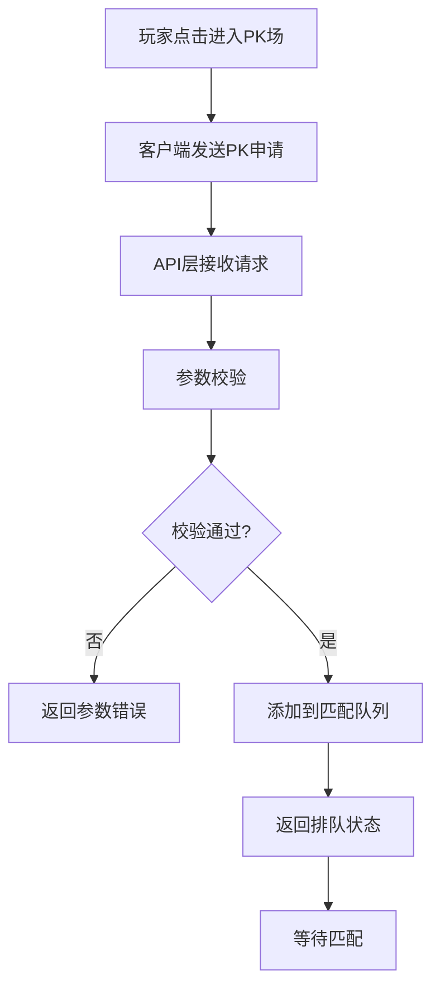
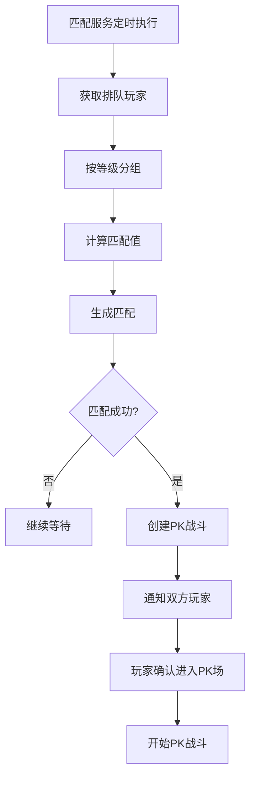
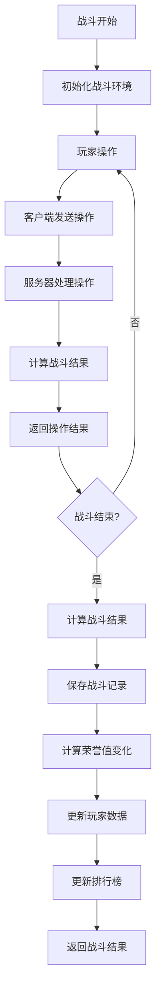
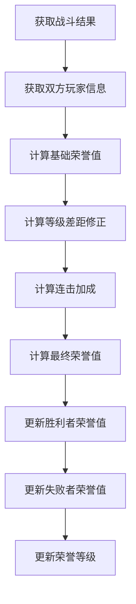
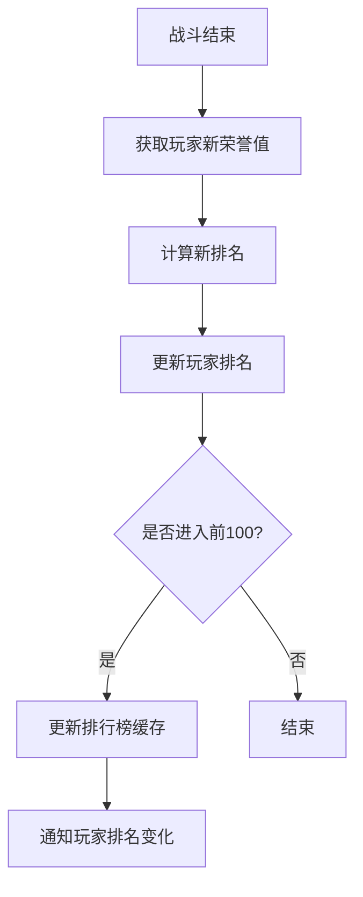
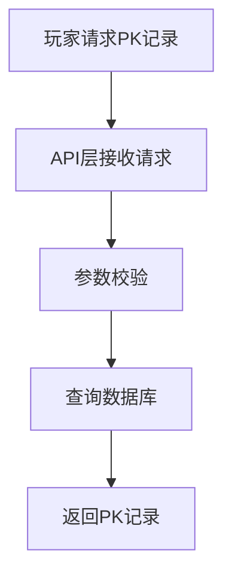
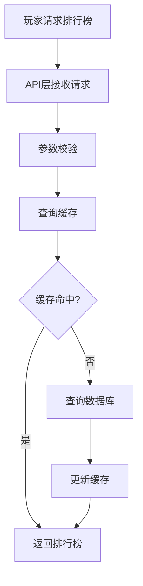
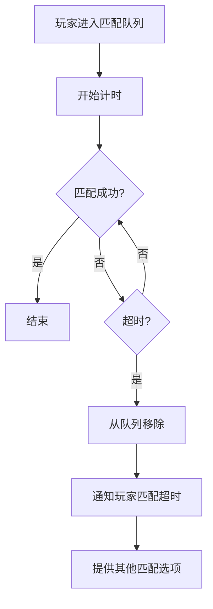
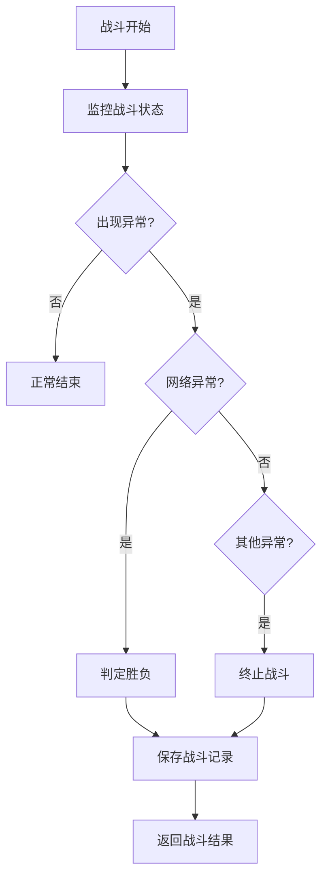
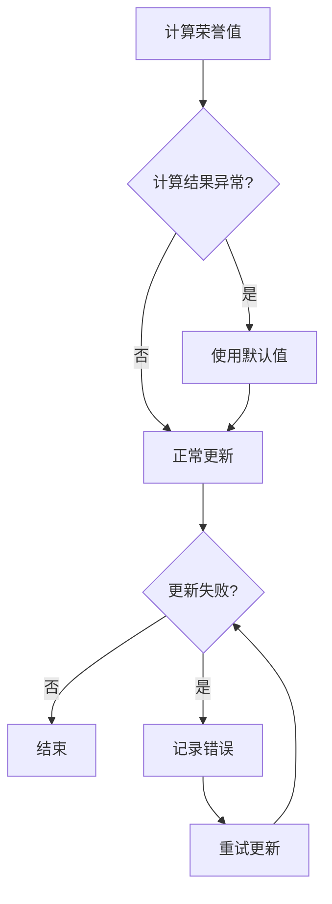

# PK系统业务流程文档

## 1. 业务流程概览

PK系统的核心业务流程包括玩家进入PK场、匹配对手、进行战斗、结算结果、更新荣誉值和排行榜等环节。这些流程相互关联，构成了完整的PK体验。

## 2. 详细业务流程

### 2.1 PK场进入流程

**流程说明**:
1. 玩家在游戏界面点击"进入PK场"按钮
2. 客户端向服务器发送PK申请请求，包含玩家ID、等级、匹配值等信息
3. API层接收请求并进行参数校验
4. 校验通过后，将玩家添加到匹配队列
5. 返回排队状态给客户端，包括队列ID和当前位置
6. 玩家进入等待匹配状态

### 2.2 PK匹配流程

**流程说明**:
1. 匹配服务定时执行，从匹配队列中获取所有等待匹配的玩家
2. 按玩家等级进行分组，确保同等级段的玩家匹配在一起
3. 计算每个玩家的匹配值，基于等级、战斗力等因素
4. 根据匹配值生成匹配，优先匹配匹配值相近的玩家
5. 匹配成功后，创建PK战斗实例
6. 通知双方玩家匹配成功，包含对手信息和战斗开始时间
7. 玩家确认进入PK场
8. 开始PK战斗

### 2.3 PK战斗流程

**流程说明**:
1. 战斗开始，初始化战斗环境，包括双方玩家信息、战场状态等
2. 玩家进行操作，如移动、攻击、释放技能等
3. 客户端将操作发送到服务器
4. 服务器处理操作，计算伤害、连击、技能效果等
5. 返回操作结果给客户端，包括伤害值、连击数等
6. 重复步骤2-5，直到战斗结束
7. 战斗结束后，计算战斗结果，确定胜利者和失败者
8. 保存战斗记录到数据库
9. 计算双方玩家的荣誉值变化
10. 更新玩家PK数据，包括荣誉值、战斗场次、胜率等
11. 更新排行榜
12. 返回战斗结果给客户端，包括胜负信息、荣誉值变化等

### 2.4 荣誉值计算流程

**流程说明**:
1. 获取战斗结果，包括胜利者、失败者、战斗持续时间、连击数等信息
2. 获取双方玩家的等级、当前荣誉值等信息
3. 计算基础荣誉值，基于战斗结果
4. 计算等级差距修正，等级低的玩家击败等级高的玩家获得更多荣誉值
5. 计算连击加成，连击数越高获得的荣誉值越多
6. 计算最终荣誉值
7. 更新胜利者的荣誉值，增加相应的荣誉值
8. 更新失败者的荣誉值，扣除相应的荣誉值
9. 根据新的荣誉值更新双方玩家的荣誉等级

### 2.5 排行榜更新流程

**流程说明**:
1. 战斗结束后，获取玩家的新荣誉值
2. 计算玩家的新排名，基于荣誉值
3. 更新玩家的排名信息
4. 检查玩家是否进入排行榜前100名
5. 如果进入前100名，更新排行榜缓存
6. 通知玩家排名变化

### 2.6 PK记录查询流程

**流程说明**:
1. 玩家在游戏界面请求查看自己的PK记录
2. 客户端向服务器发送PK记录查询请求，包含玩家ID、分页参数等
3. API层接收请求并进行参数校验
4. 从数据库中查询玩家的PK记录，按时间倒序排列
5. 返回PK记录给客户端，包括对手信息、战斗结果、荣誉值变化等

### 2.7 排行榜查询流程

**流程说明**:
1. 玩家在游戏界面请求查看PK排行榜
2. 客户端向服务器发送排行榜查询请求，包含分页参数等
3. API层接收请求并进行参数校验
4. 尝试从缓存中获取排行榜数据
5. 如果缓存命中，直接返回排行榜数据
6. 如果缓存未命中，从数据库中查询排行榜数据
7. 更新缓存
8. 返回排行榜数据给客户端，包括玩家排名、荣誉值、战斗场次等

## 3. 异常处理流程

### 3.1 匹配超时处理

**流程说明**:
1. 玩家进入匹配队列后，开始计时
2. 如果在规定时间内匹配成功，流程正常结束
3. 如果超过规定时间仍未匹配成功，将玩家从队列中移除
4. 通知玩家匹配超时
5. 提供其他匹配选项，如降低匹配要求或返回主界面

### 3.2 战斗异常处理

**流程说明**:
1. 战斗开始后，监控战斗状态
2. 如果出现异常，判断异常类型
3. 如果是网络异常，根据双方网络状态判定胜负
4. 如果是其他异常，终止战斗
5. 保存战斗记录，记录异常原因
6. 返回战斗结果给客户端

### 3.3 荣誉值异常处理

**流程说明**:
1. 计算荣誉值变化
2. 检查计算结果是否异常，如荣誉值变化过大或过小
3. 如果计算结果异常，使用默认值
4. 尝试更新玩家荣誉值
5. 如果更新失败，记录错误并重试
6. 重试失败后，记录错误日志，等待人工处理

## 4. 业务规则

### 4.1 匹配规则

1. **等级匹配**:
   - 优先匹配同等级段的玩家
   - 等级段划分：1-10级，11-20级，21-30级，31-40级，41-50级，51-60级
   - 如果同等级段没有合适的对手，可向上或向下扩展一个等级段

2. **匹配值规则**:
   - 匹配值基于玩家等级、战斗力、胜率等因素计算
   - 优先匹配匹配值相差不超过10%的玩家
   - 随着排队时间增加，匹配范围逐渐扩大

3. **匹配时间规则**:
   - 最大匹配时间为5分钟
   - 超过最大匹配时间后，自动取消匹配并通知玩家

### 4.2 战斗规则

1. **战斗时间**:
   - 单场PK战斗时间为3分钟
   - 超时后，剩余生命值多的一方获胜
   - 如果生命值相同，判定为平局

2. **胜负判定**:
   - 一方生命值为0时，另一方获胜
   - 战斗超时，剩余生命值多的一方获胜
   - 生命值相同，判定为平局

3. **连击规则**:
   - 连击数越高，获得的荣誉值越多
   - 最大连击数为999
   - 连击中断后，连击数重置为0

### 4.3 荣誉值规则

1. **基础荣誉值**:
   - 胜利：+10荣誉值
   - 失败：-5荣誉值
   - 平局：+1荣誉值

2. **等级差距修正**:
   - 等级低的玩家击败等级高的玩家，额外获得等级差×2的荣誉值
   - 等级高的玩家击败等级低的玩家，获得的荣誉值减少等级差×1

3. **连击加成**:
   - 连击数达到10：+1荣誉值
   - 连击数达到50：+3荣誉值
   - 连击数达到100：+5荣誉值
   - 连击数达到200：+10荣誉值

4. **荣誉等级规则**:
   - 1级（新手）：0-99荣誉值
   - 2级（勇士）：100-499荣誉值
   - 3级（专家）：500-999荣誉值
   - 4级（大师）：1000-1999荣誉值
   - 5级（王者）：2000+荣誉值

### 4.4 惩罚规则

1. **恶意PK惩罚**:
   - 故意输给特定玩家，扣除双倍荣誉值
   - 多次恶意PK，暂时禁止进入PK场

2. **消极比赛惩罚**:
   - 战斗中消极比赛，如不移动、不攻击等
   - 第一次警告，第二次扣除荣誉值，第三次暂时禁止进入PK场

3. **作弊惩罚**:
   - 使用外挂、修改游戏数据等作弊行为
   - 永久禁止进入PK场，情节严重者封禁账号

## 5. 业务流程优化建议

1. **匹配算法优化**:
   - 引入ELO等级分系统，提高匹配精度
   - 考虑玩家的历史匹配记录，避免重复匹配
   - 增加匹配池的大小，提高匹配效率

2. **战斗计算优化**:
   - 优化伤害计算公式，考虑更多因素如装备特效、buff/debuff等
   - 使用缓存存储常用计算结果，减少重复计算
   - 实现服务器端战斗模拟，防止客户端作弊

3. **荣誉值系统优化**:
   - 增加荣誉值获取的多样性，如连续胜利加成、首次胜利奖励等
   - 实现荣誉值保护机制，避免新手玩家荣誉值过低
   - 增加荣誉值兑换系统，可兑换特殊称号、装备等

4. **排行榜系统优化**:
   - 实现实时排行榜，提高玩家的竞争积极性
   - 增加多种排行榜，如日榜、周榜、月榜等
   - 为排行榜前几名玩家提供特殊奖励和称号

5. **异常处理优化**:
   - 实现更完善的异常检测和处理机制
   - 增加玩家反馈渠道，及时处理异常情况
   - 建立异常处理预案，提高系统稳定性

## 6. 总结

PK系统的业务流程设计涵盖了从玩家进入PK场到战斗结束的完整过程，包括匹配、战斗、荣誉值计算、排行榜更新等核心环节。通过优化业务流程和处理异常情况，可以提高系统的稳定性和玩家的游戏体验。同时，不断完善业务规则和优化建议，可以使PK系统更加公平、有趣和具有挑战性。