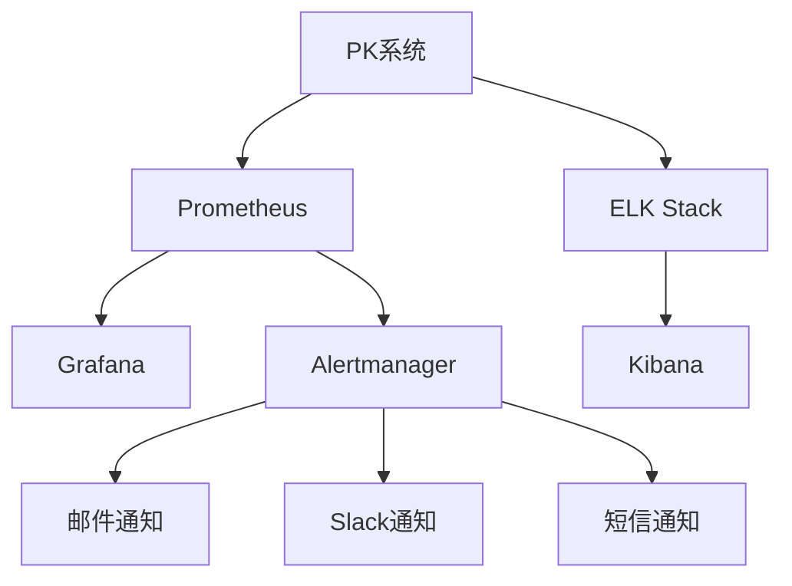
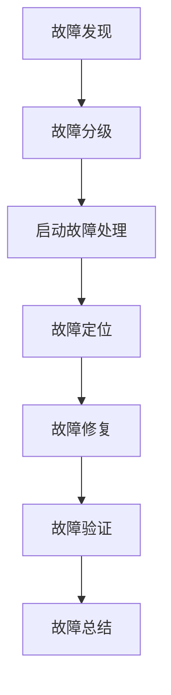

# PK系统监控与维护

## 1. 监控系统设计

### 1.1 监控目标

- **系统可用性**：确保PK系统服务持续可用，无中断
- **性能监控**：监控系统响应时间、吞吐量、资源使用率等性能指标
- **业务监控**：监控PK匹配成功率、战斗结束率、荣誉值计算准确性等业务指标
- **异常监控**：监控系统异常、错误率、崩溃等情况
- **安全监控**：监控系统安全事件、攻击尝试等

### 1.2 监控架构



**监控组件说明**：
- **Prometheus**：收集系统和业务指标
- **Grafana**：可视化监控数据，创建监控面板
- **Alertmanager**：处理告警，发送通知
- **ELK Stack**：收集、存储、分析日志
- **Kibana**：日志可视化

### 1.3 监控指标

#### 1.3.1 系统指标

| 指标名称 | 指标类型 | 单位 | 说明 | 告警阈值 |
| :--- | :--- | :--- | :--- | :--- |
| `http_requests_total` | Counter | 次 | HTTP请求总数 | - |
| `http_requests_duration_seconds` | Histogram | 秒 | HTTP请求响应时间 | P95 > 1s |
| `http_requests_error_total` | Counter | 次 | HTTP错误请求总数 | 错误率 > 5% |
| `go_goroutines` | Gauge | 个 | Go协程数 | > 1000 |
| `go_memory_alloc_bytes` | Gauge | 字节 | Go内存分配量 | > 2GB |
| `process_cpu_seconds_total` | Counter | 秒 | 进程CPU使用时间 | - |
| `process_resident_memory_bytes` | Gauge | 字节 | 进程内存使用量 | > 3GB |

#### 1.3.2 业务指标

| 指标名称 | 指标类型 | 单位 | 说明 | 告警阈值 |
| :--- | :--- | :--- | :--- | :--- |
| `pk_queue_length` | Gauge | 个 | PK匹配队列长度 | > 100 |
| `pk_match_success_total` | Counter | 次 | PK匹配成功次数 | - |
| `pk_match_failure_total` | Counter | 次 | PK匹配失败次数 | 失败率 > 10% |
| `pk_battle_start_total` | Counter | 次 | PK战斗开始次数 | - |
| `pk_battle_end_total` | Counter | 次 | PK战斗结束次数 | - |
| `pk_battle_timeout_total` | Counter | 次 | PK战斗超时次数 | 超时率 > 5% |
| `pk_honor_change_total` | Counter | 点 | 荣誉值变化总量 | - |
| `pk_ranking_update_total` | Counter | 次 | 排行榜更新次数 | - |

### 1.4 监控面板

#### 1.4.1 系统概览面板

- **CPU使用率**：系统和进程CPU使用率
- **内存使用率**：系统和进程内存使用率
- **网络流量**：入站和出站网络流量
- **磁盘使用率**：磁盘空间使用情况
- **请求量**：HTTP请求总数和速率
- **错误率**：HTTP错误请求率
- **响应时间**：HTTP请求响应时间分位数

#### 1.4.2 业务概览面板

- **匹配队列长度**：实时匹配队列长度
- **匹配成功率**：PK匹配成功次数与总尝试次数的比率
- **战斗结束率**：PK战斗结束次数与开始次数的比率
- **战斗超时率**：PK战斗超时次数与总战斗次数的比率
- **荣誉值变化**：荣誉值变化总量和趋势
- **排行榜更新频率**：排行榜更新次数和频率
- **玩家活跃度**：参与PK的玩家数量和活跃度

#### 1.4.3 数据库监控面板

- **数据库连接数**：当前数据库连接数
- **查询执行时间**：SQL查询执行时间
- **慢查询数**：慢查询次数和比率
- **事务数**：事务数量和成功率
- **缓存命中率**：Redis缓存命中率

#### 1.4.4 安全监控面板

- **请求频率**：每个IP的请求频率
- **异常请求**：异常请求次数和类型
- **认证失败**：认证失败次数
- **授权失败**：授权失败次数
- **SQL注入尝试**：SQL注入尝试次数
- **XSS攻击尝试**：XSS攻击尝试次数

## 2. 告警系统设计

### 2.1 告警级别

| 级别 | 描述 | 通知方式 |
| :--- | :--- | :--- |
| **Critical** | 严重告警，系统无法正常运行 | 邮件 + Slack + 短信 |
| **Warning** | 警告告警，系统存在异常但仍可运行 | 邮件 + Slack |
| **Info** | 信息告警，系统正常但有需要关注的事件 | 邮件 |

### 2.2 告警规则

#### 2.2.1 系统告警

| 告警名称 | 告警规则 | 级别 | 通知方式 | 恢复条件 |
| :--- | :--- | :--- | :--- | :--- |
| **服务宕机** | `up{job="pk-server"} == 0` 持续1分钟 | Critical | 邮件 + Slack + 短信 | `up{job="pk-server"} == 1` 持续1分钟 |
| **高CPU使用率** | `(100 - (avg by(instance) (irate(node_cpu_seconds_total{mode="idle"}[5m])) * 100)) > 80` 持续5分钟 | Warning | 邮件 + Slack | CPU使用率 < 70% 持续5分钟 |
| **高内存使用率** | `(node_memory_MemTotal_bytes - node_memory_MemAvailable_bytes) / node_memory_MemTotal_bytes * 100 > 80` 持续5分钟 | Warning | 邮件 + Slack | 内存使用率 < 70% 持续5分钟 |
| **高响应时间** | `histogram_quantile(0.95, sum(rate(http_request_duration_seconds_bucket[5m])) by (le)) > 1` 持续5分钟 | Warning | 邮件 + Slack | P95响应时间 < 1s 持续5分钟 |
| **高错误率** | `rate(http_requests_error_total[5m]) / rate(http_requests_total[5m]) > 0.05` 持续5分钟 | Warning | 邮件 + Slack | 错误率 < 5% 持续5分钟 |

#### 2.2.2 业务告警

| 告警名称 | 告警规则 | 级别 | 通知方式 | 恢复条件 |
| :--- | :--- | :--- | :--- | :--- |
| **匹配成功率低** | `rate(pk_match_failure_total[5m]) / (rate(pk_match_success_total[5m]) + rate(pk_match_failure_total[5m])) > 0.1` 持续10分钟 | Warning | 邮件 + Slack | 匹配失败率 < 10% 持续10分钟 |
| **战斗超时率高** | `rate(pk_battle_timeout_total[5m]) / rate(pk_battle_start_total[5m]) > 0.05` 持续10分钟 | Warning | 邮件 + Slack | 战斗超时率 < 5% 持续10分钟 |
| **队列长度过长** | `pk_queue_length > 100` 持续10分钟 | Warning | 邮件 + Slack | 队列长度 < 50 持续10分钟 |
| **荣誉值计算异常** | `abs(delta(pk_honor_change_total[5m])) > 10000` 持续5分钟 | Warning | 邮件 + Slack | 荣誉值变化正常 持续5分钟 |

#### 2.2.3 数据库告警

| 告警名称 | 告警规则 | 级别 | 通知方式 | 恢复条件 |
| :--- | :--- | :--- | :--- | :--- |
| **数据库连接数高** | `mysql_global_status_threads_connected > 200` 持续5分钟 | Warning | 邮件 + Slack | 连接数 < 150 持续5分钟 |
| **慢查询数多** | `rate(mysql_global_status_slow_queries[5m]) > 10` 持续5分钟 | Warning | 邮件 + Slack | 慢查询数 < 5 持续5分钟 |
| **Redis连接失败** | `redis_up{job="redis"} == 0` 持续1分钟 | Critical | 邮件 + Slack + 短信 | `redis_up{job="redis"} == 1` 持续1分钟 |

### 2.3 告警通知

#### 2.3.1 通知渠道

| 通知渠道 | 适用告警级别 | 配置方式 |
| :--- | :--- | :--- |
| **邮件** | Info, Warning, Critical | 配置SMTP服务器 |
| **Slack** | Warning, Critical | 配置Slack Webhook |
| **短信** | Critical | 配置短信API |
| **电话** | Critical | 配置电话告警服务 |

#### 2.3.2 通知模板

**邮件通知模板**：

```html
<h1>{{ .Status | title }}: {{ .CommonLabels.alertname }}</h1>
<p><strong>时间:</strong> {{ .StartsAt.Format "2006-01-02 15:04:05" }}</p>
<p><strong>级别:</strong> {{ .Status | title }}</p>
<p><strong>服务:</strong> {{ .CommonLabels.service }}</p>
<p><strong>主机:</strong> {{ .CommonLabels.instance }}</p>
<p><strong>描述:</strong> {{ .CommonAnnotations.description }}</p>
<p><strong>详情:</strong></p>
{{ range .Alerts }}
<ul>
  <li>状态: {{ .Status }}</li>
  <li>标签: {{ .Labels }}</li>
  <li>注解: {{ .Annotations }}</li>
</ul>
{{ end }}
```

**Slack通知模板**：

```json
{
  "color": "{{ if eq .Status \"firing\" }}{{ if eq .CommonLabels.severity \"critical\" }}danger{{ else }}warning{{ end }}{{ else }}good{{ end }}",
  "title": "{{ .Status | title }}: {{ .CommonLabels.alertname }}",
  "fields": [
    {
      "title": "服务",
      "value": "{{ .CommonLabels.service }}",
      "short": true
    },
    {
      "title": "主机",
      "value": "{{ .CommonLabels.instance }}",
      "short": true
    },
    {
      "title": "级别",
      "value": "{{ .Status | title }}",
      "short": true
    },
    {
      "title": "时间",
      "value": "{{ .StartsAt.Format \"2006-01-02 15:04:05\" }}",
      "short": true
    },
    {
      "title": "描述",
      "value": "{{ .CommonAnnotations.description }}",
      "short": false
    }
  ],
  "footer": "PK系统监控"
}
```

## 3. 维护计划

### 3.1 日常维护

| 维护项目 | 维护频率 | 维护内容 | 负责人 |
| :--- | :--- | :--- | :--- |
| **系统日志检查** | 每日 | 检查系统日志，查看是否有异常 | 系统管理员 |
| **监控面板检查** | 每日 | 检查监控面板，查看是否有告警 | 系统管理员 |
| **数据库备份** | 每日 | 执行数据库备份 | 系统管理员 |
| **日志清理** | 每日 | 清理过期日志，保持磁盘空间充足 | 系统管理员 |
| **系统资源检查** | 每日 | 检查CPU、内存、磁盘使用率 | 系统管理员 |

### 3.2 周维护

| 维护项目 | 维护频率 | 维护内容 | 负责人 |
| :--- | :--- | :--- | :--- |
| **系统更新** | 每周 | 更新系统补丁，确保系统安全 | 系统管理员 |
| **依赖更新** | 每周 | 更新Go依赖，修复安全漏洞 | 开发人员 |
| **数据库优化** | 每周 | 分析数据库性能，优化查询 | 数据库管理员 |
| **监控配置检查** | 每周 | 检查监控配置，调整告警阈值 | 系统管理员 |
| **备份验证** | 每周 | 验证备份数据的完整性和可恢复性 | 系统管理员 |

### 3.3 月维护

| 维护项目 | 维护频率 | 维护内容 | 负责人 |
| :--- | :--- | :--- | :--- |
| **系统性能评估** | 每月 | 评估系统性能，识别瓶颈 | 性能工程师 |
| **安全审计** | 每月 | 进行安全审计，检查系统漏洞 | 安全工程师 |
| **容量规划** | 每月 | 分析系统负载，规划容量扩展 | 系统架构师 |
| **灾难恢复测试** | 每月 | 测试灾难恢复流程，确保系统可恢复 | 系统管理员 |
| **维护文档更新** | 每月 | 更新维护文档，记录维护经验 | 系统管理员 |

### 3.4 季度维护

| 维护项目 | 维护频率 | 维护内容 | 负责人 |
| :--- | :--- | :--- | :--- |
| **系统架构评估** | 每季度 | 评估系统架构，提出优化建议 | 系统架构师 |
| **数据库重构** | 每季度 | 分析数据库结构，进行必要的重构 | 数据库管理员 |
| **性能测试** | 每季度 | 执行全面的性能测试，评估系统极限 | 性能工程师 |
| **安全渗透测试** | 每季度 | 执行安全渗透测试，发现安全漏洞 | 安全工程师 |
| **维护流程优化** | 每季度 | 分析维护流程，提出优化建议 | 运维经理 |

## 4. 故障处理

### 4.1 故障分类

| 故障级别 | 影响范围 | 处理时间 | 负责人 |
| :--- | :--- | :--- | :--- |
| **P0** | 系统完全不可用，影响所有用户 | 立即处理，1小时内解决 | 运维团队 + 开发团队 |
| **P1** | 系统部分功能不可用，影响部分用户 | 4小时内解决 | 运维团队 + 开发团队 |
| **P2** | 系统性能下降，用户体验受影响 | 8小时内解决 | 运维团队 |
| **P3** | 系统存在潜在问题，暂未影响用户 | 24小时内解决 | 开发团队 |

### 4.2 故障处理流程



**故障处理步骤说明**：
1. **故障发现**：通过监控系统、用户反馈、日志分析等方式发现故障
2. **故障分级**：根据故障影响范围和严重程度进行分级
3. **启动故障处理**：根据故障级别，启动相应的故障处理流程，通知相关人员
4. **故障定位**：通过日志分析、监控数据、代码检查等方式定位故障原因
5. **故障修复**：根据故障原因，采取相应的修复措施
6. **故障验证**：验证故障是否彻底修复，系统是否恢复正常
7. **故障总结**：记录故障原因、处理过程、修复措施，提出预防建议

### 4.3 常见故障处理

#### 4.3.1 服务宕机

**症状**：
- 监控面板显示服务状态为DOWN
- 所有API请求返回503错误
- 日志显示服务崩溃信息

**处理步骤**：
1. 检查服务日志，确定崩溃原因
2. 尝试重启服务
3. 如果重启失败，分析崩溃原因，修复问题后再重启
4. 验证服务是否恢复正常
5. 分析崩溃原因，提出预防措施

#### 4.3.2 数据库连接失败

**症状**：
- 监控面板显示数据库连接失败
- API请求返回数据库连接错误
- 日志显示数据库连接超时

**处理步骤**：
1. 检查数据库服务状态
2. 检查数据库连接字符串配置
3. 检查数据库连接池设置
4. 重启数据库服务（如果需要）
5. 验证数据库连接是否恢复正常
6. 分析连接失败原因，提出预防措施

#### 4.3.3 匹配失败率高

**症状**：
- 监控面板显示匹配失败率超过告警阈值
- 用户反馈匹配时间过长
- 日志显示匹配队列积压

**处理步骤**：
1. 检查匹配队列长度
2. 分析匹配算法，查找问题
3. 调整匹配参数，如扩大匹配范围
4. 增加匹配服务的并发处理能力
5. 验证匹配成功率是否恢复正常
6. 分析匹配失败原因，优化匹配算法

#### 4.3.4 战斗计算错误

**症状**：
- 用户反馈战斗结果不正确
- 日志显示战斗计算异常
- 荣誉值计算结果异常

**处理步骤**：
1. 分析战斗计算日志，查找错误原因
2. 检查战斗计算公式，修复问题
3. 验证战斗计算是否恢复正常
4. 分析计算错误原因，提出预防措施

#### 4.3.5 系统性能下降

**症状**：
- 监控面板显示响应时间增加
- 用户反馈系统卡顿
- 系统资源使用率高

**处理步骤**：
1. 检查系统资源使用率，如CPU、内存、磁盘
2. 分析慢查询日志，优化数据库查询
3. 检查网络连接，排除网络问题
4. 调整系统参数，如连接池大小、缓存设置
5. 验证系统性能是否恢复正常
6. 分析性能下降原因，提出优化建议

## 5. 日志管理

### 5.1 日志分类

| 日志类型 | 日志级别 | 存储方式 | 保留时间 |
| :--- | :--- | :--- | :--- |
| **系统日志** | INFO, ERROR, FATAL | ELK Stack | 30天 |
| **业务日志** | INFO, DEBUG | ELK Stack | 15天 |
| **访问日志** | INFO | ELK Stack | 7天 |
| **错误日志** | ERROR, FATAL | ELK Stack + 本地文件 | 90天 |
| **安全日志** | INFO, ERROR | ELK Stack + 本地文件 | 180天 |

### 5.2 日志格式

#### 5.2.1 系统日志格式

```json
{
  "timestamp": "2023-01-01T12:00:00Z",
  "level": "INFO",
  "service": "pk-server",
  "component": "api",
  "message": "HTTP request received",
  "trace_id": "1234567890",
  "request": {
    "method": "POST",
    "path": "/api/pk/queue",
    "headers": {
      "Content-Type": "application/json"
    },
    "body": {
      "playerId": 123,
      "level": 50,
      "matchValue": 1000
    }
  },
  "response": {
    "status_code": 200,
    "body": {
      "queueId": "q123",
      "position": 5,
      "status": "queued"
    },
    "duration": 0.1
  }
}
```

#### 5.2.2 业务日志格式

```json
{
  "timestamp": "2023-01-01T12:00:00Z",
  "level": "INFO",
  "service": "pk-server",
  "component": "service",
  "message": "PK match created",
  "trace_id": "1234567890",
  "match": {
    "id": "m456",
    "player1Id": 123,
    "player2Id": 456,
    "levelDiff": 0,
    "matchValueDiff": 10
  }
}
```

#### 5.2.3 错误日志格式

```json
{
  "timestamp": "2023-01-01T12:00:00Z",
  "level": "ERROR",
  "service": "pk-server",
  "component": "repository",
  "message": "Database connection failed",
  "trace_id": "1234567890",
  "error": {
    "type": "database",
    "message": "connection timeout",
    "stack": "..."
  },
  "context": {
    "operation": "save_pk_record",
    "record": {
      "winnerId": 123,
      "loserId": 456
    }
  }
}
```

### 5.3 日志收集与分析

1. **日志收集**：
   - 使用Filebeat收集本地日志
   - 使用Logstash处理日志
   - 将日志存储到Elasticsearch

2. **日志分析**：
   - 使用Kibana可视化日志数据
   - 创建日志仪表盘，监控关键指标
   - 设置日志告警，及时发现异常

3. **日志查询**：
   - 使用Elasticsearch DSL查询日志
   - 创建Saved Searches，快速查询常见问题
   - 使用Kibana Discover，交互式分析日志

4. **日志归档**：
   - 定期归档旧日志，减少存储空间
   - 使用Elasticsearch ILM（索引生命周期管理）自动管理索引
   - 归档到对象存储，如S3，长期保存

## 6. 安全管理

### 6.1 安全策略

1. **访问控制**：
   - 实施最小权限原则
   - 使用JWT进行身份认证
   - 实现基于角色的访问控制（RBAC）

2. **数据安全**：
   - 使用HTTPS加密传输数据
   - 对敏感数据进行加密存储
   - 定期清理敏感数据

3. **网络安全**：
   - 配置防火墙，限制访问
   - 使用VPN连接内部网络
   - 定期进行网络安全扫描

4. **应用安全**：
   - 防止SQL注入、XSS攻击、CSRF攻击
   - 定期更新依赖，修复安全漏洞
   - 实施请求频率限制，防止暴力攻击

5. **监控与审计**：
   - 监控系统安全事件
   - 记录所有敏感操作日志
   - 定期进行安全审计

### 6.2 安全漏洞管理

1. **漏洞扫描**：
   - 定期使用安全扫描工具扫描系统
   - 及时发现并修复安全漏洞

2. **漏洞响应**：
   - 建立安全漏洞响应流程
   - 及时处理安全漏洞，发布安全补丁

3. **漏洞预防**：
   - 实施安全编码规范
   - 定期进行安全培训
   - 采用安全开发生命周期（SDLC）

### 6.3 应急响应

1. **应急响应团队**：
   - 组建应急响应团队，明确职责
   - 建立应急响应联系方式

2. **应急响应流程**：
   - 发现安全事件
   - 评估事件影响
   - 启动应急响应
   - 控制事件影响
   - 消除安全威胁
   - 恢复系统正常
   - 分析事件原因
   - 提出预防措施

3. **应急响应演练**：
   - 定期进行应急响应演练
   - 测试应急响应流程的有效性
   - 不断优化应急响应流程

## 7. 总结

PK系统的监控与维护是确保系统稳定运行的重要保障。通过建立完善的监控体系、制定合理的维护计划、快速响应故障、有效管理日志和保障系统安全，可以提高系统的可用性、可靠性和安全性，为玩家提供更好的游戏体验。

监控与维护工作是一个持续改进的过程，需要不断分析系统运行情况，优化监控策略，完善维护流程，提高故障处理能力，确保PK系统能够稳定、高效地运行。