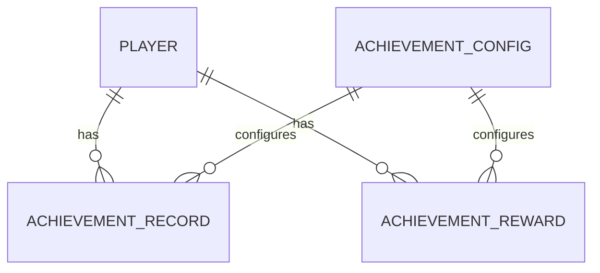

# 成就系统设计文档

## 1. 系统概述

成就系统是游戏中的重要功能模块，用于追踪和管理玩家的成就进度，提供成就奖励领取功能。

### 1.1 系统简介

- **系统名称**: 成就系统
- **系统功能**: 提供成就信息查询、成就奖励领取、成就列表查询、成就额外奖励领取等功能
- **系统位置**: `internal/game/achievement_service`

### 1.2 核心流程

1. 玩家登录游戏
2. 系统加载玩家成就信息
3. 玩家进行游戏活动（完成任务、击败怪物等）
4. 系统自动更新成就进度
5. 成就完成后通知玩家
6. 玩家领取成就奖励
7. 系统发放奖励并更新状态

## 2. Java 代码分析

### 2.1 核心控制器

- **文件位置**: `src/main/java/com/dnfm/game/achievement/AchievementController.java`
- **处理器数量**: 4 个 @RequestMapping 方法

### 2.2 核心功能

#### 2.2.1 成就信息查询 (REQ_ACHIEVEMENT_INFO)
- **方法**: `REQ_ACHIEVEMENT_INFO(IoSession session, REQ_ACHIEVEMENT_INFO req_achievement_info)`
- **功能**:
  - 查询玩家的成就信息
  - 返回成就列表
  - 包含成就进度、完成状态等信息

#### 2.2.2 成就奖励领取 (REQ_ACHIEVEMENT_REWARD)
- **方法**: `REQ_ACHIEVEMENT_REWARD(IoSession session, REQ_ACHIEVEMENT_REWARD req_achievement_reward)`
- **功能**:
  - 领取成就奖励
  - 返回冒险联盟等级和经验
  - 返回消耗的物品列表和背包物品列表

#### 2.2.3 成就列表查询 (REQ_ACHIEVEMENT_LIST)
- **方法**: `REQ_ACHIEVEMENT_LIST(IoSession session, REQ_ACHIEVEMENT_LIST req_achievement_list)`
- **功能**:
  - 查询成就列表
  - 支持分页和过滤

#### 2.2.4 成就额外奖励领取 (REQ_ACHIEVEMENT_BONUS_REWARD)
- **方法**: `REQ_ACHIEVEMENT_BONUS_REWARD(IoSession session, REQ_ACHIEVEMENT_BONUS_REWARD req_achievement_bonus_reward)`
- **功能**:
  - 领取成就额外奖励
  - 返回奖励物品列表

## 3. Go 实现方案

### 3.1 ProtoBuf 消息定义

#### achievement.proto
```protobuf
syntax = "proto3";

package dnf.v1;

option go_package = "gen/dnf/v1";

import "dnf/v1/common.proto";

// 成就信息请求
message AchievementInfoRequest {
  int32 field_1 = 1;
}

// 成就信息响应
message AchievementInfoResponse {
  repeated AchievementInfo achievements = 1;
  int32 error = 2;
  string message = 3;
}

// 成就信息
message AchievementInfo {
  uint32 achievement_id = 1;
  string name = 2;
  string description = 3;
  int32 progress = 4;
  int32 target_value = 5;
  bool completed = 6;
  bool rewarded = 7;
}

// 成就奖励请求
message AchievementRewardRequest {
  int32 field_1 = 1;
  int32 field_2 = 2;
  uint64 field_3 = 3;
}

// 成就奖励响应
message AchievementRewardResponse {
  int32 adventureunionlevel = 1;
  uint64 adventureunionexp = 2;
  repeated StackableItem consumeitems = 3;
  PT_ITEMS invenitems = 4;
  int32 error = 5;
  string message = 6;
}

// 可堆叠物品
message StackableItem {
  uint32 index = 1;
  uint32 count = 2;
  bool bind = 3;
  uint64 acquisitiontime = 4;
}

// 物品列表
message PT_ITEMS {
  repeated StackableItem consumeitems = 1;
}

// 成就列表请求
message AchievementListRequest {
  int32 field_1 = 1;
}

// 成就列表响应
message AchievementListResponse {
  repeated AchievementInfo achievements = 1;
  int32 total = 2;
  int32 error = 3;
  string message = 4;
}

// 成就额外奖励请求
message AchievementBonusRewardRequest {
  int32 field_1 = 1;
  int32 field_2 = 2;
  int32 field_3 = 3;
  int32 field_4 = 4;
  int32 field_5 = 5;
}

// 成就额外奖励响应
message AchievementBonusRewardResponse {
  repeated StackableItem rewards = 1;
  int32 error = 2;
  string message = 3;
}
```

### 3.2 服务端实现

#### 3.2.1 数据模型设计

##### models/achievement.go
```go
package models

import (
    "time"
    "gorm.io/gorm"
)

// AchievementRecord 成就记录表
type AchievementRecord struct {
    ID            uint64    `gorm:"column:id;primaryKey;autoIncrement" json:"id"`
    RoleID        uint64    `gorm:"column:role_id;index;not null" json:"roleId"`
    AchievementID uint32    `gorm:"column:achievement_id;index;not null" json:"achievementId"`
    Progress      int32     `gorm:"column:progress;default:0" json:"progress"`
    Completed     bool      `gorm:"column:completed;default:false" json:"completed"`
    Rewarded      bool      `gorm:"column:rewarded;default:false" json:"rewarded"`
    CompleteTime  time.Time `gorm:"column:complete_time" json:"completeTime"`
    RewardTime    time.Time `gorm:"column:reward_time" json:"rewardTime"`
    CreateTime    time.Time `gorm:"column:create_time;autoCreateTime" json:"createTime"`
    UpdateTime    time.Time `gorm:"column:update_time;autoUpdateTime" json:"updateTime"`
}

func (AchievementRecord) TableName() string {
    return "t_achievement_record"
}

// AchievementReward 成就奖励表
type AchievementReward struct {
    ID            uint64    `gorm:"column:id;primaryKey;autoIncrement" json:"id"`
    RoleID        uint64    `gorm:"column:role_id;index;not null" json:"roleId"`
    AchievementID uint32    `gorm:"column:achievement_id;index;not null" json:"achievementId"`
    RewardType    uint32    `gorm:"column:reward_type;not null" json:"rewardType"`
    RewardIndex   uint32    `gorm:"column:reward_index;not null" json:"rewardIndex"`
    RewardCount   uint32    `gorm:"column:reward_count;not null" json:"rewardCount"`
    Claimed       bool      `gorm:"column:claimed;default:false" json:"claimed"`
    ClaimTime     time.Time `gorm:"column:claim_time" json:"claimTime"`
    CreateTime    time.Time `gorm:"column:create_time;autoCreateTime" json:"createTime"`
}

func (AchievementReward) TableName() string {
    return "t_achievement_reward"
}

// AchievementConfig 成就配置表
type AchievementConfig struct {
    ID            uint64    `gorm:"column:id;primaryKey;autoIncrement" json:"id"`
    AchievementID uint32    `gorm:"column:achievement_id;uniqueIndex;not null" json:"achievementId"`
    Name          string    `gorm:"column:name;not null" json:"name"`
    Description   string    `gorm:"column:description" json:"description"`
    Type          uint32    `gorm:"column:type;not null" json:"type"`
    TargetValue   int32     `gorm:"column:target_value;not null" json:"targetValue"`
    RewardType    uint32    `gorm:"column:reward_type;not null" json:"rewardType"`
    RewardIndex   uint32    `gorm:"column:reward_index;not null" json:"rewardIndex"`
    RewardCount   uint32    `gorm:"column:reward_count;not null" json:"rewardCount"`
    BonusReward   bool      `gorm:"column:bonus_reward;default:false" json:"bonusReward"`
    Status        uint32    `gorm:"column:status;default:1" json:"status"`
    CreateTime    time.Time `gorm:"column:create_time;autoCreateTime" json:"createTime"`
    UpdateTime    time.Time `gorm:"column:update_time;autoUpdateTime" json:"updateTime"`
}

func (AchievementConfig) TableName() string {
    return "t_achievement_config"
}
```

#### 3.2.2 Handler 实现

##### handlers/achievement.go
```go
package handlers

import (
    "context"

    "github.com/pixb/DnfGameServer/dnf-go-server/internal/game/achievement_service"
    "github.com/pixb/DnfGameServer/dnf-go-server/internal/network"
    dnfv1 "github.com/pixb/DnfGameServer/dnf-go-server/proto/gen/dnf/v1"
    "google.golang.org/protobuf/proto"
)

type AchievementHandler struct {
    achievementService *achievement_service.AchievementService
}

func NewAchievementHandler(achievementService *achievement_service.AchievementService) *AchievementHandler {
    return &AchievementHandler{
        achievementService: achievementService,
    }
}

// AchievementInfoHandler 成就信息查询处理器
func (h *AchievementHandler) AchievementInfoHandler(sess *network.Session, msg proto.Message) {
    req, ok := msg.(*dnfv1.AchievementInfoRequest)
    if !ok {
        return
    }

    achievements, err := h.achievementService.GetAchievementInfo(context.Background(), sess.RoleID, req.Field_1)
    if err != nil {
        h.sendError(sess, req, 1, "failed to get achievement info")
        return
    }

    resp := &dnfv1.AchievementInfoResponse{
        Achievements: achievements,
        Error:        0,
        Message:      "success",
    }
    sess.Send(resp)
}

// AchievementRewardHandler 成就奖励领取处理器
func (h *AchievementHandler) AchievementRewardHandler(sess *network.Session, msg proto.Message) {
    req, ok := msg.(*dnfv1.AchievementRewardRequest)
    if !ok {
        return
    }

    result, err := h.achievementService.ClaimAchievementReward(context.Background(), sess.RoleID, req.Field_1, req.Field_2, req.Field_3)
    if err != nil {
        h.sendError(sess, req, 1, "failed to claim achievement reward")
        return
    }

    resp := &dnfv1.AchievementRewardResponse{
        Adventureunionlevel: result.AdventureUnionLevel,
        Adventureunionexp:   result.AdventureUnionExp,
        Consumeitems:        result.ConsumeItems,
        Invenitems:          result.InvenItems,
        Error:               0,
        Message:             "success",
    }
    sess.Send(resp)
}

// AchievementListHandler 成就列表查询处理器
func (h *AchievementHandler) AchievementListHandler(sess *network.Session, msg proto.Message) {
    req, ok := msg.(*dnfv1.AchievementListRequest)
    if !ok {
        return
    }

    result, err := h.achievementService.GetAchievementList(context.Background(), sess.RoleID, req.Field_1)
    if err != nil {
        h.sendError(sess, req, 1, "failed to get achievement list")
        return
    }

    resp := &dnfv1.AchievementListResponse{
        Achievements: result.Achievements,
        Total:        result.Total,
        Error:        0,
        Message:      "success",
    }
    sess.Send(resp)
}

// AchievementBonusRewardHandler 成就额外奖励领取处理器
func (h *AchievementHandler) AchievementBonusRewardHandler(sess *network.Session, msg proto.Message) {
    req, ok := msg.(*dnfv1.AchievementBonusRewardRequest)
    if !ok {
        return
    }

    rewards, err := h.achievementService.ClaimAchievementBonusReward(context.Background(), sess.RoleID, req.Field_1, req.Field_2, req.Field_3, req.Field_4, req.Field_5)
    if err != nil {
        h.sendError(sess, req, 1, "failed to claim achievement bonus reward")
        return
    }

    resp := &dnfv1.AchievementBonusRewardResponse{
        Rewards: rewards,
        Error:   0,
        Message: "success",
    }
    sess.Send(resp)
}

func (h *AchievementHandler) sendError(sess *network.Session, req proto.Message, code int32, message string) {
    switch req.(type) {
    case *dnfv1.AchievementInfoRequest:
        resp := &dnfv1.AchievementInfoResponse{
            Error:   code,
            Message: message,
        }
        sess.Send(resp)
    case *dnfv1.AchievementRewardRequest:
        resp := &dnfv1.AchievementRewardResponse{
            Error:   code,
            Message: message,
        }
        sess.Send(resp)
    case *dnfv1.AchievementListRequest:
        resp := &dnfv1.AchievementListResponse{
            Error:   code,
            Message: message,
        }
        sess.Send(resp)
    case *dnfv1.AchievementBonusRewardRequest:
        resp := &dnfv1.AchievementBonusRewardResponse{
            Error:   code,
            Message: message,
        }
        sess.Send(resp)
    }
}
```

### 3.3 实现步骤

#### 步骤 1: 创建 ProtoBuf 定义
1. 创建 `proto/dnf/v1/achievement.proto`
2. 定义所有成就相关的消息
3. 运行 `buf generate` 生成 Go 代码

#### 步骤 2: 创建数据模型
1. 创建 `internal/db/models/achievement.go`
2. 定义 AchievementRecord、AchievementReward、AchievementConfig 模型
3. 运行数据库迁移

#### 步骤 3: 实现 Handler
1. 创建 `internal/game/handlers/achievement.go`
2. 实现所有成就相关的处理器
3. 注册消息路由

#### 步骤 4: 实现 Service
1. 创建 `internal/game/achievement_service/achievement.go`
2. 实现业务逻辑
3. 集成数据库操作

#### 步骤 5: 编写测试用例
1. 创建 `tests/achievement_test.go`
2. 编写所有功能的测试用例
3. 运行测试验证

#### 步骤 6: 集成到主服务器
1. 在 `cmd/server/main.go` 中注册 Handler
2. 更新消息注册表
3. 测试完整流程

### 3.4 注意事项

1. **并发安全**: 成就奖励领取需要考虑并发问题
2. **数据一致性**: 确保奖励发放和状态更新的原子性
3. **性能优化**: 成就进度更新需要批量处理
4. **错误处理**: 完善的错误提示和日志记录
5. **扩展性**: 设计支持成就类型的扩展

## 4. API 文档

### 4.1 HTTP API

| API路径 | 方法 | 模块 | 类型 | 功能描述 | 请求体 (JSON) | 成功响应 (200 OK) |
| :--- | :--- | :--- | :--- | :--- | :--- | :--- |
| `/api/v1/achievement/info` | `POST` | 成就系统 | `Router` | 查询成就信息 | `{"field_1": 1}` | `{"achievements": [{"achievement_id": 1, "name": "初出茅庐", "description": "完成第一个任务", "progress": 1, "target_value": 1, "completed": true, "rewarded": false}], "error": 0, "message": "success"}` |
| `/api/v1/achievement/reward` | `POST` | 成就系统 | `Router` | 领取成就奖励 | `{"field_1": 1, "field_2": 1, "field_3": 123456}` | `{"adventureunionlevel": 1, "adventureunionexp": 100, "consumeitems": [], "invenitems": {"consumeitems": []}, "error": 0, "message": "success"}` |
| `/api/v1/achievement/list` | `POST` | 成就系统 | `Router` | 查询成就列表 | `{"field_1": 1}` | `{"achievements": [{"achievement_id": 1, "name": "初出茅庐", "description": "完成第一个任务", "progress": 1, "target_value": 1, "completed": true, "rewarded": false}], "total": 1, "error": 0, "message": "success"}` |
| `/api/v1/achievement/bonus_reward` | `POST` | 成就系统 | `Router` | 领取成就额外奖励 | `{"field_1": 1, "field_2": 1, "field_3": 1, "field_4": 1, "field_5": 123456}` | `{"rewards": [{"index": 1, "count": 1, "bind": false, "acquisitiontime": 1234567890}], "error": 0, "message": "success"}` |

### 4.2 gRPC API

#### 4.2.1 服务定义

```protobuf
service AchievementService {
    // 查询成就信息
    rpc GetAchievementInfo(AchievementInfoRequest) returns (AchievementInfoResponse);
    // 领取成就奖励
    rpc ClaimAchievementReward(AchievementRewardRequest) returns (AchievementRewardResponse);
    // 查询成就列表
    rpc GetAchievementList(AchievementListRequest) returns (AchievementListResponse);
    // 领取成就额外奖励
    rpc ClaimAchievementBonusReward(AchievementBonusRewardRequest) returns (AchievementBonusRewardResponse);
}
```

## 5. 数据库设计文档

### 5.1 表结构

#### 5.1.1 成就记录表 (`t_achievement_record`)

| 字段名 | 数据类型 | 约束 | 描述 |
| :--- | :--- | :--- | :--- |
| `id` | `BIGINT` | `PRIMARY KEY AUTO_INCREMENT` | 记录ID |
| `role_id` | `BIGINT` | `NOT NULL INDEX` | 角色ID |
| `achievement_id` | `INT` | `NOT NULL INDEX` | 成就ID |
| `progress` | `INT` | `NOT NULL DEFAULT 0` | 成就进度 |
| `completed` | `BOOLEAN` | `NOT NULL DEFAULT FALSE` | 是否完成 |
| `rewarded` | `BOOLEAN` | `NOT NULL DEFAULT FALSE` | 是否领取奖励 |
| `complete_time` | `DATETIME` | | 完成时间 |
| `reward_time` | `DATETIME` | | 领取奖励时间 |
| `create_time` | `DATETIME` | `NOT NULL DEFAULT CURRENT_TIMESTAMP` | 创建时间 |
| `update_time` | `DATETIME` | `NOT NULL DEFAULT CURRENT_TIMESTAMP ON UPDATE CURRENT_TIMESTAMP` | 更新时间 |

#### 5.1.2 成就奖励表 (`t_achievement_reward`)

| 字段名 | 数据类型 | 约束 | 描述 |
| :--- | :--- | :--- | :--- |
| `id` | `BIGINT` | `PRIMARY KEY AUTO_INCREMENT` | 记录ID |
| `role_id` | `BIGINT` | `NOT NULL INDEX` | 角色ID |
| `achievement_id` | `INT` | `NOT NULL INDEX` | 成就ID |
| `reward_type` | `INT` | `NOT NULL` | 奖励类型 |
| `reward_index` | `INT` | `NOT NULL` | 奖励索引 |
| `reward_count` | `INT` | `NOT NULL` | 奖励数量 |
| `claimed` | `BOOLEAN` | `NOT NULL DEFAULT FALSE` | 是否领取 |
| `claim_time` | `DATETIME` | | 领取时间 |
| `create_time` | `DATETIME` | `NOT NULL DEFAULT CURRENT_TIMESTAMP` | 创建时间 |

#### 5.1.3 成就配置表 (`t_achievement_config`)

| 字段名 | 数据类型 | 约束 | 描述 |
| :--- | :--- | :--- | :--- |
| `id` | `BIGINT` | `PRIMARY KEY AUTO_INCREMENT` | 记录ID |
| `achievement_id` | `INT` | `NOT NULL UNIQUE INDEX` | 成就ID |
| `name` | `VARCHAR(255)` | `NOT NULL` | 成就名称 |
| `description` | `TEXT` | | 成就描述 |
| `type` | `INT` | `NOT NULL` | 成就类型 |
| `target_value` | `INT` | `NOT NULL` | 目标值 |
| `reward_type` | `INT` | `NOT NULL` | 奖励类型 |
| `reward_index` | `INT` | `NOT NULL` | 奖励索引 |
| `reward_count` | `INT` | `NOT NULL` | 奖励数量 |
| `bonus_reward` | `BOOLEAN` | `NOT NULL DEFAULT FALSE` | 是否有额外奖励 |
| `status` | `INT` | `NOT NULL DEFAULT 1` | 状态 |
| `create_time` | `DATETIME` | `NOT NULL DEFAULT CURRENT_TIMESTAMP` | 创建时间 |
| `update_time` | `DATETIME` | `NOT NULL DEFAULT CURRENT_TIMESTAMP ON UPDATE CURRENT_TIMESTAMP` | 更新时间 |

### 5.2 索引设计

| 表名 | 索引名 | 字段 | 类型 | 目的 |
| :--- | :--- | :--- | :--- | :--- |
| `t_achievement_record` | `idx_role_id` | `role_id` | `普通索引` | 加速角色成就记录查询 |
| `t_achievement_record` | `idx_achievement_id` | `achievement_id` | `普通索引` | 加速成就记录查询 |
| `t_achievement_reward` | `idx_role_id_achievement_id` | `role_id, achievement_id` | `复合索引` | 加速角色成就奖励查询 |
| `t_achievement_config` | `idx_achievement_id` | `achievement_id` | `唯一索引` | 加速成就配置查询 |

### 5.3 关系图



## 6. 业务流程文档

### 6.1 成就奖励领取流程

1. **验证请求**
   - 检查玩家是否登录
   - 验证成就ID是否有效
   - 检查成就是否已完成
   - 检查奖励是否已领取

2. **处理奖励**
   - 更新成就奖励状态
   - 发放奖励物品到玩家背包
   - 更新冒险联盟等级和经验

3. **返回响应**
   - 返回奖励物品信息
   - 返回冒险联盟等级和经验
   - 返回消耗的物品信息

### 6.2 成就进度更新流程

1. **监听游戏事件**
   - 玩家登录
   - 完成任务
   - 击败怪物
   - 获得物品
   - 等级提升

2. **更新成就进度**
   - 根据事件类型更新对应成就进度
   - 检查是否完成
   - 标记完成状态

3. **通知玩家**
   - 发送成就完成通知
   - 提示玩家领取奖励

### 6.3 状态转换

| 状态 | 触发条件 | 转换动作 | 目标状态 |
| :--- | :--- | :--- | :--- |
| 未开始 | 玩家进行相关活动 | 更新进度 | 进行中 |
| 进行中 | 进度达到目标值 | 标记完成 | 已完成 |
| 已完成 | 玩家领取奖励 | 标记已领取 | 已领取 |
| 已领取 | 成就重置 | 重置状态 | 未开始 |

## 7. 测试用例文档

### 7.1 测试目标

验证成就系统的核心功能，包括成就信息查询、成就奖励领取、成就列表查询、成就额外奖励领取等功能的正确性和稳定性。

### 7.2 测试场景

#### 7.2.1 成就信息查询测试

| 测试场景 | 测试步骤 | 预期结果 | 测试数据 |
| :--- | :--- | :--- | :--- |
| 查询所有成就 | 1. 发送成就信息查询请求<br>2. 接收成就信息响应 | 成功返回所有成就信息 | `field_1: 1` |
| 查询已完成的成就 | 1. 发送成就信息查询请求（指定查询类型为已完成）<br>2. 接收成就信息响应 | 成功返回已完成的成就信息 | `field_1: 2` |
| 查询未完成的成就 | 1. 发送成就信息查询请求（指定查询类型为未完成）<br>2. 接收成就信息响应 | 成功返回未完成的成就信息 | `field_1: 3` |

#### 7.2.2 成就奖励领取测试

| 测试场景 | 测试步骤 | 预期结果 | 测试数据 |
| :--- | :--- | :--- | :--- |
| 领取已完成的成就奖励 | 1. 发送成就奖励领取请求<br>2. 接收成就奖励响应 | 成功领取奖励，返回奖励信息 | `field_1: 1, field_2: 1, field_3: 123456` |
| 尝试领取未完成的成就奖励 | 1. 发送成就奖励领取请求（成就未完成）<br>2. 接收成就奖励响应 | 领取失败，返回错误信息 | `field_1: 999, field_2: 1, field_3: 123456` |
| 尝试重复领取奖励 | 1. 发送成就奖励领取请求（已领取过奖励）<br>2. 接收成就奖励响应 | 领取失败，返回错误信息 | `field_1: 1, field_2: 1, field_3: 123456` |

#### 7.2.3 成就列表查询测试

| 测试场景 | 测试步骤 | 预期结果 | 测试数据 |
| :--- | :--- | :--- | :--- |
| 查询成就列表 | 1. 发送成就列表查询请求<br>2. 接收成就列表响应 | 成功返回成就列表 | `field_1: 1` |
| 分页查询 | 1. 发送成就列表查询请求（指定分页参数）<br>2. 接收成就列表响应 | 成功返回分页后的成就列表 | `field_1: 2` |
| 按类型过滤 | 1. 发送成就列表查询请求（指定类型过滤）<br>2. 接收成就列表响应 | 成功返回过滤后的成就列表 | `field_1: 3` |

#### 7.2.4 成就额外奖励领取测试

| 测试场景 | 测试步骤 | 预期结果 | 测试数据 |
| :--- | :--- | :--- | :--- |
| 领取额外奖励 | 1. 发送成就额外奖励领取请求<br>2. 接收成就额外奖励响应 | 成功领取额外奖励，返回奖励物品信息 | `field_1: 1, field_2: 1, field_3: 1, field_4: 1, field_5: 123456` |
| 验证奖励物品 | 1. 领取额外奖励<br>2. 检查背包中的物品 | 奖励物品已发放到背包 | `field_1: 1, field_2: 1, field_3: 1, field_4: 1, field_5: 123456` |

### 7.3 测试用例

| 测试用例ID | 测试用例名称 | 测试类型 | 优先级 | 关联API |
| :--- | :--- | :--- | :--- | :--- |
| TC001 | 成就信息查询 | 功能测试 | 高 | `/api/v1/achievement/info` |
| TC002 | 成就奖励领取 | 功能测试 | 高 | `/api/v1/achievement/reward` |
| TC003 | 成就列表查询 | 功能测试 | 高 | `/api/v1/achievement/list` |
| TC004 | 成就额外奖励领取 | 功能测试 | 高 | `/api/v1/achievement/bonus_reward` |
| TC005 | 尝试领取未完成的成就奖励 | 异常测试 | 中 | `/api/v1/achievement/reward` |
| TC006 | 尝试重复领取奖励 | 异常测试 | 中 | `/api/v1/achievement/reward` |

## 8. 部署文档

### 8.1 环境要求

| 依赖 | 版本/范围 | 用途 | 安装命令 |
| :--- | :--- | :--- | :--- |
| `Go` | `1.20+` | 开发和运行环境 | `apt install golang-go` |
| `MySQL` | `5.7+` | 数据库 | `apt install mysql-server` |
| `Redis` | `6.0+` | 缓存 | `apt install redis-server` |
| `buf` | `1.0+` | ProtoBuf 代码生成 | `npm install -g @bufbuild/buf` |

### 8.2 安装步骤

1. **安装依赖**

   ```bash
   # 安装 Go
   apt install golang-go

   # 安装 MySQL
   apt install mysql-server

   # 安装 Redis
   apt install redis-server

   # 安装 buf
   npm install -g @bufbuild/buf
   ```

2. **配置数据库**

   ```bash
   # 登录 MySQL
   mysql -u root -p

   # 创建数据库
   CREATE DATABASE dnf_game_server;

   # 创建用户并授权
   CREATE USER 'dnf'@'localhost' IDENTIFIED BY 'password';
   GRANT ALL PRIVILEGES ON dnf_game_server.* TO 'dnf'@'localhost';
   FLUSH PRIVILEGES;
   ```

3. **部署服务**

   ```bash
   # 克隆代码
   git clone https://github.com/pixb/DnfGameServer.git
   cd DnfGameServer/dnf-go-server

   # 生成 ProtoBuf 代码
   make generate

   # 编译服务
   make build

   # 启动服务
   make start
   ```

### 8.3 配置说明

| 配置项 | 类型 | 默认值 | 说明 | 所属文件/模块 |
| :--- | :--- | :--- | :--- | :--- |
| `ServerPort` | `int` | `8081` | 服务器端口 | `config/config.go` |
| `MySQLDSN` | `string` | `dnf:password@tcp(localhost:3306)/dnf_game_server?charset=utf8mb4&parseTime=True&loc=Local` | MySQL 连接字符串 | `config/config.go` |
| `RedisAddr` | `string` | `localhost:6379` | Redis 地址 | `config/config.go` |
| `LogLevel` | `string` | `info` | 日志级别 | `config/config.go` |

## 9. 监控与维护

### 9.1 监控指标

| 指标名称 | 类型 | 说明 | 监控方式 |
| :--- | :--- | :--- | :--- |
| 成就完成率 | `Counter` | 已完成成就数 / 总成就数 | Prometheus |
| 奖励领取率 | `Counter` | 已领取奖励数 / 已完成成就数 | Prometheus |
| 成就进度更新频率 | `Histogram` | 成就进度更新的频率 | Prometheus |
| 错误率 | `Counter` | 错误次数 / 总请求次数 | Prometheus |

### 9.2 日志管理

| 日志级别 | 说明 | 存储位置 |
| :--- | :--- | :--- |
| `debug` | 调试信息 | `logs/debug.log` |
| `info` | 普通信息 | `logs/info.log` |
| `warn` | 警告信息 | `logs/warn.log` |
| `error` | 错误信息 | `logs/error.log` |

### 9.3 常见问题

| 问题 | 原因 | 解决方案 |
| :--- | :--- | :--- |
| 成就进度不更新 | 事件监听器未注册 | 检查事件监听器注册 |
| 奖励领取失败 | 背包空间不足 | 提示玩家清理背包空间 |
| 成就完成后未通知 | 通知系统故障 | 检查通知系统配置 |

## 10. 变更记录

| 版本 | 日期 | 作者 | 变更内容 |
| :--- | :--- | :--- | :--- |
| 1.0 | 2026-02-17 | 系统自动生成 | 初始版本 |
| 1.1 | 2026-02-24 | 人工编辑 | 按照模板完善文档，添加API文档、数据库设计文档、业务流程文档、测试用例文档、部署文档、监控与维护和变更记录等章节 |
