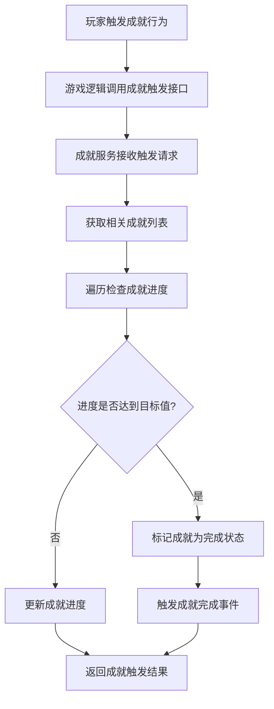
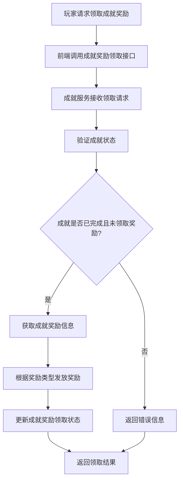
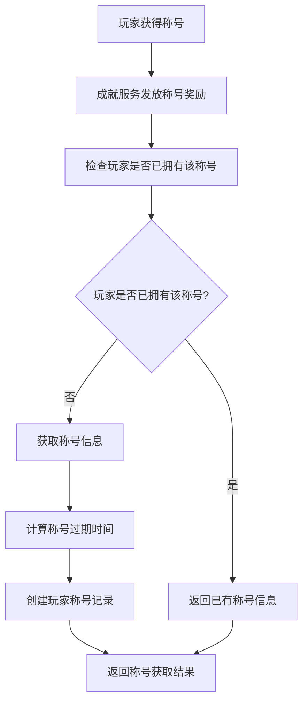
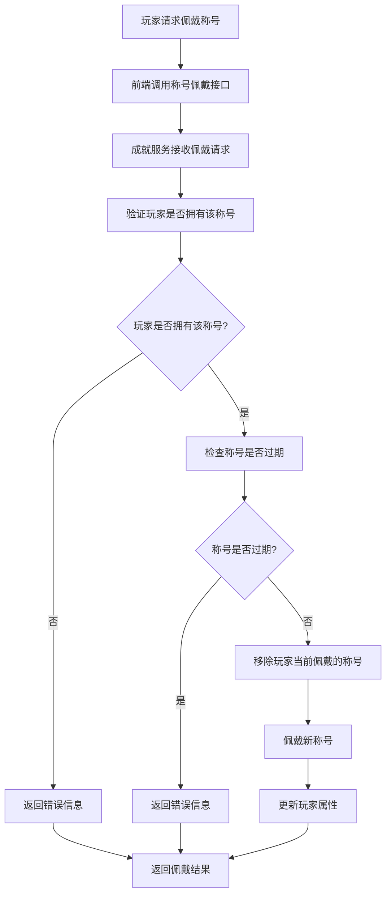
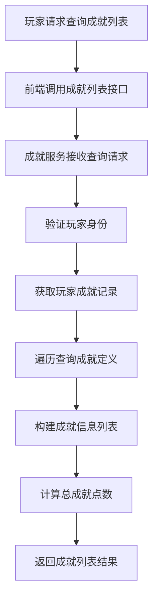
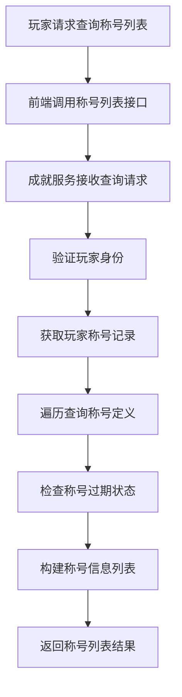
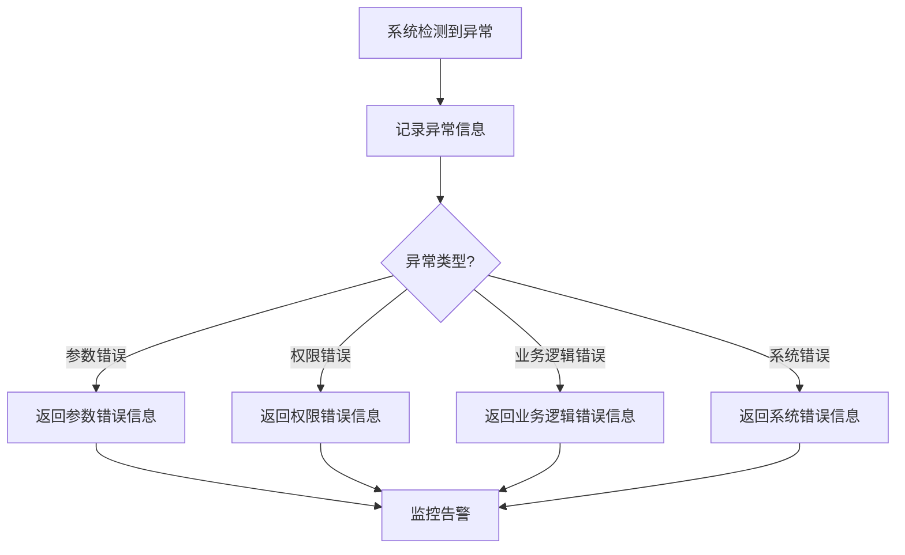

# 成就系统业务流程文档

## 1. 概述

本文档描述了成就系统的核心业务流程，包括成就触发、成就完成、奖励领取、称号管理等流程。通过清晰的业务流程设计，可以确保成就系统的正常运行和玩家的良好体验。

## 2. 成就触发流程

### 2.1 流程描述

成就触发流程是指玩家在游戏中进行特定行为时，系统检测并更新相应成就进度的过程。

### 2.2 流程图

### 2.3 流程步骤

1. **玩家触发成就行为**：玩家在游戏中进行特定行为，如完成任务、击败怪物等
2. **游戏逻辑调用成就触发接口**：游戏逻辑根据玩家行为类型和数值，调用成就触发接口
3. **成就服务接收触发请求**：成就服务接收触发请求，解析请求参数
4. **获取相关成就列表**：根据成就类型，获取相关的成就定义列表
5. **遍历检查成就进度**：遍历成就列表，检查玩家当前进度
6. **更新成就进度**：如果成就未完成，更新玩家成就进度
7. **标记成就为完成状态**：如果进度达到目标值，标记成就为完成状态
8. **触发成就完成事件**：触发成就完成事件，通知相关系统
9. **返回成就触发结果**：返回成就触发结果，包括是否有成就完成

### 2.4 状态转换

| 状态 | 触发条件 | 转换动作 | 目标状态 |
| :--- | :--- | :--- | :--- |
| 未开始 | 玩家首次触发成就行为 | 创建成就记录，设置当前进度 | 进行中 |
| 进行中 | 玩家继续触发成就行为 | 更新成就进度 | 进行中/已完成 |
| 进行中 | 进度达到目标值 | 标记为已完成，记录完成时间 | 已完成 |

## 3. 成就奖励领取流程

### 3.1 流程描述

成就奖励领取流程是指玩家领取已完成成就奖励的过程。

### 3.2 流程图

### 3.3 流程步骤

1. **玩家请求领取成就奖励**：玩家在成就界面点击领取奖励按钮
2. **前端调用成就奖励领取接口**：前端根据成就ID，调用成就奖励领取接口
3. **成就服务接收领取请求**：成就服务接收领取请求，解析请求参数
4. **验证成就状态**：验证成就是否已完成且未领取奖励
5. **获取成就奖励信息**：如果验证通过，获取成就的奖励信息
6. **根据奖励类型发放奖励**：根据奖励类型，调用相应的奖励发放方法
   - 物品奖励：调用物品系统发放物品
   - 货币奖励：调用货币系统发放货币
   - 称号奖励：调用称号系统发放称号
7. **更新成就奖励领取状态**：标记成就奖励为已领取
8. **返回领取结果**：返回奖励领取结果，包括是否成功和奖励信息

### 3.4 状态转换

| 状态 | 触发条件 | 转换动作 | 目标状态 |
| :--- | :--- | :--- | :--- |
| 已完成 | 玩家领取成就奖励 | 标记为已领取 | 已领取 |

## 4. 称号管理流程

### 4.1 称号获取流程

#### 4.1.1 流程描述

称号获取流程是指玩家通过成就奖励或其他方式获得称号的过程。

#### 4.1.2 流程图

#### 4.1.3 流程步骤

1. **玩家获得称号**：玩家通过成就奖励或其他方式获得称号
2. **成就服务发放称号奖励**：成就服务调用称号发放方法
3. **检查玩家是否已拥有该称号**：检查玩家是否已拥有该称号
4. **获取称号信息**：如果玩家未拥有该称号，获取称号的详细信息
5. **计算称号过期时间**：根据称号的持续时间，计算过期时间
6. **创建玩家称号记录**：创建玩家称号记录，设置相关属性
7. **返回称号获取结果**：返回称号获取结果

### 4.2 称号佩戴流程

#### 4.2.1 流程描述

称号佩戴流程是指玩家选择并佩戴称号的过程。

#### 4.2.2 流程图

#### 4.2.3 流程步骤

1. **玩家请求佩戴称号**：玩家在称号界面选择并点击佩戴称号按钮
2. **前端调用称号佩戴接口**：前端根据称号ID，调用称号佩戴接口
3. **成就服务接收佩戴请求**：成就服务接收佩戴请求，解析请求参数
4. **验证玩家是否拥有该称号**：验证玩家是否拥有该称号
5. **检查称号是否过期**：如果玩家拥有该称号，检查称号是否过期
6. **移除玩家当前佩戴的称号**：如果称号未过期，移除玩家当前佩戴的称号
7. **佩戴新称号**：佩戴新称号，更新佩戴状态
8. **更新玩家属性**：根据称号属性，更新玩家属性
9. **返回佩戴结果**：返回称号佩戴结果

### 4.3 状态转换

| 状态 | 触发条件 | 转换动作 | 目标状态 |
| :--- | :--- | :--- | :--- |
| 未拥有 | 玩家获得称号 | 创建称号记录，设置为未佩戴 | 未佩戴 |
| 未佩戴 | 玩家佩戴称号 | 更新佩戴状态，更新玩家属性 | 已佩戴 |
| 已佩戴 | 玩家佩戴其他称号 | 更新佩戴状态，更新玩家属性 | 未佩戴 |
| 未佩戴/已佩戴 | 称号过期时间到达 | 标记称号为过期 | 已过期 |

## 5. 成就列表查询流程

### 5.1 流程描述

成就列表查询流程是指玩家查询自己的成就列表和进度的过程。

### 5.2 流程图

### 5.3 流程步骤

1. **玩家请求查询成就列表**：玩家在成就界面点击查询按钮或进入成就界面
2. **前端调用成就列表接口**：前端调用成就列表接口，传入玩家ID
3. **成就服务接收查询请求**：成就服务接收查询请求，解析请求参数
4. **验证玩家身份**：验证玩家身份的合法性
5. **获取玩家成就记录**：根据玩家ID，获取玩家的成就记录列表
6. **遍历查询成就定义**：遍历成就记录列表，查询对应的成就定义信息
7. **构建成就信息列表**：构建包含成就名称、描述、进度等信息的列表
8. **计算总成就点数**：计算玩家的总成就点数
9. **返回成就列表结果**：返回成就列表结果，包括成就信息和总点数

## 6. 称号列表查询流程

### 6.1 流程描述

称号列表查询流程是指玩家查询自己的称号列表和状态的过程。

### 6.2 流程图

### 6.3 流程步骤

1. **玩家请求查询称号列表**：玩家在称号界面点击查询按钮或进入称号界面
2. **前端调用称号列表接口**：前端调用称号列表接口，传入玩家ID
3. **成就服务接收查询请求**：成就服务接收查询请求，解析请求参数
4. **验证玩家身份**：验证玩家身份的合法性
5. **获取玩家称号记录**：根据玩家ID，获取玩家的称号记录列表
6. **遍历查询称号定义**：遍历称号记录列表，查询对应的称号定义信息
7. **检查称号过期状态**：检查每个称号的过期状态
8. **构建称号信息列表**：构建包含称号名称、描述、属性、状态等信息的列表
9. **返回称号列表结果**：返回称号列表结果，包括称号信息和状态

## 7. 异常处理流程

### 7.1 流程描述

异常处理流程是指成就系统在运行过程中遇到异常情况时的处理过程。

### 7.2 流程图

### 7.3 异常类型及处理

| 异常类型 | 描述 | 处理方式 |
| :--- | :--- | :--- |
| 参数错误 | 请求参数不合法 | 返回参数错误信息，记录错误日志 |
| 权限错误 | 玩家无权限操作 | 返回权限错误信息，记录错误日志 |
| 业务逻辑错误 | 业务逻辑不允许的操作 | 返回业务逻辑错误信息，记录错误日志 |
| 系统错误 | 系统内部错误 | 返回系统错误信息，记录错误日志，触发告警 |

## 8. 性能优化

### 8.1 成就触发优化

1. **缓存优化**：使用缓存存储玩家成就进度，减少数据库查询
2. **批量处理**：对高频触发的成就类型，采用批量处理方式，减少数据库交互
3. **异步处理**：成就触发逻辑采用异步处理，提高响应速度

### 8.2 成就列表查询优化

1. **缓存优化**：使用缓存存储玩家成就列表，减少数据库查询
2. **分页查询**：对大量成就数据，采用分页查询方式，提高查询效率
3. **预加载**：预加载成就定义信息，减少关联查询

### 8.3 称号管理优化

1. **缓存优化**：使用缓存存储玩家称号信息，减少数据库查询
2. **过期检查优化**：采用定时任务批量检查称号过期状态，减少实时检查

## 9. 监控与日志

### 9.1 监控指标

1. **成就触发次数**：监控成就触发的频率和分布
2. **成就完成率**：监控成就的完成率
3. **奖励领取率**：监控成就奖励的领取率
4. **接口响应时间**：监控成就相关接口的响应时间
5. **异常率**：监控成就系统的异常率

### 9.2 日志记录

1. **成就触发日志**：记录成就触发的详细信息，包括玩家ID、成就类型、数值等
2. **成就完成日志**：记录成就完成的详细信息，包括玩家ID、成就ID、完成时间等
3. **奖励领取日志**：记录奖励领取的详细信息，包括玩家ID、成就ID、奖励类型、奖励ID等
4. **称号操作日志**：记录称号操作的详细信息，包括玩家ID、称号ID、操作类型等
5. **异常日志**：记录成就系统的异常信息，包括错误类型、错误信息、发生时间等

## 10. 总结

成就系统业务流程设计涵盖了成就触发、奖励领取、称号管理等核心功能，通过清晰的流程设计和状态转换，可以确保系统的正常运行和玩家的良好体验。同时，通过性能优化和监控措施，可以提高系统的稳定性和可靠性。