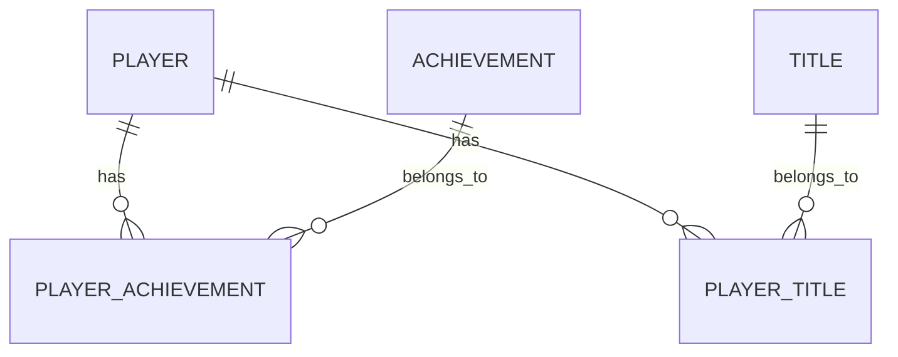

# 成就系统数据库设计文档

## 1. 数据库概述

成就系统数据库用于存储成就定义、玩家成就进度、称号信息和玩家称号数据。通过合理的数据库设计，可以确保成就系统的高效运行和数据一致性。

## 2. 数据库表结构

### 2.1 成就定义表 (`t_achievement`)

| 字段名 | 数据类型 | 约束 | 描述 |
| :--- | :--- | :--- | :--- |
| `id` | `BIGINT` | `PRIMARY KEY` | 成就ID |
| `name` | `VARCHAR(128)` | `NOT NULL` | 成就名称 |
| `description` | `VARCHAR(512)` | `NOT NULL` | 成就描述 |
| `target_value` | `INT` | `NOT NULL` | 目标值 |
| `reward_type` | `INT` | `NOT NULL` | 奖励类型 (1: 物品, 2: 货币, 3: 称号) |
| `reward_id` | `BIGINT` | `NOT NULL` | 奖励ID |
| `reward_count` | `INT` | `NOT NULL` | 奖励数量 |
| `point` | `INT` | `NOT NULL` | 成就点数 |
| `category` | `INT` | `NOT NULL` | 成就类别 |
| `create_time` | `DATETIME` | `DEFAULT CURRENT_TIMESTAMP` | 创建时间 |
| `update_time` | `DATETIME` | `DEFAULT CURRENT_TIMESTAMP ON UPDATE CURRENT_TIMESTAMP` | 更新时间 |

### 2.2 玩家成就表 (`t_player_achievement`)

| 字段名 | 数据类型 | 约束 | 描述 |
| :--- | :--- | :--- | :--- |
| `id` | `BIGINT` | `PRIMARY KEY` | 记录ID |
| `player_id` | `BIGINT` | `NOT NULL, INDEX` | 玩家ID |
| `achievement_id` | `BIGINT` | `NOT NULL, INDEX` | 成就ID |
| `current_value` | `INT` | `NOT NULL` | 当前进度值 |
| `is_completed` | `BOOLEAN` | `NOT NULL DEFAULT FALSE` | 是否完成 |
| `is_rewarded` | `BOOLEAN` | `NOT NULL DEFAULT FALSE` | 是否领取奖励 |
| `complete_time` | `DATETIME` | `NULL` | 完成时间 |
| `create_time` | `DATETIME` | `DEFAULT CURRENT_TIMESTAMP` | 创建时间 |
| `update_time` | `DATETIME` | `DEFAULT CURRENT_TIMESTAMP ON UPDATE CURRENT_TIMESTAMP` | 更新时间 |

### 2.3 称号表 (`t_title`)

| 字段名 | 数据类型 | 约束 | 描述 |
| :--- | :--- | :--- | :--- |
| `id` | `BIGINT` | `PRIMARY KEY` | 称号ID |
| `name` | `VARCHAR(64)` | `NOT NULL` | 称号名称 |
| `description` | `VARCHAR(256)` | `NOT NULL` | 称号描述 |
| `attribute_type` | `INT` | `NOT NULL` | 属性类型 |
| `attribute_value` | `INT` | `NOT NULL` | 属性值 |
| `duration` | `INT` | `NOT NULL DEFAULT 0` | 持续时间(秒) |
| `create_time` | `DATETIME` | `DEFAULT CURRENT_TIMESTAMP` | 创建时间 |
| `update_time` | `DATETIME` | `DEFAULT CURRENT_TIMESTAMP ON UPDATE CURRENT_TIMESTAMP` | 更新时间 |

### 2.4 玩家称号表 (`t_player_title`)

| 字段名 | 数据类型 | 约束 | 描述 |
| :--- | :--- | :--- | :--- |
| `id` | `BIGINT` | `PRIMARY KEY` | 记录ID |
| `player_id` | `BIGINT` | `NOT NULL, INDEX` | 玩家ID |
| `title_id` | `BIGINT` | `NOT NULL, INDEX` | 称号ID |
| `is_wearing` | `BOOLEAN` | `NOT NULL DEFAULT FALSE` | 是否佩戴 |
| `acquire_time` | `DATETIME` | `NOT NULL` | 获取时间 |
| `expire_time` | `DATETIME` | `NULL` | 过期时间 |
| `create_time` | `DATETIME` | `DEFAULT CURRENT_TIMESTAMP` | 创建时间 |
| `update_time` | `DATETIME` | `DEFAULT CURRENT_TIMESTAMP ON UPDATE CURRENT_TIMESTAMP` | 更新时间 |

## 3. 索引设计

### 3.1 成就定义表索引

| 索引名 | 类型 | 字段 | 描述 |
| :--- | :--- | :--- | :--- |
| `PRIMARY` | ` PRIMARY KEY` | `id` | 主键索引 |
| `idx_category` | `INDEX` | `category` | 成就类别索引，用于按类别查询成就 |

### 3.2 玩家成就表索引

| 索引名 | 类型 | 字段 | 描述 |
| :--- | :--- | :--- | :--- |
| `PRIMARY` | ` PRIMARY KEY` | `id` | 主键索引 |
| `idx_player_achievement` | `UNIQUE INDEX` | `player_id, achievement_id` | 玩家ID和成就ID联合唯一索引，确保玩家成就记录唯一 |
| `idx_player_completed` | `INDEX` | `player_id, is_completed` | 玩家ID和完成状态联合索引，用于查询玩家已完成/未完成的成就 |

### 3.3 称号表索引

| 索引名 | 类型 | 字段 | 描述 |
| :--- | :--- | :--- | :--- |
| `PRIMARY` | ` PRIMARY KEY` | `id` | 主键索引 |

### 3.4 玩家称号表索引

| 索引名 | 类型 | 字段 | 描述 |
| :--- | :--- | :--- | :--- |
| `PRIMARY` | ` PRIMARY KEY` | `id` | 主键索引 |
| `idx_player_title` | `UNIQUE INDEX` | `player_id, title_id` | 玩家ID和称号ID联合唯一索引，确保玩家称号记录唯一 |
| `idx_player_wearing` | `INDEX` | `player_id, is_wearing` | 玩家ID和佩戴状态联合索引，用于查询玩家当前佩戴的称号 |

## 4. 关系图



## 5. 数据模型

### 5.1 成就定义模型

```go
// Achievement 成就定义模型
type Achievement struct {
    ID           uint64    `gorm:"column:id;primaryKey;autoIncrement" json:"id"`
    Name         string    `gorm:"column:name;size:128;not null" json:"name"`
    Description  string    `gorm:"column:description;size:512;not null" json:"description"`
    TargetValue  int       `gorm:"column:target_value;not null" json:"targetValue"`
    RewardType   int       `gorm:"column:reward_type;not null" json:"rewardType"`
    RewardID     uint64    `gorm:"column:reward_id;not null" json:"rewardId"`
    RewardCount  int       `gorm:"column:reward_count;not null" json:"rewardCount"`
    Point        int       `gorm:"column:point;not null" json:"point"`
    Category     int       `gorm:"column:category;not null" json:"category"`
    CreateTime   time.Time `gorm:"column:create_time;autoCreateTime" json:"createTime"`
    UpdateTime   time.Time `gorm:"column:update_time;autoUpdateTime" json:"updateTime"`
}

func (Achievement) TableName() string {
    return "t_achievement"
}
```

### 5.2 玩家成就模型

```go
// PlayerAchievement 玩家成就模型
type PlayerAchievement struct {
    ID             uint64    `gorm:"column:id;primaryKey;autoIncrement" json:"id"`
    PlayerID       uint64    `gorm:"column:player_id;index;not null" json:"playerId"`
    AchievementID  uint64    `gorm:"column:achievement_id;index;not null" json:"achievementId"`
    CurrentValue   int       `gorm:"column:current_value;not null" json:"currentValue"`
    IsCompleted    bool      `gorm:"column:is_completed;default:false" json:"isCompleted"`
    IsRewarded     bool      `gorm:"column:is_rewarded;default:false" json:"isRewarded"`
    CompleteTime   time.Time `gorm:"column:complete_time" json:"completeTime"`
    CreateTime     time.Time `gorm:"column:create_time;autoCreateTime" json:"createTime"`
    UpdateTime     time.Time `gorm:"column:update_time;autoUpdateTime" json:"updateTime"`
}

func (PlayerAchievement) TableName() string {
    return "t_player_achievement"
}
```

### 5.3 称号模型

```go
// Title 称号模型
type Title struct {
    ID             uint64    `gorm:"column:id;primaryKey;autoIncrement" json:"id"`
    Name           string    `gorm:"column:name;size:64;not null" json:"name"`
    Description    string    `gorm:"column:description;size:256;not null" json:"description"`
    AttributeType  int       `gorm:"column:attribute_type;not null" json:"attributeType"`
    AttributeValue int       `gorm:"column:attribute_value;not null" json:"attributeValue"`
    Duration       int       `gorm:"column:duration;default:0" json:"duration"`
    CreateTime     time.Time `gorm:"column:create_time;autoCreateTime" json:"createTime"`
    UpdateTime     time.Time `gorm:"column:update_time;autoUpdateTime" json:"updateTime"`
}

func (Title) TableName() string {
    return "t_title"
}
```

### 5.4 玩家称号模型

```go
// PlayerTitle 玩家称号模型
type PlayerTitle struct {
    ID          uint64    `gorm:"column:id;primaryKey;autoIncrement" json:"id"`
    PlayerID    uint64    `gorm:"column:player_id;index;not null" json:"playerId"`
    TitleID     uint64    `gorm:"column:title_id;index;not null" json:"titleId"`
    IsWearing   bool      `gorm:"column:is_wearing;default:false" json:"isWearing"`
    AcquireTime time.Time `gorm:"column:acquire_time;not null" json:"acquireTime"`
    ExpireTime  time.Time `gorm:"column:expire_time" json:"expireTime"`
    CreateTime  time.Time `gorm:"column:create_time;autoCreateTime" json:"createTime"`
    UpdateTime  time.Time `gorm:"column:update_time;autoUpdateTime" json:"updateTime"`
}

func (PlayerTitle) TableName() string {
    return "t_player_title"
}
```

## 6. 数据库操作

### 6.1 成就定义操作

#### 6.1.1 添加成就

```sql
INSERT INTO t_achievement (name, description, target_value, reward_type, reward_id, reward_count, point, category) 
VALUES ('初出茅庐', '完成第一个任务', 1, 1, 1001, 1, 10, 1);
```

#### 6.1.2 更新成就

```sql
UPDATE t_achievement 
SET name = '新手入门', description = '完成第一个任务', target_value = 1 
WHERE id = 1;
```

#### 6.1.3 查询成就

```sql
-- 查询所有成就
SELECT * FROM t_achievement;

-- 按类别查询成就
SELECT * FROM t_achievement WHERE category = 1;

-- 查询指定成就
SELECT * FROM t_achievement WHERE id = 1;
```

### 6.2 玩家成就操作

#### 6.2.1 添加玩家成就

```sql
INSERT INTO t_player_achievement (player_id, achievement_id, current_value, is_completed, is_rewarded) 
VALUES (123456, 1, 0, FALSE, FALSE);
```

#### 6.2.2 更新玩家成就进度

```sql
-- 更新成就进度
UPDATE t_player_achievement 
SET current_value = current_value + 1 
WHERE player_id = 123456 AND achievement_id = 1;

-- 标记成就为完成
UPDATE t_player_achievement 
SET is_completed = TRUE, complete_time = NOW() 
WHERE player_id = 123456 AND achievement_id = 1;

-- 标记成就奖励为已领取
UPDATE t_player_achievement 
SET is_rewarded = TRUE 
WHERE player_id = 123456 AND achievement_id = 1;
```

#### 6.2.3 查询玩家成就

```sql
-- 查询玩家所有成就
SELECT pa.*, a.name, a.description, a.target_value, a.point 
FROM t_player_achievement pa 
JOIN t_achievement a ON pa.achievement_id = a.id 
WHERE pa.player_id = 123456;

-- 查询玩家已完成未领取奖励的成就
SELECT pa.*, a.name, a.description, a.target_value, a.point 
FROM t_player_achievement pa 
JOIN t_achievement a ON pa.achievement_id = a.id 
WHERE pa.player_id = 123456 AND pa.is_completed = TRUE AND pa.is_rewarded = FALSE;
```

### 6.3 称号操作

#### 6.3.1 添加称号

```sql
INSERT INTO t_title (name, description, attribute_type, attribute_value, duration) 
VALUES ('勇士', '完成10个任务获得', 1, 10, 0);
```

#### 6.3.2 更新称号

```sql
UPDATE t_title 
SET name = '勇者', description = '完成10个任务获得', attribute_value = 15 
WHERE id = 1;
```

#### 6.3.3 查询称号

```sql
-- 查询所有称号
SELECT * FROM t_title;

-- 查询指定称号
SELECT * FROM t_title WHERE id = 1;
```

### 6.4 玩家称号操作

#### 6.4.1 添加玩家称号

```sql
-- 永久称号
INSERT INTO t_player_title (player_id, title_id, is_wearing, acquire_time) 
VALUES (123456, 1, FALSE, NOW());

-- 限时称号
INSERT INTO t_player_title (player_id, title_id, is_wearing, acquire_time, expire_time) 
VALUES (123456, 2, FALSE, NOW(), DATE_ADD(NOW(), INTERVAL 7 DAY));
```

#### 6.4.2 更新玩家称号

```sql
-- 佩戴称号
UPDATE t_player_title 
SET is_wearing = TRUE 
WHERE player_id = 123456 AND title_id = 1;

-- 移除佩戴状态
UPDATE t_player_title 
SET is_wearing = FALSE 
WHERE player_id = 123456 AND is_wearing = TRUE;
```

#### 6.4.3 查询玩家称号

```sql
-- 查询玩家所有称号
SELECT pt.*, t.name, t.description, t.attribute_type, t.attribute_value 
FROM t_player_title pt 
JOIN t_title t ON pt.title_id = t.id 
WHERE pt.player_id = 123456;

-- 查询玩家当前佩戴的称号
SELECT pt.*, t.name, t.description, t.attribute_type, t.attribute_value 
FROM t_player_title pt 
JOIN t_title t ON pt.title_id = t.id 
WHERE pt.player_id = 123456 AND pt.is_wearing = TRUE;

-- 查询玩家未过期的称号
SELECT pt.*, t.name, t.description, t.attribute_type, t.attribute_value 
FROM t_player_title pt 
JOIN t_title t ON pt.title_id = t.id 
WHERE pt.player_id = 123456 AND (pt.expire_time IS NULL OR pt.expire_time > NOW());
```

## 7. 数据库优化

### 7.1 性能优化

1. **索引优化**：为频繁查询的字段添加索引，如玩家成就表的player_id和achievement_id字段
2. **分区表**：对于玩家成就表和玩家称号表，可考虑按player_id进行分区，提高查询和更新效率
3. **缓存策略**：使用Redis缓存成就定义数据和玩家成就进度，减少数据库查询
4. **批量操作**：成就进度更新时，使用批量更新操作，减少数据库交互次数
5. **读写分离**：对于读多写少的场景，可考虑使用读写分离架构

### 7.2 数据一致性

1. **事务处理**：使用数据库事务确保成就操作的数据一致性
2. **外键约束**：添加外键约束，确保引用完整性
3. **数据验证**：在应用层进行数据验证，确保数据的合法性
4. **定期检查**：定期检查数据一致性，修复异常数据

### 7.3 数据安全

1. **备份策略**：定期备份成就系统数据
2. **权限控制**：严格控制数据库用户权限
3. **数据加密**：对敏感数据进行加密存储
4. **审计日志**：记录数据库操作日志，便于追溯

## 8. 数据库迁移

### 8.1 初始化脚本

```sql
-- 创建成就定义表
CREATE TABLE IF NOT EXISTS t_achievement (
    id BIGINT PRIMARY KEY AUTO_INCREMENT,
    name VARCHAR(128) NOT NULL,
    description VARCHAR(512) NOT NULL,
    target_value INT NOT NULL,
    reward_type INT NOT NULL,
    reward_id BIGINT NOT NULL,
    reward_count INT NOT NULL,
    point INT NOT NULL,
    category INT NOT NULL,
    create_time DATETIME DEFAULT CURRENT_TIMESTAMP,
    update_time DATETIME DEFAULT CURRENT_TIMESTAMP ON UPDATE CURRENT_TIMESTAMP
);

-- 创建玩家成就表
CREATE TABLE IF NOT EXISTS t_player_achievement (
    id BIGINT PRIMARY KEY AUTO_INCREMENT,
    player_id BIGINT NOT NULL,
    achievement_id BIGINT NOT NULL,
    current_value INT NOT NULL,
    is_completed BOOLEAN NOT NULL DEFAULT FALSE,
    is_rewarded BOOLEAN NOT NULL DEFAULT FALSE,
    complete_time DATETIME NULL,
    create_time DATETIME DEFAULT CURRENT_TIMESTAMP,
    update_time DATETIME DEFAULT CURRENT_TIMESTAMP ON UPDATE CURRENT_TIMESTAMP,
    UNIQUE KEY idx_player_achievement (player_id, achievement_id),
    INDEX idx_player_completed (player_id, is_completed)
);

-- 创建称号表
CREATE TABLE IF NOT EXISTS t_title (
    id BIGINT PRIMARY KEY AUTO_INCREMENT,
    name VARCHAR(64) NOT NULL,
    description VARCHAR(256) NOT NULL,
    attribute_type INT NOT NULL,
    attribute_value INT NOT NULL,
    duration INT NOT NULL DEFAULT 0,
    create_time DATETIME DEFAULT CURRENT_TIMESTAMP,
    update_time DATETIME DEFAULT CURRENT_TIMESTAMP ON UPDATE CURRENT_TIMESTAMP
);

-- 创建玩家称号表
CREATE TABLE IF NOT EXISTS t_player_title (
    id BIGINT PRIMARY KEY AUTO_INCREMENT,
    player_id BIGINT NOT NULL,
    title_id BIGINT NOT NULL,
    is_wearing BOOLEAN NOT NULL DEFAULT FALSE,
    acquire_time DATETIME NOT NULL,
    expire_time DATETIME NULL,
    create_time DATETIME DEFAULT CURRENT_TIMESTAMP,
    update_time DATETIME DEFAULT CURRENT_TIMESTAMP ON UPDATE CURRENT_TIMESTAMP,
    UNIQUE KEY idx_player_title (player_id, title_id),
    INDEX idx_player_wearing (player_id, is_wearing)
);

-- 添加外键约束
ALTER TABLE t_player_achievement ADD CONSTRAINT fk_pa_achievement FOREIGN KEY (achievement_id) REFERENCES t_achievement(id) ON DELETE CASCADE;
ALTER TABLE t_player_title ADD CONSTRAINT fk_pt_title FOREIGN KEY (title_id) REFERENCES t_title(id) ON DELETE CASCADE;
```

### 8.2 数据迁移策略

1. **历史数据迁移**：从旧系统迁移成就数据到新系统
2. **增量迁移**：定期同步新产生的成就数据
3. **验证迁移**：迁移后验证数据一致性和完整性
4. **回滚方案**：制定迁移失败的回滚方案

## 9. 监控与维护

### 9.1 监控指标

1. **数据库连接数**：监控数据库连接数，避免连接池耗尽
2. **查询执行时间**：监控慢查询，优化查询性能
3. **数据增长速度**：监控数据增长速度，及时扩容
4. **错误率**：监控数据库错误率，及时处理异常

### 9.2 维护计划

1. **定期备份**：定期备份成就系统数据
2. **索引重建**：定期重建索引，提高查询性能
3. **碎片整理**：定期整理数据库碎片，提高存储效率
4. **性能分析**：定期进行性能分析，优化数据库设计

### 9.3 故障处理

1. **故障定位**：快速定位数据库故障原因
2. **故障恢复**：使用备份数据恢复数据库
3. **灾备方案**：建立数据库灾备机制，确保系统高可用性

## 10. 总结

成就系统数据库设计采用了合理的表结构和索引设计，确保了系统的高效运行和数据一致性。通过优化数据库操作和维护策略，可以为玩家提供良好的成就系统体验。同时，通过定期的监控和维护，可以确保成就系统数据库的稳定性和可靠性。