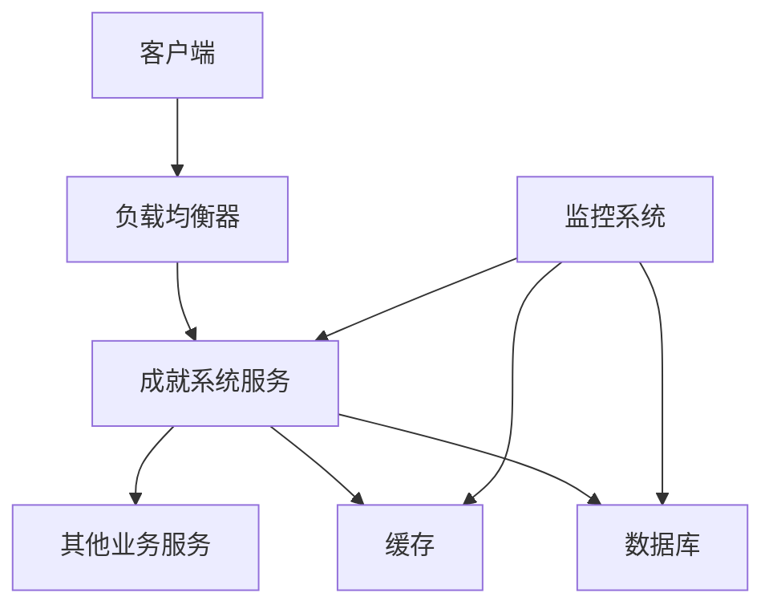

# 成就系统部署文档

## 1. 部署环境

### 1.1 硬件环境

| 设备 | 配置 | 数量 |
| :--- | :--- | :--- |
| 服务器 | CPU: 8核, 内存: 16GB, 磁盘: 500GB | 1 |
| 数据库服务器 | CPU: 4核, 内存: 8GB, 磁盘: 500GB | 1 |
| 缓存服务器 | CPU: 2核, 内存: 4GB, 磁盘: 100GB | 1 |

### 1.2 软件环境

| 软件 | 版本 | 用途 |
| :--- | :--- | :--- |
| 操作系统 | Linux CentOS 7.6 | 服务器运行环境 |
| Docker | 20.10+ | 容器化部署 |
| Kubernetes | 1.20+ | 服务编排 |
| MySQL | 8.0 | 数据存储 |
| Redis | 6.0+ | 缓存 |
| Go | 1.20+ | 编译环境 |
| Nginx | 1.18+ | 反向代理 |
| Prometheus | 2.28+ | 监控 |
| Grafana | 8.0+ | 监控可视化 |

### 1.3 网络环境

| 网络类型 | 带宽 | 延迟 |
| :--- | :--- | :--- |
| 内网 | 1Gbps | <1ms |
| 公网 | 100Mbps | <50ms |

## 2. 部署架构

### 2.1 架构图



### 2.2 组件说明

| 组件 | 说明 | 部署方式 |
| :--- | :--- | :--- |
| 负载均衡器 | 负责请求分发，提高系统可用性 | 容器化部署 |
| 成就系统服务 | 提供成就系统核心功能 | 容器化部署，多实例 |
| 数据库 | 存储成就系统数据 | 容器化部署，主从复制 |
| 缓存 | 缓存成就系统数据，提高性能 | 容器化部署，集群 |
| 监控系统 | 监控系统运行状态 | 容器化部署 |

## 3. 部署前准备

### 3.1 环境检查

1. **硬件检查**：确保服务器硬件配置满足要求
2. **网络检查**：确保网络连接正常，带宽充足
3. **系统检查**：确保操作系统版本正确，系统更新到最新
4. **依赖检查**：确保所需依赖软件已安装

### 3.2 资源准备

1. **服务器资源**：准备足够的服务器资源
2. **存储资源**：准备足够的存储资源
3. **网络资源**：确保网络资源充足
4. **域名资源**：准备必要的域名

### 3.3 配置文件准备

1. **应用配置**：准备应用配置文件
2. **数据库配置**：准备数据库配置文件
3. **缓存配置**：准备缓存配置文件
4. **监控配置**：准备监控配置文件

## 4. 部署步骤

### 4.1 数据库部署

#### 4.1.1 容器化部署

```bash
# 拉取MySQL镜像
docker pull mysql:8.0

# 创建MySQL数据卷
docker volume create mysql-data

# 运行MySQL容器
docker run -d \
  --name mysql \
  -v mysql-data:/var/lib/mysql \
  -e MYSQL_ROOT_PASSWORD=your_password \
  -e MYSQL_DATABASE=dnf_achievement \
  -e MYSQL_USER=dnf_user \
  -e MYSQL_PASSWORD=dnf_password \
  -p 3306:3306 \
  mysql:8.0

# 初始化数据库
cat init.sql | docker exec -i mysql mysql -u root -pyour_password dnf_achievement
```

#### 4.1.2 初始化数据库

```sql
-- 创建成就定义表
CREATE TABLE IF NOT EXISTS t_achievement (
    id BIGINT PRIMARY KEY AUTO_INCREMENT,
    name VARCHAR(128) NOT NULL,
    description VARCHAR(512) NOT NULL,
    target_value INT NOT NULL,
    reward_type INT NOT NULL,
    reward_id BIGINT NOT NULL,
    reward_count INT NOT NULL,
    point INT NOT NULL,
    category INT NOT NULL,
    create_time DATETIME DEFAULT CURRENT_TIMESTAMP,
    update_time DATETIME DEFAULT CURRENT_TIMESTAMP ON UPDATE CURRENT_TIMESTAMP
);

-- 创建玩家成就表
CREATE TABLE IF NOT EXISTS t_player_achievement (
    id BIGINT PRIMARY KEY AUTO_INCREMENT,
    player_id BIGINT NOT NULL,
    achievement_id BIGINT NOT NULL,
    current_value INT NOT NULL,
    is_completed BOOLEAN NOT NULL DEFAULT FALSE,
    is_rewarded BOOLEAN NOT NULL DEFAULT FALSE,
    complete_time DATETIME NULL,
    create_time DATETIME DEFAULT CURRENT_TIMESTAMP,
    update_time DATETIME DEFAULT CURRENT_TIMESTAMP ON UPDATE CURRENT_TIMESTAMP,
    UNIQUE KEY idx_player_achievement (player_id, achievement_id),
    INDEX idx_player_completed (player_id, is_completed)
);

-- 创建称号表
CREATE TABLE IF NOT EXISTS t_title (
    id BIGINT PRIMARY KEY AUTO_INCREMENT,
    name VARCHAR(64) NOT NULL,
    description VARCHAR(256) NOT NULL,
    attribute_type INT NOT NULL,
    attribute_value INT NOT NULL,
    duration INT NOT NULL DEFAULT 0,
    create_time DATETIME DEFAULT CURRENT_TIMESTAMP,
    update_time DATETIME DEFAULT CURRENT_TIMESTAMP ON UPDATE CURRENT_TIMESTAMP
);

-- 创建玩家称号表
CREATE TABLE IF NOT EXISTS t_player_title (
    id BIGINT PRIMARY KEY AUTO_INCREMENT,
    player_id BIGINT NOT NULL,
    title_id BIGINT NOT NULL,
    is_wearing BOOLEAN NOT NULL DEFAULT FALSE,
    acquire_time DATETIME NOT NULL,
    expire_time DATETIME NULL,
    create_time DATETIME DEFAULT CURRENT_TIMESTAMP,
    update_time DATETIME DEFAULT CURRENT_TIMESTAMP ON UPDATE CURRENT_TIMESTAMP,
    UNIQUE KEY idx_player_title (player_id, title_id),
    INDEX idx_player_wearing (player_id, is_wearing)
);

-- 添加外键约束
ALTER TABLE t_player_achievement ADD CONSTRAINT fk_pa_achievement FOREIGN KEY (achievement_id) REFERENCES t_achievement(id) ON DELETE CASCADE;
ALTER TABLE t_player_title ADD CONSTRAINT fk_pt_title FOREIGN KEY (title_id) REFERENCES t_title(id) ON DELETE CASCADE;

-- 插入初始数据
INSERT INTO t_achievement (name, description, target_value, reward_type, reward_id, reward_count, point, category) VALUES
('初出茅庐', '完成第一个任务', 1, 1, 1001, 1, 10, 1),
('任务达人', '完成10个任务', 10, 1, 1002, 1, 20, 1),
('怪物猎人', '击败50个怪物', 50, 1, 1003, 1, 30, 2),
('装备大师', '强化装备20次', 20, 2, 2001, 10000, 40, 3),
('社交达人', '添加5个好友', 5, 3, 3001, 1, 50, 4);

INSERT INTO t_title (name, description, attribute_type, attribute_value, duration) VALUES
('勇士', '完成10个任务获得', 1, 10, 0),
('英雄', '完成50个任务获得', 1, 20, 0),
('传奇', '完成100个任务获得', 1, 30, 604800),
('富豪', '累计获得100000金币', 2, 10, 0),
('社交之王', '添加50个好友', 3, 10, 0);
```

### 4.2 缓存部署

#### 4.2.1 容器化部署

```bash
# 拉取Redis镜像
docker pull redis:6.0

# 创建Redis数据卷
docker volume create redis-data

# 运行Redis容器
docker run -d \
  --name redis \
  -v redis-data:/data \
  -p 6379:6379 \
  redis:6.0 \
  --requirepass your_password
```

### 4.3 成就系统服务部署

#### 4.3.1 编译构建

```bash
# 克隆代码仓库
git clone https://github.com/your-repo/dnf-go-server.git
cd dnf-go-server

# 设置Go环境变量
export GO111MODULE=on
export GOPROXY=https://goproxy.cn,direct

# 安装依赖
go mod tidy

# 编译
go build -o achievement-server ./cmd/achievement

# 构建Docker镜像
docker build -t achievement-server:v1.0 .
```

#### 4.3.2 容器化部署

```bash
# 运行成就系统服务容器
docker run -d \
  --name achievement-server \
  --link mysql:mysql \
  --link redis:redis \
  -e DB_HOST=mysql \
  -e DB_PORT=3306 \
  -e DB_USER=dnf_user \
  -e DB_PASSWORD=dnf_password \
  -e DB_NAME=dnf_achievement \
  -e REDIS_HOST=redis \
  -e REDIS_PORT=6379 \
  -e REDIS_PASSWORD=your_password \
  -p 8080:8080 \
  achievement-server:v1.0
```

#### 4.3.3 Kubernetes部署

```yaml
# achievement-deployment.yaml
apiVersion: apps/v1
kind: Deployment
metadata:
  name: achievement-server
  namespace: dnf
spec:
  replicas: 3
  selector:
    matchLabels:
      app: achievement-server
  template:
    metadata:
      labels:
        app: achievement-server
    spec:
      containers:
      - name: achievement-server
        image: achievement-server:v1.0
        ports:
        - containerPort: 8080
        env:
        - name: DB_HOST
          value: mysql
        - name: DB_PORT
          value: "3306"
        - name: DB_USER
          value: dnf_user
        - name: DB_PASSWORD
          value: dnf_password
        - name: DB_NAME
          value: dnf_achievement
        - name: REDIS_HOST
          value: redis
        - name: REDIS_PORT
          value: "6379"
        - name: REDIS_PASSWORD
          value: your_password
---
# achievement-service.yaml
apiVersion: v1
kind: Service
metadata:
  name: achievement-server
  namespace: dnf
spec:
  selector:
    app: achievement-server
  ports:
  - port: 80
    targetPort: 8080
  type: ClusterIP
---
# achievement-ingress.yaml
apiVersion: networking.k8s.io/v1
kind: Ingress
metadata:
  name: achievement-server
  namespace: dnf
spec:
  rules:
  - host: achievement.example.com
    http:
      paths:
      - path: /
        pathType: Prefix
        backend:
          service:
            name: achievement-server
            port:
              number: 80
```

```bash
# 应用Kubernetes配置
kubectl apply -f achievement-deployment.yaml
kubectl apply -f achievement-service.yaml
kubectl apply -f achievement-ingress.yaml
```

### 4.4 负载均衡器部署

#### 4.4.1 Nginx配置

```nginx
# nginx.conf
worker_processes auto;
events {
    worker_connections 1024;
}
http {
    upstream achievement_servers {
        server achievement-server:80;
    }
    server {
        listen 80;
        server_name achievement.example.com;
        location / {
            proxy_pass http://achievement_servers;
            proxy_set_header Host $host;
            proxy_set_header X-Real-IP $remote_addr;
            proxy_set_header X-Forwarded-For $proxy_add_x_forwarded_for;
        }
    }
}
```

#### 4.4.2 容器化部署

```bash
# 运行Nginx容器
docker run -d \
  --name nginx \
  --link achievement-server:achievement-server \
  -v ./nginx.conf:/etc/nginx/nginx.conf \
  -p 80:80 \
  nginx:1.18
```

### 4.5 监控系统部署

#### 4.5.1 Prometheus部署

```yaml
# prometheus.yaml
global:
  scrape_interval: 15s

scrape_configs:
  - job_name: 'achievement-server'
    static_configs:
      - targets: ['achievement-server:8080']
  - job_name: 'mysql'
    static_configs:
      - targets: ['mysql:9104']
  - job_name: 'redis'
    static_configs:
      - targets: ['redis:9121']
```

```bash
# 运行Prometheus容器
docker run -d \
  --name prometheus \
  --link achievement-server:achievement-server \
  --link mysql:mysql \
  --link redis:redis \
  -v ./prometheus.yaml:/etc/prometheus/prometheus.yml \
  -p 9090:9090 \
  prom/prometheus:v2.28.0
```

#### 4.5.2 Grafana部署

```bash
# 运行Grafana容器
docker run -d \
  --name grafana \
  --link prometheus:prometheus \
  -p 3000:3000 \
  grafana/grafana:8.0.0
```

## 5. 配置管理

### 5.1 应用配置

| 配置项 | 说明 | 默认值 | 配置文件 |
| :--- | :--- | :--- | :--- |
| `SERVER_PORT` | 服务器端口 | 8080 | .env |
| `DB_HOST` | 数据库主机 | localhost | .env |
| `DB_PORT` | 数据库端口 | 3306 | .env |
| `DB_USER` | 数据库用户 | root | .env |
| `DB_PASSWORD` | 数据库密码 | - | .env |
| `DB_NAME` | 数据库名称 | dnf_achievement | .env |
| `REDIS_HOST` | Redis主机 | localhost | .env |
| `REDIS_PORT` | Redis端口 | 6379 | .env |
| `REDIS_PASSWORD` | Redis密码 | - | .env |
| `LOG_LEVEL` | 日志级别 | info | .env |
| `CACHE_EXPIRATION` | 缓存过期时间(秒) | 3600 | .env |

### 5.2 数据库配置

| 配置项 | 说明 | 默认值 | 配置文件 |
| :--- | :--- | :--- | :--- |
| `max_connections` | 最大连接数 | 100 | my.cnf |
| `innodb_buffer_pool_size` | InnoDB缓冲池大小 | 2G | my.cnf |
| `innodb_log_file_size` | InnoDB日志文件大小 | 512M | my.cnf |
| `query_cache_size` | 查询缓存大小 | 0 | my.cnf |

### 5.3 缓存配置

| 配置项 | 说明 | 默认值 | 配置文件 |
| :--- | :--- | :--- | :--- |
| `maxmemory` | 最大内存 | 2GB | redis.conf |
| `maxmemory-policy` | 内存淘汰策略 | allkeys-lru | redis.conf |
| `appendonly` | AOF持久化 | yes | redis.conf |
| `appendfsync` | AOF同步策略 | everysec | redis.conf |

### 5.4 监控配置

| 配置项 | 说明 | 默认值 | 配置文件 |
| :--- | :--- | :--- | :--- |
| `scrape_interval` | 抓取间隔 | 15s | prometheus.yaml |
| `evaluation_interval` | 评估间隔 | 15s | prometheus.yaml |
| `alertmanager_url` | 告警管理器URL | - | prometheus.yaml |

## 6. 启动与停止

### 6.1 启动服务

```bash
# 启动数据库
docker start mysql

# 启动缓存
docker start redis

# 启动成就系统服务
docker start achievement-server

# 启动负载均衡器
docker start nginx

# 启动监控系统
docker start prometheus grafana
```

### 6.2 停止服务

```bash
# 停止监控系统
docker stop prometheus grafana

# 停止负载均衡器
docker stop nginx

# 停止成就系统服务
docker stop achievement-server

# 停止缓存
docker stop redis

# 停止数据库
docker stop mysql
```

### 6.3 重启服务

```bash
# 重启成就系统服务
docker restart achievement-server

# 重启数据库
docker restart mysql

# 重启缓存
docker restart redis
```

## 7. 监控与维护

### 7.1 监控指标

| 指标 | 说明 | 监控方式 |
| :--- | :--- | :--- |
| 服务状态 | 服务是否运行正常 | Prometheus |
| 响应时间 | 接口响应时间 | Prometheus |
| 请求量 | 接口请求量 | Prometheus |
| 错误率 | 接口错误率 | Prometheus |
| 数据库连接数 | 数据库连接数 | Prometheus |
| 缓存命中率 | 缓存命中率 | Prometheus |
| 系统资源使用 | CPU、内存、磁盘使用情况 | Prometheus |

### 7.2 告警规则

| 告警项 | 触发条件 | 告警级别 | 处理方式 |
| :--- | :--- | :--- | :--- |
| 服务宕机 | 服务不可访问 | 严重 | 立即重启服务 |
| 响应时间过长 | 平均响应时间>1s | 警告 | 检查系统负载，优化代码 |
| 错误率过高 | 错误率>5% | 警告 | 检查错误日志，修复问题 |
| 数据库连接数过高 | 连接数>80% | 警告 | 检查数据库连接池配置 |
| 缓存命中率过低 | 命中率<80% | 信息 | 优化缓存策略 |
| 系统资源使用过高 | CPU>80%或内存>80% | 警告 | 检查系统负载，扩容资源 |

### 7.3 日志管理

#### 7.3.1 日志配置

| 配置项 | 说明 | 默认值 | 配置文件 |
| :--- | :--- | :--- | :--- |
| `LOG_LEVEL` | 日志级别 | info | .env |
| `LOG_FILE` | 日志文件路径 | ./logs/achievement.log | .env |
| `LOG_ROTATION` | 日志轮转方式 | daily | .env |
| `LOG_MAX_SIZE` | 日志文件最大大小 | 100MB | .env |
| `LOG_MAX_BACKUPS` | 日志文件最大备份数 | 7 | .env |

#### 7.3.2 日志分析

1. **实时日志查看**：使用`docker logs`命令查看实时日志
2. **历史日志分析**：使用ELK等工具分析历史日志
3. **错误日志监控**：使用监控工具监控错误日志

### 7.4 定期维护

| 维护项 | 频率 | 维护内容 |
| :--- | :--- | :--- |
| 数据库备份 | 每日 | 备份数据库数据 |
| 日志清理 | 每周 | 清理过期日志 |
| 系统更新 | 每月 | 更新系统和依赖软件 |
| 性能优化 | 每季度 | 分析系统性能，进行优化 |
| 安全检查 | 每季度 | 进行安全检查，修复漏洞 |

## 8. 故障处理

### 8.1 常见故障

| 故障类型 | 症状 | 可能原因 | 处理方法 |
| :--- | :--- | :--- | :--- |
| 服务无法启动 | 服务进程不存在，端口未监听 | 配置错误，依赖服务未启动 | 检查配置文件，确保依赖服务已启动 |
| 接口响应缓慢 | 接口响应时间过长 | 系统负载高，数据库查询慢，缓存未命中 | 检查系统负载，优化数据库查询，检查缓存配置 |
| 接口返回错误 | 接口返回错误信息 | 参数错误，业务逻辑错误，系统错误 | 检查请求参数，查看错误日志，修复业务逻辑 |
| 数据库连接失败 | 无法连接数据库 | 数据库服务未启动，网络连接问题，配置错误 | 检查数据库服务状态，检查网络连接，检查数据库配置 |
| 缓存连接失败 | 无法连接缓存 | 缓存服务未启动，网络连接问题，配置错误 | 检查缓存服务状态，检查网络连接，检查缓存配置 |

### 8.2 故障排查流程

1. **收集信息**：收集故障症状、错误日志、系统状态等信息
2. **分析原因**：根据收集的信息，分析故障原因
3. **制定方案**：根据故障原因，制定修复方案
4. **实施修复**：实施修复方案，解决故障
5. **验证结果**：验证故障是否已解决
6. **记录总结**：记录故障原因、修复过程和结果

### 8.3 灾备方案

1. **数据库灾备**：使用主从复制，定期备份数据库
2. **缓存灾备**：使用Redis集群，确保高可用性
3. **服务灾备**：部署多个服务实例，使用负载均衡
4. **网络灾备**：使用多网络线路，确保网络连接可靠
5. **存储灾备**：使用分布式存储，确保数据安全

## 9. 升级与回滚

### 9.1 升级步骤

1. **备份数据**：备份数据库和配置文件
2. **停止服务**：停止当前运行的服务
3. **更新代码**：更新代码或部署新版本
4. **更新配置**：更新配置文件（如果需要）
5. **启动服务**：启动更新后的服务
6. **验证服务**：验证服务是否正常运行
7. **监控运行**：监控服务运行状态

### 9.2 回滚步骤

1. **停止服务**：停止当前运行的服务
2. **恢复备份**：恢复数据库和配置文件备份
3. **部署旧版本**：部署旧版本的代码
4. **启动服务**：启动旧版本的服务
5. **验证服务**：验证服务是否正常运行
6. **分析原因**：分析升级失败的原因

## 10. 总结

成就系统部署采用了容器化部署方式，结合Kubernetes进行服务编排，提高了系统的可用性和可扩展性。通过合理的配置管理和监控维护，可以确保系统的稳定运行。同时，制定了完善的故障处理和灾备方案，提高了系统的可靠性。

在部署过程中，需要注意以下几点：

1. **环境准备**：确保部署环境满足要求，网络连接正常
2. **配置管理**：合理配置系统参数，确保系统性能和稳定性
3. **监控维护**：建立完善的监控系统，及时发现和处理问题
4. **安全防护**：加强系统安全防护，防止安全漏洞
5. **灾备方案**：建立完善的灾备方案，确保系统高可用性

通过以上措施，可以确保成就系统的顺利部署和稳定运行，为玩家提供良好的游戏体验。