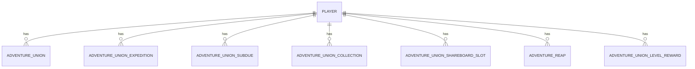

# 冒险系统设计文档

## 1. 系统概述

冒险系统是游戏中的重要功能模块，包含冒险联盟、冒险奖励、冒险远征、冒险讨伐等多个子系统，用于追踪和管理玩家的冒险进度，提供丰富的游戏玩法和奖励机制。

### 1.1 系统简介

- **系统名称**: 冒险系统
- **系统功能**: 提供冒险联盟信息查询、冒险联盟改名、冒险远征、冒险讨伐、冒险奖励领取、冒险联盟展示板管理等功能
- **系统位置**: `internal/game/adventure_service`

### 1.2 核心流程

1. 玩家登录游戏
2. 系统加载玩家冒险联盟信息
3. 玩家进行冒险活动（远征、讨伐、搜索等）
4. 系统自动更新冒险进度
5. 冒险完成后通知玩家
6. 玩家领取冒险奖励
7. 系统发放奖励并更新状态

## 2. Java 代码分析

### 2.1 核心控制器

- **文件位置**: `src/main/java/com/dnfm/game/adventure/AdventureController.java`
- **处理器数量**: 15 个 @RequestMapping 方法

### 2.2 核心功能

#### 2.2.1 冒险联盟信息查询 (REQ_ADVENTURE_UNION_INFO)
- **方法**: `REQ_ADVENTURE_UNION_INFO(IoSession session, REQ_ADVENTURE_UNION_INFO req)`
- **功能**:
  - 查询玩家的冒险联盟信息
  - 返回冒险联盟等级、经验、远征信息等

#### 2.2.2 冒险联盟改名 (REQ_ADVENTURE_UNION_NAME_CHANGE)
- **方法**: `REQ_ADVENTURE_UNION_NAME_CHANGE(IoSession session, REQ_ADVENTURE_UNION_NAME_CHANGE req)`
- **功能**:
  - 修改冒险联盟名称
  - 验证名称合法性
  - 更新改名时间

#### 2.2.3 冒险联盟远征开始 (REQ_ADVENTURE_UNION_EXPEDITION_START)
- **方法**: `REQ_ADVENTURE_UNION_EXPEDITION_START(IoSession session, REQ_ADVENTURE_UNION_EXPEDITION_START req)`
- **功能**:
  - 开始冒险联盟远征
  - 验证远征条件
  - 创建远征记录

#### 2.2.4 冒险联盟远征取消 (REQ_ADVENTURE_UNION_EXPEDITION_CANCEL)
- **方法**: `REQ_ADVENTURE_UNION_EXPEDITION_CANCEL(IoSession session, REQ_ADVENTURE_UNION_EXPEDITION_CANCEL req)`
- **功能**:
  - 取消冒险联盟远征
  - 更新远征状态

#### 2.2.5 冒险联盟远征奖励 (REQ_ADVENTURE_UNION_EXPEDITION_REWARD)
- **方法**: `REQ_ADVENTURE_UNION_EXPEDITION_REWARD(IoSession session, REQ_ADVENTURE_UNION_EXPEDITION_REWARD req)`
- **功能**:
  - 领取冒险联盟远征奖励
  - 发放奖励物品

#### 2.2.6 冒险联盟讨伐信息 (REQ_ADVENTURE_UNION_SUBDUE_INFO)
- **方法**: `REQ_ADVENTURE_UNION_SUBDUE_INFO(IoSession session, REQ_ADVENTURE_UNION_SUBDUE_INFO req)`
- **功能**:
  - 查询冒险联盟讨伐信息

#### 2.2.7 冒险联盟讨伐开始 (REQ_ADVENTURE_UNION_SUBDUE_START)
- **方法**: `REQ_ADVENTURE_UNION_SUBDUE_START(IoSession session, REQ_ADVENTURE_UNION_SUBDUE_START req)`
- **功能**:
  - 开始冒险联盟讨伐
  - 验证讨伐条件
  - 创建讨伐记录

#### 2.2.8 冒险联盟讨伐奖励 (REQ_ADVENTURE_UNION_SUBDUE_REWARD)
- **方法**: `REQ_ADVENTURE_UNION_SUBDUE_REWARD(IoSession session, REQ_ADVENTURE_UNION_SUBDUE_REWARD req)`
- **功能**:
  - 领取冒险联盟讨伐奖励
  - 发放奖励物品

#### 2.2.9 冒险联盟展示板槽位开启 (REQ_ADVENTURE_UNION_OPEN_SHAREBOARD_SLOT)
- **方法**: `REQ_ADVENTURE_UNION_OPEN_SHAREBOARD_SLOT(IoSession session, REQ_ADVENTURE_UNION_OPEN_SHAREBOARD_SLOT req)`
- **功能**:
  - 开启冒险联盟展示板槽位

#### 2.2.10 冒险联盟展示板设置 (REQ_ADVENTURE_UNION_SET_SHAREBOARD)
- **方法**: `REQ_ADVENTURE_UNION_SET_SHAREBOARD(IoSession session, REQ_ADVENTURE_UNION_SET_SHAREBOARD req)`
- **功能**:
  - 设置冒险联盟展示板
  - 配置展示内容

#### 2.2.11 冒险奖励信息 (REQ_ADVENTURE_REAP_INFO)
- **方法**: `REQ_ADVENTURE_REAP_INFO(IoSession session, REQ_ADVENTURE_REAP_INFO req)`
- **功能**:
  - 查询冒险奖励信息
  - 返回奖励列表

#### 2.2.12 冒险奖励领取 (REQ_ADVENTURE_REAP_REWARD)
- **方法**: `REQ_ADVENTURE_REAP_REWARD(IoSession session, REQ_ADVENTURE_REAP_REWARD req)`
- **功能**:
  - 领取冒险奖励
  - 发放奖励物品

#### 2.2.13 冒险联盟搜索开始 (REQ_ADVENTURE_UNION_SEARCH_START)
- **方法**: `REQ_ADVENTURE_UNION_SEARCH_START(IoSession session, REQ_ADVENTURE_UNION_SEARCH_START req)`
- **功能**:
  - 开始冒险联盟搜索

#### 2.2.14 冒险联盟收藏奖励 (REQ_ADVENTURE_UNION_COLLECTION_REWARD)
- **方法**: `REQ_ADVENTURE_UNION_COLLECTION_REWARD(IoSession session, REQ_ADVENTURE_UNION_COLLECTION_REWARD req)`
- **功能**:
  - 领取冒险联盟收藏奖励

#### 2.2.15 冒险联盟等级奖励 (REQ_ADVENTURE_UNION_LEVEL_REWARD)
- **方法**: `REQ_ADVENTURE_UNION_LEVEL_REWARD(IoSession session, REQ_ADVENTURE_UNION_LEVEL_REWARD req)`
- **功能**:
  - 领取冒险联盟等级奖励

## 3. Go 实现方案

### 3.1 ProtoBuf 消息定义

#### adventure.proto
```protobuf
syntax = "proto3";

package dnf.v1;

option go_package = "gen/dnf/v1";

import "dnf/v1/common.proto";

// 冒险联盟信息请求
message AdventureUnionInfoRequest {
}

message AdventureUnionInfoResponse {
  int32 error = 1;
  uint64 exp = 2;
  uint32 level = 3;
  uint32 day = 4;
  uint64 typicalcharacterguid = 5;
  string name = 6;
  uint64 updatetime = 7;
  uint64 lastchangenametime = 8;
  AdventureUnionExpedition expedition = 9;
  repeated AdventureUnionExpedition expeditions = 10;
  repeated AdventureUnionCollection collections = 11;
  repeated AdventureUnionCollectionSlot collectionslots = 12;
  uint32 shareboardbackground = 13;
  uint32 shareboardframe = 14;
  repeated AdventureUnionShareboardSlot shareboardslotlist = 15;
  repeated AdventureUnionShareboardBackground shareboardbackgroundlist = 16;
  repeated AdventureUnionShareboardFrame shareboardframelist = 17;
  bool shareboardshowantievilscore = 18;
  uint32 autosearchcount = 19;
  repeated uint32 receivedcollectionrewards = 20;
  repeated AdventureUnionLevelReward levelrewards = 21;
  uint32 shareboardtotalantievilscore = 22;
  bool shareboardantievilscorerefresh = 23;
  bool isadventureCondition = 24;
}

message AdventureUnionExpedition {
  uint32 expedition_id = 1;
  uint32 expedition_type = 2;
  uint32 status = 3;
  uint64 start_time = 4;
  uint64 end_time = 5;
}

message AdventureUnionCollection {
  uint32 collection_id = 1;
  uint32 progress = 2;
  bool completed = 3;
}

message AdventureUnionCollectionSlot {
  uint32 slot_id = 1;
  uint32 slot_type = 2;
}

message AdventureUnionShareboardSlot {
  uint32 slot_id = 1;
  uint32 slot_type = 2;
  uint32 item_id = 3;
  uint32 item_count = 4;
  bool show = 5;
}

message AdventureUnionShareboardBackground {
  uint32 background_id = 1;
  string name = 2;
}

message AdventureUnionShareboardFrame {
  uint32 frame_id = 1;
  string name = 2;
}

message AdventureUnionLevelReward {
  uint32 level = 1;
  uint32 reward_type = 2;
  uint32 reward_index = 3;
  uint32 reward_count = 4;
  bool claimed = 5;
}

// 冒险联盟改名请求
message AdventureUnionNameChangeRequest {
  string field_1 = 1;
}

message AdventureUnionNameChangeResponse {
  int32 error = 1;
  uint64 transId = 2;
}

// 冒险联盟远征请求
message AdventureUnionExpeditionStartRequest {
  int32 field_1 = 1;
  int32 field_2 = 2;
}

message AdventureUnionExpeditionStartResponse {
  int32 error = 1;
  uint64 transId = 2;
}

message AdventureUnionExpeditionCancelRequest {
  int32 field_1 = 1;
}

message AdventureUnionExpeditionCancelResponse {
  int32 error = 1;
  uint64 transId = 2;
}

message AdventureUnionExpeditionRewardRequest {
  int32 field_1 = 1;
}

message AdventureUnionExpeditionRewardResponse {
  int32 error = 1;
  uint64 transId = 2;
}

// 冒险联盟讨伐请求
message AdventureUnionSubdueInfoRequest {
}

message AdventureUnionSubdueInfoResponse {
  int32 error = 1;
  uint64 transId = 2;
}

message AdventureUnionSubdueStartRequest {
  int32 field_1 = 1;
  int32 field_2 = 2;
  uint64 field_3 = 3;
}

message AdventureUnionSubdueStartResponse {
  int32 error = 1;
  uint64 transId = 2;
}

message AdventureUnionSubdueRewardRequest {
  int32 field_1 = 1;
}

message AdventureUnionSubdueRewardResponse {
  int32 error = 1;
  uint64 transId = 2;
}

// 冒险联盟展示板请求
message AdventureUnionOpenShareboardSlotRequest {
  int32 field_1 = 1;
}

message AdventureUnionOpenShareboardSlotResponse {
  int32 error = 1;
  uint64 transId = 2;
}

message AdventureUnionSetShareboardRequest {
  int32 field_1 = 1;
  int32 field_2 = 2;
  bool field_4 = 4;
}

message AdventureUnionSetShareboardResponse {
  int32 error = 1;
  uint64 transId = 2;
}

// 冒险奖励请求
message AdventureReapInfoRequest {
}

message AdventureReapInfoResponse {
  repeated ReapReward rewards = 1;
  uint64 starttime = 2;
  int32 error = 3;
}

message ReapReward {
  uint32 reward_type = 1;
  uint32 reward_index = 2;
  uint32 reward_count = 3;
}

message AdventureReapRewardRequest {
  int32 field_1 = 1;
}

message AdventureReapRewardResponse {
  int32 error = 1;
  uint64 transId = 2;
}

// 冒险联盟搜索请求
message AdventureUnionSearchStartRequest {
}

message AdventureUnionSearchStartResponse {
  int32 error = 1;
  uint64 transId = 2;
}

// 冒险联盟收藏奖励请求
message AdventureUnionCollectionRewardRequest {
  int32 field_1 = 1;
}

message AdventureUnionCollectionRewardResponse {
  int32 error = 1;
  uint64 transId = 2;
}

// 冒险联盟等级奖励请求
message AdventureUnionLevelRewardRequest {
  int32 field_1 = 1;
}

message AdventureUnionLevelRewardResponse {
  int32 error = 1;
  uint64 transId = 2;
}
```

### 3.2 服务端实现

#### 3.2.1 数据模型设计

##### models/adventure.go
```go
package models

import (
    "time"
    "gorm.io/gorm"
)

// AdventureUnion 冒险联盟信息表
type AdventureUnion struct {
    ID                      uint64    `gorm:"column:id;primaryKey;autoIncrement" json:"id"`
    RoleID                  uint64    `gorm:"column:role_id;uniqueIndex;not null" json:"roleId"`
    Name                    string    `gorm:"column:name;size:64;not null" json:"name"`
    Exp                     uint64    `gorm:"column:exp;default:0" json:"exp"`
    Level                   uint32    `gorm:"column:level;default:1" json:"level"`
    Day                     uint32    `gorm:"column:day;default:1" json:"day"`
    TypicalCharacterGUID    uint64    `gorm:"column:typical_character_guid" json:"typicalCharacterGuid"`
    LastChangeNameTime      time.Time `gorm:"column:last_change_name_time" json:"lastChangeNameTime"`
    ShareboardBackground    uint32    `gorm:"column:shareboard_background;default:0" json:"shareboardBackground"`
    ShareboardFrame         uint32    `gorm:"column:shareboard_frame;default:0" json:"shareboardFrame"`
    ShareboardShowAntiEvilScore bool  `gorm:"column:shareboard_show_antievil_score;default:false" json:"shareboardShowAntiEvilScore"`
    AutoSearchCount         uint32    `gorm:"column:auto_search_count;default:0" json:"autoSearchCount"`
    ShareboardTotalAntiEvilScore uint32 `gorm:"column:shareboard_total_antievil_score;default:0" json:"shareboardTotalAntiEvilScore"`
    ShareboardAntiEvilScoreRefresh bool `gorm:"column:shareboard_antievil_score_refresh;default:false" json:"shareboardAntiEvilScoreRefresh"`
    IsAdventureCondition    bool      `gorm:"column:is_adventure_condition;default:false" json:"isAdventureCondition"`
    CreateTime              time.Time `gorm:"column:create_time;autoCreateTime" json:"createTime"`
    UpdateTime              time.Time `gorm:"column:update_time;autoUpdateTime" json:"updateTime"`
}

func (AdventureUnion) TableName() string {
    return "t_adventure_union"
}

// AdventureUnionExpedition 冒险联盟远征表
type AdventureUnionExpedition struct {
    ID          uint64    `gorm:"column:id;primaryKey;autoIncrement" json:"id"`
    RoleID      uint64    `gorm:"column:role_id;index;not null" json:"roleId"`
    ExpeditionID uint32   `gorm:"column:expedition_id;not null" json:"expeditionId"`
    ExpeditionType uint32 `gorm:"column:expedition_type;not null" json:"expeditionType"`
    Status      uint32    `gorm:"column:status;default:0" json:"status"`
    StartTime   time.Time `gorm:"column:start_time" json:"startTime"`
    EndTime     time.Time `gorm:"column:end_time" json:"endTime"`
    RewardClaimed bool    `gorm:"column:reward_claimed;default:false" json:"rewardClaimed"`
    CreateTime  time.Time `gorm:"column:create_time;autoCreateTime" json:"createTime"`
    UpdateTime  time.Time `gorm:"column:update_time;autoUpdateTime" json:"updateTime"`
}

func (AdventureUnionExpedition) TableName() string {
    return "t_adventure_union_expedition"
}

// AdventureUnionSubdue 冒险联盟讨伐表
type AdventureUnionSubdue struct {
    ID          uint64    `gorm:"column:id;primaryKey;autoIncrement" json:"id"`
    RoleID      uint64    `gorm:"column:role_id;index;not null" json:"roleId"`
    SubdueID    uint32    `gorm:"column:subdue_id;not null" json:"subdueId"`
    SubdueType  uint32    `gorm:"column:subdue_type;not null" json:"subdueType"`
    CharacterGUID uint64 `gorm:"column:character_guid" json:"characterGuid"`
    Status      uint32    `gorm:"column:status;default:0" json:"status"`
    StartTime   time.Time `gorm:"column:start_time" json:"startTime"`
    EndTime     time.Time `gorm:"column:end_time" json:"endTime"`
    RewardClaimed bool    `gorm:"column:reward_claimed;default:false" json:"rewardClaimed"`
    CreateTime  time.Time `gorm:"column:create_time;autoCreateTime" json:"createTime"`
    UpdateTime  time.Time `gorm:"column:update_time;autoUpdateTime" json:"updateTime"`
}

func (AdventureUnionSubdue) TableName() string {
    return "t_adventure_union_subdue"
}

// AdventureUnionCollection 冒险联盟收藏表
type AdventureUnionCollection struct {
    ID          uint64    `gorm:"column:id;primaryKey;autoIncrement" json:"id"`
    RoleID      uint64    `gorm:"column:role_id;index;not null" json:"roleId"`
    CollectionID uint32   `gorm:"column:collection_id;not null" json:"collectionId"`
    Progress    uint32    `gorm:"column:progress;default:0" json:"progress"`
    Completed   bool      `gorm:"column:completed;default:false" json:"completed"`
    RewardClaimed bool    `gorm:"column:reward_claimed;default:false" json:"rewardClaimed"`
    CreateTime  time.Time `gorm:"column:create_time;autoCreateTime" json:"createTime"`
    UpdateTime  time.Time `gorm:"column:update_time;autoUpdateTime" json:"updateTime"`
}

func (AdventureUnionCollection) TableName() string {
    return "t_adventure_union_collection"
}

// AdventureUnionShareboardSlot 冒险联盟展示板槽位表
type AdventureUnionShareboardSlot struct {
    ID          uint64    `gorm:"column:id;primaryKey;autoIncrement" json:"id"`
    RoleID      uint64    `gorm:"column:role_id;index;not null" json:"roleId"`
    SlotID      uint32    `gorm:"column:slot_id;not null" json:"slotId"`
    SlotType    uint32    `gorm:"column:slot_type;not null" json:"slotType"`
    ItemID      uint32    `gorm:"column:item_id" json:"itemId"`
    ItemCount   uint32    `gorm:"column:item_count" json:"itemCount"`
    Show        bool      `gorm:"column:show;default:false" json:"show"`
    CreateTime  time.Time `gorm:"column:create_time;autoCreateTime" json:"createTime"`
    UpdateTime  time.Time `gorm:"column:update_time;autoUpdateTime" json:"updateTime"`
}

func (AdventureUnionShareboardSlot) TableName() string {
    return "t_adventure_union_shareboard_slot"
}

// AdventureReap 冒险奖励表
type AdventureReap struct {
    ID          uint64    `gorm:"column:id;primaryKey;autoIncrement" json:"id"`
    RoleID      uint64    `gorm:"column:role_id;index;not null" json:"roleId"`
    ReapID      uint32    `gorm:"column:reap_id;not null" json:"reapId"`
    RewardType  uint32    `gorm:"column:reward_type;not null" json:"rewardType"`
    RewardIndex uint32    `gorm:"column:reward_index;not null" json:"rewardIndex"`
    RewardCount uint32    `gorm:"column:reward_count;not null" json:"rewardCount"`
    Claimed     bool      `gorm:"column:claimed;default:false" json:"claimed"`
    ClaimTime   time.Time `gorm:"column:claim_time" json:"claimTime"`
    CreateTime  time.Time `gorm:"column:create_time;autoCreateTime" json:"createTime"`
}

func (AdventureReap) TableName() string {
    return "t_adventure_reap"
}

// AdventureUnionLevelReward 冒险联盟等级奖励表
type AdventureUnionLevelReward struct {
    ID          uint64    `gorm:"column:id;primaryKey;autoIncrement" json:"id"`
    RoleID      uint64    `gorm:"column:role_id;index;not null" json:"roleId"`
    Level       uint32    `gorm:"column:level;not null" json:"level"`
    RewardType  uint32    `gorm:"column:reward_type;not null" json:"rewardType"`
    RewardIndex uint32    `gorm:"column:reward_index;not null" json:"rewardIndex"`
    RewardCount uint32    `gorm:"column:reward_count;not null" json:"rewardCount"`
    Claimed     bool      `gorm:"column:claimed;default:false" json:"claimed"`
    ClaimTime   time.Time `gorm:"column:claim_time" json:"claimTime"`
    CreateTime  time.Time `gorm:"column:create_time;autoCreateTime" json:"createTime"`
}

func (AdventureUnionLevelReward) TableName() string {
    return "t_adventure_union_level_reward"
}
```

#### 3.2.2 Handler 实现

##### handlers/adventure.go
```go
package handlers

import (
    "context"

    "github.com/pixb/DnfGameServer/dnf-go-server/internal/game/adventure_service"
    "github.com/pixb/DnfGameServer/dnf-go-server/internal/network"
    dnfv1 "github.com/pixb/DnfGameServer/dnf-go-server/proto/gen/dnf/v1"
    "google.golang.org/protobuf/proto"
)

type AdventureHandler struct {
    adventureService *adventure_service.AdventureService
}

func NewAdventureHandler(adventureService *adventure_service.AdventureService) *AdventureHandler {
    return &AdventureHandler{
        adventureService: adventureService,
    }
}

// AdventureUnionInfoHandler 冒险联盟信息查询处理器
func (h *AdventureHandler) AdventureUnionInfoHandler(sess *network.Session, msg proto.Message) {
    req, ok := msg.(*dnfv1.AdventureUnionInfoRequest)
    if !ok {
        return
    }

    info, err := h.adventureService.GetAdventureUnionInfo(context.Background(), sess.RoleID)
    if err != nil {
        h.sendError(sess, req, 1, "failed to get adventure union info")
        return
    }

    sess.Send(info)
}

// AdventureUnionNameChangeHandler 冒险联盟改名处理器
func (h *AdventureHandler) AdventureUnionNameChangeHandler(sess *network.Session, msg proto.Message) {
    req, ok := msg.(*dnfv1.AdventureUnionNameChangeRequest)
    if !ok {
        return
    }

    resp, err := h.adventureService.ChangeAdventureUnionName(context.Background(), sess.RoleID, req.Field_1)
    if err != nil {
        h.sendError(sess, req, 1, "failed to change adventure union name")
        return
    }

    sess.Send(resp)
}

// AdventureUnionExpeditionStartHandler 冒险联盟远征开始处理器
func (h *AdventureHandler) AdventureUnionExpeditionStartHandler(sess *network.Session, msg proto.Message) {
    req, ok := msg.(*dnfv1.AdventureUnionExpeditionStartRequest)
    if !ok {
        return
    }

    resp, err := h.adventureService.StartExpedition(context.Background(), sess.RoleID, req.Field_1, req.Field_2)
    if err != nil {
        h.sendError(sess, req, 1, "failed to start expedition")
        return
    }

    sess.Send(resp)
}

// AdventureUnionExpeditionCancelHandler 冒险联盟远征取消处理器
func (h *AdventureHandler) AdventureUnionExpeditionCancelHandler(sess *network.Session, msg proto.Message) {
    req, ok := msg.(*dnfv1.AdventureUnionExpeditionCancelRequest)
    if !ok {
        return
    }

    resp, err := h.adventureService.CancelExpedition(context.Background(), sess.RoleID, req.Field_1)
    if err != nil {
        h.sendError(sess, req, 1, "failed to cancel expedition")
        return
    }

    sess.Send(resp)
}

// AdventureUnionExpeditionRewardHandler 冒险联盟远征奖励处理器
func (h *AdventureHandler) AdventureUnionExpeditionRewardHandler(sess *network.Session, msg proto.Message) {
    req, ok := msg.(*dnfv1.AdventureUnionExpeditionRewardRequest)
    if !ok {
        return
    }

    resp, err := h.adventureService.ClaimExpeditionReward(context.Background(), sess.RoleID, req.Field_1)
    if err != nil {
        h.sendError(sess, req, 1, "failed to claim expedition reward")
        return
    }

    sess.Send(resp)
}

// AdventureUnionSubdueInfoHandler 冒险联盟讨伐信息处理器
func (h *AdventureHandler) AdventureUnionSubdueInfoHandler(sess *network.Session, msg proto.Message) {
    req, ok := msg.(*dnfv1.AdventureUnionSubdueInfoRequest)
    if !ok {
        return
    }

    resp, err := h.adventureService.GetSubdueInfo(context.Background(), sess.RoleID)
    if err != nil {
        h.sendError(sess, req, 1, "failed to get subdue info")
        return
    }

    sess.Send(resp)
}

// AdventureUnionSubdueStartHandler 冒险联盟讨伐开始处理器
func (h *AdventureHandler) AdventureUnionSubdueStartHandler(sess *network.Session, msg proto.Message) {
    req, ok := msg.(*dnfv1.AdventureUnionSubdueStartRequest)
    if !ok {
        return
    }

    resp, err := h.adventureService.StartSubdue(context.Background(), sess.RoleID, req.Field_1, req.Field_2, req.Field_3)
    if err != nil {
        h.sendError(sess, req, 1, "failed to start subdue")
        return
    }

    sess.Send(resp)
}

// AdventureUnionSubdueRewardHandler 冒险联盟讨伐奖励处理器
func (h *AdventureHandler) AdventureUnionSubdueRewardHandler(sess *network.Session, msg proto.Message) {
    req, ok := msg.(*dnfv1.AdventureUnionSubdueRewardRequest)
    if !ok {
        return
    }

    resp, err := h.adventureService.ClaimSubdueReward(context.Background(), sess.RoleID, req.Field_1)
    if err != nil {
        h.sendError(sess, req, 1, "failed to claim subdue reward")
        return
    }

    sess.Send(resp)
}

// AdventureUnionOpenShareboardSlotHandler 冒险联盟展示板槽位开启处理器
func (h *AdventureHandler) AdventureUnionOpenShareboardSlotHandler(sess *network.Session, msg proto.Message) {
    req, ok := msg.(*dnfv1.AdventureUnionOpenShareboardSlotRequest)
    if !ok {
        return
    }

    resp, err := h.adventureService.OpenShareboardSlot(context.Background(), sess.RoleID, req.Field_1)
    if err != nil {
        h.sendError(sess, req, 1, "failed to open shareboard slot")
        return
    }

    sess.Send(resp)
}

// AdventureUnionSetShareboardHandler 冒险联盟展示板设置处理器
func (h *AdventureHandler) AdventureUnionSetShareboardHandler(sess *network.Session, msg proto.Message) {
    req, ok := msg.(*dnfv1.AdventureUnionSetShareboardRequest)
    if !ok {
        return
    }

    resp, err := h.adventureService.SetShareboard(context.Background(), sess.RoleID, req.Field_1, req.Field_2, req.Field_4)
    if err != nil {
        h.sendError(sess, req, 1, "failed to set shareboard")
        return
    }

    sess.Send(resp)
}

// AdventureReapInfoHandler 冒险奖励信息处理器
func (h *AdventureHandler) AdventureReapInfoHandler(sess *network.Session, msg proto.Message) {
    req, ok := msg.(*dnfv1.AdventureReapInfoRequest)
    if !ok {
        return
    }

    resp, err := h.adventureService.GetAdventureReapInfo(context.Background(), sess.RoleID)
    if err != nil {
        h.sendError(sess, req, 1, "failed to get adventure reap info")
        return
    }

    sess.Send(resp)
}

// AdventureReapRewardHandler 冒险奖励领取处理器
func (h *AdventureHandler) AdventureReapRewardHandler(sess *network.Session, msg proto.Message) {
    req, ok := msg.(*dnfv1.AdventureReapRewardRequest)
    if !ok {
        return
    }

    resp, err := h.adventureService.ClaimAdventureReapReward(context.Background(), sess.RoleID, req.Field_1)
    if err != nil {
        h.sendError(sess, req, 1, "failed to claim adventure reap reward")
        return
    }

    sess.Send(resp)
}

// AdventureUnionSearchStartHandler 冒险联盟搜索开始处理器
func (h *AdventureHandler) AdventureUnionSearchStartHandler(sess *network.Session, msg proto.Message) {
    req, ok := msg.(*dnfv1.AdventureUnionSearchStartRequest)
    if !ok {
        return
    }

    resp, err := h.adventureService.StartSearch(context.Background(), sess.RoleID)
    if err != nil {
        h.sendError(sess, req, 1, "failed to start search")
        return
    }

    sess.Send(resp)
}

// AdventureUnionCollectionRewardHandler 冒险联盟收藏奖励处理器
func (h *AdventureHandler) AdventureUnionCollectionRewardHandler(sess *network.Session, msg proto.Message) {
    req, ok := msg.(*dnfv1.AdventureUnionCollectionRewardRequest)
    if !ok {
        return
    }

    resp, err := h.adventureService.ClaimCollectionReward(context.Background(), sess.RoleID, req.Field_1)
    if err != nil {
        h.sendError(sess, req, 1, "failed to claim collection reward")
        return
    }

    sess.Send(resp)
}

// AdventureUnionLevelRewardHandler 冒险联盟等级奖励处理器
func (h *AdventureHandler) AdventureUnionLevelRewardHandler(sess *network.Session, msg proto.Message) {
    req, ok := msg.(*dnfv1.AdventureUnionLevelRewardRequest)
    if !ok {
        return
    }

    resp, err := h.adventureService.ClaimLevelReward(context.Background(), sess.RoleID, req.Field_1)
    if err != nil {
        h.sendError(sess, req, 1, "failed to claim level reward")
        return
    }

    sess.Send(resp)
}

func (h *AdventureHandler) sendError(sess *network.Session, req proto.Message, code int32, message string) {
    switch req.(type) {
    case *dnfv1.AdventureUnionInfoRequest:
        resp := &dnfv1.AdventureUnionInfoResponse{
            Error: code,
        }
        sess.Send(resp)
    case *dnfv1.AdventureUnionNameChangeRequest:
        resp := &dnfv1.AdventureUnionNameChangeResponse{
            Error: code,
            TransId: 0,
        }
        sess.Send(resp)
    case *dnfv1.AdventureUnionExpeditionStartRequest:
        resp := &dnfv1.AdventureUnionExpeditionStartResponse{
            Error: code,
            TransId: 0,
        }
        sess.Send(resp)
    case *dnfv1.AdventureUnionExpeditionCancelRequest:
        resp := &dnfv1.AdventureUnionExpeditionCancelResponse{
            Error: code,
            TransId: 0,
        }
        sess.Send(resp)
    case *dnfv1.AdventureUnionExpeditionRewardRequest:
        resp := &dnfv1.AdventureUnionExpeditionRewardResponse{
            Error: code,
            TransId: 0,
        }
        sess.Send(resp)
    case *dnfv1.AdventureUnionSubdueInfoRequest:
        resp := &dnfv1.AdventureUnionSubdueInfoResponse{
            Error: code,
            TransId: 0,
        }
        sess.Send(resp)
    case *dnfv1.AdventureUnionSubdueStartRequest:
        resp := &dnfv1.AdventureUnionSubdueStartResponse{
            Error: code,
            TransId: 0,
        }
        sess.Send(resp)
    case *dnfv1.AdventureUnionSubdueRewardRequest:
        resp := &dnfv1.AdventureUnionSubdueRewardResponse{
            Error: code,
            TransId: 0,
        }
        sess.Send(resp)
    case *dnfv1.AdventureUnionOpenShareboardSlotRequest:
        resp := &dnfv1.AdventureUnionOpenShareboardSlotResponse{
            Error: code,
            TransId: 0,
        }
        sess.Send(resp)
    case *dnfv1.AdventureUnionSetShareboardRequest:
        resp := &dnfv1.AdventureUnionSetShareboardResponse{
            Error: code,
            TransId: 0,
        }
        sess.Send(resp)
    case *dnfv1.AdventureReapInfoRequest:
        resp := &dnfv1.AdventureReapInfoResponse{
            Error: code,
        }
        sess.Send(resp)
    case *dnfv1.AdventureReapRewardRequest:
        resp := &dnfv1.AdventureReapRewardResponse{
            Error: code,
            TransId: 0,
        }
        sess.Send(resp)
    case *dnfv1.AdventureUnionSearchStartRequest:
        resp := &dnfv1.AdventureUnionSearchStartResponse{
            Error: code,
            TransId: 0,
        }
        sess.Send(resp)
    case *dnfv1.AdventureUnionCollectionRewardRequest:
        resp := &dnfv1.AdventureUnionCollectionRewardResponse{
            Error: code,
            TransId: 0,
        }
        sess.Send(resp)
    case *dnfv1.AdventureUnionLevelRewardRequest:
        resp := &dnfv1.AdventureUnionLevelRewardResponse{
            Error: code,
            TransId: 0,
        }
        sess.Send(resp)
    }
}
```

### 3.3 实现步骤

#### 步骤 1: 创建 ProtoBuf 定义
1. 创建 `proto/dnf/v1/adventure.proto`
2. 定义所有冒险相关的消息
3. 运行 `buf generate` 生成 Go 代码

#### 步骤 2: 创建数据模型
1. 创建 `internal/db/models/adventure.go`
2. 定义所有冒险相关的数据模型
3. 运行数据库迁移

#### 步骤 3: 实现 Handler
1. 创建 `internal/game/handlers/adventure.go`
2. 实现所有冒险相关的处理器
3. 注册消息路由

#### 步骤 4: 实现 Service
1. 创建 `internal/game/adventure_service/adventure.go`
2. 实现业务逻辑
3. 集成数据库操作

#### 步骤 5: 编写测试用例
1. 创建 `tests/adventure_test.go`
2. 编写所有功能的测试用例
3. 运行测试验证

#### 步骤 6: 集成到主服务器
1. 在 `cmd/server/main.go` 中注册 Handler
2. 更新消息注册表
3. 测试完整流程

### 3.4 注意事项

1. **并发安全**: 冒险奖励领取需要考虑并发问题
2. **数据一致性**: 确保奖励发放和状态更新的原子性
3. **性能优化**: 冒险联盟信息查询需要缓存优化
4. **错误处理**: 完善的错误提示和日志记录
5. **扩展性**: 设计支持冒险类型的扩展
6. **冷却时间**: 改名等功能需要考虑冷却时间
7. **权限控制**: 某些功能需要权限验证

## 4. API 文档

### 4.1 HTTP API

| API路径 | 方法 | 模块 | 类型 | 功能描述 | 请求体 (JSON) | 成功响应 (200 OK) |
| :--- | :--- | :--- | :--- | :--- | :--- | :--- |
| `/api/v1/adventure/union/info` | `POST` | 冒险系统 | `Router` | 查询冒险联盟信息 | `{}` | `{"error": 0, "exp": 1000, "level": 1, "day": 1, "name": "冒险联盟"}` |
| `/api/v1/adventure/union/name_change` | `POST` | 冒险系统 | `Router` | 修改冒险联盟名称 | `{"field_1": "新名称"}` | `{"error": 0, "transId": 123456}` |
| `/api/v1/adventure/union/expedition_start` | `POST` | 冒险系统 | `Router` | 开始冒险联盟远征 | `{"field_1": 1, "field_2": 1}` | `{"error": 0, "transId": 123456}` |
| `/api/v1/adventure/union/expedition_cancel` | `POST` | 冒险系统 | `Router` | 取消冒险联盟远征 | `{"field_1": 1}` | `{"error": 0, "transId": 123456}` |
| `/api/v1/adventure/union/expedition_reward` | `POST` | 冒险系统 | `Router` | 领取冒险联盟远征奖励 | `{"field_1": 1}` | `{"error": 0, "transId": 123456}` |
| `/api/v1/adventure/union/subdue_info` | `POST` | 冒险系统 | `Router` | 查询冒险联盟讨伐信息 | `{}` | `{"error": 0, "transId": 123456}` |
| `/api/v1/adventure/union/subdue_start` | `POST` | 冒险系统 | `Router` | 开始冒险联盟讨伐 | `{"field_1": 1, "field_2": 1, "field_3": 123456}` | `{"error": 0, "transId": 123456}` |
| `/api/v1/adventure/union/subdue_reward` | `POST` | 冒险系统 | `Router` | 领取冒险联盟讨伐奖励 | `{"field_1": 1}` | `{"error": 0, "transId": 123456}` |
| `/api/v1/adventure/union/open_shareboard_slot` | `POST` | 冒险系统 | `Router` | 开启冒险联盟展示板槽位 | `{"field_1": 1}` | `{"error": 0, "transId": 123456}` |
| `/api/v1/adventure/union/set_shareboard` | `POST` | 冒险系统 | `Router` | 设置冒险联盟展示板 | `{"field_1": 1, "field_2": 1, "field_4": true}` | `{"error": 0, "transId": 123456}` |
| `/api/v1/adventure/reap/info` | `POST` | 冒险系统 | `Router` | 查询冒险奖励信息 | `{}` | `{"rewards": [{"reward_type": 1, "reward_index": 1, "reward_count": 1}], "starttime": 1234567890, "error": 0}` |
| `/api/v1/adventure/reap/reward` | `POST` | 冒险系统 | `Router` | 领取冒险奖励 | `{"field_1": 1}` | `{"error": 0, "transId": 123456}` |
| `/api/v1/adventure/union/search_start` | `POST` | 冒险系统 | `Router` | 开始冒险联盟搜索 | `{}` | `{"error": 0, "transId": 123456}` |
| `/api/v1/adventure/union/collection_reward` | `POST` | 冒险系统 | `Router` | 领取冒险联盟收藏奖励 | `{"field_1": 1}` | `{"error": 0, "transId": 123456}` |
| `/api/v1/adventure/union/level_reward` | `POST` | 冒险系统 | `Router` | 领取冒险联盟等级奖励 | `{"field_1": 1}` | `{"error": 0, "transId": 123456}` |

### 4.2 gRPC API

#### 4.2.1 服务定义

```protobuf
service AdventureService {
  // 冒险联盟相关
  rpc GetAdventureUnionInfo(AdventureUnionInfoRequest) returns (AdventureUnionInfoResponse);
  rpc ChangeAdventureUnionName(AdventureUnionNameChangeRequest) returns (AdventureUnionNameChangeResponse);
  rpc StartExpedition(AdventureUnionExpeditionStartRequest) returns (AdventureUnionExpeditionStartResponse);
  rpc CancelExpedition(AdventureUnionExpeditionCancelRequest) returns (AdventureUnionExpeditionCancelResponse);
  rpc ClaimExpeditionReward(AdventureUnionExpeditionRewardRequest) returns (AdventureUnionExpeditionRewardResponse);
  rpc GetSubdueInfo(AdventureUnionSubdueInfoRequest) returns (AdventureUnionSubdueInfoResponse);
  rpc StartSubdue(AdventureUnionSubdueStartRequest) returns (AdventureUnionSubdueStartResponse);
  rpc ClaimSubdueReward(AdventureUnionSubdueRewardRequest) returns (AdventureUnionSubdueRewardResponse);
  rpc OpenShareboardSlot(AdventureUnionOpenShareboardSlotRequest) returns (AdventureUnionOpenShareboardSlotResponse);
  rpc SetShareboard(AdventureUnionSetShareboardRequest) returns (AdventureUnionSetShareboardResponse);
  
  // 冒险奖励相关
  rpc GetAdventureReapInfo(AdventureReapInfoRequest) returns (AdventureReapInfoResponse);
  rpc ClaimAdventureReapReward(AdventureReapRewardRequest) returns (AdventureReapRewardResponse);
  
  // 冒险联盟搜索
  rpc StartSearch(AdventureUnionSearchStartRequest) returns (AdventureUnionSearchStartResponse);
  
  // 冒险联盟收藏奖励
  rpc ClaimCollectionReward(AdventureUnionCollectionRewardRequest) returns (AdventureUnionCollectionRewardResponse);
  
  // 冒险联盟等级奖励
  rpc ClaimLevelReward(AdventureUnionLevelRewardRequest) returns (AdventureUnionLevelRewardResponse);
}
```

## 5. 数据库设计文档

### 5.1 表结构

#### 5.1.1 冒险联盟信息表 (`t_adventure_union`)

| 字段名 | 数据类型 | 约束 | 描述 |
| :--- | :--- | :--- | :--- |
| `id` | `BIGINT` | `PRIMARY KEY AUTO_INCREMENT` | 记录ID |
| `role_id` | `BIGINT` | `NOT NULL UNIQUE INDEX` | 角色ID |
| `name` | `VARCHAR(64)` | `NOT NULL` | 冒险联盟名称 |
| `exp` | `BIGINT` | `NOT NULL DEFAULT 0` | 冒险联盟经验 |
| `level` | `INT` | `NOT NULL DEFAULT 1` | 冒险联盟等级 |
| `day` | `INT` | `NOT NULL DEFAULT 1` | 天数 |
| `typical_character_guid` | `BIGINT` | | 代表角色GUID |
| `last_change_name_time` | `DATETIME` | | 最后改名时间 |
| `shareboard_background` | `INT` | `NOT NULL DEFAULT 0` | 展示板背景 |
| `shareboard_frame` | `INT` | `NOT NULL DEFAULT 0` | 展示板边框 |
| `shareboard_show_antievil_score` | `BOOLEAN` | `NOT NULL DEFAULT FALSE` | 展示板显示讨伐分数 |
| `auto_search_count` | `INT` | `NOT NULL DEFAULT 0` | 自动搜索次数 |
| `shareboard_total_antievil_score` | `INT` | `NOT NULL DEFAULT 0` | 展示板总讨伐分数 |
| `shareboard_antievil_score_refresh` | `BOOLEAN` | `NOT NULL DEFAULT FALSE` | 展示板讨伐分数刷新 |
| `is_adventure_condition` | `BOOLEAN` | `NOT NULL DEFAULT FALSE` | 冒险条件 |
| `create_time` | `DATETIME` | `NOT NULL DEFAULT CURRENT_TIMESTAMP` | 创建时间 |
| `update_time` | `DATETIME` | `NOT NULL DEFAULT CURRENT_TIMESTAMP ON UPDATE CURRENT_TIMESTAMP` | 更新时间 |

#### 5.1.2 冒险联盟远征表 (`t_adventure_union_expedition`)

| 字段名 | 数据类型 | 约束 | 描述 |
| :--- | :--- | :--- | :--- |
| `id` | `BIGINT` | `PRIMARY KEY AUTO_INCREMENT` | 记录ID |
| `role_id` | `BIGINT` | `NOT NULL INDEX` | 角色ID |
| `expedition_id` | `INT` | `NOT NULL` | 远征ID |
| `expedition_type` | `INT` | `NOT NULL` | 远征类型 |
| `status` | `INT` | `NOT NULL DEFAULT 0` | 状态 |
| `start_time` | `DATETIME` | | 开始时间 |
| `end_time` | `DATETIME` | | 结束时间 |
| `reward_claimed` | `BOOLEAN` | `NOT NULL DEFAULT FALSE` | 奖励是否领取 |
| `create_time` | `DATETIME` | `NOT NULL DEFAULT CURRENT_TIMESTAMP` | 创建时间 |
| `update_time` | `DATETIME` | `NOT NULL DEFAULT CURRENT_TIMESTAMP ON UPDATE CURRENT_TIMESTAMP` | 更新时间 |

#### 5.1.3 冒险联盟讨伐表 (`t_adventure_union_subdue`)

| 字段名 | 数据类型 | 约束 | 描述 |
| :--- | :--- | :--- | :--- |
| `id` | `BIGINT` | `PRIMARY KEY AUTO_INCREMENT` | 记录ID |
| `role_id` | `BIGINT` | `NOT NULL INDEX` | 角色ID |
| `subdue_id` | `INT` | `NOT NULL` | 讨伐ID |
| `subdue_type` | `INT` | `NOT NULL` | 讨伐类型 |
| `character_guid` | `BIGINT` | | 角色GUID |
| `status` | `INT` | `NOT NULL DEFAULT 0` | 状态 |
| `start_time` | `DATETIME` | | 开始时间 |
| `end_time` | `DATETIME` | | 结束时间 |
| `reward_claimed` | `BOOLEAN` | `NOT NULL DEFAULT FALSE` | 奖励是否领取 |
| `create_time` | `DATETIME` | `NOT NULL DEFAULT CURRENT_TIMESTAMP` | 创建时间 |
| `update_time` | `DATETIME` | `NOT NULL DEFAULT CURRENT_TIMESTAMP ON UPDATE CURRENT_TIMESTAMP` | 更新时间 |

#### 5.1.4 冒险联盟收藏表 (`t_adventure_union_collection`)

| 字段名 | 数据类型 | 约束 | 描述 |
| :--- | :--- | :--- | :--- |
| `id` | `BIGINT` | `PRIMARY KEY AUTO_INCREMENT` | 记录ID |
| `role_id` | `BIGINT` | `NOT NULL INDEX` | 角色ID |
| `collection_id` | `INT` | `NOT NULL` | 收藏ID |
| `progress` | `INT` | `NOT NULL DEFAULT 0` | 进度 |
| `completed` | `BOOLEAN` | `NOT NULL DEFAULT FALSE` | 是否完成 |
| `reward_claimed` | `BOOLEAN` | `NOT NULL DEFAULT FALSE` | 奖励是否领取 |
| `create_time` | `DATETIME` | `NOT NULL DEFAULT CURRENT_TIMESTAMP` | 创建时间 |
| `update_time` | `DATETIME` | `NOT NULL DEFAULT CURRENT_TIMESTAMP ON UPDATE CURRENT_TIMESTAMP` | 更新时间 |

#### 5.1.5 冒险联盟展示板槽位表 (`t_adventure_union_shareboard_slot`)

| 字段名 | 数据类型 | 约束 | 描述 |
| :--- | :--- | :--- | :--- |
| `id` | `BIGINT` | `PRIMARY KEY AUTO_INCREMENT` | 记录ID |
| `role_id` | `BIGINT` | `NOT NULL INDEX` | 角色ID |
| `slot_id` | `INT` | `NOT NULL` | 槽位ID |
| `slot_type` | `INT` | `NOT NULL` | 槽位类型 |
| `item_id` | `INT` | | 物品ID |
| `item_count` | `INT` | | 物品数量 |
| `show` | `BOOLEAN` | `NOT NULL DEFAULT FALSE` | 是否显示 |
| `create_time` | `DATETIME` | `NOT NULL DEFAULT CURRENT_TIMESTAMP` | 创建时间 |
| `update_time` | `DATETIME` | `NOT NULL DEFAULT CURRENT_TIMESTAMP ON UPDATE CURRENT_TIMESTAMP` | 更新时间 |

#### 5.1.6 冒险奖励表 (`t_adventure_reap`)

| 字段名 | 数据类型 | 约束 | 描述 |
| :--- | :--- | :--- | :--- |
| `id` | `BIGINT` | `PRIMARY KEY AUTO_INCREMENT` | 记录ID |
| `role_id` | `BIGINT` | `NOT NULL INDEX` | 角色ID |
| `reap_id` | `INT` | `NOT NULL` | 奖励ID |
| `reward_type` | `INT` | `NOT NULL` | 奖励类型 |
| `reward_index` | `INT` | `NOT NULL` | 奖励索引 |
| `reward_count` | `INT` | `NOT NULL` | 奖励数量 |
| `claimed` | `BOOLEAN` | `NOT NULL DEFAULT FALSE` | 是否领取 |
| `claim_time` | `DATETIME` | | 领取时间 |
| `create_time` | `DATETIME` | `NOT NULL DEFAULT CURRENT_TIMESTAMP` | 创建时间 |

#### 5.1.7 冒险联盟等级奖励表 (`t_adventure_union_level_reward`)

| 字段名 | 数据类型 | 约束 | 描述 |
| :--- | :--- | :--- | :--- |
| `id` | `BIGINT` | `PRIMARY KEY AUTO_INCREMENT` | 记录ID |
| `role_id` | `BIGINT` | `NOT NULL INDEX` | 角色ID |
| `level` | `INT` | `NOT NULL` | 等级 |
| `reward_type` | `INT` | `NOT NULL` | 奖励类型 |
| `reward_index` | `INT` | `NOT NULL` | 奖励索引 |
| `reward_count` | `INT` | `NOT NULL` | 奖励数量 |
| `claimed` | `BOOLEAN` | `NOT NULL DEFAULT FALSE` | 是否领取 |
| `claim_time` | `DATETIME` | | 领取时间 |
| `create_time` | `DATETIME` | `NOT NULL DEFAULT CURRENT_TIMESTAMP` | 创建时间 |

### 5.2 索引设计

| 表名 | 索引名 | 字段 | 类型 | 目的 |
| :--- | :--- | :--- | :--- | :--- |
| `t_adventure_union` | `idx_role_id` | `role_id` | `唯一索引` | 加速角色冒险联盟信息查询 |
| `t_adventure_union_expedition` | `idx_role_id` | `role_id` | `普通索引` | 加速角色远征记录查询 |
| `t_adventure_union_subdue` | `idx_role_id` | `role_id` | `普通索引` | 加速角色讨伐记录查询 |
| `t_adventure_union_collection` | `idx_role_id` | `role_id` | `普通索引` | 加速角色收藏记录查询 |
| `t_adventure_union_shareboard_slot` | `idx_role_id` | `role_id` | `普通索引` | 加速角色展示板槽位查询 |
| `t_adventure_reap` | `idx_role_id` | `role_id` | `普通索引` | 加速角色冒险奖励查询 |
| `t_adventure_union_level_reward` | `idx_role_id` | `role_id` | `普通索引` | 加速角色等级奖励查询 |

### 5.3 关系图



## 6. 业务流程文档

### 6.1 冒险联盟改名流程

1. **验证请求**
   - 检查玩家是否登录
   - 验证新名称是否合法
   - 检查改名冷却时间
   - 检查改名次数限制

2. **处理改名**
   - 更新冒险联盟名称
   - 更新最后改名时间
   - 记录改名历史

3. **返回响应**
   - 返回成功或错误信息

### 6.2 冒险联盟远征流程

1. **验证请求**
   - 检查玩家是否登录
   - 验证远征ID是否有效
   - 检查远征条件
   - 检查是否有进行中的远征

2. **开始远征**
   - 创建远征记录
   - 设置远征状态
   - 记录开始时间

3. **返回响应**
   - 返回成功或错误信息

### 6.3 冒险联盟讨伐流程

1. **验证请求**
   - 检查玩家是否登录
   - 验证讨伐ID是否有效
   - 检查讨伐条件
   - 验证角色GUID

2. **开始讨伐**
   - 创建讨伐记录
   - 设置讨伐状态
   - 记录开始时间

3. **返回响应**
   - 返回成功或错误信息

### 6.4 冒险奖励领取流程

1. **验证请求**
   - 检查玩家是否登录
   - 验证奖励ID是否有效
   - 检查奖励是否已领取

2. **处理奖励**
   - 更新奖励领取状态
   - 发放奖励物品到玩家背包
   - 更新冒险联盟经验

3. **返回响应**
   - 返回奖励物品信息
   - 返回冒险联盟经验

### 6.5 状态转换

| 状态 | 触发条件 | 转换动作 | 目标状态 |
| :--- | :--- | :--- | :--- |
| 未开始 | 玩家开始远征/讨伐 | 创建记录，设置状态 | 进行中 |
| 进行中 | 远征/讨伐时间结束 | 更新状态 | 已完成 |
| 已完成 | 玩家领取奖励 | 更新奖励状态 | 已领取 |
| 已领取 | 远征/讨伐重置 | 重置状态 | 未开始 |

## 7. 测试用例文档

### 7.1 测试目标

验证冒险系统的核心功能，包括冒险联盟信息查询、冒险联盟改名、冒险远征、冒险讨伐、冒险奖励领取、冒险联盟展示板管理等功能的正确性和稳定性。

### 7.2 测试场景

#### 7.2.1 冒险联盟信息查询测试

| 测试场景 | 测试步骤 | 预期结果 | 测试数据 |
| :--- | :--- | :--- | :--- |
| 查询冒险联盟信息 | 1. 发送冒险联盟信息查询请求<br>2. 接收冒险联盟信息响应 | 成功返回冒险联盟信息，包含等级、经验等 | `{}` |
| 验证默认值 | 1. 新角色登录游戏<br>2. 查询冒险联盟信息 | 成功返回默认冒险联盟信息，等级为1，经验为0 | `{}` |

#### 7.2.2 冒险联盟改名测试

| 测试场景 | 测试步骤 | 预期结果 | 测试数据 |
| :--- | :--- | :--- | :--- |
| 修改冒险联盟名称 | 1. 发送冒险联盟改名请求<br>2. 接收改名响应<br>3. 查询冒险联盟信息验证名称更新 | 成功修改名称，返回成功响应 | `{"field_1": "新冒险联盟"}` |
| 测试非法名称 | 1. 发送包含非法字符的改名请求<br>2. 接收改名响应 | 改名失败，返回错误信息 | `{"field_1": "包含非法字符!@#"}` |
| 测试改名冷却时间 | 1. 成功修改名称<br>2. 立即再次发送改名请求<br>3. 接收改名响应 | 改名失败，返回冷却时间错误 | `{"field_1": "再次改名"}` |

#### 7.2.3 冒险联盟远征测试

| 测试场景 | 测试步骤 | 预期结果 | 测试数据 |
| :--- | :--- | :--- | :--- |
| 开始远征 | 1. 发送远征开始请求<br>2. 接收远征开始响应<br>3. 查询冒险联盟信息验证远征状态 | 成功开始远征，返回成功响应 | `{"field_1": 1, "field_2": 1}` |
| 取消远征 | 1. 开始远征<br>2. 发送远征取消请求<br>3. 接收远征取消响应<br>4. 查询冒险联盟信息验证远征状态 | 成功取消远征，返回成功响应 | `{"field_1": 1}` |
| 领取远征奖励 | 1. 开始远征<br>2. 等待远征完成<br>3. 发送远征奖励领取请求<br>4. 接收远征奖励响应 | 成功领取奖励，返回成功响应 | `{"field_1": 1}` |
| 测试重复远征 | 1. 开始远征<br>2. 立即再次发送远征开始请求<br>3. 接收远征开始响应 | 远征失败，返回已有进行中远征错误 | `{"field_1": 1, "field_2": 1}` |

#### 7.2.4 冒险联盟讨伐测试

| 测试场景 | 测试步骤 | 预期结果 | 测试数据 |
| :--- | :--- | :--- | :--- |
| 开始讨伐 | 1. 发送讨伐开始请求<br>2. 接收讨伐开始响应<br>3. 查询冒险联盟信息验证讨伐状态 | 成功开始讨伐，返回成功响应 | `{"field_1": 1, "field_2": 1, "field_3": 123456}` |
| 领取讨伐奖励 | 1. 开始讨伐<br>2. 等待讨伐完成<br>3. 发送讨伐奖励领取请求<br>4. 接收讨伐奖励响应 | 成功领取奖励，返回成功响应 | `{"field_1": 1}` |
| 测试重复讨伐 | 1. 开始讨伐<br>2. 立即再次发送讨伐开始请求<br>3. 接收讨伐开始响应 | 讨伐失败，返回已有进行中讨伐错误 | `{"field_1": 1, "field_2": 1, "field_3": 123456}` |

#### 7.2.5 冒险联盟展示板测试

| 测试场景 | 测试步骤 | 预期结果 | 测试数据 |
| :--- | :--- | :--- | :--- |
| 开启展示板槽位 | 1. 发送开启展示板槽位请求<br>2. 接收开启槽位响应<br>3. 查询冒险联盟信息验证槽位状态 | 成功开启槽位，返回成功响应 | `{"field_1": 1}` |
| 设置展示板 | 1. 发送设置展示板请求<br>2. 接收设置展示板响应<br>3. 查询冒险联盟信息验证展示板设置 | 成功设置展示板，返回成功响应 | `{"field_1": 1, "field_2": 1, "field_4": true}` |

#### 7.2.6 冒险奖励测试

| 测试场景 | 测试步骤 | 预期结果 | 测试数据 |
| :--- | :--- | :--- | :--- |
| 查询冒险奖励信息 | 1. 发送冒险奖励信息查询请求<br>2. 接收冒险奖励信息响应 | 成功返回冒险奖励信息，包含奖励列表 | `{}` |
| 领取冒险奖励 | 1. 发送冒险奖励领取请求<br>2. 接收冒险奖励领取响应<br>3. 检查背包中的奖励物品 | 成功领取奖励，返回成功响应 | `{"field_1": 1}` |
| 测试重复领取 | 1. 成功领取奖励<br>2. 再次发送奖励领取请求<br>3. 接收奖励领取响应 | 领取失败，返回奖励已领取错误 | `{"field_1": 1}` |

#### 7.2.7 冒险联盟搜索测试

| 测试场景 | 测试步骤 | 预期结果 | 测试数据 |
| :--- | :--- | :--- | :--- |
| 开始搜索 | 1. 发送搜索开始请求<br>2. 接收搜索开始响应 | 成功开始搜索，返回成功响应 | `{}` |

#### 7.2.8 冒险联盟收藏奖励测试

| 测试场景 | 测试步骤 | 预期结果 | 测试数据 |
| :--- | :--- | :--- | :--- |
| 领取收藏奖励 | 1. 发送收藏奖励领取请求<br>2. 接收收藏奖励领取响应<br>3. 检查背包中的奖励物品 | 成功领取奖励，返回成功响应 | `{"field_1": 1}` |
| 测试重复领取 | 1. 成功领取收藏奖励<br>2. 再次发送收藏奖励领取请求<br>3. 接收收藏奖励领取响应 | 领取失败，返回奖励已领取错误 | `{"field_1": 1}` |

#### 7.2.9 冒险联盟等级奖励测试

| 测试场景 | 测试步骤 | 预期结果 | 测试数据 |
| :--- | :--- | :--- | :--- |
| 领取等级奖励 | 1. 提升冒险联盟等级<br>2. 发送等级奖励领取请求<br>3. 接收等级奖励领取响应<br>4. 检查背包中的奖励物品 | 成功领取奖励，返回成功响应 | `{"field_1": 1}` |
| 测试重复领取 | 1. 成功领取等级奖励<br>2. 再次发送等级奖励领取请求<br>3. 接收等级奖励领取响应 | 领取失败，返回奖励已领取错误 | `{"field_1": 1}` |

### 7.3 测试用例

| 测试用例ID | 测试用例名称 | 测试类型 | 优先级 | 关联API |
| :--- | :--- | :--- | :--- | :--- |
| TC001 | 冒险联盟信息查询 | 功能测试 | 高 | `/api/v1/adventure/union/info` |
| TC002 | 冒险联盟改名 | 功能测试 | 高 | `/api/v1/adventure/union/name_change` |
| TC003 | 冒险联盟远征开始 | 功能测试 | 高 | `/api/v1/adventure/union/expedition_start` |
| TC004 | 冒险联盟远征取消 | 功能测试 | 高 | `/api/v1/adventure/union/expedition_cancel` |
| TC005 | 冒险联盟远征奖励领取 | 功能测试 | 高 | `/api/v1/adventure/union/expedition_reward` |
| TC006 | 冒险联盟讨伐开始 | 功能测试 | 高 | `/api/v1/adventure/union/subdue_start` |
| TC007 | 冒险联盟讨伐奖励领取 | 功能测试 | 高 | `/api/v1/adventure/union/subdue_reward` |
| TC008 | 冒险联盟展示板槽位开启 | 功能测试 | 中 | `/api/v1/adventure/union/open_shareboard_slot` |
| TC009 | 冒险联盟展示板设置 | 功能测试 | 中 | `/api/v1/adventure/union/set_shareboard` |
| TC010 | 冒险奖励信息查询 | 功能测试 | 高 | `/api/v1/adventure/reap/info` |
| TC011 | 冒险奖励领取 | 功能测试 | 高 | `/api/v1/adventure/reap/reward` |
| TC012 | 冒险联盟搜索开始 | 功能测试 | 中 | `/api/v1/adventure/union/search_start` |
| TC013 | 冒险联盟收藏奖励领取 | 功能测试 | 中 | `/api/v1/adventure/union/collection_reward` |
| TC014 | 冒险联盟等级奖励领取 | 功能测试 | 中 | `/api/v1/adventure/union/level_reward` |
| TC015 | 冒险联盟改名冷却时间测试 | 异常测试 | 中 | `/api/v1/adventure/union/name_change` |
| TC016 | 冒险联盟改名非法名称测试 | 异常测试 | 中 | `/api/v1/adventure/union/name_change` |
| TC017 | 冒险奖励重复领取测试 | 异常测试 | 中 | `/api/v1/adventure/reap/reward` |

## 8. 部署文档

### 8.1 环境要求

| 依赖 | 版本/范围 | 用途 | 安装命令 |
| :--- | :--- | :--- | :--- |
| `Go` | `1.20+` | 开发和运行环境 | `apt install golang-go` |
| `MySQL` | `5.7+` | 数据库 | `apt install mysql-server` |
| `Redis` | `6.0+` | 缓存 | `apt install redis-server` |
| `buf` | `1.0+` | ProtoBuf 代码生成 | `npm install -g @bufbuild/buf` |

### 8.2 安装步骤

1. **安装依赖**

   ```bash
   # 安装 Go
   apt install golang-go

   # 安装 MySQL
   apt install mysql-server

   # 安装 Redis
   apt install redis-server

   # 安装 buf
   npm install -g @bufbuild/buf
   ```

2. **配置数据库**

   ```bash
   # 登录 MySQL
   mysql -u root -p

   # 创建数据库
   CREATE DATABASE dnf_game_server;

   # 创建用户并授权
   CREATE USER 'dnf'@'localhost' IDENTIFIED BY 'password';
   GRANT ALL PRIVILEGES ON dnf_game_server.* TO 'dnf'@'localhost';
   FLUSH PRIVILEGES;
   ```

3. **部署服务**

   ```bash
   # 克隆代码
   git clone https://github.com/pixb/DnfGameServer.git
   cd DnfGameServer/dnf-go-server

   # 生成 ProtoBuf 代码
   make generate

   # 编译服务
   make build

   # 启动服务
   make start
   ```

### 8.3 配置说明

| 配置项 | 类型 | 默认值 | 说明 | 所属文件/模块 |
| :--- | :--- | :--- | :--- | :--- |
| `ServerPort` | `int` | `8081` | 服务器端口 | `config/config.go` |
| `MySQLDSN` | `string` | `dnf:password@tcp(localhost:3306)/dnf_game_server?charset=utf8mb4&parseTime=True&loc=Local` | MySQL 连接字符串 | `config/config.go` |
| `RedisAddr` | `string` | `localhost:6379` | Redis 地址 | `config/config.go` |
| `LogLevel` | `string` | `info` | 日志级别 | `config/config.go` |
| `AdventureCacheTTL` | `time.Duration` | `5m` | 冒险联盟信息缓存时间 | `config/config.go` |

## 9. 监控与维护

### 9.1 监控指标

| 指标名称 | 类型 | 说明 | 监控方式 |
| :--- | :--- | :--- | :--- |
| 冒险联盟信息查询次数 | `Counter` | 冒险联盟信息查询的总次数 | Prometheus |
| 冒险联盟改名次数 | `Counter` | 冒险联盟改名的总次数 | Prometheus |
| 冒险远征开始次数 | `Counter` | 冒险远征开始的总次数 | Prometheus |
| 冒险讨伐开始次数 | `Counter` | 冒险讨伐开始的总次数 | Prometheus |
| 冒险奖励领取次数 | `Counter` | 冒险奖励领取的总次数 | Prometheus |
| 错误率 | `Counter` | 错误次数 / 总请求次数 | Prometheus |
| 响应时间 | `Histogram` | API 响应时间分布 | Prometheus |

### 9.2 日志管理

| 日志级别 | 说明 | 存储位置 |
| :--- | :--- | :--- |
| `debug` | 调试信息 | `logs/debug.log` |
| `info` | 普通信息 | `logs/info.log` |
| `warn` | 警告信息 | `logs/warn.log` |
| `error` | 错误信息 | `logs/error.log` |

### 9.3 常见问题

| 问题 | 原因 | 解决方案 |
| :--- | :--- | :--- |
| 冒险联盟信息查询缓慢 | 缓存未命中或数据量过大 | 检查缓存配置，优化数据库查询 |
| 冒险奖励领取失败 | 背包空间不足或并发冲突 | 提示玩家清理背包空间，实现并发控制 |
| 冒险远征状态异常 | 服务器重启导致状态不一致 | 实现状态恢复机制，定期同步状态 |
| 冒险联盟改名失败 | 冷却时间未到或名称非法 | 检查冷却时间配置，加强名称验证 |

## 10. 变更记录

| 版本 | 日期 | 作者 | 变更内容 |
| :--- | :--- | :--- | :--- |
| 1.0 | 2026-02-17 | 系统自动生成 | 初始版本 |
| 1.1 | 2026-02-24 | 人工编辑 | 按照模板完善文档，添加API文档、数据库设计文档、业务流程文档、测试用例文档、部署文档、监控与维护和变更记录等章节 |
