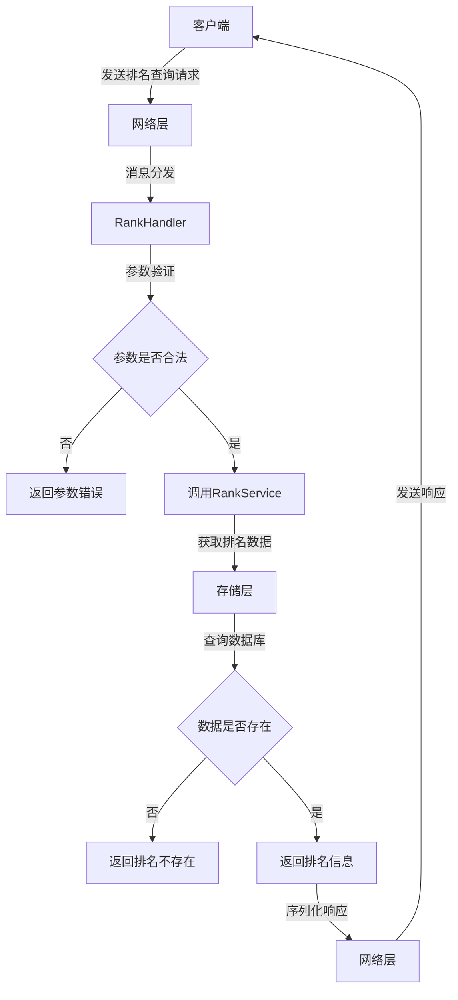
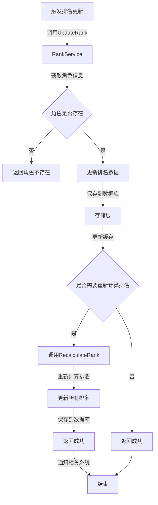
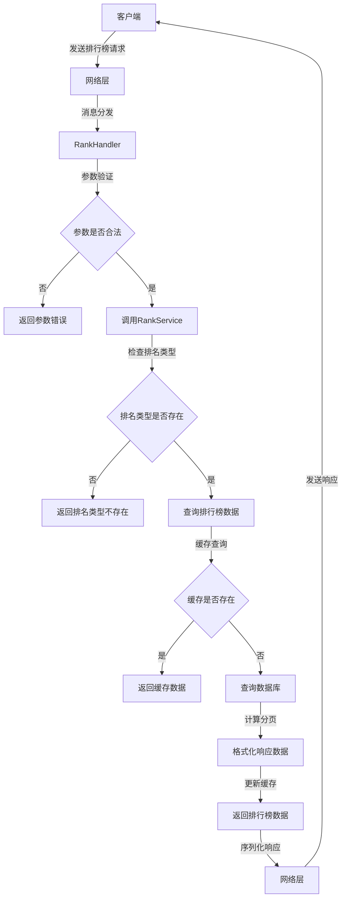

# 排名系统 - API文档

## 1. 接口概述

排名系统提供了一系列API接口，用于查询和管理游戏中的各种排名。这些接口包括个人排名查询、我的排名查询、好友排名查询、队伍排名查询和排行榜列表等功能。

### 1.1 接口分类

| 接口类别 | 功能描述 | 协议 | 版本 |
|----------|----------|------|------|
| 排名查询 | 查询个人、我的、好友、队伍排名 | TCP | v1.0 |
| 排行榜 | 获取排行榜列表 | TCP | v1.0 |
| 排名管理 | 更新排名、重新计算排名 | 内部 | v1.0 |
| 排名奖励 | 检查和发放排名奖励 | 内部 | v1.0 |

### 1.2 基本信息

| 项目 | 描述 |
|------|------|
| 服务地址 | 游戏服务器IP:端口 |
| 通信协议 | TCP |
| 数据格式 | Protobuf |
| 接口版本 | v1.0 |
| 错误处理 | 统一错误码和错误信息 |

## 2. 核心接口

### 2.1 查询个人排名

**消息类型**: `INQUIRE_PERSONAL_RANKING`

**功能描述**: 查询指定玩家的排名信息

**请求参数**:

| 字段名 | 数据类型 | 必须 | 描述 |
|--------|----------|------|------|
| charguid | uint64 | 是 | 角色GUID |
| type | uint32 | 是 | 排名类型 |
| transid | uint32 | 是 | 交易ID |

**响应参数**:

| 字段名 | 数据类型 | 必须 | 描述 |
|--------|----------|------|------|
| rankinfo | RankInfo | 否 | 排名信息 |
| type | uint32 | 是 | 排名类型 |
| error | uint32 | 是 | 错误码（0-成功，非0-失败） |
| message | string | 否 | 错误信息 |

**错误码**:

| 错误码 | 错误信息 | 描述 |
|--------|----------|------|
| 0 | 成功 | 请求成功 |
| 1 | 参数错误 | 参数格式不正确 |
| 2 | 角色不存在 | 指定角色不存在 |
| 3 | 排名不存在 | 该角色在指定排名类型中不存在排名 |
| 4 | 系统错误 | 系统内部错误 |

**请求示例**:

```protobuf
charguid: 123456
Type: 1
Transid: 10001
```

**响应示例**:

```protobuf
rankinfo {
  charguid: 123456
  name: "测试玩家"
  job: 1
  level: 50
  rank: 10
  score: 5000
  exp: 1000000
  equipscore: 10000
  guildid: 1
  guildname: "测试公会"
}
type: 1
error: 0
```

### 2.2 查询我的排名

**消息类型**: `MY_RANKING`

**功能描述**: 查询当前登录玩家的排名信息

**请求参数**:

| 字段名 | 数据类型 | 必须 | 描述 |
|--------|----------|------|------|
| type | uint32 | 是 | 排名类型 |
| transid | uint32 | 是 | 交易ID |

**响应参数**:

| 字段名 | 数据类型 | 必须 | 描述 |
|--------|----------|------|------|
| rankinfo | RankInfo | 否 | 排名信息 |
| type | uint32 | 是 | 排名类型 |
| error | uint32 | 是 | 错误码（0-成功，非0-失败） |
| message | string | 否 | 错误信息 |

**错误码**:

| 错误码 | 错误信息 | 描述 |
|--------|----------|------|
| 0 | 成功 | 请求成功 |
| 1 | 参数错误 | 参数格式不正确 |
| 2 | 未登录 | 玩家未登录 |
| 3 | 排名不存在 | 当前玩家在指定排名类型中不存在排名 |
| 4 | 系统错误 | 系统内部错误 |

**请求示例**:

```protobuf
type: 2
transid: 10002
```

**响应示例**:

```protobuf
rankinfo {
  charguid: 123456
  name: "测试玩家"
  job: 1
  level: 50
  rank: 5
  score: 8000
  exp: 1000000
  equipscore: 15000
  guildid: 1
  guildname: "测试公会"
}
type: 2
error: 0
```

### 2.3 查询好友排名

**消息类型**: `RANK_FRIEND`

**功能描述**: 查询玩家好友列表中的排名情况

**请求参数**:

| 字段名 | 数据类型 | 必须 | 描述 |
|--------|----------|------|------|
| type | uint32 | 是 | 排名类型 |
| transid | uint32 | 是 | 交易ID |

**响应参数**:

| 字段名 | 数据类型 | 必须 | 描述 |
|--------|----------|------|------|
| ranking | repeated RankInfo | 否 | 好友排名列表 |
| type | uint32 | 是 | 排名类型 |
| error | uint32 | 是 | 错误码（0-成功，非0-失败） |
| message | string | 否 | 错误信息 |

**错误码**:

| 错误码 | 错误信息 | 描述 |
|--------|----------|------|
| 0 | 成功 | 请求成功 |
| 1 | 参数错误 | 参数格式不正确 |
| 2 | 未登录 | 玩家未登录 |
| 3 | 好友列表为空 | 玩家好友列表为空 |
| 4 | 系统错误 | 系统内部错误 |

**请求示例**:

```protobuf
type: 1
transid: 10003
```

**响应示例**:

```protobuf
ranking {
  charguid: 123457
  name: "好友1"
  job: 2
  level: 45
  rank: 20
  score: 4000
  exp: 800000
  equipscore: 8000
  guildid: 2
  guildname: "好友公会"
}
ranking {
  charguid: 123458
  name: "好友2"
  job: 3
  level: 40
  rank: 30
  score: 3000
  exp: 600000
  equipscore: 6000
  guildid: 0
  guildname: ""
}
type: 1
error: 0
```

### 2.4 查询我的队伍排名

**消息类型**: `MY_PARTY_RANKING`

**功能描述**: 查询玩家所在队伍的排名信息

**请求参数**:

| 字段名 | 数据类型 | 必须 | 描述 |
|--------|----------|------|------|
| type | uint32 | 是 | 排名类型 |
| transid | uint32 | 是 | 交易ID |

**响应参数**:

| 字段名 | 数据类型 | 必须 | 描述 |
|--------|----------|------|------|
| rankinfo | RankInfo | 否 | 队伍排名信息 |
| type | uint32 | 是 | 排名类型 |
| error | uint32 | 是 | 错误码（0-成功，非0-失败） |
| message | string | 否 | 错误信息 |

**错误码**:

| 错误码 | 错误信息 | 描述 |
|--------|----------|------|
| 0 | 成功 | 请求成功 |
| 1 | 参数错误 | 参数格式不正确 |
| 2 | 未登录 | 玩家未登录 |
| 3 | 不在队伍中 | 玩家当前不在队伍中 |
| 4 | 队伍排名不存在 | 队伍在指定排名类型中不存在排名 |
| 5 | 系统错误 | 系统内部错误 |

**请求示例**:

```protobuf
type: 3
transid: 10004
```

**响应示例**:

```protobuf
rankinfo {
  charguid: 654321
  name: "测试队伍"
  rank: 5
  score: 20000
}
type: 3
error: 0
```

### 2.5 获取排行榜列表

**消息类型**: `RANKING_LIST`

**功能描述**: 分页获取指定类型的排行榜数据

**请求参数**:

| 字段名 | 数据类型 | 必须 | 描述 |
|--------|----------|------|------|
| type | uint32 | 是 | 排名类型 |
| page | uint32 | 是 | 页码（从1开始） |
| page_size | uint32 | 是 | 每页数量 |

**响应参数**:

| 字段名 | 数据类型 | 必须 | 描述 |
|--------|----------|------|------|
| ranking | repeated RankInfo | 否 | 排行榜列表 |
| type | uint32 | 是 | 排名类型 |
| total | uint32 | 是 | 总数量 |
| error | uint32 | 是 | 错误码（0-成功，非0-失败） |
| message | string | 否 | 错误信息 |

**错误码**:

| 错误码 | 错误信息 | 描述 |
|--------|----------|------|
| 0 | 成功 | 请求成功 |
| 1 | 参数错误 | 参数格式不正确 |
| 2 | 排名类型不存在 | 指定的排名类型不存在 |
| 3 | 系统错误 | 系统内部错误 |

**请求示例**:

```protobuf
type: 1
page: 1
page_size: 10
```

**响应示例**:

```protobuf
ranking {
  charguid: 100001
  name: "玩家1"
  job: 1
  level: 60
  rank: 1
  score: 10000
  exp: 2000000
  equipscore: 20000
  guildid: 1
  guildname: "第一公会"
}
ranking {
  charguid: 100002
  name: "玩家2"
  job: 2
  level: 60
  rank: 2
  score: 9500
  exp: 1900000
  equipscore: 19000
  guildid: 2
  guildname: "第二公会"
}
// ... 更多排名数据
type: 1
total: 100
error: 0
```

## 3. 内部接口

### 3.1 更新排名

**接口名称**: `UpdateRank`

**功能描述**: 更新指定玩家的排名数据

**请求参数**:

| 参数名 | 数据类型 | 必须 | 描述 |
|--------|----------|------|------|
| roleId | uint64 | 是 | 角色ID |
| type | uint32 | 是 | 排名类型 |
| score | uint32 | 是 | 新分数 |

**返回值**:

| 数据类型 | 描述 |
|----------|------|
| error | 错误信息 |

**调用示例**:

```go
err := rankService.UpdateRank(ctx, 123456, 1, 5000)
if err != nil {
    // 处理错误
}
```

### 3.2 重新计算排名

**接口名称**: `RecalculateRank`

**功能描述**: 重新计算指定类型的排名

**请求参数**:

| 参数名 | 数据类型 | 必须 | 描述 |
|--------|----------|------|------|
| type | uint32 | 是 | 排名类型 |

**返回值**:

| 数据类型 | 描述 |
|----------|------|
| error | 错误信息 |

**调用示例**:

```go
err := rankService.RecalculateRank(ctx, 1)
if err != nil {
    // 处理错误
}
```

### 3.3 保存排名历史

**接口名称**: `SaveRankHistory`

**功能描述**: 保存指定类型的排名历史

**请求参数**:

| 参数名 | 数据类型 | 必须 | 描述 |
|--------|----------|------|------|
| type | uint32 | 是 | 排名类型 |

**返回值**:

| 数据类型 | 描述 |
|----------|------|
| error | 错误信息 |

**调用示例**:

```go
err := rankService.SaveRankHistory(ctx, 1)
if err != nil {
    // 处理错误
}
```

### 3.4 检查排名奖励

**接口名称**: `CheckRankReward`

**功能描述**: 检查并发放指定类型的排名奖励

**请求参数**:

| 参数名 | 数据类型 | 必须 | 描述 |
|--------|----------|------|------|
| type | uint32 | 是 | 排名类型 |

**返回值**:

| 数据类型 | 描述 |
|----------|------|
| error | 错误信息 |

**调用示例**:

```go
err := rankService.CheckRankReward(ctx, 1)
if err != nil {
    // 处理错误
}
```

## 4. 数据结构

### 4.1 RankInfo

| 字段名 | 数据类型 | 描述 |
|--------|----------|------|
| charguid | uint64 | 角色GUID |
| name | string | 角色名称 |
| job | uint32 | 职业 |
| level | uint32 | 等级 |
| rank | uint32 | 排名 |
| score | uint32 | 分数 |
| exp | uint64 | 经验值 |
| equipscore | uint32 | 装备评分 |
| guildid | uint32 | 公会ID |
| guildname | string | 公会名称 |

### 4.2 排名类型

| 类型值 | 类型名称 | 描述 |
|--------|----------|------|
| 1 | 等级排名 | 按玩家等级排序 |
| 2 | 战力排名 | 按玩家战力排序 |
| 3 | 副本排名 | 按副本通关时间排序 |
| 4 | 财富排名 | 按玩家财富排序 |
| 5 | 成就排名 | 按成就点数排序 |
| 6 | 公会排名 | 按公会等级和活跃度排序 |
| 7 | PK排名 | 按PK胜率和场次排序 |
| 8 | 贡献排名 | 按公会贡献排序 |

## 5. 接口调用流程

### 5.1 排名查询流程



### 5.2 排名更新流程



### 5.3 排行榜获取流程



## 6. 最佳实践

### 6.1 客户端调用建议

1. **批量查询**
   - 避免频繁单独查询每个好友的排名，使用好友排名接口一次性获取
   - 合理设置排行榜的每页数量，避免一次性获取过多数据

2. **缓存策略**
   - 客户端可以缓存排行榜数据，减少重复请求
   - 设置合理的缓存过期时间，根据排名类型的更新频率调整

3. **错误处理**
   - 正确处理各种错误码，尤其是排名不存在的情况
   - 对网络超时等异常情况进行重试机制

4. **性能优化**
   - 只在必要时查询排名信息，避免频繁刷新
   - 使用分页加载排行榜数据，避免一次性加载过多内容

### 6.2 服务端调用建议

1. **实时更新**
   - 对于实时性要求高的排名类型（如等级、战力），及时更新
   - 对于实时性要求较低的排名类型（如财富、贡献），使用定时任务更新

2. **批量操作**
   - 使用批量更新接口处理多个角色的排名更新
   - 避免频繁单独更新每个角色的排名

3. **缓存使用**
   - 充分利用缓存减少数据库查询
   - 设置合理的缓存过期时间，平衡实时性和性能

4. **数据一致性**
   - 使用事务确保排名数据的一致性
   - 定期验证排名数据，确保数据准确性

## 7. 接口变更记录

| 版本 | 变更日期 | 变更内容 | 变更人 |
|------|----------|----------|--------|
| v1.0 | 2024-01-01 | 初始版本，包含基本排名查询和更新接口 | 系统管理员 |
| v1.1 | 2024-02-01 | 增加排行榜分页接口，优化排名计算性能 | 系统管理员 |
| v1.2 | 2024-03-01 | 增加排名历史查询接口，支持排名奖励功能 | 系统管理员 |

## 8. 常见问题

### 8.1 排名查询返回错误码3

**问题描述**: 查询排名时返回错误码3（排名不存在）

**可能原因**:
- 该角色在指定排名类型中确实没有排名
- 排名数据还未更新
- 数据库连接问题

**解决方案**:
- 确认角色是否存在
- 等待排名系统更新数据
- 检查数据库连接状态

### 8.2 排行榜数据不完整

**问题描述**: 获取的排行榜数据不完整或与实际不符

**可能原因**:
- 排名数据还未更新
- 缓存数据过期
- 数据库查询错误

**解决方案**:
- 等待排名系统更新数据
- 清除客户端缓存
- 检查数据库查询语句

### 8.3 排名更新失败

**问题描述**: 调用UpdateRank接口时返回错误

**可能原因**:
- 角色不存在
- 参数格式不正确
- 数据库连接问题

**解决方案**:
- 确认角色ID是否正确
- 检查参数格式是否符合要求
- 检查数据库连接状态

### 8.4 排行榜加载缓慢

**问题描述**: 获取排行榜数据时响应时间过长

**可能原因**:
- 数据量过大
- 缓存未命中
- 数据库查询性能问题

**解决方案**:
- 合理设置分页参数
- 优化数据库索引
- 增加缓存容量和过期时间

## 9. 总结

排名系统API接口提供了全面的排名查询和管理功能，支持多种排名类型和查询方式。通过合理使用这些接口，可以为玩家提供流畅的排名体验，增强游戏的竞争性和社交性。

在使用接口时，应注意以下几点：

1. 遵循最佳实践，合理设置缓存策略和批量操作
2. 正确处理各种错误码和异常情况
3. 关注接口性能，避免频繁调用和大数据量查询
4. 定期更新排名数据，确保数据的准确性和实时性

通过以上措施，可以确保排名系统的稳定运行，为玩家提供良好的游戏体验。