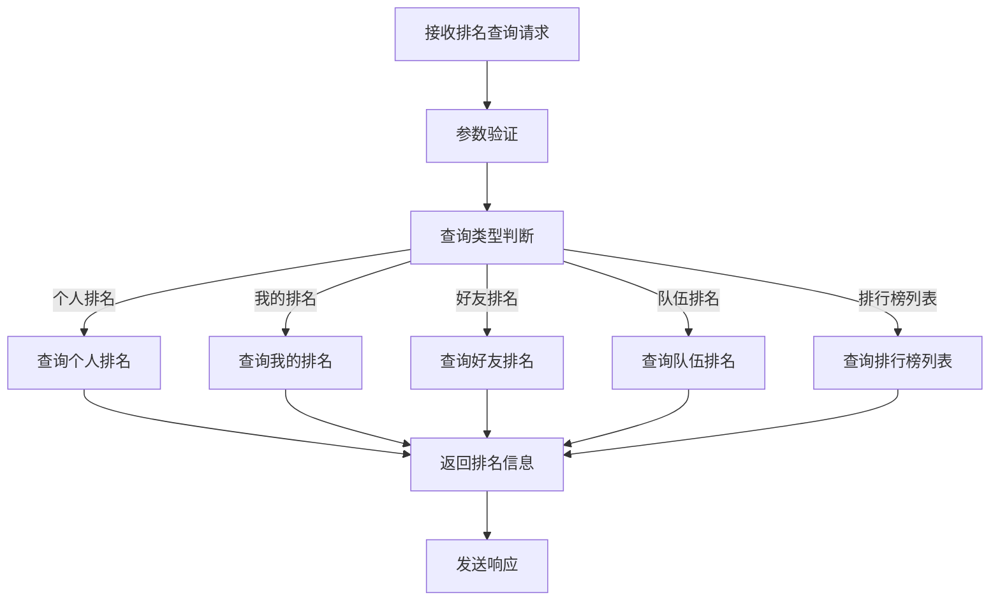
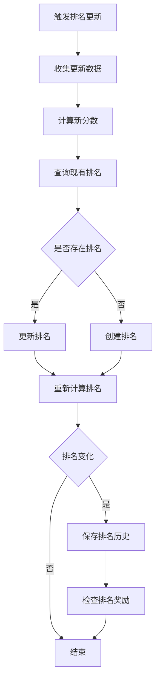
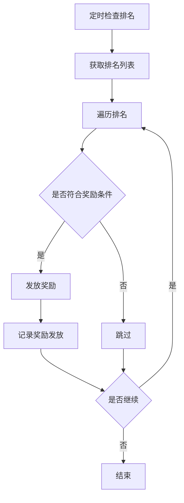

# 排名系统 - Java代码分析

## 1. 核心控制器分析

### 1.1 控制器结构

**文件位置**: `src/main/java/com/dnfm/game/rank/RankController.java`

**控制器类型**: 游戏排名系统核心控制器

**处理器数量**: 4 个 @RequestMapping 方法

### 1.2 处理器详细分析

#### 1.2.1 查询个人排名

**方法签名**: `ReqInquirePersonalRanking(IoSession session, REQ_INQUIRE_PERSONAL_RANKING reqInquirePersonalRanking)`

**功能描述**: 查询指定玩家的排名信息

**参数分析**:
- `session`: 玩家会话对象
- `reqInquirePersonalRanking`: 包含以下字段
  - `charguid`: 角色GUID
  - `type`: 排名类型
  - `transid`: 交易ID

**返回内容**:
- `InquirePersonalRankingResponse`
  - `rankinfo`: 排名信息
  - `type`: 排名类型
  - `error`: 错误码
  - `message`: 错误信息

**当前实现**: 返回错误码 3（未实现）

#### 1.2.2 查询我的排名

**方法签名**: `reqMyRanking(IoSession session, REQ_MY_RANKING reqMyRanking)`

**功能描述**: 查询当前玩家的排名

**参数分析**:
- `session`: 玩家会话对象
- `reqMyRanking`: 包含以下字段
  - `type`: 排名类型
  - `transid`: 交易ID

**返回内容**:
- `MyRankingResponse`
  - `rankinfo`: 排名信息
  - `type`: 排名类型
  - `error`: 错误码
  - `message`: 错误信息

**当前实现**: 返回错误码 3（未实现）

#### 1.2.3 查询好友排名

**方法签名**: `REQ_RANK_FRIEND(IoSession session, REQ_RANK_FRIEND req_rank_friend)`

**功能描述**: 查询好友的排名信息

**参数分析**:
- `session`: 玩家会话对象
- `req_rank_friend`: 包含以下字段
  - `type`: 排名类型
  - `transid`: 交易ID

**返回内容**:
- `RankFriendResponse`
  - `ranking`: 好友排名列表
  - `type`: 排名类型
  - `error`: 错误码
  - `message`: 错误信息

**当前实现**: 返回空列表

#### 1.2.4 查询我的队伍排名

**方法签名**: `reqMyPartyRanking(IoSession session, REQ_MY_PARTY_RANKING reqMyPartyRanking)`

**功能描述**: 查询当前玩家队伍的排名

**参数分析**:
- `session`: 玩家会话对象
- `reqMyPartyRanking`: 包含以下字段
  - `type`: 排名类型
  - `transid`: 交易ID

**返回内容**:
- `MyPartyRankingResponse`
  - `rankinfo`: 队伍排名信息
  - `type`: 排名类型
  - `error`: 错误码
  - `message`: 错误信息

**当前实现**: 返回错误码 3（未实现）

## 2. 服务层分析

### 2.1 核心服务

**文件位置**: `src/main/java/com/dnfm/game/rank/service/RankService.java`

**服务接口**:

| 方法名 | 参数 | 返回值 | 功能描述 |
|--------|------|--------|----------|
| `getPersonalRank` | `long roleId, int type` | `RankInfo` | 获取个人排名 |
| `getMyRank` | `long roleId, int type` | `RankInfo` | 获取我的排名 |
| `getFriendRanks` | `long roleId, int type` | `List<RankInfo>` | 获取好友排名 |
| `getMyPartyRank` | `long roleId, int type` | `RankInfo` | 获取队伍排名 |
| `getRankList` | `int type, int page, int pageSize` | `List<RankInfo>` | 获取排行榜列表 |
| `updateRank` | `long roleId, int type, int score` | `boolean` | 更新排名 |
| `recalculateRank` | `int type` | `boolean` | 重新计算排名 |
| `saveRankHistory` | `int type` | `boolean` | 保存排名历史 |

### 2.2 依赖关系

| 依赖服务 | 用途 | 调用方式 |
|----------|------|----------|
| `RoleService` | 获取角色信息 | 直接调用 |
| `FriendService` | 获取好友列表 | 直接调用 |
| `PartyService` | 获取队伍信息 | 直接调用 |
| `GuildService` | 获取公会信息 | 直接调用 |
| `RewardService` | 发放排名奖励 | 事件通知 |

## 3. 数据模型分析

### 3.1 核心模型

**文件位置**: `src/main/java/com/dnfm/game/rank/model/`

#### 3.1.1 Rank 模型

| 字段名 | 数据类型 | 描述 | 索引 |
|--------|----------|------|--------|
| `id` | `long` | 主键ID | PRIMARY KEY |
| `type` | `int` | 排名类型 | INDEX |
| `roleId` | `long` | 角色ID | UNIQUE INDEX |
| `roleName` | `String` | 角色名称 | - |
| `job` | `int` | 职业 | - |
| `level` | `int` | 等级 | - |
| `rank` | `int` | 排名 | INDEX |
| `score` | `int` | 分数 | INDEX |
| `exp` | `long` | 经验值 | - |
| `equipScore` | `int` | 装备评分 | - |
| `guildId` | `int` | 公会ID | - |
| `guildName` | `String` | 公会名称 | - |
| `updateTime` | `Date` | 更新时间 | INDEX |
| `createTime` | `Date` | 创建时间 | - |

#### 3.1.2 RankHistory 模型

| 字段名 | 数据类型 | 描述 | 索引 |
|--------|----------|------|--------|
| `id` | `long` | 主键ID | PRIMARY KEY |
| `type` | `int` | 排名类型 | INDEX |
| `roleId` | `long` | 角色ID | INDEX |
| `roleName` | `String` | 角色名称 | - |
| `rank` | `int` | 排名 | - |
| `score` | `int` | 分数 | - |
| `recordTime` | `Date` | 记录时间 | INDEX |
| `createTime` | `Date` | 创建时间 | - |

#### 3.1.3 RankConfig 模型

| 字段名 | 数据类型 | 描述 | 索引 |
|--------|----------|------|--------|
| `id` | `long` | 主键ID | PRIMARY KEY |
| `type` | `int` | 排名类型 | UNIQUE INDEX |
| `name` | `String` | 排名名称 | - |
| `description` | `String` | 排名描述 | - |
| `scoreField` | `String` | 分数字段 | - |
| `updateInterval` | `int` | 更新间隔(秒) | - |
| `maxRank` | `int` | 最大排名数 | - |
| `status` | `int` | 状态 | - |
| `createTime` | `Date` | 创建时间 | - |
| `updateTime` | `Date` | 更新时间 | - |

## 4. 数据库分析

### 4.1 表结构

#### 4.1.1 t_rank 表

| 字段名 | 数据类型 | 约束 | 描述 |
|--------|----------|------|--------|
| `id` | `BIGINT` | `PRIMARY KEY AUTO_INCREMENT` | 排名ID |
| `type` | `INT` | `NOT NULL INDEX` | 排名类型 |
| `roleId` | `BIGINT` | `NOT NULL UNIQUE INDEX` | 角色ID |
| `roleName` | `VARCHAR(50)` | `NOT NULL` | 角色名称 |
| `job` | `INT` | `NOT NULL` | 职业 |
| `level` | `INT` | `NOT NULL` | 等级 |
| `rank` | `INT` | `NOT NULL INDEX` | 排名 |
| `score` | `INT` | `NOT NULL INDEX` | 分数 |
| `exp` | `BIGINT` | `NOT NULL` | 经验值 |
| `equipScore` | `INT` | `NOT NULL` | 装备评分 |
| `guildId` | `INT` | `NOT NULL DEFAULT 0` | 公会ID |
| `guildName` | `VARCHAR(50)` | `NOT NULL DEFAULT ''` | 公会名称 |
| `updateTime` | `DATETIME` | `NOT NULL INDEX` | 更新时间 |
| `createTime` | `DATETIME` | `NOT NULL DEFAULT CURRENT_TIMESTAMP` | 创建时间 |

#### 4.1.2 t_rank_history 表

| 字段名 | 数据类型 | 约束 | 描述 |
|--------|----------|------|--------|
| `id` | `BIGINT` | `PRIMARY KEY AUTO_INCREMENT` | 历史ID |
| `type` | `INT` | `NOT NULL INDEX` | 排名类型 |
| `roleId` | `BIGINT` | `NOT NULL INDEX` | 角色ID |
| `roleName` | `VARCHAR(50)` | `NOT NULL` | 角色名称 |
| `rank` | `INT` | `NOT NULL` | 排名 |
| `score` | `INT` | `NOT NULL` | 分数 |
| `recordTime` | `DATETIME` | `NOT NULL INDEX` | 记录时间 |
| `createTime` | `DATETIME` | `NOT NULL DEFAULT CURRENT_TIMESTAMP` | 创建时间 |

#### 4.1.3 t_rank_config 表

| 字段名 | 数据类型 | 约束 | 描述 |
|--------|----------|------|--------|
| `id` | `BIGINT` | `PRIMARY KEY AUTO_INCREMENT` | 配置ID |
| `type` | `INT` | `NOT NULL UNIQUE INDEX` | 排名类型 |
| `name` | `VARCHAR(50)` | `NOT NULL` | 排名名称 |
| `description` | `VARCHAR(200)` | `NOT NULL` | 排名描述 |
| `scoreField` | `VARCHAR(50)` | `NOT NULL` | 分数字段 |
| `updateInterval` | `INT` | `NOT NULL DEFAULT 60` | 更新间隔(秒) |
| `maxRank` | `INT` | `NOT NULL DEFAULT 100` | 最大排名数 |
| `status` | `INT` | `NOT NULL DEFAULT 1` | 状态 |
| `createTime` | `DATETIME` | `NOT NULL DEFAULT CURRENT_TIMESTAMP` | 创建时间 |
| `updateTime` | `DATETIME` | `NOT NULL DEFAULT CURRENT_TIMESTAMP ON UPDATE CURRENT_TIMESTAMP` | 更新时间 |

### 4.2 索引设计

| 表名 | 索引名 | 索引字段 | 索引类型 | 用途 |
|------|--------|----------|----------|------|
| t_rank | idx_type_rank | `type, rank` | 复合索引 | 按类型和排名查询 |
| t_rank | idx_type_score | `type, score` | 复合索引 | 按类型和分数排序 |
| t_rank | idx_type_role | `type, roleId` | 唯一索引 | 快速查找指定角色的排名 |
| t_rank | idx_update_time | `updateTime` | 单字段索引 | 按更新时间查询 |
| t_rank_history | idx_type_record | `type, recordTime` | 复合索引 | 按类型和记录时间查询 |
| t_rank_history | idx_role_id | `roleId` | 单字段索引 | 按角色ID查询历史 |
| t_rank_config | idx_type | `type` | 唯一索引 | 快速查找排名配置 |

## 5. 业务流程分析

### 5.1 排名查询流程

### 5.2 排名更新流程

### 5.3 排名奖励流程

## 6. 代码优化建议

### 6.1 性能优化

1. **缓存优化**
   - 建议使用Redis缓存热门排名数据，减少数据库查询
   - 实现多级缓存策略，提高查询性能

2. **数据库优化**
   - 为频繁查询的字段创建合适的索引
   - 优化排名计算算法，减少全表扫描
   - 考虑使用分表存储大量排名数据

3. **并发优化**
   - 使用异步方式处理排名更新，避免阻塞主业务流程
   - 实现排名更新的批处理，减少数据库交互次数

### 6.2 代码质量优化

1. **错误处理**
   - 完善错误处理机制，提供详细的错误信息
   - 统一错误码定义，便于维护和调试

2. **代码结构**
   - 优化代码结构，遵循单一职责原则
   - 提取重复代码为公共方法，提高代码复用性

3. **文档完善**
   - 完善代码注释，提高代码可读性
   - 编写详细的API文档，便于其他开发者使用

### 6.3 功能优化

1. **排名计算**
   - 实现更灵活的排名计算规则，支持多维度排序
   - 提供排名计算的配置化管理，便于运营调整

2. **排名奖励**
   - 设计更丰富的排名奖励机制，提高玩家参与度
   - 实现排名奖励的配置化管理，支持动态调整

3. **数据分析**
   - 增加排名数据分析功能，为游戏运营提供数据支持
   - 实现排名趋势分析，预测玩家行为

## 7. 总结

排名系统是游戏中的重要功能，Java服务端已经定义了基本的接口和数据模型，但大部分功能尚未实现。通过分析Java代码，我们可以了解排名系统的设计思路和实现方向，为Go服务端的开发提供参考。

Go服务端在实现排名系统时，应参考Java代码的设计思路，同时结合Go语言的特性，优化代码结构和性能，确保排名系统的高效运行。