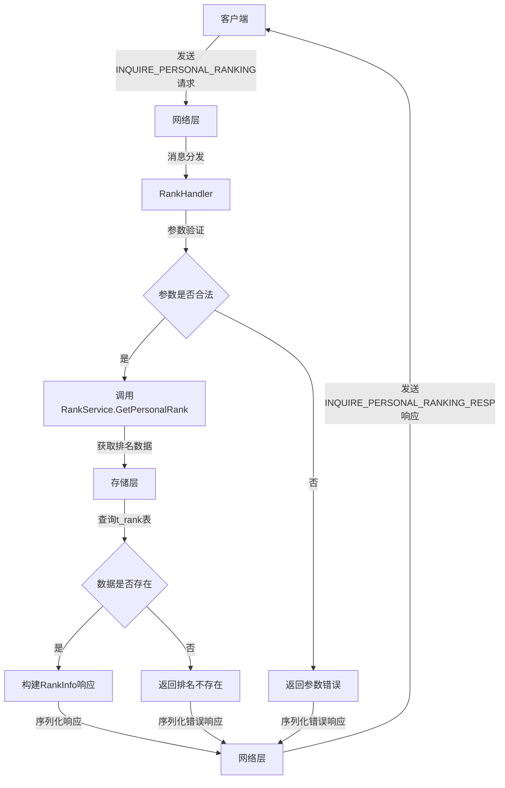
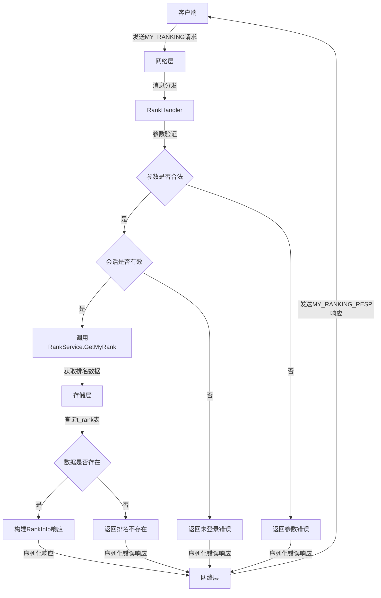
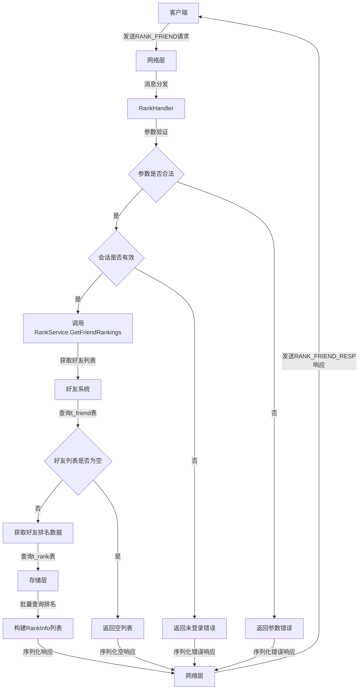
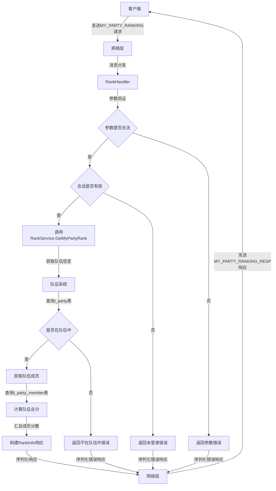
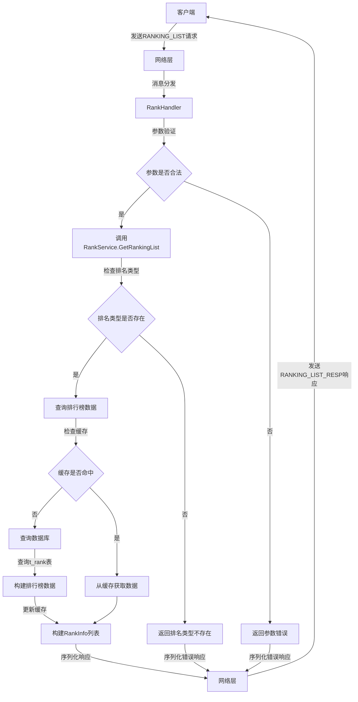
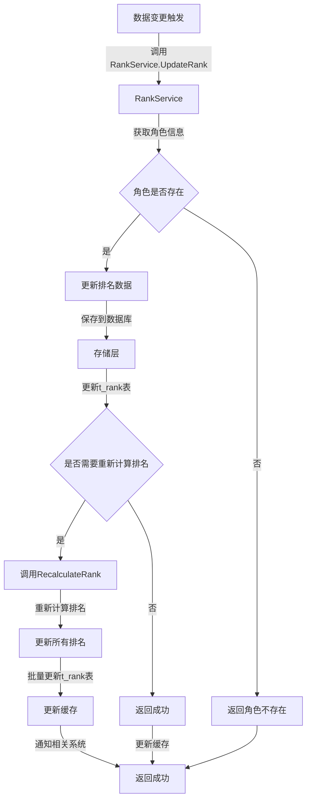
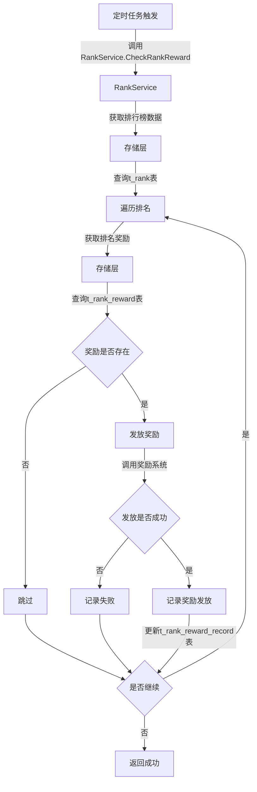
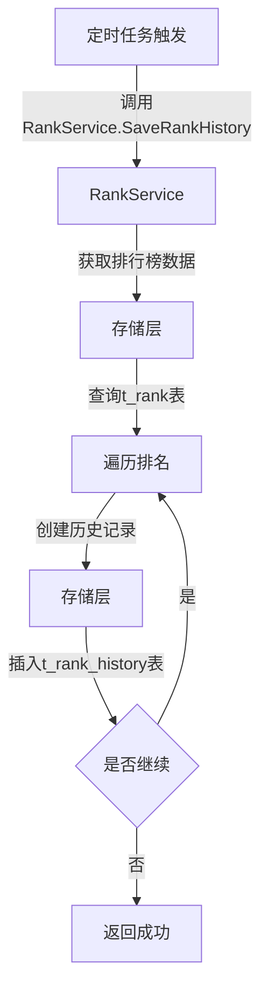
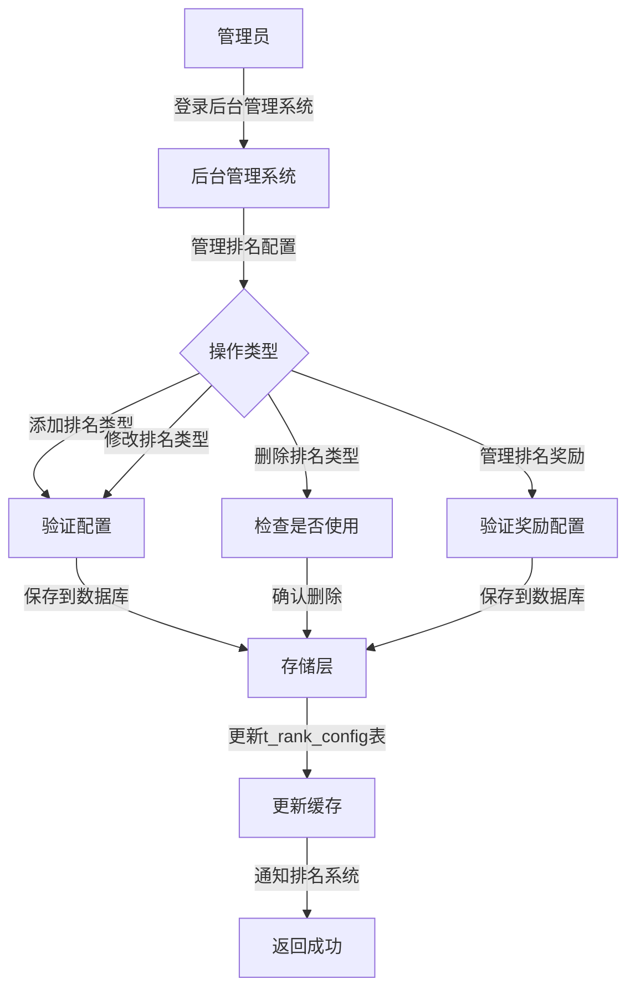

# 排名系统 - 业务流程文档

## 1. 业务流程概述

排名系统是游戏中的重要功能，通过展示玩家在不同维度的排名，激发玩家的竞争意识，提高游戏的可玩性和社交性。本文档详细描述了排名系统的核心业务流程，包括排名查询、排名更新、排名计算、排名奖励等关键环节。

### 1.1 流程分类

| 流程类型 | 流程名称 | 描述 | 触发方式 | 涉及系统 |
|----------|----------|------|----------|----------|
| 查询流程 | 个人排名查询 | 查询指定玩家的排名信息 | 客户端请求 | 排名系统 |
| 查询流程 | 我的排名查询 | 查询当前登录玩家的排名信息 | 客户端请求 | 排名系统 |
| 查询流程 | 好友排名查询 | 查询玩家好友列表中的排名情况 | 客户端请求 | 排名系统、好友系统 |
| 查询流程 | 队伍排名查询 | 查询玩家所在队伍的排名信息 | 客户端请求 | 排名系统、队伍系统 |
| 查询流程 | 排行榜列表 | 分页获取不同类型的排行榜数据 | 客户端请求 | 排名系统 |
| 更新流程 | 排名更新 | 根据玩家数据变化更新排名 | 数据变更触发 | 排名系统、角色系统 |
| 更新流程 | 排名重新计算 | 重新计算指定类型的排名 | 定时任务触发 | 排名系统 |
| 奖励流程 | 排名奖励发放 | 根据排名发放相应的奖励 | 定时任务触发 | 排名系统、奖励系统 |
| 历史流程 | 排名历史记录 | 记录和查询排名历史数据 | 定时任务触发 | 排名系统 |

## 2. 核心业务流程

### 2.1 个人排名查询流程

**流程名称**: 个人排名查询

**流程描述**: 客户端发送个人排名查询请求，服务器根据角色ID和排名类型查询排名信息并返回。

**流程图**:

**流程步骤**:

1. **接收请求** (网络层)
   - 接收客户端发送的 `INQUIRE_PERSONAL_RANKING` 请求
   - 解析 Protobuf 消息
   - 分发到 `RankHandler`

2. **参数验证** (RankHandler)
   - 验证 `charguid` 是否有效
   - 验证 `type` 是否为有效的排名类型
   - 验证 `transid` 是否合法

3. **查询排名** (RankService)
   - 调用 `GetPersonalRank` 方法
   - 检查缓存中是否存在排名数据
   - 缓存未命中则查询数据库

4. **数据处理** (存储层)
   - 在 `t_rank` 表中查询 `roleId = charguid AND type = type` 的记录
   - 如果记录不存在，返回错误
   - 如果记录存在，返回排名信息

5. **构建响应** (RankHandler)
   - 构建 `RankInfo` 对象
   - 填充排名相关字段
   - 构建 `INQUIRE_PERSONAL_RANKING_RESP` 响应

6. **发送响应** (网络层)
   - 序列化响应消息
   - 发送到客户端

**关键节点**:
- **参数验证**：确保请求参数合法，防止非法请求
- **缓存查询**：提高查询性能，减少数据库压力
- **数据查询**：使用索引 `idx_type_role` 快速定位排名数据

### 2.2 我的排名查询流程

**流程名称**: 我的排名查询

**流程描述**: 客户端发送我的排名查询请求，服务器根据当前登录玩家的角色ID和排名类型查询排名信息并返回。

**流程图**:

**流程步骤**:

1. **接收请求** (网络层)
   - 接收客户端发送的 `MY_RANKING` 请求
   - 解析 Protobuf 消息
   - 分发到 `RankHandler`

2. **参数验证** (RankHandler)
   - 验证 `type` 是否为有效的排名类型
   - 验证 `transid` 是否合法

3. **会话验证** (RankHandler)
   - 检查会话是否有效
   - 获取会话中的角色ID

4. **查询排名** (RankService)
   - 调用 `GetMyRank` 方法
   - 检查缓存中是否存在排名数据
   - 缓存未命中则查询数据库

5. **数据处理** (存储层)
   - 在 `t_rank` 表中查询 `roleId = 会话角色ID AND type = type` 的记录
   - 如果记录不存在，返回错误
   - 如果记录存在，返回排名信息

6. **构建响应** (RankHandler)
   - 构建 `RankInfo` 对象
   - 填充排名相关字段
   - 构建 `MY_RANKING_RESP` 响应

7. **发送响应** (网络层)
   - 序列化响应消息
   - 发送到客户端

**关键节点**:
- **会话验证**：确保玩家已登录，防止未授权访问
- **缓存查询**：提高查询性能，减少数据库压力
- **数据查询**：使用索引 `idx_type_role` 快速定位排名数据

### 2.3 好友排名查询流程

**流程名称**: 好友排名查询

**流程描述**: 客户端发送好友排名查询请求，服务器查询玩家好友列表中的排名情况并返回。

**流程图**:

**流程步骤**:

1. **接收请求** (网络层)
   - 接收客户端发送的 `RANK_FRIEND` 请求
   - 解析 Protobuf 消息
   - 分发到 `RankHandler`

2. **参数验证** (RankHandler)
   - 验证 `type` 是否为有效的排名类型
   - 验证 `transid` 是否合法

3. **会话验证** (RankHandler)
   - 检查会话是否有效
   - 获取会话中的角色ID

4. **获取好友列表** (RankService)
   - 调用 `GetFriendRankings` 方法
   - 查询玩家的好友列表

5. **好友列表检查** (好友系统)
   - 查询 `t_friend` 表获取好友列表
   - 如果好友列表为空，返回空列表

6. **获取好友排名** (RankService)
   - 批量查询好友的排名数据
   - 检查缓存中是否存在排名数据
   - 缓存未命中则查询数据库

7. **数据处理** (存储层)
   - 在 `t_rank` 表中批量查询 `roleId IN (好友ID列表) AND type = type` 的记录
   - 构建排名信息列表

8. **构建响应** (RankHandler)
   - 构建 `RankInfo` 对象列表
   - 填充排名相关字段
   - 构建 `RANK_FRIEND_RESP` 响应

9. **发送响应** (网络层)
   - 序列化响应消息
   - 发送到客户端

**关键节点**:
- **好友列表查询**：获取玩家的好友ID列表
- **批量查询**：减少数据库查询次数，提高性能
- **数据构建**：构建完整的好友排名列表

### 2.4 队伍排名查询流程

**流程名称**: 队伍排名查询

**流程描述**: 客户端发送队伍排名查询请求，服务器查询玩家所在队伍的排名信息并返回。

**流程图**:

**流程步骤**:

1. **接收请求** (网络层)
   - 接收客户端发送的 `MY_PARTY_RANKING` 请求
   - 解析 Protobuf 消息
   - 分发到 `RankHandler`

2. **参数验证** (RankHandler)
   - 验证 `type` 是否为有效的排名类型
   - 验证 `transid` 是否合法

3. **会话验证** (RankHandler)
   - 检查会话是否有效
   - 获取会话中的角色ID

4. **获取队伍信息** (RankService)
   - 调用 `GetMyPartyRank` 方法
   - 查询玩家所在的队伍信息

5. **队伍检查** (队伍系统)
   - 查询 `t_party` 表获取队伍信息
   - 如果玩家不在队伍中，返回错误

6. **获取队伍成员** (队伍系统)
   - 查询 `t_party_member` 表获取队伍成员

7. **计算队伍总分** (RankService)
   - 批量查询队伍成员的排名数据
   - 计算队伍成员的总分

8. **构建响应** (RankHandler)
   - 构建 `RankInfo` 对象
   - 填充队伍排名相关字段
   - 构建 `MY_PARTY_RANKING_RESP` 响应

9. **发送响应** (网络层)
   - 序列化响应消息
   - 发送到客户端

**关键节点**:
- **队伍信息查询**：获取玩家所在队伍的信息
- **成员分数计算**：汇总队伍成员的分数，计算队伍总分
- **响应构建**：构建完整的队伍排名信息

### 2.5 排行榜列表流程

**流程名称**: 排行榜列表

**流程描述**: 客户端发送排行榜列表请求，服务器根据排名类型、页码和每页数量查询排行榜数据并返回。

**流程图**:

**流程步骤**:

1. **接收请求** (网络层)
   - 接收客户端发送的 `RANKING_LIST` 请求
   - 解析 Protobuf 消息
   - 分发到 `RankHandler`

2. **参数验证** (RankHandler)
   - 验证 `type` 是否为有效的排名类型
   - 验证 `page` 和 `page_size` 是否合法

3. **查询排行榜** (RankService)
   - 调用 `GetRankingList` 方法
   - 检查排名类型是否存在
   - 检查缓存中是否存在排行榜数据

4. **缓存处理** (RankService)
   - 如果缓存命中，直接从缓存获取数据
   - 如果缓存未命中，查询数据库

5. **数据查询** (存储层)
   - 在 `t_rank` 表中查询 `type = type` 的记录
   - 按 `rank` 字段排序
   - 分页查询数据

6. **缓存更新** (RankService)
   - 将查询结果更新到缓存
   - 设置合理的过期时间

7. **构建响应** (RankHandler)
   - 构建 `RankInfo` 对象列表
   - 填充排名相关字段
   - 构建 `RANKING_LIST_RESP` 响应

8. **发送响应** (网络层)
   - 序列化响应消息
   - 发送到客户端

**关键节点**:
- **缓存检查**：提高查询性能，减少数据库压力
- **分页查询**：避免一次性加载过多数据
- **索引使用**：使用 `idx_type_rank` 索引加速排序

### 2.6 排名更新流程

**流程名称**: 排名更新

**流程描述**: 当玩家数据发生变化时，触发排名更新，服务器根据新的数据更新排名并重新计算。

**流程图**:

**流程步骤**:

1. **触发更新** (外部系统)
   - 当玩家数据发生变化时（如等级提升、装备更换）
   - 调用 `RankService.UpdateRank` 方法

2. **获取角色信息** (RankService)
   - 查询角色的最新信息
   - 验证角色是否存在

3. **更新排名数据** (RankService)
   - 计算新的排名分数
   - 更新排名记录

4. **保存到数据库** (存储层)
   - 更新 `t_rank` 表中的排名数据
   - 如果记录不存在，创建新记录

5. **检查是否需要重新计算排名** (RankService)
   - 根据排名类型和分数变化判断
   - 如果需要，调用 `RecalculateRank` 方法

6. **重新计算排名** (RankService)
   - 按分数排序重新计算所有排名
   - 更新排名序号

7. **批量更新排名** (存储层)
   - 批量更新 `t_rank` 表中的排名数据
   - 确保排名的连续性

8. **更新缓存** (RankService)
   - 更新个人排名缓存
   - 更新排行榜缓存

9. **通知相关系统** (RankService)
   - 通知奖励系统检查排名奖励
   - 通知其他相关系统

**关键节点**:
- **数据变更检测**：及时检测玩家数据变化，触发排名更新
- **排名重新计算**：确保排名的准确性和连续性
- **批量更新**：减少数据库交互次数，提高性能

### 2.7 排名奖励发放流程

**流程名称**: 排名奖励发放

**流程描述**: 定时任务触发排名奖励发放，服务器根据玩家的排名发放相应的奖励。

**流程图**:

**流程步骤**:

1. **触发任务** (定时任务)
   - 定时任务触发排名奖励发放
   - 调用 `RankService.CheckRankReward` 方法

2. **获取排行榜数据** (RankService)
   - 查询指定类型的排行榜数据
   - 按排名顺序获取玩家列表

3. **遍历排名** (RankService)
   - 遍历排行榜中的每个玩家
   - 检查玩家排名是否符合奖励条件

4. **获取排名奖励** (存储层)
   - 查询 `t_rank_reward` 表获取奖励配置
   - 根据玩家排名查找对应的奖励

5. **发放奖励** (奖励系统)
   - 调用奖励系统发放奖励
   - 检查发放是否成功

6. **记录奖励发放** (存储层)
   - 更新 `t_rank_reward_record` 表记录奖励发放情况
   - 记录发放时间和奖励内容

7. **继续处理** (RankService)
   - 处理下一个玩家的奖励
   - 直到所有符合条件的玩家都处理完毕

**关键节点**:
- **定时触发**：确保奖励按时发放
- **奖励查询**：根据排名准确查找对应的奖励
- **发放记录**：跟踪奖励发放情况，便于后续查询

## 3. 辅助业务流程

### 3.1 排名历史记录流程

**流程名称**: 排名历史记录

**流程描述**: 定时任务触发排名历史记录，服务器将当前排名数据保存到历史表中。

**流程图**:

**流程步骤**:

1. **触发任务** (定时任务)
   - 定时任务触发排名历史记录
   - 调用 `RankService.SaveRankHistory` 方法

2. **获取排行榜数据** (RankService)
   - 查询指定类型的排行榜数据
   - 按排名顺序获取玩家列表

3. **遍历排名** (RankService)
   - 遍历排行榜中的每个玩家
   - 准备历史记录数据

4. **创建历史记录** (存储层)
   - 插入 `t_rank_history` 表
   - 记录当前排名、分数和时间

5. **继续处理** (RankService)
   - 处理下一个玩家的历史记录
   - 直到所有玩家都处理完毕

**关键节点**:
- **定时触发**：确保历史记录按时保存
- **数据准备**：准备完整的历史记录数据
- **批量插入**：减少数据库交互次数，提高性能

### 3.2 排名配置管理流程

**流程名称**: 排名配置管理

**流程描述**: 管理员通过后台管理系统管理排名配置，包括添加、修改、删除排名类型和奖励配置。

**流程图**:

**流程步骤**:

1. **登录后台** (管理员)
   - 管理员登录后台管理系统
   - 进入排名配置管理页面

2. **选择操作类型** (后台管理系统)
   - 添加排名类型
   - 修改排名类型
   - 删除排名类型
   - 管理排名奖励

3. **验证配置** (后台管理系统)
   - 验证排名类型配置是否合法
   - 验证奖励配置是否合法

4. **保存到数据库** (存储层)
   - 更新 `t_rank_config` 表
   - 更新 `t_rank_reward` 表

5. **更新缓存** (后台管理系统)
   - 更新排名配置缓存
   - 更新排名奖励缓存

6. **通知排名系统** (后台管理系统)
   - 通知排名系统配置变更
   - 确保系统使用最新配置

**关键节点**:
- **配置验证**：确保配置数据合法
- **缓存更新**：确保系统使用最新配置
- **通知系统**：确保配置变更及时生效

## 4. 异常处理

### 4.1 常见异常

| 异常类型 | 异常描述 | 处理策略 | 影响范围 | 严重程度 |
|----------|----------|----------|----------|----------|
| 参数错误 | 请求参数格式不正确或值不合法 | 返回错误码 1，提示参数错误 | 单个请求 | 低 |
| 未登录 | 玩家未登录或会话过期 | 返回错误码 2，提示未登录 | 单个请求 | 低 |
| 角色不存在 | 指定的角色不存在 | 返回错误码 2，提示角色不存在 | 单个请求 | 低 |
| 排名不存在 | 该角色在指定排名类型中不存在排名 | 返回错误码 3，提示排名不存在 | 单个请求 | 低 |
| 排名类型不存在 | 指定的排名类型不存在 | 返回错误码 2，提示排名类型不存在 | 单个请求 | 低 |
| 不在队伍中 | 玩家当前不在队伍中 | 返回错误码 3，提示不在队伍中 | 单个请求 | 低 |
| 数据库错误 | 数据库连接或查询错误 | 返回错误码 4，提示系统错误 | 所有请求 | 高 |
| 缓存错误 | 缓存连接或操作错误 | 降级到数据库查询 | 所有请求 | 中 |
| 系统错误 | 系统内部错误 | 返回错误码 4，提示系统错误 | 所有请求 | 高 |

### 4.2 异常处理策略

1. **参数错误处理**
   - 严格验证所有请求参数
   - 返回明确的错误码和错误信息
   - 记录详细的错误日志

2. **未登录处理**
   - 检查会话的有效性
   - 要求玩家重新登录
   - 返回明确的错误信息

3. **角色不存在处理**
   - 验证角色ID的有效性
   - 返回明确的错误信息
   - 记录异常情况

4. **排名不存在处理**
   - 检查排名记录是否存在
   - 如果不存在，返回错误信息
   - 可以选择自动创建初始排名

5. **数据库错误处理**
   - 使用连接池管理数据库连接
   - 实现数据库操作的重试机制
   - 监控数据库状态，及时发现问题

6. **缓存错误处理**
   - 实现缓存的降级策略，当缓存不可用时使用数据库
   - 监控缓存状态，及时发现问题
   - 定期清理过期缓存

7. **系统错误处理**
   - 实现全局异常捕获
   - 返回统一的错误码和错误信息
   - 记录详细的错误日志，便于排查

## 5. 性能优化

### 5.1 关键性能点

| 性能点 | 优化策略 | 预期效果 | 实施难度 |
|--------|----------|----------|----------|
| 排行榜查询 | 使用复合索引 `idx_type_rank`，分页查询，缓存 | 响应时间 < 50ms | 低 |
| 个人排名查询 | 使用唯一索引 `idx_type_role`，缓存 | 响应时间 < 10ms | 低 |
| 排名更新 | 批量操作，异步处理，缓存更新 | 处理时间 < 1s | 中 |
| 排名重新计算 | 批量更新，索引优化，异步处理 | 处理时间 < 5s | 中 |
| 排名奖励发放 | 批量操作，异步处理，缓存 | 处理时间 < 10s | 中 |
| 好友排名查询 | 批量查询，缓存 | 响应时间 < 100ms | 低 |

### 5.2 优化措施

1. **缓存优化**
   - 使用 Redis 缓存热门排名数据
   - 实现多级缓存策略
   - 合理设置缓存过期时间

2. **数据库优化**
   - 为核心查询创建复合索引
   - 使用批量操作减少数据库交互次数
   - 实现数据库连接池管理

3. **代码优化**
   - 减少网络层和业务层的代码冗余
   - 优化序列化和反序列化性能
   - 使用并发处理提高系统吞吐量

4. **架构优化**
   - 实现异步排名更新
   - 使用消息队列处理排名重新计算
   - 考虑使用分布式架构处理大规模排名数据

## 6. 总结

排名系统的业务流程设计充分考虑了性能、可靠性和可扩展性，通过合理的流程设计和优化措施，确保系统能够高效运行并支持大量玩家数据。

**核心优势**:

1. **流程清晰**：详细的业务流程设计，确保系统运行的可靠性
2. **性能优化**：通过缓存、索引和批量操作等优化措施，提高系统性能
3. **异常处理**：完善的异常处理机制，确保系统的稳定性
4. **可扩展性**：模块化设计，便于添加新的排名类型和功能
5. **数据一致性**：通过事务处理和锁机制，确保排名数据的一致性

**未来改进方向**:

1. **实时排名**：进一步优化实时排名的性能，支持更多玩家同时在线
2. **跨服排名**：实现不同服务器之间的排名比较
3. **智能排名**：使用机器学习算法优化排名计算，提供更合理的排名结果
4. **个性化排名**：根据玩家的游戏行为提供个性化的排名推荐

通过本业务流程文档，排名系统将能够为游戏提供稳定、高效的排名服务，增强游戏的竞争性和社交性，为玩家提供良好的游戏体验。