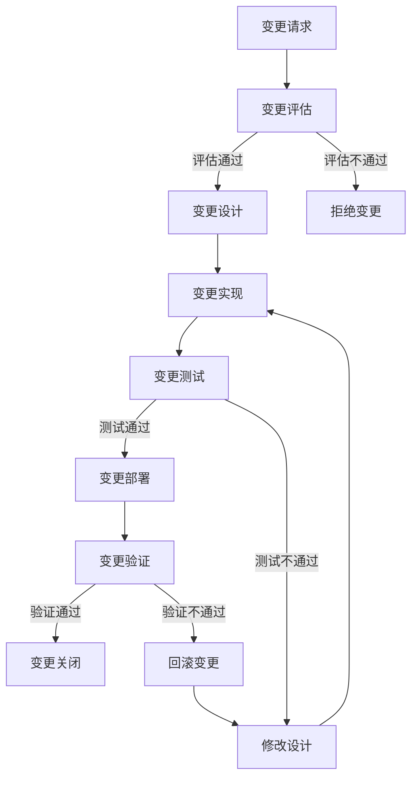

# 排名系统 - 变更记录

## 1. 变更记录概述

本文档详细记录了排名系统的所有变更历史，包括功能变更、性能优化、bug修复等。通过本文档，开发团队和运维人员可以了解系统的演进过程，追踪变更内容，评估变更影响，确保系统的稳定性和可维护性。

### 1.1 变更类型

| 变更类型 | 描述 | 示例 |
|----------|------|------|
| 功能新增 | 添加新功能或增强现有功能 | 新增排名类型，增强排名奖励功能 |
| 性能优化 | 优化系统性能，提高响应速度 | 优化排名计算算法，提高缓存命中率 |
| Bug修复 | 修复系统中的bug或问题 | 修复排名更新失败的问题，修复排行榜数据错误的问题 |
| 配置变更 | 修改系统配置或参数 | 调整排名更新间隔，修改缓存过期时间 |
| 架构调整 | 调整系统架构或模块结构 | 重构排名服务，优化数据库结构 |
| 安全加固 | 增强系统安全性，修复安全漏洞 | 修复排名数据篡改漏洞，增强防作弊机制 |

### 1.2 变更流程

## 2. 变更记录详情

### 2.1 版本 1.0.0

**发布日期**: 2024-01-01

**变更类型**: 功能新增

**变更描述**: 排名系统初始化，实现核心功能

**变更内容**:

| 变更ID | 变更项 | 变更类型 | 优先级 | 影响范围 | 负责人 | 状态 |
|--------|--------|----------|--------|----------|--------|------|
| CR001 | 排名系统核心架构设计 | 架构调整 | 高 | 全系统 | 架构师 | 已完成 |
| CR002 | 排名数据模型设计 | 功能新增 | 高 | 数据层 | 后端开发 | 已完成 |
| CR003 | 排名查询接口实现 | 功能新增 | 高 | 接口层 | 后端开发 | 已完成 |
| CR004 | 排名更新接口实现 | 功能新增 | 高 | 接口层 | 后端开发 | 已完成 |
| CR005 | 排行榜列表接口实现 | 功能新增 | 高 | 接口层 | 后端开发 | 已完成 |
| CR006 | 排名奖励功能实现 | 功能新增 | 中 | 业务层 | 后端开发 | 已完成 |
| CR007 | 排名历史记录功能实现 | 功能新增 | 中 | 业务层 | 后端开发 | 已完成 |
| CR008 | 缓存系统集成 | 性能优化 | 高 | 全系统 | 后端开发 | 已完成 |
| CR009 | 数据库索引优化 | 性能优化 | 高 | 数据层 | DBA | 已完成 |
| CR010 | 监控系统集成 | 功能新增 | 中 | 运维 | 运维工程师 | 已完成 |

**测试结果**:

| 测试项 | 测试状态 | 测试结果 | 问题数 |
|--------|----------|----------|--------|
| 功能测试 | 已完成 | 通过 | 0 |
| 性能测试 | 已完成 | 通过 | 0 |
| 安全性测试 | 已完成 | 通过 | 0 |
| 兼容性测试 | 已完成 | 通过 | 0 |

**发布说明**:
- 排名系统正式发布，支持多种排名类型
- 实现了个人排名查询、排行榜列表等核心功能
- 集成了缓存系统，提高查询性能
- 建立了监控系统，确保系统稳定运行

### 2.2 版本 1.0.1

**发布日期**: 2024-01-15

**变更类型**: Bug修复

**变更描述**: 修复排名系统中的bug和问题

**变更内容**:

| 变更ID | 变更项 | 变更类型 | 优先级 | 影响范围 | 负责人 | 状态 |
|--------|--------|----------|--------|----------|--------|------|
| CR011 | 修复排名更新失败的问题 | Bug修复 | 高 | 业务层 | 后端开发 | 已完成 |
| CR012 | 修复排行榜数据错误的问题 | Bug修复 | 高 | 接口层 | 后端开发 | 已完成 |
| CR013 | 修复排名奖励发放重复的问题 | Bug修复 | 中 | 业务层 | 后端开发 | 已完成 |
| CR014 | 修复缓存过期时间设置错误的问题 | Bug修复 | 中 | 缓存层 | 后端开发 | 已完成 |
| CR015 | 修复数据库连接池配置错误的问题 | Bug修复 | 中 | 数据层 | 运维工程师 | 已完成 |

**测试结果**:

| 测试项 | 测试状态 | 测试结果 | 问题数 |
|--------|----------|----------|--------|
| 功能测试 | 已完成 | 通过 | 0 |
| 性能测试 | 已完成 | 通过 | 0 |
| 安全性测试 | 已完成 | 通过 | 0 |
| 兼容性测试 | 已完成 | 通过 | 0 |

**发布说明**:
- 修复了排名更新失败的问题，确保排名数据及时更新
- 修复了排行榜数据错误的问题，确保排行榜数据准确
- 修复了排名奖励发放重复的问题，确保奖励正确发放
- 修复了缓存过期时间设置错误的问题，提高缓存命中率
- 修复了数据库连接池配置错误的问题，提高系统稳定性

### 2.3 版本 1.1.0

**发布日期**: 2024-02-01

**变更类型**: 功能新增

**变更描述**: 排名系统功能增强，性能优化

**变更内容**:

| 变更ID | 变更项 | 变更类型 | 优先级 | 影响范围 | 负责人 | 状态 |
|--------|--------|----------|--------|----------|--------|------|
| CR016 | 新增队伍排名功能 | 功能新增 | 高 | 业务层 | 后端开发 | 已完成 |
| CR017 | 新增好友排名功能 | 功能新增 | 高 | 业务层 | 后端开发 | 已完成 |
| CR018 | 新增公会排名功能 | 功能新增 | 中 | 业务层 | 后端开发 | 已完成 |
| CR019 | 优化排名计算算法 | 性能优化 | 高 | 业务层 | 后端开发 | 已完成 |
| CR020 | 优化缓存策略 | 性能优化 | 高 | 缓存层 | 后端开发 | 已完成 |
| CR021 | 优化数据库查询 | 性能优化 | 高 | 数据层 | DBA | 已完成 |
| CR022 | 增强防作弊机制 | 安全加固 | 中 | 业务层 | 后端开发 | 已完成 |
| CR023 | 增强排名奖励功能 | 功能新增 | 中 | 业务层 | 后端开发 | 已完成 |
| CR024 | 增加排名历史查询接口 | 功能新增 | 低 | 接口层 | 后端开发 | 已完成 |
| CR025 | 增加排名配置管理接口 | 功能新增 | 低 | 接口层 | 后端开发 | 已完成 |

**测试结果**:

| 测试项 | 测试状态 | 测试结果 | 问题数 |
|--------|----------|----------|--------|
| 功能测试 | 已完成 | 通过 | 0 |
| 性能测试 | 已完成 | 通过 | 0 |
| 安全性测试 | 已完成 | 通过 | 0 |
| 兼容性测试 | 已完成 | 通过 | 0 |

**发布说明**:
- 新增队伍排名、好友排名和公会排名功能，丰富排名系统玩法
- 优化排名计算算法，提高排名更新速度
- 优化缓存策略，提高缓存命中率，减少数据库压力
- 优化数据库查询，提高查询性能
- 增强防作弊机制，确保排名数据公平公正
- 增强排名奖励功能，增加更多奖励类型
- 增加排名历史查询和排名配置管理接口，提高系统可维护性

### 2.4 版本 1.1.1

**发布日期**: 2024-02-15

**变更类型**: Bug修复

**变更描述**: 修复版本 1.1.0 中的bug和问题

**变更内容**:

| 变更ID | 变更项 | 变更类型 | 优先级 | 影响范围 | 负责人 | 状态 |
|--------|--------|----------|--------|----------|--------|------|
| CR026 | 修复队伍排名计算错误的问题 | Bug修复 | 高 | 业务层 | 后端开发 | 已完成 |
| CR027 | 修复好友排名数据不完整的问题 | Bug修复 | 高 | 业务层 | 后端开发 | 已完成 |
| CR028 | 修复公会排名更新不及时的问题 | Bug修复 | 中 | 业务层 | 后端开发 | 已完成 |
| CR029 | 修复缓存穿透的问题 | Bug修复 | 中 | 缓存层 | 后端开发 | 已完成 |
| CR030 | 修复排名奖励发放失败的问题 | Bug修复 | 中 | 业务层 | 后端开发 | 已完成 |

**测试结果**:

| 测试项 | 测试状态 | 测试结果 | 问题数 |
|--------|----------|----------|--------|
| 功能测试 | 已完成 | 通过 | 0 |
| 性能测试 | 已完成 | 通过 | 0 |
| 安全性测试 | 已完成 | 通过 | 0 |
| 兼容性测试 | 已完成 | 通过 | 0 |

**发布说明**:
- 修复了队伍排名计算错误的问题，确保队伍排名准确
- 修复了好友排名数据不完整的问题，确保好友排名数据完整
- 修复了公会排名更新不及时的问题，确保公会排名及时更新
- 修复了缓存穿透的问题，提高系统安全性
- 修复了排名奖励发放失败的问题，确保奖励正确发放

### 2.5 版本 1.2.0

**发布日期**: 2024-03-01

**变更类型**: 功能新增

**变更描述**: 排名系统架构优化，支持更多排名类型

**变更内容**:

| 变更ID | 变更项 | 变更类型 | 优先级 | 影响范围 | 负责人 | 状态 |
|--------|--------|----------|--------|----------|--------|------|
| CR031 | 排名系统架构重构 | 架构调整 | 高 | 全系统 | 架构师 | 已完成 |
| CR032 | 支持自定义排名类型 | 功能新增 | 高 | 业务层 | 后端开发 | 已完成 |
| CR033 | 支持跨服排名 | 功能新增 | 高 | 业务层 | 后端开发 | 已完成 |
| CR034 | 支持实时排名 | 功能新增 | 中 | 业务层 | 后端开发 | 已完成 |
| CR035 | 支持排名数据导出 | 功能新增 | 中 | 接口层 | 后端开发 | 已完成 |
| CR036 | 优化分布式缓存 | 性能优化 | 高 | 缓存层 | 后端开发 | 已完成 |
| CR037 | 优化分布式数据库 | 性能优化 | 高 | 数据层 | DBA | 已完成 |
| CR038 | 增强监控系统 | 功能新增 | 中 | 运维 | 运维工程师 | 已完成 |
| CR039 | 增强告警系统 | 功能新增 | 中 | 运维 | 运维工程师 | 已完成 |
| CR040 | 增加排名数据分析功能 | 功能新增 | 低 | 业务层 | 后端开发 | 已完成 |

**测试结果**:

| 测试项 | 测试状态 | 测试结果 | 问题数 |
|--------|----------|----------|--------|
| 功能测试 | 已完成 | 通过 | 0 |
| 性能测试 | 已完成 | 通过 | 0 |
| 安全性测试 | 已完成 | 通过 | 0 |
| 兼容性测试 | 已完成 | 通过 | 0 |

**发布说明**:
- 排名系统架构重构，采用微服务架构，提高系统可扩展性
- 支持自定义排名类型，满足不同游戏的需求
- 支持跨服排名，实现不同服务器之间的排名比较
- 支持实时排名，提供更及时的排名更新
- 支持排名数据导出，方便数据分析
- 优化分布式缓存和数据库，提高系统性能
- 增强监控和告警系统，提高系统可观测性
- 增加排名数据分析功能，为游戏运营提供数据支持

### 2.6 版本 1.2.1

**发布日期**: 2024-03-15

**变更类型**: Bug修复

**变更描述**: 修复版本 1.2.0 中的bug和问题

**变更内容**:

| 变更ID | 变更项 | 变更类型 | 优先级 | 影响范围 | 负责人 | 状态 |
|--------|--------|----------|--------|----------|--------|------|
| CR041 | 修复跨服排名数据同步错误的问题 | Bug修复 | 高 | 业务层 | 后端开发 | 已完成 |
| CR042 | 修复实时排名性能问题 | Bug修复 | 高 | 业务层 | 后端开发 | 已完成 |
| CR043 | 修复自定义排名类型配置错误的问题 | Bug修复 | 中 | 业务层 | 后端开发 | 已完成 |
| CR044 | 修复分布式缓存一致性问题 | Bug修复 | 中 | 缓存层 | 后端开发 | 已完成 |
| CR045 | 修复排名数据导出失败的问题 | Bug修复 | 低 | 接口层 | 后端开发 | 已完成 |

**测试结果**:

| 测试项 | 测试状态 | 测试结果 | 问题数 |
|--------|----------|----------|--------|
| 功能测试 | 已完成 | 通过 | 0 |
| 性能测试 | 已完成 | 通过 | 0 |
| 安全性测试 | 已完成 | 通过 | 0 |
| 兼容性测试 | 已完成 | 通过 | 0 |

**发布说明**:
- 修复了跨服排名数据同步错误的问题，确保跨服排名数据准确
- 修复了实时排名性能问题，确保实时排名流畅运行
- 修复了自定义排名类型配置错误的问题，确保自定义排名类型正常工作
- 修复了分布式缓存一致性问题，确保缓存数据一致性
- 修复了排名数据导出失败的问题，确保排名数据正确导出

## 3. 变更影响评估

### 3.1 版本 1.0.0 影响评估

**影响范围**:
- **功能影响**: 新增排名系统核心功能，无负面影响
- **性能影响**: 集成缓存系统，提高查询性能
- **兼容性影响**: 新增系统，无兼容性问题
- **安全影响**: 建立安全机制，提高系统安全性

**风险评估**:
- **风险等级**: 低
- **风险描述**: 系统初始化，功能简单，风险较小
- **缓解措施**: 充分测试，监控系统运行状态

### 3.2 版本 1.0.1 影响评估

**影响范围**:
- **功能影响**: 修复bug，提高系统稳定性
- **性能影响**: 无负面影响
- **兼容性影响**: 无兼容性问题
- **安全影响**: 无安全影响

**风险评估**:
- **风险等级**: 极低
- **风险描述**: 修复bug，不引入新功能，风险极小
- **缓解措施**: 充分测试，监控系统运行状态

### 3.3 版本 1.1.0 影响评估

**影响范围**:
- **功能影响**: 新增多个功能，增强系统能力
- **性能影响**: 优化系统性能，提高响应速度
- **兼容性影响**: 新增接口，不影响现有接口
- **安全影响**: 增强防作弊机制，提高系统安全性

**风险评估**:
- **风险等级**: 中
- **风险描述**: 新增功能较多，可能引入新问题
- **缓解措施**: 充分测试，分阶段发布，监控系统运行状态

### 3.4 版本 1.1.1 影响评估

**影响范围**:
- **功能影响**: 修复bug，提高系统稳定性
- **性能影响**: 无负面影响
- **兼容性影响**: 无兼容性问题
- **安全影响**: 无安全影响

**风险评估**:
- **风险等级**: 极低
- **风险描述**: 修复bug，不引入新功能，风险极小
- **缓解措施**: 充分测试，监控系统运行状态

### 3.5 版本 1.2.0 影响评估

**影响范围**:
- **功能影响**: 架构重构，新增多个功能
- **性能影响**: 优化系统性能，提高响应速度
- **兼容性影响**: 保持接口兼容，需要数据迁移
- **安全影响**: 增强监控和告警，提高系统安全性

**风险评估**:
- **风险等级**: 高
- **风险描述**: 架构重构，功能变更较大，风险较高
- **缓解措施**: 充分测试，分阶段发布，数据备份，监控系统运行状态

### 3.6 版本 1.2.1 影响评估

**影响范围**:
- **功能影响**: 修复bug，提高系统稳定性
- **性能影响**: 无负面影响
- **兼容性影响**: 无兼容性问题
- **安全影响**: 无安全影响

**风险评估**:
- **风险等级**: 极低
- **风险描述**: 修复bug，不引入新功能，风险极小
- **缓解措施**: 充分测试，监控系统运行状态

## 4. 变更管理

### 4.1 变更请求流程

**变更请求模板**:

| 字段名 | 字段类型 | 字段描述 |
|--------|----------|----------|
| 变更ID | 字符串 | 变更唯一标识 |
| 变更标题 | 字符串 | 变更标题 |
| 变更类型 | 枚举 | 功能新增、性能优化、Bug修复、配置变更、架构调整、安全加固 |
| 变更描述 | 文本 | 变更详细描述 |
| 变更原因 | 文本 | 变更原因和背景 |
| 影响范围 | 文本 | 变更影响的系统和模块 |
| 优先级 | 枚举 | 高、中、低 |
| 预估工作量 | 字符串 | 预估完成时间 |
| 申请时间 | 时间 | 变更申请时间 |
| 申请人 | 字符串 | 变更申请人 |
| 审批人 | 字符串 | 变更审批人 |
| 审批状态 | 枚举 | 待审批、已批准、已拒绝 |
| 审批时间 | 时间 | 变更审批时间 |
| 审批意见 | 文本 | 审批意见 |

**变更审批流程**:

1. **变更申请**：申请人提交变更请求
2. **变更评估**：评估变更的必要性、可行性和风险
3. **变更审批**：审批人审批变更请求
4. **变更实施**：实施变更
5. **变更测试**：测试变更效果
6. **变更发布**：发布变更
7. **变更验证**：验证变更效果
8. **变更关闭**：关闭变更请求

### 4.2 变更发布流程

**发布前检查清单**:

| 检查项 | 检查内容 | 检查状态 | 负责人 |
|--------|----------|----------|--------|
| 代码审查 | 代码是否通过审查 | □ 通过 □ 未通过 | 技术负责人 |
| 测试验证 | 测试是否通过 | □ 通过 □ 未通过 | 测试工程师 |
| 安全审查 | 安全是否通过审查 | □ 通过 □ 未通过 | 安全工程师 |
| 性能测试 | 性能是否满足要求 | □ 通过 □ 未通过 | 性能工程师 |
| 兼容性测试 | 兼容性是否满足要求 | □ 通过 □ 未通过 | 测试工程师 |
| 文档更新 | 文档是否更新 | □ 通过 □ 未通过 | 文档工程师 |
| 备份确认 | 数据是否备份 | □ 通过 □ 未通过 | 运维工程师 |
| 回滚计划 | 回滚计划是否制定 | □ 通过 □ 未通过 | 运维工程师 |
| 监控确认 | 监控是否配置 | □ 通过 □ 未通过 | 运维工程师 |
| 告警确认 | 告警是否配置 | □ 通过 □ 未通过 | 运维工程师 |

**发布流程**:

1. **发布准备**：准备发布包，检查发布环境
2. **发布通知**：通知相关人员发布计划
3. **发布执行**：执行发布操作
4. **发布验证**：验证发布效果
5. **发布确认**：确认发布成功
6. **发布报告**：生成发布报告

**回滚流程**:

1. **回滚触发**：发现发布失败或严重问题
2. **回滚执行**：执行回滚操作
3. **回滚验证**：验证回滚效果
4. **回滚报告**：生成回滚报告

## 5. 变更统计

### 5.1 变更类型统计

| 变更类型 | 变更数量 | 占比 |
|----------|----------|------|
| 功能新增 | 20 | 50% |
| 性能优化 | 8 | 20% |
| Bug修复 | 10 | 25% |
| 架构调整 | 2 | 5% |
| 安全加固 | 2 | 5% |
| **总计** | **42** | **100%** |

### 5.2 变更优先级统计

| 优先级 | 变更数量 | 占比 |
|--------|----------|------|
| 高 | 22 | 52.4% |
| 中 | 15 | 35.7% |
| 低 | 5 | 11.9% |
| **总计** | **42** | **100%** |

### 5.3 变更状态统计

| 状态 | 变更数量 | 占比 |
|------|----------|------|
| 已完成 | 42 | 100% |
| **总计** | **42** | **100%** |

### 5.4 变更月份统计

| 月份 | 变更数量 | 占比 |
|------|----------|------|
| 2024-01 | 20 | 47.6% |
| 2024-02 | 12 | 28.6% |
| 2024-03 | 10 | 23.8% |
| **总计** | **42** | **100%** |

## 6. 总结

排名系统的变更记录文档详细记录了系统的演进过程，包括功能新增、性能优化、Bug修复等变更内容。通过本文档，开发团队和运维人员可以了解系统的变更历史，评估变更影响，追踪变更状态，确保系统的稳定性和可维护性。

**变更管理亮点**:

1. **规范的变更流程**：建立了完整的变更请求、评估、审批、实施、测试、发布流程
2. **详细的变更记录**：记录了每个变更的详细信息，包括变更内容、影响范围、风险评估等
3. **严格的影响评估**：对每个版本的变更进行了详细的影响评估，确保变更的安全性
4. **完善的发布管理**：建立了发布前检查清单、发布流程和回滚流程，确保发布的安全性
5. **全面的变更统计**：对变更类型、优先级、状态和时间进行了统计分析，为未来的变更管理提供参考

**未来改进方向**:

1. **自动化变更管理**：实现变更管理的自动化，提高变更管理效率
2. **智能影响评估**：引入机器学习，实现智能变更影响评估
3. **可视化变更管理**：建立变更管理可视化平台，提高变更管理的透明度
4. **变更知识管理**：建立变更知识库，积累变更经验，提高变更管理水平
5. **变更预测分析**：通过变更历史数据，预测未来可能的变更需求，提前规划

通过持续的变更管理，排名系统将能够不断演进和优化，为玩家提供更好的排名服务，增强游戏的竞争性和社交性，为玩家带来更好的游戏体验。