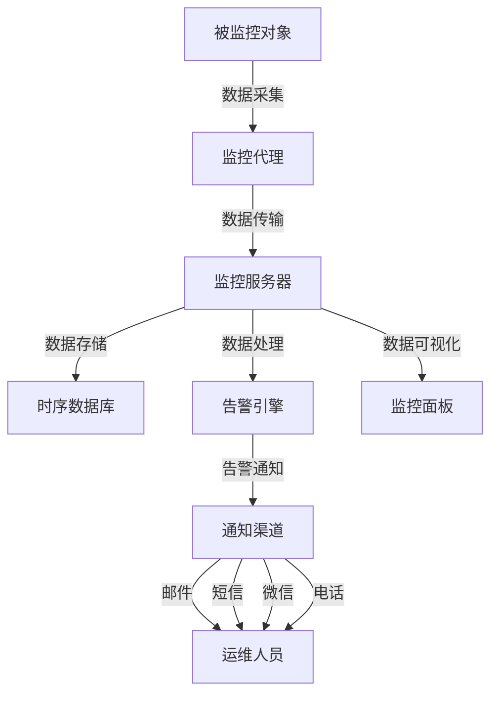
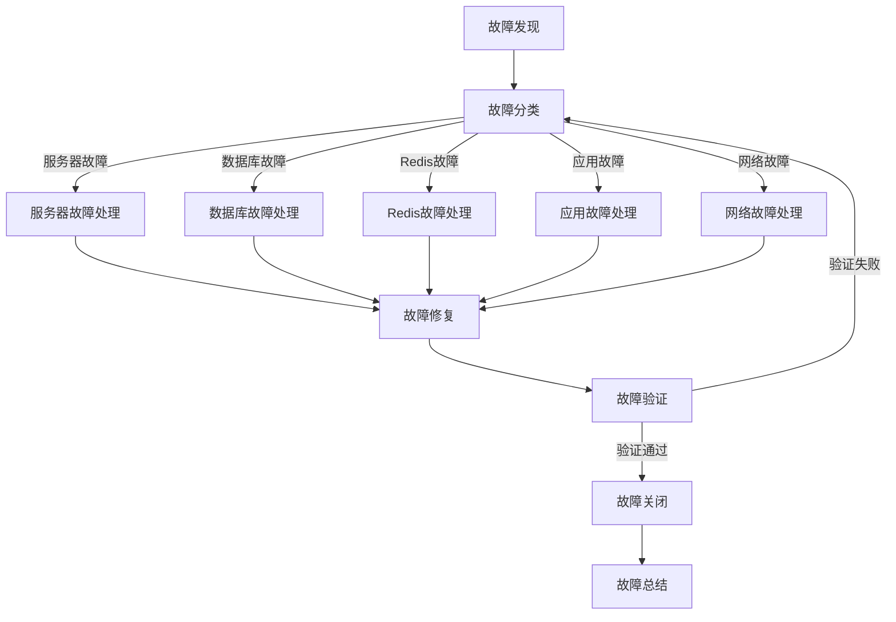

# 排名系统 - 监控与维护

## 1. 监控系统概述

排名系统是游戏中的重要功能，需要实时监控其运行状态，确保系统稳定、高效地运行。本文档详细描述了排名系统的监控方案、维护策略和故障处理流程，帮助运维人员及时发现和解决问题，保证系统的正常运行。

### 1.1 监控目标

- **实时监控**：实时监控系统的运行状态和性能指标
- **异常预警**：及时发现系统异常，提前预警
- **故障定位**：快速定位故障原因，减少故障处理时间
- **性能优化**：通过监控数据，分析系统瓶颈，优化性能
- **容量规划**：根据监控数据，预测系统容量需求，提前规划

### 1.2 监控范围

| 监控对象 | 监控指标 | 监控工具 | 告警阈值 | 监控频率 |
|----------|----------|----------|----------|----------|
| 服务器 | CPU 使用率、内存使用率、磁盘使用率、网络流量 | Prometheus + Grafana | CPU > 80%，内存 > 85%，磁盘 > 90% | 1分钟 |
| 数据库 | 连接数、查询响应时间、慢查询、缓存命中率 | MySQL Enterprise Monitor | 连接数 > 80%，响应时间 > 100ms | 1分钟 |
| Redis | 内存使用率、命中率、连接数、命令执行时间 | Redis Enterprise Monitor | 内存 > 80%，命中率 < 70% | 1分钟 |
| 排名系统 | 查询响应时间、更新响应时间、错误率、缓存命中率 | 自定义监控 | 响应时间 > 100ms，错误率 > 1% | 1分钟 |
| 应用日志 | 错误日志、警告日志、业务日志 | ELK Stack | 错误日志 > 10/min | 5分钟 |

## 2. 监控系统架构

### 2.1 整体架构



### 2.2 核心组件

| 组件 | 类型 | 功能 | 推荐工具 | 部署方式 |
|------|------|------|----------|----------|
| 数据采集 | 监控代理 | 采集被监控对象的指标数据 | Node Exporter, MySQL Exporter, Redis Exporter | 部署在被监控服务器 |
| 数据传输 | 传输协议 | 将采集的数据传输到监控服务器 | Prometheus, Telegraf | 部署在监控服务器 |
| 数据存储 | 时序数据库 | 存储监控数据，支持高效查询 | Prometheus, InfluxDB, TimescaleDB | 部署在监控服务器 |
| 数据处理 | 告警引擎 | 分析监控数据，触发告警 | Alertmanager, Grafana Alerting | 部署在监控服务器 |
| 数据可视化 | 监控面板 | 展示监控数据，支持交互式查询 | Grafana, Kibana | 部署在监控服务器 |
| 通知渠道 | 告警通知 | 将告警信息发送给运维人员 | Email, SMS, WeChat, Phone | 集成到监控系统 |

## 3. 监控指标

### 3.1 服务器监控指标

| 指标名称 | 指标类型 | 单位 | 告警阈值 | 说明 | 采集工具 |
|----------|----------|------|----------|------|----------|
| CPU 使用率 | 资源使用率 | % | > 80% | 服务器 CPU 使用情况 | Node Exporter |
| 内存使用率 | 资源使用率 | % | > 85% | 服务器内存使用情况 | Node Exporter |
| 磁盘使用率 | 资源使用率 | % | > 90% | 服务器磁盘使用情况 | Node Exporter |
| 网络入流量 | 网络流量 | bytes/s | > 1Gbps | 服务器网络入流量 | Node Exporter |
| 网络出流量 | 网络流量 | bytes/s | > 1Gbps | 服务器网络出流量 | Node Exporter |
| 系统负载 | 系统负载 | - | > 0.8 * CPU核心数 | 服务器系统负载 | Node Exporter |
| 进程数 | 系统指标 | 个 | > 300 | 服务器运行的进程数 | Node Exporter |
| 句柄数 | 系统指标 | 个 | > 80% 最大句柄数 | 服务器打开的文件句柄数 | Node Exporter |

### 3.2 数据库监控指标

| 指标名称 | 指标类型 | 单位 | 告警阈值 | 说明 | 采集工具 |
|----------|----------|------|----------|------|----------|
| 连接数 | 资源使用率 | 个 | > 80% 最大连接数 | 数据库连接使用情况 | MySQL Exporter |
| 查询响应时间 | 性能指标 | ms | > 100ms | 数据库查询平均响应时间 | MySQL Exporter |
| 慢查询数 | 性能指标 | 个/min | > 10 | 每分钟慢查询数量 | MySQL Exporter |
| 缓存命中率 | 性能指标 | % | < 70% | 数据库缓存命中率 | MySQL Exporter |
| 事务提交数 | 性能指标 | 个/s | - | 每秒事务提交数量 | MySQL Exporter |
| 事务回滚数 | 性能指标 | 个/s | > 10 | 每秒事务回滚数量 | MySQL Exporter |
| 表锁等待数 | 性能指标 | 个/s | > 5 | 每秒表锁等待数量 | MySQL Exporter |
| 行锁等待数 | 性能指标 | 个/s | > 10 | 每秒行锁等待数量 | MySQL Exporter |

### 3.3 Redis 监控指标

| 指标名称 | 指标类型 | 单位 | 告警阈值 | 说明 | 采集工具 |
|----------|----------|------|----------|------|----------|
| 内存使用率 | 资源使用率 | % | > 80% | Redis 内存使用情况 | Redis Exporter |
| 命中率 | 性能指标 | % | < 70% | Redis 缓存命中率 | Redis Exporter |
| 连接数 | 资源使用率 | 个 | > 80% 最大连接数 | Redis 连接使用情况 | Redis Exporter |
| 命令执行时间 | 性能指标 | ms | > 10ms | Redis 命令平均执行时间 | Redis Exporter |
| 过期键数 | 性能指标 | 个/s | - | 每秒过期键数量 | Redis Exporter |
| 驱逐键数 | 性能指标 | 个/s | > 10 | 每秒驱逐键数量 | Redis Exporter |
| 网络入流量 | 网络流量 | bytes/s | > 100MB/s | Redis 网络入流量 | Redis Exporter |
| 网络出流量 | 网络流量 | bytes/s | > 100MB/s | Redis 网络出流量 | Redis Exporter |

### 3.4 排名系统监控指标

| 指标名称 | 指标类型 | 单位 | 告警阈值 | 说明 | 采集工具 |
|----------|----------|------|----------|------|----------|
| 排名查询响应时间 | 性能指标 | ms | > 100ms | 排名查询平均响应时间 | 自定义监控 |
| 排名更新响应时间 | 性能指标 | ms | > 1000ms | 排名更新平均响应时间 | 自定义监控 |
| 排行榜加载时间 | 性能指标 | ms | > 200ms | 排行榜平均加载时间 | 自定义监控 |
| 错误率 | 质量指标 | % | > 1% | 排名系统错误请求比例 | 自定义监控 |
| 请求数 | 流量指标 | 个/s | - | 每秒请求数量 | 自定义监控 |
| 缓存命中率 | 性能指标 | % | < 70% | 排名系统缓存命中率 | 自定义监控 |
| 排名更新频率 | 业务指标 | 次/min | < 预期值 | 每分钟排名更新次数 | 自定义监控 |
| 排名奖励发放数 | 业务指标 | 个/min | - | 每分钟排名奖励发放数量 | 自定义监控 |

### 3.5 日志监控指标

| 指标名称 | 指标类型 | 单位 | 告警阈值 | 说明 | 采集工具 |
|----------|----------|------|----------|------|----------|
| 错误日志数 | 质量指标 | 个/min | > 10 | 每分钟错误日志数量 | ELK Stack |
| 警告日志数 | 质量指标 | 个/min | > 50 | 每分钟警告日志数量 | ELK Stack |
| 业务异常数 | 质量指标 | 个/min | > 20 | 每分钟业务异常数量 | ELK Stack |
| 日志增长率 | 趋势指标 | % | > 100% | 日志增长率 | ELK Stack |
| 日志存储量 | 资源指标 | GB | > 80% 存储容量 | 日志存储使用情况 | ELK Stack |

## 4. 监控工具部署

### 4.1 Prometheus + Grafana

**部署步骤**:

1. **安装 Prometheus**

```bash
# 下载 Prometheus
wget https://github.com/prometheus/prometheus/releases/download/v2.40.0/prometheus-2.40.0.linux-amd64.tar.gz

# 解压并安装
tar -xzf prometheus-2.40.0.linux-amd64.tar.gz
mv prometheus-2.40.0.linux-amd64 /opt/prometheus

# 创建配置文件
vi /opt/prometheus/prometheus.yml

# 配置内容
scrape_configs:
  - job_name: 'node'
    static_configs:
      - targets: ['localhost:9100']
  - job_name: 'mysql'
    static_configs:
      - targets: ['localhost:9104']
  - job_name: 'redis'
    static_configs:
      - targets: ['localhost:9121']
  - job_name: 'rank-service'
    static_configs:
      - targets: ['localhost:9090']

# 启动 Prometheus
cd /opt/prometheus
./prometheus --config.file=prometheus.yml --storage.tsdb.path=/data/prometheus
```

2. **安装 Node Exporter**

```bash
# 下载 Node Exporter
wget https://github.com/prometheus/node_exporter/releases/download/v1.3.1/node_exporter-1.3.1.linux-amd64.tar.gz

# 解压并安装
tar -xzf node_exporter-1.3.1.linux-amd64.tar.gz
mv node_exporter-1.3.1.linux-amd64 /opt/node_exporter

# 启动 Node Exporter
cd /opt/node_exporter
./node_exporter
```

3. **安装 MySQL Exporter**

```bash
# 下载 MySQL Exporter
wget https://github.com/prometheus/mysqld_exporter/releases/download/v0.14.0/mysqld_exporter-0.14.0.linux-amd64.tar.gz

# 解压并安装
tar -xzf mysqld_exporter-0.14.0.linux-amd64.tar.gz
mv mysqld_exporter-0.14.0.linux-amd64 /opt/mysql_exporter

# 创建 MySQL 配置
vi /opt/mysql_exporter/.my.cnf

# 配置内容
[client]
user=exporter
password=password
host=localhost

# 启动 MySQL Exporter
cd /opt/mysql_exporter
./mysqld_exporter --config.my-cnf=.my.cnf
```

4. **安装 Redis Exporter**

```bash
# 下载 Redis Exporter
wget https://github.com/oliver006/redis_exporter/releases/download/v1.37.0/redis_exporter-v1.37.0.linux-amd64.tar.gz

# 解压并安装
tar -xzf redis_exporter-v1.37.0.linux-amd64.tar.gz
mv redis_exporter-v1.37.0.linux-amd64 /opt/redis_exporter

# 启动 Redis Exporter
cd /opt/redis_exporter
./redis_exporter --redis.addr=redis://localhost:6379
```

5. **安装 Grafana**

```bash
# 下载 Grafana
wget https://dl.grafana.com/oss/release/grafana-9.3.6.linux-amd64.tar.gz

# 解压并安装
tar -xzf grafana-9.3.6.linux-amd64.tar.gz
mv grafana-9.3.6.linux-amd64 /opt/grafana

# 启动 Grafana
cd /opt/grafana
./bin/grafana-server
```

6. **配置 Grafana 面板**

- 访问 Grafana 界面：http://localhost:3000
- 登录：admin / admin
- 添加 Prometheus 数据源
- 导入或创建监控面板

### 4.2 ELK Stack

**部署步骤**:

1. **使用 Docker Compose 部署 ELK Stack**

```yaml
# docker-compose.yml
version: '3'
services:
  elasticsearch:
    image: docker.elastic.co/elasticsearch/elasticsearch:7.17.0
    environment:
      - discovery.type=single-node
      - ES_JAVA_OPTS=-Xms1g -Xmx1g
    ports:
      - 9200:9200
    volumes:
      - es_data:/usr/share/elasticsearch/data

  logstash:
    image: docker.elastic.co/logstash/logstash:7.17.0
    volumes:
      - ./logstash/pipeline:/usr/share/logstash/pipeline
    ports:
      - 5044:5044
    depends_on:
      - elasticsearch

  kibana:
    image: docker.elastic.co/kibana/kibana:7.17.0
    ports:
      - 5601:5601
    depends_on:
      - elasticsearch

  filebeat:
    image: docker.elastic.co/beats/filebeat:7.17.0
    volumes:
      - ./filebeat/filebeat.yml:/usr/share/filebeat/filebeat.yml
      - /var/log/dnf-game-server:/var/log/dnf-game-server:ro
    depends_on:
      - logstash

volumes:
  es_data:
    driver: local
```

2. **配置 Filebeat**

```yaml
# filebeat.yml
filebeat.inputs:
- type: log
  enabled: true
  paths:
    - /var/log/dnf-game-server/*.log
  fields:
    service: rank-service

output.logstash:
  hosts: ["logstash:5044"]
```

3. **配置 Logstash**

```ruby
# logstash/pipeline/logstash.conf
input {
  beats {
    port => 5044
  }
}

filter {
  if [fields][service] == "rank-service" {
    grok {
      match => {
        "message" => "%{TIMESTAMP_ISO8601:timestamp} \[%{LOGLEVEL:level}\] \[%{DATA:module}\] %{GREEDYDATA:message}"
      }
    }
    date {
      match => ["timestamp", "yyyy-MM-dd HH:mm:ss.SSS"]
      target => "@timestamp"
    }
  }
}

output {
  elasticsearch {
    hosts => ["elasticsearch:9200"]
    index => "rank-service-%{+YYYY.MM.dd}"
  }
}
```

4. **启动 ELK Stack**

```bash
docker-compose up -d
```

5. **配置 Kibana 面板**

- 访问 Kibana 界面：http://localhost:5601
- 创建索引模式：rank-service-*
- 创建监控面板

## 5. 告警系统配置

### 5.1 Alertmanager 配置

**部署步骤**:

1. **安装 Alertmanager**

```bash
# 下载 Alertmanager
wget https://github.com/prometheus/alertmanager/releases/download/v0.24.0/alertmanager-0.24.0.linux-amd64.tar.gz

# 解压并安装
tar -xzf alertmanager-0.24.0.linux-amd64.tar.gz
mv alertmanager-0.24.0.linux-amd64 /opt/alertmanager

# 创建配置文件
vi /opt/alertmanager/alertmanager.yml

# 配置内容
global:
  resolve_timeout: 5m
  smtp_smarthost: 'smtp.example.com:587'
  smtp_from: 'alertmanager@example.com'
  smtp_auth_username: 'alertmanager'
  smtp_auth_password: 'password'

route:
  group_by: ['alertname', 'service']
  group_wait: 30s
  group_interval: 5m
  repeat_interval: 1h
  receiver: 'email'

receivers:
- name: 'email'
  email_configs:
  - to: 'ops@example.com'
    send_resolved: true

- name: 'wechat'
  wechat_configs:
  - corp_id: 'your_corp_id'
    api_url: 'https://qyapi.weixin.qq.com/cgi-bin/'
    to_party: 'your_party_id'
    agent_id: 'your_agent_id'
    api_secret: 'your_api_secret'
    send_resolved: true

inhibit_rules:
  - source_match:
      severity: 'critical'
    target_match:
      severity: 'warning'
    equal: ['alertname', 'service']
```

2. **启动 Alertmanager**

```bash
cd /opt/alertmanager
./alertmanager --config.file=alertmanager.yml
```

3. **配置 Prometheus 告警规则**

```yaml
# prometheus/rules/rank-service.yml
groups:
- name: rank-service
  rules:
  - alert: RankQueryLatency
    expr: rank_query_latency_seconds > 0.1
    for: 5m
    labels:
      severity: warning
    annotations:
      summary: "Rank query latency high"
      description: "Rank query latency is higher than 100ms for 5 minutes"

  - alert: RankUpdateLatency
    expr: rank_update_latency_seconds > 1
    for: 5m
    labels:
      severity: warning
    annotations:
      summary: "Rank update latency high"
      description: "Rank update latency is higher than 1s for 5 minutes"

  - alert: RankErrorRate
    expr: rank_error_rate > 0.01
    for: 5m
    labels:
      severity: critical
    annotations:
      summary: "Rank error rate high"
      description: "Rank error rate is higher than 1% for 5 minutes"

  - alert: RankCacheHitRate
    expr: rank_cache_hit_rate < 0.7
    for: 10m
    labels:
      severity: warning
    annotations:
      summary: "Rank cache hit rate low"
      description: "Rank cache hit rate is lower than 70% for 10 minutes"
```

### 5.2 告警级别

| 告警级别 | 颜色 | 说明 | 通知方式 | 处理时间 |
|----------|------|------|----------|----------|
| Critical | 红色 | 严重故障，系统不可用 | 邮件 + 短信 + 微信 + 电话 | 15分钟内 |
| Warning | 黄色 | 警告，系统性能下降 | 邮件 + 微信 | 30分钟内 |
| Info | 蓝色 | 信息，系统状态变化 | 邮件 | 24小时内 |

### 5.3 告警通知模板

**邮件通知模板**:

```html
<!DOCTYPE html>
<html>
<body>
  <h2>告警通知</h2>
  <p><strong>告警级别:</strong> {{ .Status | toUpper }}</p>
  <p><strong>告警服务:</strong> {{ .GroupLabels.service }}</p>
  <p><strong>告警名称:</strong> {{ .CommonLabels.alertname }}</p>
  <p><strong>告警描述:</strong> {{ .CommonAnnotations.description }}</p>
  <p><strong>触发时间:</strong> {{ .StartsAt.Format "2006-01-02 15:04:05" }}</p>
  <p><strong>当前值:</strong> {{ .CommonLabels.value }}</p>
  <p><strong>查看详情:</strong> <a href="http://grafana.example.com/d/xxxx/rank-service">Grafana 面板</a></p>
</body>
</html>
```

**微信通知模板**:

```json
{
  "msgtype": "markdown",
  "markdown": {
    "content": "**告警通知**\n" +
    "**告警级别:** {{ .Status | toUpper }}\n" +
    "**告警服务:** {{ .GroupLabels.service }}\n" +
    "**告警名称:** {{ .CommonLabels.alertname }}\n" +
    "**告警描述:** {{ .CommonAnnotations.description }}\n" +
    "**触发时间:** {{ .StartsAt.Format "2006-01-02 15:04:05" }}\n" +
    "**当前值:** {{ .CommonLabels.value }}\n"
  }
}
```

## 6. 维护策略

### 6.1 日常维护

| 维护项 | 维护内容 | 维护频率 | 维护窗口 | 负责人 |
|--------|----------|----------|----------|--------|
| 日志检查 | 检查服务日志，排查异常 | 每日 | 低峰期 | 运维工程师 |
| 性能监控 | 分析系统性能指标，识别瓶颈 | 每日 | 低峰期 | 运维工程师 |
| 数据备份 | 备份数据库和 Redis 数据 | 每日 | 低峰期 | 运维工程师 |
| 安全扫描 | 扫描系统安全漏洞，更新补丁 | 每周 | 低峰期 | 安全工程师 |
| 配置检查 | 检查系统配置，确保配置正确 | 每周 | 低峰期 | 运维工程师 |

### 6.2 定期维护

| 维护项 | 维护内容 | 维护频率 | 维护窗口 | 负责人 |
|--------|----------|----------|----------|--------|
| 数据库优化 | 重建索引，分析表，清理碎片 | 每周 | 低峰期 | DBA |
| Redis 优化 | 清理过期键，优化内存使用 | 每周 | 低峰期 | 运维工程师 |
| 服务器维护 | 清理系统垃圾，更新系统补丁 | 每月 | 低峰期 | 运维工程师 |
| 监控系统维护 | 更新监控规则，优化告警策略 | 每月 | 低峰期 | 运维工程师 |
| 容量规划 | 分析系统容量，预测未来需求 | 每季度 | 低峰期 | 运维主管 |

### 6.3 年度维护

| 维护项 | 维护内容 | 维护频率 | 维护窗口 | 负责人 |
|--------|----------|----------|----------|--------|
| 系统升级 | 升级系统版本，更新依赖 | 每年 | 计划停机 | 运维团队 |
| 架构优化 | 优化系统架构，提高扩展性 | 每年 | 计划停机 | 架构师 |
| 灾难恢复演练 | 测试系统灾难恢复能力 | 每年 | 计划停机 | 运维团队 |
| 性能压测 | 进行系统性能压测，评估极限 | 每年 | 计划停机 | 测试工程师 |

## 7. 故障处理

### 7.1 故障处理流程



### 7.2 常见故障处理

**服务器故障**:

| 故障现象 | 可能原因 | 处理步骤 | 预计恢复时间 |
|----------|----------|----------|--------------|
| CPU 使用率高 | 进程占用过高，系统负载大 | 1. 查看占用 CPU 高的进程<br>2. 分析进程原因<br>3. 优化或重启进程 | 5-15分钟 |
| 内存使用率高 | 内存泄漏，缓存占用大 | 1. 查看内存使用情况<br>2. 分析内存占用进程<br>3. 释放内存或重启服务 | 5-15分钟 |
| 磁盘使用率高 | 日志文件过大，数据文件增长 | 1. 查找大文件<br>2. 清理日志文件<br>3. 调整日志配置 | 10-30分钟 |
| 网络故障 | 网络连接中断，带宽饱和 | 1. 检查网络连接<br>2. 分析网络流量<br>3. 联系网络管理员 | 30-60分钟 |

**数据库故障**:

| 故障现象 | 可能原因 | 处理步骤 | 预计恢复时间 |
|----------|----------|----------|--------------|
| 连接数耗尽 | 应用连接池配置不当，连接未释放 | 1. 查看数据库连接<br>2. 分析连接来源<br>3. 调整连接池配置 | 5-15分钟 |
| 查询响应慢 | 索引失效，查询语句优化不当 | 1. 查看慢查询日志<br>2. 分析查询语句<br>3. 优化查询或添加索引 | 10-30分钟 |
| 数据库崩溃 | 硬件故障，软件bug | 1. 重启数据库服务<br>2. 检查数据库文件<br>3. 从备份恢复（如果需要） | 30-60分钟 |

**Redis 故障**:

| 故障现象 | 可能原因 | 处理步骤 | 预计恢复时间 |
|----------|----------|----------|--------------|
| 内存使用率高 | 缓存数据过多，过期策略不当 | 1. 查看内存使用情况<br>2. 分析缓存数据<br>3. 调整过期策略或清理缓存 | 5-15分钟 |
| 命中率低 | 缓存策略不当，数据更新频繁 | 1. 分析缓存命中率<br>2. 调整缓存策略<br>3. 优化数据更新机制 | 10-20分钟 |
| Redis 崩溃 | 内存不足，硬件故障 | 1. 重启 Redis 服务<br>2. 检查持久化文件<br>3. 从持久化文件恢复 | 5-15分钟 |

**应用故障**:

| 故障现象 | 可能原因 | 处理步骤 | 预计恢复时间 |
|----------|----------|----------|--------------|
| 服务崩溃 | 代码bug，资源耗尽 | 1. 查看应用日志<br>2. 分析崩溃原因<br>3. 修复bug或调整资源 | 10-30分钟 |
| 响应时间长 | 代码逻辑复杂，依赖服务慢 | 1. 分析应用性能<br>2. 定位瓶颈<br>3. 优化代码或依赖服务 | 15-45分钟 |
| 错误率高 | 业务逻辑错误，外部依赖异常 | 1. 查看错误日志<br>2. 分析错误原因<br>3. 修复业务逻辑或处理外部依赖 | 10-30分钟 |

### 7.3 故障记录

**故障记录模板**:

| 字段名 | 字段类型 | 字段描述 |
|--------|----------|----------|
| 故障ID | 字符串 | 故障唯一标识 |
| 故障类型 | 枚举 | 服务器故障、数据库故障、Redis故障、应用故障、网络故障 |
| 故障级别 | 枚举 | 严重、重要、一般 |
| 故障描述 | 文本 | 故障详细描述 |
| 触发时间 | 时间 | 故障触发时间 |
| 发现方式 | 枚举 | 监控告警、用户反馈、定期检查 |
| 处理人 | 字符串 | 故障处理负责人 |
| 处理步骤 | 文本 | 故障处理详细步骤 |
| 恢复时间 | 时间 | 故障恢复时间 |
| 影响范围 | 文本 | 故障影响的系统和用户 |
| 根因分析 | 文本 | 故障根本原因分析 |
| 解决方案 | 文本 | 故障解决方案 |
| 预防措施 | 文本 | 类似故障的预防措施 |
| 状态 | 枚举 | 待处理、处理中、已解决、已关闭 |

## 8. 备份与恢复

### 8.1 数据备份

**数据库备份**:

```bash
# 全量备份
mysqldump -u dnf -p --opt --single-transaction dnf_game_server > dnf_game_server_full_$(date +%Y%m%d).sql

# 增量备份
mysqlbinlog --start-position=4 --stop-position=1000 mysql-bin.000001 > dnf_game_server_inc_$(date +%Y%m%d_%H%M%S).sql
```

**Redis 备份**:

```bash
# RDB 备份
redis-cli save
cp /var/lib/redis/dump.rdb /backup/redis/dump_$(date +%Y%m%d).rdb

# AOF 备份
cp /var/lib/redis/appendonly.aof /backup/redis/appendonly_$(date +%Y%m%d).aof
```

**配置备份**:

```bash
# 备份配置文件
tar -czf config_backup_$(date +%Y%m%d).tar.gz /path/to/config
```

### 8.2 数据恢复

**数据库恢复**:

```bash
# 全量恢复
mysql -u dnf -p dnf_game_server < dnf_game_server_full_20240101.sql

# 增量恢复
mysql -u dnf -p dnf_game_server < dnf_game_server_full_20240101.sql
mysqlbinlog mysql-bin.000001 | mysql -u dnf -p dnf_game_server
```

**Redis 恢复**:

```bash
# RDB 恢复
cp /backup/redis/dump_20240101.rdb /var/lib/redis/dump.rdb
systemctl restart redis

# AOF 恢复
cp /backup/redis/appendonly_20240101.aof /var/lib/redis/appendonly.aof
systemctl restart redis
```

**配置恢复**:

```bash
# 恢复配置文件
tar -xzf config_backup_20240101.tar.gz -C /path/to/
```

### 8.3 备份策略

| 备份类型 | 备份频率 | 保留时间 | 备份方式 | 存储位置 |
|----------|----------|----------|----------|----------|
| 数据库全量备份 | 每日 | 7天 | mysqldump | 本地 + 远程 |
| 数据库增量备份 | 每小时 | 3天 | mysqlbinlog | 本地 + 远程 |
| Redis 备份 | 每6小时 | 7天 | RDB + AOF | 本地 + 远程 |
| 配置备份 | 每周 | 30天 | tar | 本地 + 远程 |
| 系统镜像 | 每月 | 90天 | 快照 | 远程 |

## 9. 总结

排名系统的监控与维护是确保系统稳定运行的重要保障。通过本文档的指导，运维人员可以建立完善的监控系统，制定有效的维护策略，快速处理故障，保证系统的正常运行。

**监控与维护亮点**:

1. **全面的监控方案**：覆盖服务器、数据库、Redis、应用和日志等各个方面
2. **实时的告警机制**：及时发现和预警系统异常
3. **完善的维护策略**：包括日常、定期和年度维护
4. **高效的故障处理**：快速定位和解决故障，减少故障影响
5. **可靠的备份恢复**：确保数据安全，能够在灾难发生时快速恢复

**未来改进方向**:

1. **自动化运维**：实现更多的自动化运维任务，减少人工干预
2. **智能监控**：引入机器学习，实现智能异常检测和根因分析
3. **容器化部署**：采用容器化部署，提高系统的可扩展性和可靠性
4. **服务网格**：引入服务网格，提供更细粒度的监控和管理
5. **混沌工程**：定期进行混沌测试，提高系统的韧性

通过持续的监控与维护，排名系统将能够为玩家提供稳定、高效、安全的排名服务，增强游戏的竞争性和社交性，为玩家带来更好的游戏体验。