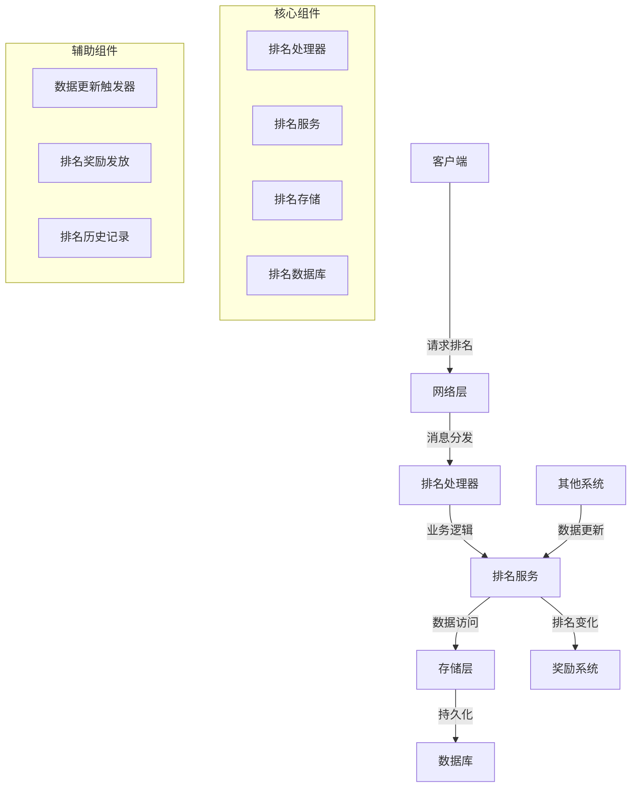

# 排名系统 - 系统概述

## 1. 系统简介

排名系统是游戏中的重要功能，用于展示玩家在不同维度的排名，如等级排名、战力排名、副本排名等。通过排名系统，玩家可以了解自己在游戏中的实力水平，激发竞争意识，提高游戏的可玩性和社交性。

## 2. 核心功能

### 2.1 主要功能

- **个人排名查询**：查询指定玩家在不同排名类型中的具体排名
- **我的排名查询**：查询当前登录玩家的排名信息
- **好友排名查询**：查询玩家好友列表中的排名情况
- **队伍排名查询**：查询玩家所在队伍的排名信息
- **排行榜列表**：分页获取不同类型的排行榜数据
- **排名更新**：根据玩家数据变化实时或定期更新排名
- **排名历史**：记录和查询排名历史数据
- **排名奖励**：根据排名发放相应的奖励

### 2.2 排名类型

| 排名类型 | 描述 | 计算依据 | 刷新频率 |
|----------|------|----------|----------|
| 等级排名 | 按玩家等级排序 | 等级 > 经验值 | 实时 |
| 战力排名 | 按玩家战力排序 | 装备评分 + 技能等级 | 实时 |
| 副本排名 | 按副本通关时间排序 | 通关时间 | 实时 |
| 财富排名 | 按玩家财富排序 | 游戏币数量 | 每天 |
| 成就排名 | 按成就点数排序 | 成就点数 | 每天 |
| 公会排名 | 按公会等级和活跃度排序 | 公会等级 + 活跃度 | 每天 |
| PK排名 | 按PK胜率和场次排序 | 胜率 > 场次 | 每天 |
| 贡献排名 | 按公会贡献排序 | 公会贡献值 | 每周 |

## 3. 系统架构

### 3.1 整体架构

排名系统采用分层架构设计，与游戏服务端的其他系统紧密集成。

### 3.2 架构说明

1. **客户端**：游戏客户端，发送排名查询请求，显示排名结果
2. **网络层**：处理客户端连接，消息编解码和分发
3. **排名处理器**：处理排名相关的消息，调用排名服务
4. **排名服务**：实现排名的核心业务逻辑，如排名计算、更新等
5. **存储层**：提供数据访问接口，处理排名数据的读写
6. **数据库**：存储排名数据、排名历史等持久化信息
7. **其他系统**：如角色系统、装备系统等，当玩家数据变化时触发排名更新
8. **奖励系统**：根据排名结果发放相应的奖励

## 4. 依赖关系

### 4.1 内部依赖

| 依赖系统 | 依赖原因 | 交互方式 |
|----------|----------|----------|
| 角色系统 | 获取角色基本信息 | 直接调用 |
| 装备系统 | 获取装备评分 | 直接调用 |
| 好友系统 | 获取好友列表 | 直接调用 |
| 组队系统 | 获取队伍信息 | 直接调用 |
| 公会系统 | 获取公会信息 | 直接调用 |
| 奖励系统 | 发放排名奖励 | 事件通知 |

### 4.2 外部依赖

| 依赖项 | 版本 | 用途 | 安装方式 |
|--------|------|------|----------|
| Go | 1.20+ | 开发语言 | 系统安装 |
| gorm.io/gorm | 1.25+ | ORM框架 | go get |
| google.golang.org/protobuf | 1.30+ | 消息序列化 | go get |
| Redis | 7.0+ | 缓存排名数据 | 系统安装 |
| MySQL | 5.7+ | 存储排名数据 | 系统安装 |

## 5. 技术特点

### 5.1 性能优化

- **缓存机制**：使用Redis缓存热门排名数据，减少数据库查询
- **增量更新**：只更新发生变化的数据，避免全量计算
- **异步处理**：排名计算和更新采用异步方式，不阻塞主业务流程
- **批量操作**：批量处理排名数据，减少数据库交互次数

### 5.2 可扩展性

- **模块化设计**：排名系统采用模块化设计，易于扩展新的排名类型
- **插件架构**：支持通过插件方式添加新的排名计算规则
- **配置驱动**：排名类型、计算规则、刷新频率等通过配置文件管理

### 5.3 可靠性

- **数据一致性**：确保排名数据的准确性和一致性
- **故障恢复**：支持排名数据的备份和恢复
- **容错处理**：即使在数据异常情况下也能保证系统正常运行

## 6. 业务价值

### 6.1 玩家价值

- **竞争激励**：通过排名激发玩家的竞争意识，提高游戏活跃度
- **社交互动**：排名系统促进玩家之间的比较和交流
- **目标导向**：为玩家提供明确的游戏目标，增强游戏的可玩性
- **成就感**：排名靠前的玩家获得成就感和荣誉感

### 6.2 游戏运营价值

- **数据洞察**：通过排名数据了解玩家行为和游戏平衡性
- **活动支持**：为游戏活动提供数据支持和玩法设计基础
- **留存提升**：排名系统有助于提高玩家留存率
- **商业化**：排名系统可以作为游戏商业化的重要组成部分

## 7. 发展规划

### 7.1 短期规划

- **核心功能实现**：完成所有基础排名功能的实现
- **性能优化**：确保排名系统在大量玩家数据下的性能表现
- **测试验证**：通过全面测试确保系统稳定性

### 7.2 中期规划

- **功能扩展**：增加更多排名类型和玩法
- **数据可视化**：提供排名数据的可视化分析工具
- **智能推荐**：基于排名数据实现智能推荐功能

### 7.3 长期规划

- **跨服排名**：实现不同服务器之间的排名比较
- **全球排名**：实现全球范围内的玩家排名
- **AI分析**：使用AI技术分析排名数据，提供游戏平衡性建议