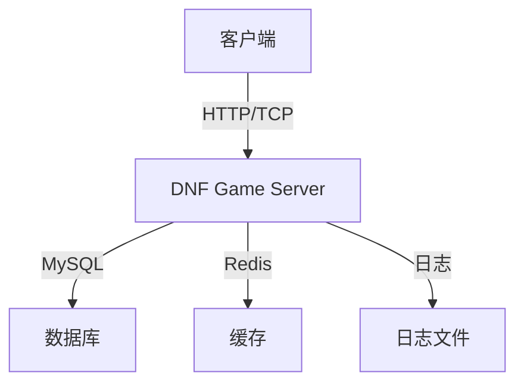
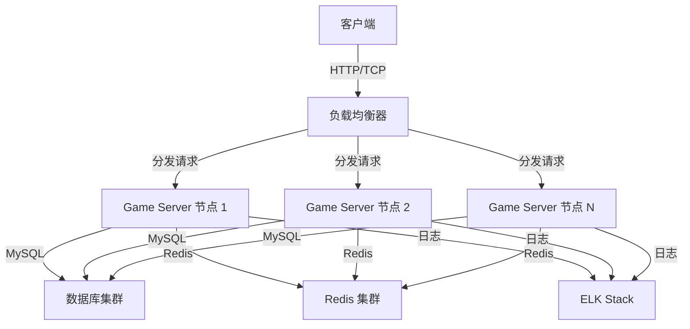

# 排名系统 - 部署文档

## 1. 部署概述

排名系统是游戏中的重要功能，需要稳定、高效地运行。本文档详细描述了排名系统的部署流程，包括环境准备、依赖安装、配置设置、部署步骤和验证测试等方面。通过本文档的指导，您可以快速完成排名系统的部署和上线。

### 1.1 部署目标

- **环境准备**：搭建适合排名系统运行的服务器环境
- **依赖安装**：安装排名系统所需的依赖组件
- **配置设置**：正确配置排名系统的各项参数
- **服务部署**：部署排名系统服务并确保正常运行
- **验证测试**：验证排名系统的功能和性能

### 1.2 部署类型

| 部署类型 | 环境描述 | 适用场景 | 部署复杂度 |
|----------|----------|----------|------------|
| 开发环境 | 本地开发机 | 开发和测试 | 低 |
| 测试环境 | 测试服务器 | 集成测试 | 中 |
| 生产环境 | 生产服务器 | 正式上线 | 高 |

## 2. 环境准备

### 2.1 硬件环境

| 环境类型 | CPU | 内存 | 存储 | 网络 |
|----------|-----|------|------|------|
| 开发环境 | 4核 | 8GB | 200GB | 千兆网卡 |
| 测试环境 | 8核 | 16GB | 500GB | 千兆网卡 |
| 生产环境 | 16核+ | 32GB+ | 1TB+ | 万兆网卡 |

### 2.2 软件环境

| 软件 | 版本 | 用途 | 安装命令 |
|------|------|------|----------|
| Linux | CentOS 7.6+ / Ubuntu 18.04+ | 操作系统 | - |
| Go | 1.20+ | 开发语言 | `wget https://golang.org/dl/go1.20.0.linux-amd64.tar.gz && tar -C /usr/local -xzf go1.20.0.linux-amd64.tar.gz` |
| MySQL | 5.7+ | 数据库 | `yum install mysql-server` 或 `apt install mysql-server` |
| Redis | 7.0+ | 缓存 | `yum install redis` 或 `apt install redis-server` |
| Nginx | 1.18+ | 反向代理（可选） | `yum install nginx` 或 `apt install nginx` |
| Git | 2.20+ | 代码管理 | `yum install git` 或 `apt install git` |

## 3. 依赖安装

### 3.1 Go 依赖

**文件位置**: `go.mod`

```go
module github.com/pixb/DnfGameServer/dnf-go-server

go 1.20

require (
    github.com/gin-gonic/gin v1.9.1
    github.com/go-sql-driver/mysql v1.7.1
    github.com/golang/protobuf v1.5.3
    github.com/joho/godotenv v1.5.1
    github.com/redis/go-redis/v9 v9.0.5
    google.golang.org/grpc v1.56.1
    google.golang.org/protobuf v1.30.0
    gorm.io/driver/mysql v1.5.1
    gorm.io/gorm v1.25.2
)
```

**安装命令**:

```bash
# 进入项目目录
cd /path/to/dnf-go-server

# 安装依赖
go mod tidy
```

### 3.2 系统依赖

**MySQL 配置**:

```bash
# 启动 MySQL 服务
systemctl start mysqld

# 设置 MySQL 开机自启
systemctl enable mysqld

# 初始化 MySQL 配置
mysql_secure_installation

# 创建数据库
mysql -u root -p
CREATE DATABASE dnf_game_server CHARACTER SET utf8mb4 COLLATE utf8mb4_unicode_ci;
CREATE USER 'dnf'@'localhost' IDENTIFIED BY 'password';
GRANT ALL PRIVILEGES ON dnf_game_server.* TO 'dnf'@'localhost';
FLUSH PRIVILEGES;
```

**Redis 配置**:

```bash
# 启动 Redis 服务
systemctl start redis

# 设置 Redis 开机自启
systemctl enable redis

# 配置 Redis
vi /etc/redis/redis.conf
# 修改以下配置
# bind 127.0.0.1
# protected-mode yes
# requirepass yourpassword

# 重启 Redis
systemctl restart redis
```

## 4. 配置设置

### 4.1 配置文件

**文件位置**: `config/config.yaml`

```yaml
# 服务器配置
server:
  host: "0.0.0.0"
  port: 8080
  max_conn: 10000

# 数据库配置
database:
  host: "localhost"
  port: 3306
  user: "dnf"
  password: "password"
  dbname: "dnf_game_server"
  max_idle: 10
  max_open: 100

# Redis 配置
redis:
  host: "localhost"
  port: 6379
  password: ""
  db: 0
  pool_size: 100

# 排名系统配置
rank:
  # 排名更新间隔（秒）
  update_interval: 60
  # 排行榜缓存过期时间（秒）
  cache_expire: 300
  # 个人排名缓存过期时间（秒）
  personal_cache_expire: 3600
  # 最大排名数
  max_rank: 1000
  # 排名奖励检查间隔（秒）
  reward_check_interval: 3600
  # 排名历史记录间隔（秒）
  history_record_interval: 86400

# 日志配置
log:
  level: "info"
  file: "/var/log/dnf-game-server.log"
  max_size: 100
  max_backups: 10
  max_age: 7
```

### 4.2 环境变量

**文件位置**: `.env`

```env
# 服务器配置
SERVER_HOST=0.0.0.0
SERVER_PORT=8080

# 数据库配置
DB_HOST=localhost
DB_PORT=3306
DB_USER=dnf
DB_PASSWORD=password
DB_NAME=dnf_game_server

# Redis 配置
REDIS_HOST=localhost
REDIS_PORT=6379
REDIS_PASSWORD=
REDIS_DB=0

# 排名系统配置
RANK_UPDATE_INTERVAL=60
RANK_CACHE_EXPIRE=300
RANK_PERSONAL_CACHE_EXPIRE=3600
RANK_MAX_RANK=1000
RANK_REWARD_CHECK_INTERVAL=3600
RANK_HISTORY_RECORD_INTERVAL=86400

# 日志配置
LOG_LEVEL=info
LOG_FILE=/var/log/dnf-game-server.log
```

### 4.3 配置说明

| 配置项 | 类型 | 默认值 | 说明 | 建议值 |
|--------|------|--------|------|--------|
| `update_interval` | int | 60 | 排名更新间隔（秒） | 60 |
| `cache_expire` | int | 300 | 排行榜缓存过期时间（秒） | 300 |
| `personal_cache_expire` | int | 3600 | 个人排名缓存过期时间（秒） | 3600 |
| `max_rank` | int | 1000 | 最大排名数 | 1000 |
| `reward_check_interval` | int | 3600 | 排名奖励检查间隔（秒） | 3600 |
| `history_record_interval` | int | 86400 | 排名历史记录间隔（秒） | 86400 |

## 5. 部署步骤

### 5.1 代码部署

**步骤 1: 克隆代码**

```bash
git clone https://github.com/pixb/DnfGameServer.git
cd DnfGameServer/dnf-go-server
```

**步骤 2: 编译项目**

```bash
# 设置 Go 环境变量
export GO111MODULE=on
export GOPROXY=https://goproxy.io,direct

# 编译
go build -o dnf-game-server cmd/server/main.go
```

**步骤 3: 准备配置文件**

```bash
# 创建配置目录
mkdir -p config

# 复制配置文件
cp config.example.yaml config/config.yaml
# 根据实际环境修改配置

# 创建日志目录
mkdir -p /var/log/dnf-game-server
chmod 755 /var/log/dnf-game-server
```

### 5.2 数据库部署

**步骤 1: 初始化数据库**

```bash
# 运行数据库迁移脚本
./dnf-game-server migrate
```

**步骤 2: 初始化排名配置**

```bash
# 运行排名配置初始化脚本
./dnf-game-server init-rank
```

### 5.3 服务部署

**步骤 1: 启动服务**

```bash
# 直接启动（开发环境）
./dnf-game-server start

# 后台启动（测试/生产环境）
nohup ./dnf-game-server start > /dev/null 2>&1 &
```

**步骤 2: 设置开机自启**

```bash
# 创建系统服务文件
vi /etc/systemd/system/dnf-game-server.service

# 内容如下
[Unit]
Description=DNF Game Server
After=network.target mysql.service redis.service

[Service]
Type=simple
WorkingDirectory=/path/to/dnf-go-server
ExecStart=/path/to/dnf-go-server/dnf-game-server start
Restart=on-failure
RestartSec=5s

[Install]
WantedBy=multi-user.target

# 启用服务
systemctl daemon-reload
systemctl enable dnf-game-server
systemctl start dnf-game-server
```

## 6. 验证测试

### 6.1 服务状态检查

```bash
# 检查服务状态
systemctl status dnf-game-server

# 查看服务日志
tail -f /var/log/dnf-game-server.log

# 检查端口是否监听
netstat -tlnp | grep 8080
```

### 6.2 功能测试

**步骤 1: 测试排名查询**

```bash
# 使用 curl 测试 API
curl -X POST http://localhost:8080/api/rank/my \
  -H "Content-Type: application/json" \
  -d '{"type": 1, "transid": 10001}'
```

**步骤 2: 测试排行榜**

```bash
# 使用 curl 测试 API
curl -X POST http://localhost:8080/api/rank/list \
  -H "Content-Type: application/json" \
  -d '{"type": 1, "page": 1, "page_size": 10}'
```

### 6.3 性能测试

**步骤 1: 使用 JMeter 测试**

1. 打开 JMeter，创建测试计划
2. 添加线程组，设置并发用户数为 100
3. 添加 HTTP 请求，设置请求路径和参数
4. 添加监听器，查看测试结果
5. 运行测试，观察响应时间和错误率

**步骤 2: 监控系统性能**

```bash
# 监控 CPU 和内存使用情况
top

# 监控磁盘 I/O
iostat -x

# 监控网络流量
netstat -tulnp

# 监控数据库性能
mysqladmin -u dnf -p extended-status

# 监控 Redis 性能
redis-cli info stats
```

## 7. 常见问题

### 7.1 服务启动失败

**问题描述**: 服务启动后立即退出，或启动失败

**可能原因**:
- 配置文件错误
- 数据库连接失败
- Redis 连接失败
- 端口被占用

**解决方案**:
- 检查配置文件中的数据库和 Redis 连接信息
- 确保数据库和 Redis 服务已启动
- 检查端口是否被其他服务占用
- 查看日志文件，获取详细错误信息

### 7.2 排名查询返回错误

**问题描述**: 调用排名查询接口返回错误

**可能原因**:
- 排名类型不存在
- 数据库中没有排名数据
- 缓存服务异常

**解决方案**:
- 检查排名类型是否正确
- 运行排名初始化脚本，生成初始排名数据
- 检查 Redis 服务状态

### 7.3 排名更新不及时

**问题描述**: 玩家数据变化后，排名没有及时更新

**可能原因**:
- 排名更新间隔设置过长
- 缓存过期时间设置过长
- 排名重新计算失败

**解决方案**:
- 调整 `update_interval` 配置，缩短更新间隔
- 调整 `cache_expire` 配置，缩短缓存过期时间
- 检查排名重新计算的日志，排查失败原因

### 7.4 服务性能下降

**问题描述**: 服务运行一段时间后，性能明显下降

**可能原因**:
- 内存泄漏
- 数据库连接池耗尽
- Redis 缓存满
- 磁盘空间不足

**解决方案**:
- 使用内存分析工具排查内存泄漏
- 调整数据库连接池配置
- 增加 Redis 内存容量或设置合理的淘汰策略
- 清理日志文件，释放磁盘空间

### 7.5 数据备份和恢复

**问题描述**: 需要备份排名数据，或在数据损坏时恢复

**解决方案**:

**数据备份**:

```bash
# 备份数据库
mysqldump -u dnf -p dnf_game_server > dnf_game_server_$(date +%Y%m%d).sql

# 备份 Redis 数据
redis-cli save
cp /var/lib/redis/dump.rdb /backup/redis_dump_$(date +%Y%m%d).rdb
```

**数据恢复**:

```bash
# 恢复数据库
mysql -u dnf -p dnf_game_server < dnf_game_server_20240101.sql

# 恢复 Redis 数据
cp /backup/redis_dump_20240101.rdb /var/lib/redis/
systemctl restart redis
```

## 8. 监控与维护

### 8.1 监控系统

**推荐监控工具**:

| 工具 | 用途 | 安装命令 |
|------|------|----------|
| Prometheus | 监控系统指标 | `wget https://github.com/prometheus/prometheus/releases/download/v2.40.0/prometheus-2.40.0.linux-amd64.tar.gz` |
| Grafana | 可视化监控数据 | `wget https://dl.grafana.com/oss/release/grafana-9.3.6.linux-amd64.tar.gz` |
| ELK Stack | 日志收集和分析 | `docker-compose up -d` (使用 Docker 部署) |
| New Relic | 应用性能监控 | `curl -Ls https://download.newrelic.com/install/newrelic-cli/scripts/install.sh | bash` |

**监控指标**:

| 指标 | 说明 | 告警阈值 | 监控频率 |
|------|------|----------|----------|
| CPU 使用率 | 服务器 CPU 使用情况 | > 80% | 1分钟 |
| 内存使用率 | 服务器内存使用情况 | > 85% | 1分钟 |
| 磁盘使用率 | 服务器磁盘使用情况 | > 90% | 5分钟 |
| 网络流量 | 服务器网络流量 | > 1Gbps | 1分钟 |
| 数据库连接数 | 数据库连接使用情况 | > 80% 最大连接数 | 1分钟 |
| Redis 内存使用率 | Redis 内存使用情况 | > 80% | 5分钟 |
| 排名查询响应时间 | 排名查询 API 响应时间 | > 100ms | 1分钟 |
| 排名更新响应时间 | 排名更新 API 响应时间 | > 1s | 1分钟 |
| 服务错误率 | 服务错误请求比例 | > 1% | 1分钟 |

### 8.2 维护计划

**日常维护**:

| 维护项 | 维护内容 | 维护频率 | 维护窗口 |
|--------|----------|----------|----------|
| 日志检查 | 检查服务日志，排查异常 | 每日 | 低峰期 |
| 数据备份 | 备份数据库和 Redis 数据 | 每日 | 低峰期 |
| 性能监控 | 监控系统性能指标 | 实时 | 全时段 |
| 安全扫描 | 扫描系统安全漏洞 | 每周 | 低峰期 |

**定期维护**:

| 维护项 | 维护内容 | 维护频率 | 维护窗口 |
|--------|----------|----------|----------|
| 数据库优化 | 重建索引，分析表 | 每周 | 低峰期 |
| 缓存清理 | 清理过期缓存 | 每周 | 低峰期 |
| 历史数据清理 | 清理过期排名历史记录 | 每月 | 低峰期 |
| 系统更新 | 更新系统补丁和依赖 | 每月 | 低峰期 |
| 性能测试 | 进行性能测试，评估系统状态 | 每季度 | 低峰期 |

### 8.3 故障处理

**故障处理流程**:

1. **故障发现**：通过监控系统或用户反馈发现故障
2. **故障定位**：分析日志和监控数据，定位故障原因
3. **故障处理**：根据故障原因采取相应的处理措施
4. **故障验证**：验证故障是否已解决
5. **故障记录**：记录故障原因、处理过程和解决方案

**常见故障处理**:

| 故障类型 | 处理措施 | 预计恢复时间 |
|----------|----------|--------------|
| 服务崩溃 | 重启服务，检查日志 | 5分钟 |
| 数据库连接失败 | 检查数据库状态，重启数据库服务 | 10分钟 |
| Redis 缓存失败 | 检查 Redis 状态，重启 Redis 服务 | 5分钟 |
| 网络故障 | 检查网络连接，联系网络管理员 | 30分钟 |
| 数据损坏 | 从备份恢复数据 | 1小时 |

## 9. 部署架构

### 9.1 单机部署

**适用场景**：开发环境、测试环境，或小型游戏服务



**配置建议**:
- 服务器：8核 CPU，16GB 内存，500GB 存储
- 数据库：MySQL 5.7+，配置 4GB 内存
- Redis：4GB 内存，开启持久化

### 9.2 集群部署

**适用场景**：生产环境，大型游戏服务



**配置建议**:
- 负载均衡器：Nginx 或 HAProxy
- Game Server 节点：每节点 8核 CPU，16GB 内存
- 数据库集群：MySQL Master-Slave 或 MySQL Cluster
- Redis 集群：3-6 节点，每节点 8GB 内存
- 日志系统：ELK Stack，用于集中管理日志

### 9.3 云服务部署

**适用场景**：快速部署，弹性扩展

**云服务选择**:

| 服务类型 | 推荐产品 | 配置建议 |
|----------|----------|----------|
| 云服务器 | AWS EC2 / 阿里云 ECS / 腾讯云 CVM | 8核 16GB |
| 数据库 | AWS RDS / 阿里云 RDS / 腾讯云 CDB | MySQL 5.7+，4核 8GB |
| 缓存 | AWS ElastiCache / 阿里云 Redis / 腾讯云 Redis | 8GB 内存 |
| 负载均衡 | AWS ELB / 阿里云 SLB / 腾讯云 CLB | 标准型 |
| 日志服务 | AWS CloudWatch / 阿里云 SLS / 腾讯云 CLS | 标准配置 |

**部署步骤**:

1. **创建云服务器实例**
2. **创建数据库实例**
3. **创建 Redis 实例**
4. **配置网络和安全组**
5. **部署应用代码**
6. **配置负载均衡**
7. **启动服务并验证**

## 10. 总结

排名系统的部署是一个系统工程，需要考虑环境准备、依赖安装、配置设置、服务部署和验证测试等多个方面。通过本文档的指导，您可以快速完成排名系统的部署和上线，确保系统稳定、高效地运行。

**部署要点**:

1. **环境准备**：确保服务器硬件和软件环境满足要求
2. **依赖安装**：正确安装和配置 MySQL、Redis 等依赖服务
3. **配置优化**：根据实际情况调整配置参数，优化系统性能
4. **服务管理**：使用系统服务管理工具，确保服务稳定运行
5. **监控维护**：建立完善的监控系统，及时发现和处理问题
6. **备份恢复**：定期备份数据，确保数据安全

**未来扩展**:

1. **横向扩展**：通过增加服务器节点，提高系统处理能力
2. **纵向扩展**：升级服务器硬件配置，提高单节点性能
3. **服务拆分**：将排名系统拆分为独立服务，提高系统模块化程度
4. **微服务架构**：采用微服务架构，提高系统的可扩展性和可靠性

通过本文档的指导，您已经掌握了排名系统的部署方法和最佳实践。在实际部署过程中，您可以根据具体情况进行调整和优化，确保排名系统能够为玩家提供稳定、高效、安全的排名服务。