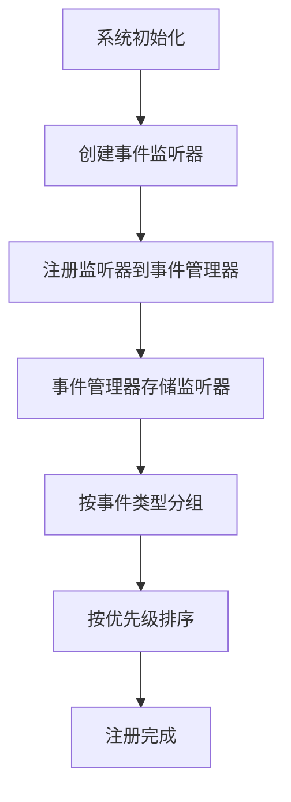
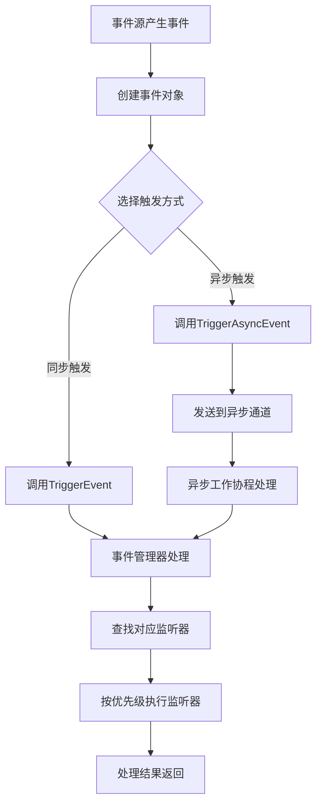
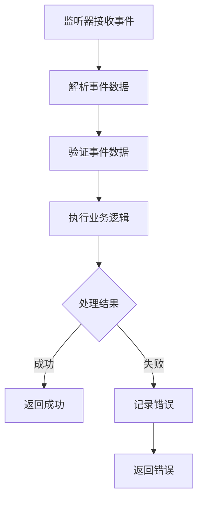
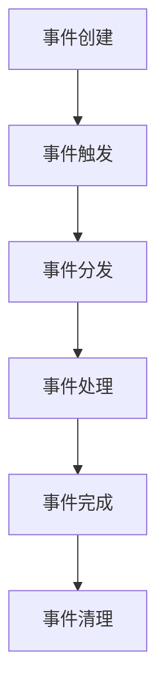
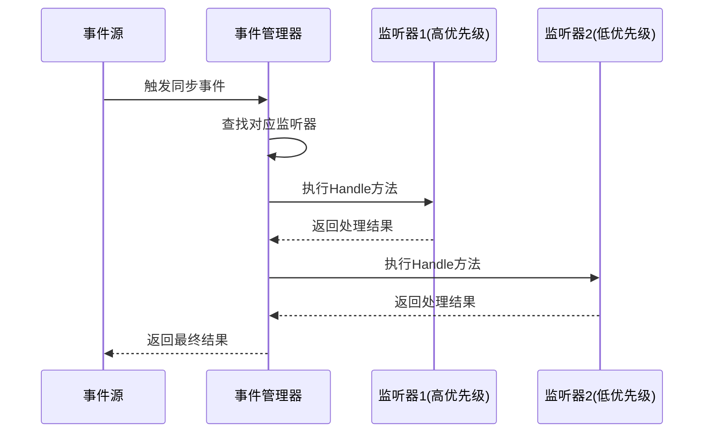
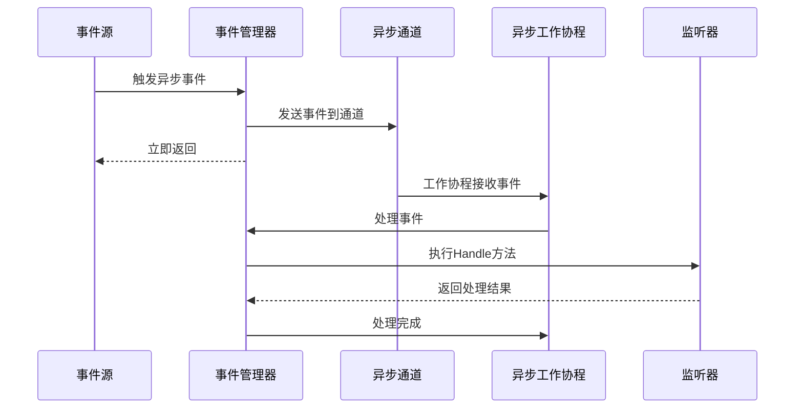
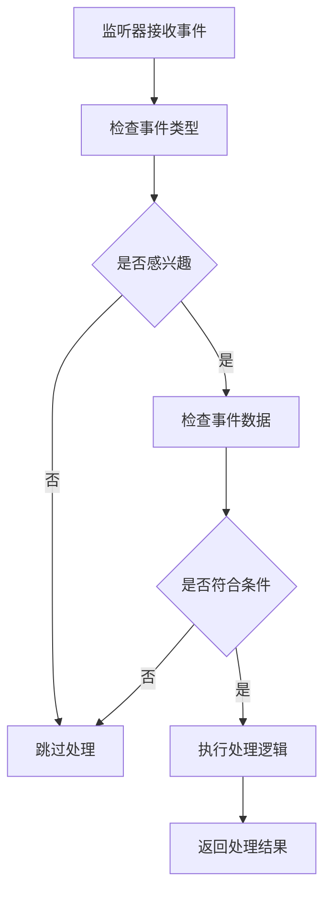
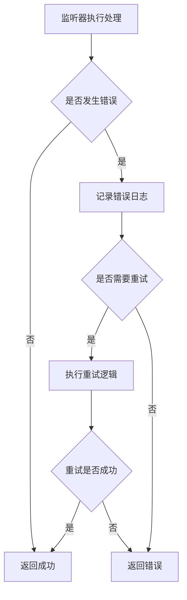
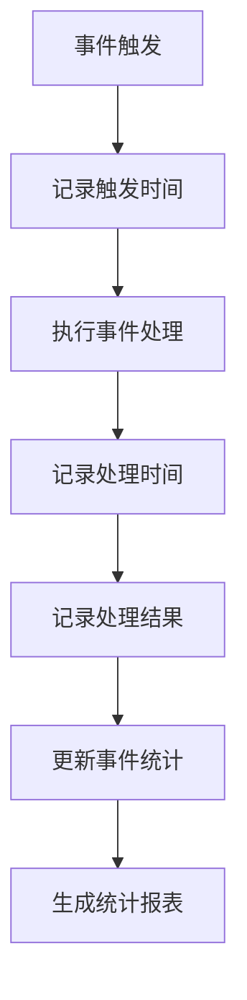

# 事件系统 - 业务流程文档

## 1. 概述
本文档描述了事件系统的核心业务流程，包括事件的注册、触发、分发和处理等关键环节。通过标准化的业务流程，确保事件系统能够高效、可靠地处理游戏内的各种事件。

## 2. 核心业务流程

### 2.1 事件注册流程

**流程描述**：各系统在初始化时注册感兴趣的事件类型和对应的处理逻辑。

**流程图**：


**详细步骤**：
1. **系统初始化**：游戏服务端启动时，各子系统依次初始化
2. **创建事件监听器**：各系统创建实现了EventListener接口的监听器实例
3. **注册监听器**：调用EventManager.RegisterListener()方法注册监听器
4. **存储监听器**：事件管理器将监听器存储到内部的映射结构中
5. **分组排序**：按事件类型分组监听器，并按优先级排序
6. **注册完成**：监听器注册成功，等待事件触发

**关键节点**：
- **监听器创建**：确保监听器实现正确的接口方法
- **优先级设置**：根据业务需求设置合适的优先级
- **事件类型绑定**：确保监听器绑定到正确的事件类型

### 2.2 事件触发流程

**流程描述**：当游戏内发生特定事件时，相关系统触发对应的事件。

**流程图**：


**详细步骤**：
1. **事件源产生事件**：游戏内发生特定事件，如玩家登录、升级等
2. **创建事件对象**：创建包含事件类型和相关数据的事件对象
3. **选择触发方式**：根据事件类型和业务需求选择同步或异步触发
4. **调用触发方法**：
   - 同步触发：调用EventManager.TriggerEvent()
   - 异步触发：调用EventManager.TriggerAsyncEvent()
5. **事件管理器处理**：
   - 同步：直接处理事件
   - 异步：通过通道发送到工作协程
6. **查找监听器**：根据事件类型查找对应的监听器列表
7. **执行监听器**：按优先级顺序执行监听器的Handle方法
8. **返回结果**：返回事件处理结果

**关键节点**：
- **事件对象创建**：确保事件对象包含必要的信息
- **触发方式选择**：根据事件的紧急程度和处理时间选择合适的触发方式
- **监听器查找**：确保能够快速找到对应的监听器

### 2.3 事件处理流程

**流程描述**：监听器接收到事件后，执行相应的处理逻辑。

**流程图**：


**详细步骤**：
1. **接收事件**：监听器的Handle方法被调用，接收事件对象
2. **解析事件数据**：从事件对象中提取和解析事件数据
3. **验证事件数据**：验证事件数据的有效性和完整性
4. **执行业务逻辑**：根据事件类型和数据执行相应的业务逻辑
5. **处理结果**：
   - 成功：返回nil
   - 失败：记录错误并返回错误信息

**关键节点**：
- **数据解析**：确保正确解析事件数据
- **业务逻辑执行**：确保业务逻辑正确处理事件
- **错误处理**：确保错误能够被正确记录和处理

### 2.4 事件生命周期管理

**流程描述**：事件从创建到销毁的完整生命周期管理。

**流程图**：


**详细步骤**：
1. **事件创建**：创建事件对象，设置事件类型和数据
2. **事件触发**：调用事件管理器的触发方法
3. **事件分发**：事件管理器将事件分发给对应的监听器
4. **事件处理**：监听器执行事件处理逻辑
5. **事件完成**：所有监听器处理完成
6. **事件清理**：清理事件相关的资源

**关键节点**：
- **事件创建**：确保事件对象的正确创建
- **事件分发**：确保事件能够正确分发到所有相关监听器
- **事件清理**：确保事件相关的资源能够正确释放

## 3. 同步事件处理流程

**流程描述**：同步事件的处理流程，适用于需要立即处理且结果对调用方重要的事件。

**流程图**：


**特点**：
- 阻塞式处理，调用方需要等待所有监听器处理完成
- 处理结果直接返回给调用方
- 适用于需要立即响应的事件

## 4. 异步事件处理流程

**流程描述**：异步事件的处理流程，适用于处理时间较长且不需要立即响应的事件。

**流程图**：


**特点**：
- 非阻塞式处理，调用方无需等待处理完成
- 处理结果不直接返回给调用方
- 适用于处理时间较长的事件
- 提高系统响应速度和吞吐量

## 5. 事件过滤流程

**流程描述**：监听器根据事件内容决定是否处理事件。

**流程图**：


**详细步骤**：
1. **接收事件**：监听器接收事件对象
2. **检查事件类型**：检查事件类型是否是监听器感兴趣的类型
3. **检查事件数据**：检查事件数据是否符合监听器的处理条件
4. **执行处理**：如果符合条件，执行处理逻辑
5. **跳过处理**：如果不符合条件，跳过处理

**应用场景**：
- 监听器只处理特定条件的事件
- 减少不必要的处理开销
- 提高事件处理的效率

## 6. 错误处理流程

**流程描述**：处理事件处理过程中可能出现的错误。

**流程图**：


**详细步骤**：
1. **执行处理**：监听器执行事件处理逻辑
2. **检查错误**：检查是否发生错误
3. **记录错误**：如果发生错误，记录详细的错误日志
4. **决定重试**：根据错误类型决定是否需要重试
5. **执行重试**：如果需要重试，执行重试逻辑
6. **返回结果**：返回最终的处理结果

**关键节点**：
- **错误记录**：确保错误信息被详细记录
- **重试策略**：根据错误类型制定合适的重试策略
- **错误传播**：确保错误能够被正确传播和处理

## 7. 事件统计流程

**流程描述**：统计事件的触发频率、处理时间和成功率等指标。

**流程图**：


**详细步骤**：
1. **事件触发**：事件被触发时开始统计
2. **记录时间**：记录事件的触发时间和处理时间
3. **记录结果**：记录事件处理的成功或失败
4. **更新统计**：更新事件统计数据
5. **生成报表**：定期生成事件统计报表

**统计指标**：
- **触发频率**：单位时间内事件的触发次数
- **处理时间**：事件处理的平均时间和最大时间
- **成功率**：事件处理的成功比例
- **失败率**：事件处理的失败比例

## 8. 业务流程优化

### 8.1 性能优化

**优化策略**：
- **监听器缓存**：缓存常用的监听器，减少查找开销
- **异步处理**：将耗时较长的事件处理改为异步
- **批量处理**：对相似事件进行批量处理
- **优先级调度**：优先处理高优先级事件

**优化效果**：
- 提高事件处理速度
- 减少系统响应时间
- 提高系统吞吐量

### 8.2 可靠性优化

**优化策略**：
- **错误重试**：对可重试的错误进行自动重试
- **故障隔离**：确保单个监听器故障不影响其他监听器
- **降级处理**：当系统负载过高时，降级处理非关键事件
- **数据校验**：加强事件数据的校验，减少错误发生

**优化效果**：
- 提高事件处理的成功率
- 增强系统的稳定性
- 减少因错误导致的系统异常

### 8.3 可扩展性优化

**优化策略**：
- **动态注册**：支持运行时动态注册监听器
- **插件化**：将监听器实现为插件，支持热插拔
- **配置驱动**：通过配置文件管理事件和监听器
- **模块化**：将事件处理逻辑模块化，便于扩展

**优化效果**：
- 提高系统的可扩展性
- 减少系统维护成本
- 加快新功能的上线速度

## 9. 业务流程规范

### 9.1 事件命名规范

**规范要求**：
- 事件类型使用大写字母和下划线组合
- 事件名称应具有明确的语义
- 避免使用模糊或歧义的事件名称

**示例**：
- 正确：`PLAYER_LOGIN`, `ACTIVITY_START`
- 错误：`EVENT1`, `ACTION`

### 9.2 事件数据规范

**规范要求**：
- 事件数据应包含必要的信息
- 事件数据结构应保持稳定
- 避免在事件数据中包含过大的对象

**示例**：
```go
// 正确的事件数据
map[string]interface{}{
    "playerId": 12345,
    "timestamp": time.Now().Unix(),
    "ip": "192.168.1.1",
}

// 错误的事件数据（包含过大对象）
map[string]interface{}{
    "player": playerObject, // 包含完整的玩家对象
}
```

### 9.3 监听器实现规范

**规范要求**：
- 监听器应职责单一，专注于处理特定类型的事件
- 监听器处理逻辑应简洁高效
- 监听器应妥善处理可能的错误

**示例**：
```go
// 正确的监听器实现
func (l *LoginListener) Handle(event Event) error {
    data := event.Data().(map[string]interface{})
    playerId := data["playerId"].(int64)
    
    // 处理登录事件
    if err := l.processLogin(playerId); err != nil {
        log.Printf("Error processing login for player %d: %v", playerId, err)
        return err
    }
    
    return nil
}

// 错误的监听器实现（职责不单一）
func (l *MultiListener) Handle(event Event) error {
    switch event.Type() {
    case EventTypePlayerLogin:
        // 处理登录事件
    case EventTypePlayerLogout:
        // 处理登出事件
    case EventTypePlayerLevelUp:
        // 处理升级事件
    }
    return nil
}
```

### 9.4 错误处理规范

**规范要求**：
- 监听器应返回详细的错误信息
- 事件管理器应记录错误但不中断事件处理
- 对可重试的错误应进行适当的重试

**示例**：
```go
// 正确的错误处理
func (l *Listener) Handle(event Event) error {
    if err := l.processEvent(event); err != nil {
        // 记录详细错误
        log.Printf("Error handling %s event: %v, data: %v", event.Type(), err, event.Data())
        return fmt.Errorf("failed to process %s event: %w", event.Type(), err)
    }
    return nil
}

// 错误的错误处理（吞掉错误）
func (l *Listener) Handle(event Event) error {
    if err := l.processEvent(event); err != nil {
        // 没有记录错误
        return nil
    }
    return nil
}
```

## 10. 流程监控与审计

### 10.1 监控指标

**核心指标**：
- **事件触发率**：单位时间内事件的触发次数
- **事件处理延迟**：事件从触发到处理完成的时间
- **事件处理成功率**：事件处理成功的比例
- **异步队列长度**：异步事件队列的长度
- **监听器执行时间**：各监听器的平均执行时间

**监控工具**：
- Prometheus + Grafana：监控事件系统的各项指标
- ELK Stack：收集和分析事件处理日志
- 自定义监控面板：展示事件系统的运行状态

### 10.2 审计日志

**审计内容**：
- 事件的触发和处理记录
- 监听器的注册和注销
- 事件系统的配置变更
- 事件处理的错误和异常

**审计工具**：
- 结构化日志：记录详细的审计信息
- 日志聚合系统：集中管理审计日志
- 审计报表：定期生成事件系统的审计报表

## 11. 业务流程测试

### 11.1 单元测试

**测试内容**：
- 事件注册和触发
- 同步和异步事件处理
- 监听器优先级
- 错误处理
- 事件过滤

**测试工具**：
- Go标准测试库
- Mock框架：模拟事件源和监听器

### 11.2 集成测试

**测试内容**：
- 事件系统与其他系统的集成
- 高并发场景下的性能
- 异常情况下的可靠性
- 系统重启后的状态恢复

**测试工具**：
- 集成测试框架
- 压力测试工具：模拟高并发场景

### 11.3 测试用例

**示例测试用例**：
1. **事件注册测试**：测试监听器注册是否成功
2. **事件触发测试**：测试事件触发是否正确
3. **优先级测试**：测试监听器优先级是否生效
4. **异步事件测试**：测试异步事件处理是否正常
5. **错误处理测试**：测试错误处理是否正确
6. **并发测试**：测试高并发场景下的性能

## 12. 总结

通过标准化的业务流程，事件系统能够高效、可靠地处理游戏内的各种事件。从事件的注册、触发到处理，每个环节都有明确的流程和规范，确保事件系统的稳定性和可扩展性。同时，通过持续的性能优化和监控，不断提升事件系统的处理能力和可靠性，为游戏提供更好的用户体验。