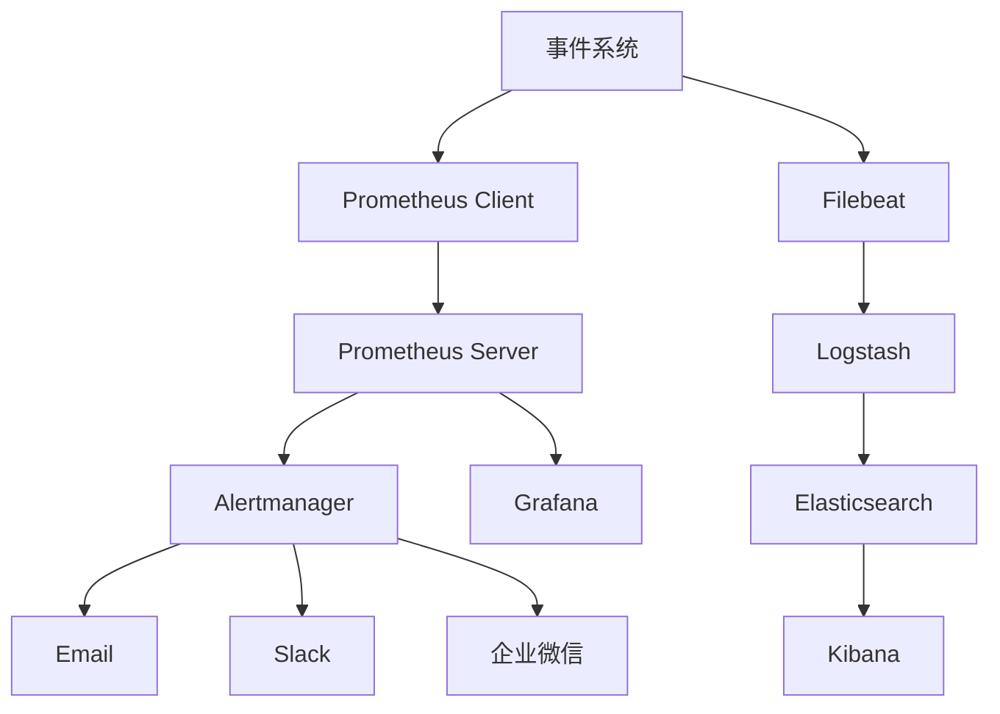

# 事件系统 - 监控与维护

## 1. 概述
本文档描述了事件系统的监控策略、维护方法和最佳实践，确保事件系统能够稳定、高效地运行。通过建立完善的监控与维护体系，可以及时发现和解决问题，提高系统的可靠性和可用性。

## 2. 监控体系

### 2.1 监控目标
- **实时监控**：实时监控系统的运行状态和性能
- **及时告警**：当系统出现异常时及时告警
- **问题定位**：快速定位和解决问题
- **性能优化**：通过监控数据优化系统性能
- **趋势分析**：分析系统运行趋势，预测潜在问题

### 2.2 监控指标

**核心指标**：

| 指标名称 | 描述 | 单位 | 阈值 | 告警级别 |
|---------|------|------|------|--------|
| 事件触发率 | 单位时间内事件的触发次数 | events/sec | > 1000 | 警告 |
| 事件处理延迟 | 事件从触发到处理完成的时间 | ms | > 100 | 警告 |
| 事件处理成功率 | 事件处理成功的比例 | % | < 99.9 | 警告 |
| 异步队列长度 | 异步事件队列的长度 | 个 | > 1000 | 警告 |
| 异步队列满率 | 异步事件队列满的比例 | % | > 1 | 警告 |
| 监听器执行时间 | 监听器执行的平均时间 | ms | > 50 | 警告 |
| 监听器错误率 | 监听器执行错误的比例 | % | > 0.1 | 警告 |
| 系统CPU使用率 | 系统CPU的使用情况 | % | > 80 | 警告 |
| 系统内存使用率 | 系统内存的使用情况 | % | > 80 | 警告 |
| 网络IO | 网络输入输出流量 | MB/s | > 100 | 警告 |
| 磁盘IO | 磁盘输入输出流量 | MB/s | > 50 | 警告 |

**业务指标**：

| 指标名称 | 描述 | 单位 | 阈值 | 告警级别 |
|---------|------|------|------|--------|
| 玩家登录事件数 | 单位时间内玩家登录事件的数量 | events/sec | - | 信息 |
| 玩家登出事件数 | 单位时间内玩家登出事件的数量 | events/sec | - | 信息 |
| 玩家升级事件数 | 单位时间内玩家升级事件的数量 | events/sec | - | 信息 |
| 活动开始事件数 | 单位时间内活动开始事件的数量 | events/sec | - | 信息 |
| 活动结束事件数 | 单位时间内活动结束事件的数量 | events/sec | - | 信息 |

### 2.3 监控工具

**核心工具**：

- **Prometheus**：开源的监控系统，用于收集和存储监控指标
- **Grafana**：开源的数据可视化工具，用于展示监控指标
- **Alertmanager**：Prometheus的告警组件，用于处理和发送告警
- **ELK Stack**：Elasticsearch、Logstash、Kibana的组合，用于日志收集、分析和可视化

**辅助工具**：

- **Node Exporter**：收集主机级别的监控指标
- **MySQL Exporter**：收集MySQL数据库的监控指标
- **Blackbox Exporter**：监控网络服务的可用性

### 2.4 监控架构

**架构图**：

**组件说明**：
- **Prometheus Client**：在事件系统中集成，收集事件系统的监控指标
- **Prometheus Server**：定期从Prometheus Client拉取监控指标，存储到时间序列数据库
- **Alertmanager**：根据预定义的规则处理告警，发送到不同的通知渠道
- **Grafana**：从Prometheus Server获取数据，展示监控面板
- **Filebeat**：收集事件系统的日志
- **Logstash**：处理和转换日志数据
- **Elasticsearch**：存储和索引日志数据
- **Kibana**：搜索和可视化日志数据

### 2.5 告警策略

**告警级别**：
- **紧急**：系统无法正常运行，需要立即处理
- **警告**：系统出现异常，需要及时处理
- **信息**：系统运行状态信息，不需要立即处理

**告警规则**：

| 规则名称 | 指标 | 条件 | 持续时间 | 级别 | 通知渠道 |
|---------|------|------|---------|------|----------|
| 事件处理成功率低 | event_processing_success_rate | < 99% | 5m | 紧急 | 邮件、企业微信 |
| 异步队列满 | async_queue_full | > 0 | 1m | 警告 | 邮件、企业微信 |
| 系统CPU使用率高 | system_cpu_usage | > 80% | 10m | 警告 | 邮件 |
| 系统内存使用率高 | system_memory_usage | > 80% | 10m | 警告 | 邮件 |
| 事件处理延迟高 | event_processing_latency | > 200ms | 5m | 警告 | 邮件 |

**告警通知**：
- **邮件**：发送详细的告警邮件
- **企业微信**：发送告警消息到企业微信群
- **Slack**：发送告警消息到Slack频道
- **电话**：对于紧急告警，可配置电话通知

## 3. 维护体系

### 3.1 维护目标
- **系统稳定**：确保系统稳定运行，减少故障发生
- **性能优化**：持续优化系统性能，提高系统效率
- **问题预防**：通过维护预防问题发生
- **快速恢复**：当系统出现故障时，快速恢复系统运行

### 3.2 维护类型

**日常维护**：
- **日志检查**：检查系统日志，发现和解决问题
- **监控检查**：检查监控指标，发现异常情况
- **系统检查**：检查系统状态，确保系统正常运行

**定期维护**：
- **数据清理**：清理过期的事件数据和日志
- **备份**：备份系统配置和数据
- **优化**：根据监控数据优化系统配置
- **安全检查**：进行安全检查，发现和修复安全问题

**应急维护**：
- **故障处理**：处理系统故障，恢复系统运行
- **性能问题**：解决系统性能问题
- **安全事件**：处理安全事件，修复安全漏洞

### 3.3 维护流程

**日常维护流程**：
1. **检查日志**：使用ELK Stack检查系统日志，发现异常
2. **检查监控**：使用Grafana检查监控指标，发现异常
3. **分析问题**：分析发现的问题，确定原因
4. **解决问题**：采取措施解决问题
5. **记录问题**：记录问题的发现和解决过程

**定期维护流程**：
1. **制定计划**：制定维护计划，包括维护内容、时间和负责人
2. **执行维护**：按照计划执行维护任务
3. **验证结果**：验证维护结果，确保维护任务完成
4. **记录维护**：记录维护过程和结果

**应急维护流程**：
1. **接收告警**：接收系统告警
2. **确认问题**：确认问题是否真实存在
3. **分析原因**：分析问题原因
4. **制定方案**：制定解决方案
5. **执行方案**：执行解决方案
6. **验证恢复**：验证系统是否恢复正常
7. **记录总结**：记录问题的发现、解决过程和经验教训

### 3.4 维护计划

**日常维护计划**：

| 维护任务 | 频率 | 负责人 | 工具 |
|---------|------|--------|------|
| 日志检查 | 每日 | 运维工程师 | ELK Stack |
| 监控检查 | 每小时 | 监控系统 | Grafana |
| 系统检查 | 每日 | 运维工程师 | 系统命令 |

**定期维护计划**：

| 维护任务 | 频率 | 负责人 | 工具 |
|---------|------|--------|------|
| 数据清理 | 每周 | 运维工程师 | 脚本 |
| 备份 | 每日 | 备份系统 | 备份工具 |
| 优化 | 每月 | 开发工程师 | 监控工具 |
| 安全检查 | 每月 | 安全工程师 | 安全扫描工具 |

**应急维护计划**：

| 维护任务 | 触发条件 | 负责人 | 工具 |
|---------|---------|--------|------|
| 故障处理 | 系统故障 | 运维工程师、开发工程师 | 诊断工具 |
| 性能问题 | 性能下降 | 开发工程师 | 性能分析工具 |
| 安全事件 | 安全告警 | 安全工程师、开发工程师 | 安全工具 |

## 4. 常见问题与解决方案

### 4.1 事件处理延迟高

**症状**：事件处理延迟增加，系统响应变慢

**可能原因**：
- 系统负载过高
- 监听器执行时间过长
- 异步工作协程数量不足
- 数据库性能下降
- 网络延迟增加

**解决方案**：
- 增加系统资源（CPU、内存）
- 优化监听器实现，减少执行时间
- 增加异步工作协程数量
- 优化数据库性能（索引、查询）
- 检查网络状态，解决网络延迟问题

### 4.2 异步队列满

**症状**：异步事件队列满，事件无法入队

**可能原因**：
- 事件触发频率过高
- 异步工作协程数量不足
- 监听器执行时间过长
- 异步队列容量过小

**解决方案**：
- 增加异步工作协程数量
- 优化监听器实现，减少执行时间
- 增加异步队列容量
- 考虑使用消息队列（如Kafka、RabbitMQ）处理高并发事件

### 4.3 监听器错误率高

**症状**：监听器执行错误的比例增加

**可能原因**：
- 监听器实现错误
- 事件数据格式错误
- 依赖服务失败
- 系统资源不足

**解决方案**：
- 检查监听器实现，修复错误
- 检查事件数据格式，确保数据正确
- 检查依赖服务状态，确保服务正常运行
- 增加系统资源（CPU、内存）

### 4.4 系统内存使用率高

**症状**：系统内存使用情况持续增加

**可能原因**：
- 内存泄漏
- 事件数据过大
- 异步队列容量过大
- 系统负载过高

**解决方案**：
- 检查代码，修复内存泄漏
- 优化事件数据结构，减少数据大小
- 调整异步队列容量
- 增加系统内存

### 4.5 数据库性能下降

**症状**：数据库操作延迟增加，影响事件处理

**可能原因**：
- 数据库连接池不足
- SQL查询效率低下
- 数据库索引不合理
- 数据库服务器资源不足

**解决方案**：
- 增加数据库连接池大小
- 优化SQL查询，使用索引
- 调整数据库索引
- 增加数据库服务器资源（CPU、内存、磁盘）

## 5. 性能优化

### 5.1 系统优化

**优化策略**：
- **增加系统资源**：根据系统负载增加CPU、内存等资源
- **负载均衡**：使用负载均衡分散系统负载
- **水平扩展**：通过增加服务器数量扩展系统能力
- **垂直扩展**：通过增加单个服务器的资源扩展系统能力

**优化效果**：
- 提高系统处理能力
- 减少系统响应时间
- 提高系统稳定性

### 5.2 代码优化

**优化策略**：
- **监听器优化**：优化监听器实现，减少执行时间
- **事件数据优化**：优化事件数据结构，减少数据大小
- **并发优化**：使用并发编程提高处理能力
- **缓存优化**：使用缓存减少重复计算和数据库操作

**优化效果**：
- 提高事件处理速度
- 减少系统资源使用
- 提高系统吞吐量

### 5.3 配置优化

**优化策略**：
- **异步工作协程数量**：根据系统CPU核心数调整
- **异步队列容量**：根据事件触发频率调整
- **监听器优先级**：合理设置监听器优先级
- **数据库连接池**：根据系统负载调整连接池大小

**优化效果**：
- 提高系统资源利用率
- 减少系统瓶颈
- 提高系统性能

### 5.4 数据库优化

**优化策略**：
- **索引优化**：为常用查询字段添加索引
- **查询优化**：优化SQL查询语句
- **分区表**：对大表使用分区表
- **读写分离**：使用读写分离提高数据库性能

**优化效果**：
- 提高数据库查询速度
- 减少数据库负载
- 提高系统整体性能

## 6. 安全管理

### 6.1 安全风险

**潜在风险**：
- **注入攻击**：通过事件数据注入恶意代码
- **拒绝服务攻击**：通过大量事件触发导致系统过载
- **数据泄露**：事件数据中包含敏感信息
- **权限提升**：监听器执行权限过高

### 6.2 安全措施

**防护措施**：
- **输入验证**：对事件数据进行严格的输入验证
- **限流措施**：对事件触发频率进行限流
- **数据加密**：对敏感事件数据进行加密
- **权限控制**：严格控制监听器的执行权限
- **安全审计**：记录所有事件操作，便于审计

**安全配置**：
- **最小权限原则**：监听器只拥有必要的权限
- **网络隔离**：将事件系统部署在安全的网络环境中
- **防火墙**：配置防火墙，只开放必要的端口
- **入侵检测**：部署入侵检测系统，及时发现攻击

### 6.3 安全审计

**审计内容**：
- **事件操作审计**：记录所有事件的触发和处理
- **监听器操作审计**：记录所有监听器的注册和执行
- **配置变更审计**：记录所有配置的变更
- **安全事件审计**：记录所有安全相关的事件

**审计工具**：
- **ELK Stack**：收集和分析审计日志
- **SIEM系统**：安全信息和事件管理系统

## 7. 备份与恢复

### 7.1 备份策略

**备份内容**：
- **配置文件**：事件系统的配置文件
- **数据库数据**：事件配置、监听器配置、事件历史等
- **日志数据**：系统日志和事件日志

**备份频率**：
- **配置文件**：每次变更后备份
- **数据库数据**：每日全量备份，每小时增量备份
- **日志数据**：每日备份，保留30天

**备份方式**：
- **本地备份**：在本地服务器上备份
- **远程备份**：在远程服务器上备份
- **云备份**：在云存储服务上备份

### 7.2 恢复策略

**恢复场景**：
- **系统崩溃**：系统因硬件或软件故障崩溃
- **数据丢失**：因误操作或恶意攻击导致数据丢失
- **配置错误**：因配置错误导致系统无法正常运行
- **灾难恢复**：因自然灾害等导致系统完全损坏

**恢复流程**：
1. **停止服务**：停止事件系统服务
2. **恢复数据**：从备份中恢复配置文件、数据库数据和日志数据
3. **启动服务**：启动事件系统服务
4. **验证恢复**：验证系统是否恢复正常

**恢复时间目标**：
- **RTO (Recovery Time Objective)**：系统恢复的目标时间，不超过4小时
- **RPO (Recovery Point Objective)**：数据恢复的目标点，不超过1小时

## 8. 文档管理

### 8.1 文档类型

**系统文档**：
- **架构文档**：系统架构设计
- **设计文档**：系统详细设计
- **部署文档**：系统部署指南
- **监控文档**：系统监控指南
- **维护文档**：系统维护指南

**操作文档**：
- **用户手册**：系统使用指南
- **管理员手册**：系统管理指南
- **故障处理手册**：系统故障处理指南

**技术文档**：
- **API文档**：系统API接口文档
- **数据库文档**：系统数据库设计文档
- **代码文档**：系统代码说明文档

### 8.2 文档维护

**维护流程**：
1. **文档创建**：根据系统设计和实现创建文档
2. **文档更新**：当系统变更时，及时更新相关文档
3. **文档审核**：定期审核文档，确保文档的准确性和完整性
4. **文档归档**：对过时的文档进行归档

**版本控制**：
- 使用版本控制系统（如Git）管理文档
- 为文档设置版本号，与系统版本对应
- 记录文档的变更历史

## 9. 培训与知识传递

### 9.1 培训内容

**技术培训**：
- **系统架构**：事件系统的架构设计和实现
- **API使用**：事件系统API的使用方法
- **监控工具**：监控工具的使用方法
- **故障处理**：系统故障的处理方法

**操作培训**：
- **系统部署**：事件系统的部署流程
- **系统配置**：事件系统的配置方法
- **系统维护**：事件系统的维护方法
- **应急响应**：系统应急响应流程

### 9.2 培训方式

**培训方法**：
- **课堂培训**：组织线下或线上课堂培训
- **实操培训**：通过实际操作进行培训
- **文档学习**：提供详细的文档供学习
- **经验分享**：组织经验分享会议

**培训材料**：
- **幻灯片**：培训幻灯片
- **操作手册**：详细的操作步骤
- **视频教程**：操作视频教程
- **常见问题**：常见问题及解答

### 9.3 知识传递

**知识管理**：
- **知识库**：建立系统知识库，存储系统相关知识
- **经验总结**：定期总结系统运行和维护的经验
- **案例分析**：分析系统故障和问题的案例
- **最佳实践**：总结系统运行和维护的最佳实践

**知识传递**：
- **文档共享**：共享系统相关文档
- **培训课程**：定期组织培训课程
- **技术交流**：组织技术交流会议
- **导师制度**：建立导师制度，指导新员工

## 10. 总结

通过建立完善的监控与维护体系，事件系统能够稳定、高效地运行，及时发现和解决问题，提高系统的可靠性和可用性。监控与维护是一个持续的过程，需要不断地优化和改进，以适应系统的发展和变化。

在监控方面，我们使用Prometheus和Grafana收集和展示监控指标，使用Alertmanager处理告警，使用ELK Stack收集和分析日志。在维护方面，我们制定了日常维护、定期维护和应急维护计划，确保系统的正常运行。

同时，我们注重性能优化、安全管理、备份与恢复、文档管理和培训与知识传递，全面提升系统的质量和可靠性。通过这些措施，事件系统能够更好地服务于游戏业务，为玩家提供更好的游戏体验。