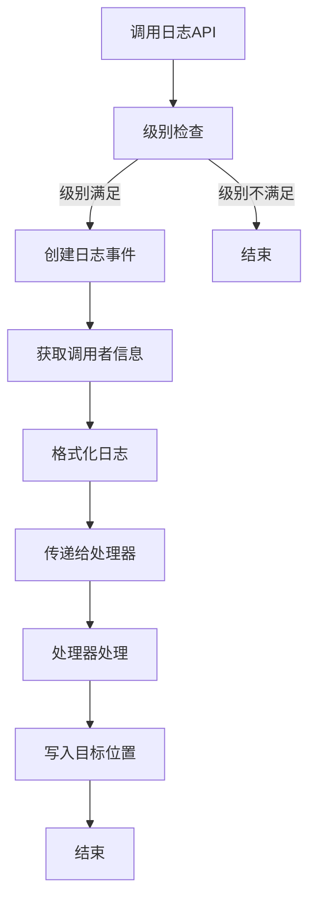
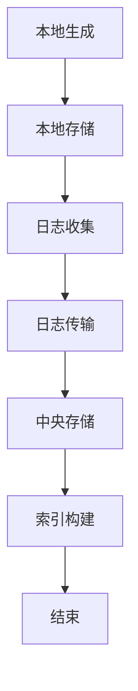
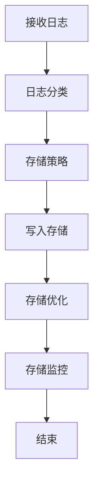
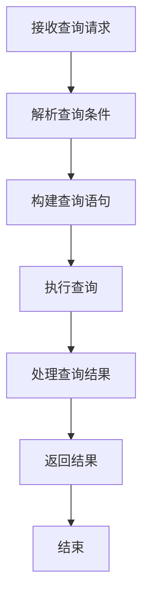
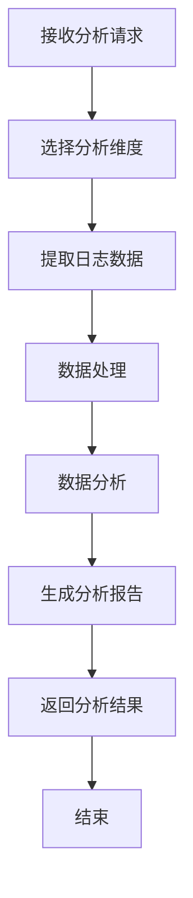
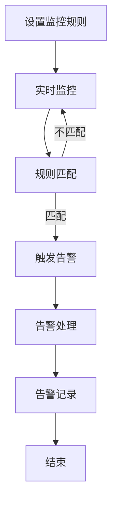
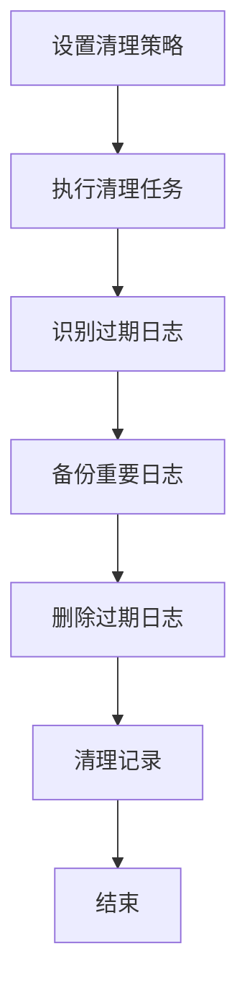

# 日志系统 - 业务流程文档

## 1. 概述
本文档描述了日志系统的业务流程，包括日志生成、收集、存储、查询、分析和监控等核心流程。日志系统作为游戏服务端的重要组成部分，为系统运行状态监控、问题排查、用户行为分析、业务数据分析和安全审计提供了重要支持。

## 2. 核心业务流程

### 2.1 日志生成流程

**流程描述**：业务代码通过日志API生成日志，经过级别过滤、格式化后传递给处理器处理。

**流程步骤**：
1. **调用日志API**：业务代码调用logger的Debug/Info/Warn/Error等方法
2. **级别检查**：检查日志级别是否满足要求
3. **创建日志事件**：创建包含日志信息的Entry对象
4. **获取调用者信息**：获取调用者的文件、行号、函数等信息
5. **格式化日志**：使用格式化器将日志事件格式化为字符串
6. **传递给处理器**：将格式化后的日志传递给所有注册的处理器
7. **处理器处理**：处理器将日志写入目标位置（控制台、文件、数据库等）

**流程图**：

**关键节点**：
- **级别检查**：确保只有符合级别的日志被处理，提高性能
- **格式化**：将日志格式化为合适的格式，便于阅读和分析
- **处理器处理**：将日志写入不同的目标位置，确保日志的可靠性

### 2.2 日志收集流程

**流程描述**：收集分散在各个服务和模块的日志，进行集中处理和存储。

**流程步骤**：
1. **本地生成**：各个服务和模块在本地生成日志
2. **本地存储**：将日志存储在本地文件或内存中
3. **日志收集**：通过日志收集器收集本地日志
4. **日志传输**：将收集的日志传输到中央存储
5. **中央存储**：将日志存储到中央存储系统（如ELK Stack）
6. **索引构建**：为存储的日志构建索引，便于查询和分析

**流程图**：

**关键节点**：
- **日志收集**：确保所有日志都被收集，不丢失
- **日志传输**：确保日志传输的可靠性和安全性
- **索引构建**：确保日志可以快速查询和分析

### 2.3 日志存储流程

**流程描述**：将收集的日志存储到合适的存储介质中，确保日志的可靠性和可访问性。

**流程步骤**：
1. **接收日志**：接收来自日志收集器的日志
2. **日志分类**：根据日志类型对日志进行分类
3. **存储策略**：根据日志类型和重要性选择存储策略
4. **写入存储**：将日志写入存储介质
5. **存储优化**：对存储的日志进行优化，如压缩、索引等
6. **存储监控**：监控存储状态，确保存储的可靠性

**流程图**：

**关键节点**：
- **存储策略**：根据日志类型和重要性选择合适的存储策略
- **写入存储**：确保日志写入的可靠性，不丢失
- **存储优化**：提高存储效率和查询性能

### 2.4 日志查询流程

**流程描述**：根据用户的查询条件，从存储系统中检索相关的日志。

**流程步骤**：
1. **接收查询请求**：接收用户的日志查询请求
2. **解析查询条件**：解析查询条件，如时间范围、级别、关键词等
3. **构建查询语句**：根据查询条件构建查询语句
4. **执行查询**：执行查询操作，从存储系统中检索日志
5. **处理查询结果**：处理查询结果，如排序、分页等
6. **返回结果**：将查询结果返回给用户

**流程图**：

**关键节点**：
- **解析查询条件**：确保查询条件的准确性和有效性
- **构建查询语句**：构建高效的查询语句，提高查询性能
- **处理查询结果**：确保查询结果的准确性和完整性

### 2.5 日志分析流程

**流程描述**：对存储的日志进行分析，提取有价值的信息，发现问题和趋势。

**流程步骤**：
1. **接收分析请求**：接收用户的日志分析请求
2. **选择分析维度**：选择分析维度，如时间、级别、用户、业务等
3. **提取日志数据**：从存储系统中提取相关的日志数据
4. **数据处理**：对提取的日志数据进行处理，如过滤、聚合、统计等
5. **数据分析**：对处理后的数据进行分析，发现问题和趋势
6. **生成分析报告**：根据分析结果生成分析报告
7. **返回分析结果**：将分析结果返回给用户

**流程图**：

**关键节点**：
- **选择分析维度**：选择合适的分析维度，确保分析的有效性
- **数据处理**：确保数据处理的准确性和效率
- **数据分析**：发现有价值的信息和趋势

### 2.6 日志监控流程

**流程描述**：监控日志中的异常信息，及时发现和处理问题。

**流程步骤**：
1. **设置监控规则**：设置日志监控规则，如关键词、级别、频率等
2. **实时监控**：实时监控日志流中的信息
3. **规则匹配**：检查日志是否匹配监控规则
4. **触发告警**：当日志匹配监控规则时，触发告警
5. **告警处理**：处理告警，如通知相关人员、自动修复等
6. **告警记录**：记录告警信息，便于后续分析

**流程图**：

**关键节点**：
- **监控规则**：设置有效的监控规则，确保及时发现问题
- **实时监控**：确保监控的实时性，及时发现问题
- **告警处理**：确保告警得到及时处理，避免问题扩大

### 2.7 日志清理流程

**流程描述**：定期清理过期的日志，避免磁盘空间不足和性能下降。

**流程步骤**：
1. **设置清理策略**：设置日志清理策略，如保留时间、清理频率等
2. **执行清理任务**：按照清理策略执行清理任务
3. **识别过期日志**：识别过期的日志文件或记录
4. **备份重要日志**：备份重要的过期日志
5. **删除过期日志**：删除过期的日志文件或记录
6. **清理记录**：记录清理操作，便于后续审计

**流程图**：

**关键节点**：
- **清理策略**：设置合理的清理策略，确保日志的安全性和存储的有效性
- **备份重要日志**：确保重要的日志不会丢失
- **删除过期日志**：确保过期的日志被及时删除，释放磁盘空间

## 3. 业务场景分析

### 3.1 系统监控场景

**场景描述**：监控系统运行状态，及时发现和处理问题。

**流程**：
1. **设置监控规则**：设置系统错误、异常的监控规则
2. **实时监控**：实时监控系统日志中的错误和异常
3. **触发告警**：当发现错误或异常时，触发告警
4. **告警处理**：通知运维人员处理问题
5. **问题排查**：根据日志信息排查问题原因
6. **问题解决**：解决问题并记录解决方案

**应用**：
- **服务器宕机**：监控服务器宕机事件
- **内存泄漏**：监控内存使用异常
- **CPU过载**：监控CPU使用异常
- **网络异常**：监控网络连接异常
- **数据库异常**：监控数据库操作异常

### 3.2 问题排查场景

**场景描述**：当系统出现问题时，通过日志排查问题原因。

**流程**：
1. **问题发现**：用户或监控系统发现问题
2. **确定时间范围**：确定问题发生的时间范围
3. **查询相关日志**：查询该时间范围内的相关日志
4. **分析日志**：分析日志中的错误信息和上下文
5. **定位问题**：根据日志信息定位问题原因
6. **问题解决**：解决问题并验证解决方案
7. **记录问题**：记录问题原因和解决方案

**应用**：
- **用户登录失败**：查询用户登录相关的日志
- **交易失败**：查询交易相关的日志
- **功能异常**：查询功能相关的日志
- **性能问题**：查询性能相关的日志

### 3.3 用户行为分析场景

**场景描述**：分析用户行为，优化游戏体验和业务流程。

**流程**：
1. **确定分析目标**：确定用户行为分析的目标
2. **选择分析维度**：选择分析维度，如用户类型、时间、操作等
3. **提取用户行为日志**：提取相关的用户行为日志
4. **数据处理**：对提取的日志数据进行处理和清洗
5. **数据分析**：对处理后的数据进行分析，发现用户行为模式
6. **生成分析报告**：根据分析结果生成分析报告
7. **应用分析结果**：根据分析结果优化游戏体验和业务流程

**应用**：
- **用户活跃度**：分析用户登录和在线时长
- **功能使用**：分析用户对不同功能的使用情况
- **付费行为**：分析用户的付费行为和偏好
- **流失预测**：分析用户流失的原因和模式

### 3.4 业务数据分析场景

**场景描述**：分析业务数据，辅助业务决策。

**流程**：
1. **确定分析目标**：确定业务数据分析的目标
2. **选择分析维度**：选择分析维度，如业务类型、时间、地区等
3. **提取业务日志**：提取相关的业务操作日志
4. **数据处理**：对提取的日志数据进行处理和聚合
5. **数据分析**：对处理后的数据进行分析，发现业务趋势和问题
6. **生成分析报告**：根据分析结果生成分析报告
7. **应用分析结果**：根据分析结果调整业务策略

**应用**：
- **业务量分析**：分析不同业务的交易量和趋势
- **收入分析**：分析不同业务的收入和趋势
- **转化率分析**：分析业务的转化率和优化空间
- **库存分析**：分析游戏内物品的库存和需求

### 3.5 安全审计场景

**场景描述**：审计安全相关的事件，确保系统安全。

**流程**：
1. **设置审计规则**：设置安全审计的规则和范围
2. **收集安全日志**：收集系统中的安全相关日志
3. **分析安全日志**：分析安全日志中的异常和可疑行为
4. **生成审计报告**：根据分析结果生成安全审计报告
5. **处理安全问题**：处理发现的安全问题
6. **记录审计结果**：记录审计结果和处理措施

**应用**：
- **登录审计**：审计用户登录行为，发现异常登录
- **权限审计**：审计权限变更和使用情况
- **操作审计**：审计敏感操作的执行情况
- **攻击检测**：检测可能的安全攻击和入侵

## 4. 业务流程优化

### 4.1 性能优化

**优化方向**：
- **异步处理**：使用异步处理器减少对业务代码的影响
- **批量写入**：使用批量写入减少数据库I/O操作
- **缓存机制**：使用缓存减少重复计算和查询
- **级别过滤**：通过级别过滤减少不必要的日志处理

**具体措施**：
- **配置异步处理器**：为文件和数据库处理器配置异步处理
- **调整批量写入参数**：调整批量写入的大小和频率
- **使用内存缓存**：为常用的日志配置和格式化结果使用内存缓存
- **合理设置日志级别**：在生产环境中使用较高的日志级别

### 4.2 可靠性优化

**优化方向**：
- **错误处理**：加强处理器的错误处理，避免处理器故障影响业务
- **重试机制**：为日志写入添加重试机制，提高可靠性
- **备份机制**：为重要日志添加备份机制，确保日志不会丢失
- **优雅关闭**：支持优雅关闭，确保日志不会丢失

**具体措施**：
- **添加错误处理**：在处理器中添加错误处理逻辑
- **实现重试机制**：为网络和I/O操作添加重试机制
- **配置多重存储**：同时将日志存储到多个位置
- **实现优雅关闭**：在程序退出前确保日志处理器完成处理

### 4.3 可维护性优化

**优化方向**：
- **标准化配置**：标准化日志配置，方便管理
- **统一接口**：统一日志接口，方便切换底层实现
- **详细文档**：完善日志系统的文档，方便使用和维护
- **监控工具**：提供日志系统的监控工具，方便维护

**具体措施**：
- **使用配置文件**：使用标准化的配置文件管理日志配置
- **抽象接口**：抽象处理器和格式化器接口，支持插件化
- **完善文档**：编写详细的使用文档和维护指南
- **开发监控工具**：开发日志系统的监控和管理工具

### 4.4 安全性优化

**优化方向**：
- **敏感信息过滤**：过滤日志中的敏感信息
- **访问控制**：控制日志的访问权限
- **加密存储**：加密存储敏感日志信息
- **审计日志**：记录对日志的访问和操作

**具体措施**：
- **实现敏感信息过滤器**：过滤密码、令牌等敏感信息
- **配置访问控制**：设置日志文件和数据库的访问权限
- **使用加密存储**：对敏感日志使用加密存储
- **记录审计日志**：记录对日志的查询和修改操作

## 5. 流程改进建议

### 5.1 日志生成流程改进

**问题**：
- **性能影响**：同步日志处理可能影响业务代码性能
- **调用者信息获取开销**：获取调用者信息可能增加开销
- **日志格式不统一**：不同模块的日志格式可能不一致

**改进建议**：
- **使用异步处理器**：对I/O密集型的处理器使用异步处理
- **可选的调用者信息**：将调用者信息获取改为可选，根据配置决定是否获取
- **统一日志格式**：使用标准化的日志格式，确保所有模块的日志格式一致
- **添加上下文信息**：在日志中添加更多上下文信息，如用户ID、请求ID等

### 5.2 日志收集流程改进

**问题**：
- **日志丢失**：网络故障可能导致日志丢失
- **收集延迟**：日志收集可能存在延迟
- **存储压力**：大量日志可能对存储造成压力

**改进建议**：
- **本地缓冲**：在本地添加日志缓冲，减少网络故障的影响
- **批量收集**：使用批量收集减少网络传输次数
- **压缩传输**：对日志进行压缩传输，减少网络带宽使用
- **分级存储**：根据日志重要性使用不同的存储策略

### 5.3 日志查询流程改进

**问题**：
- **查询性能**：大量日志可能导致查询性能下降
- **查询复杂度**：复杂查询可能难以构建
- **结果准确性**：查询结果可能不够准确

**改进建议**：
- **索引优化**：为常用查询字段添加索引
- **分区存储**：对日志数据进行分区存储，提高查询性能
- **缓存查询结果**：缓存常用查询的结果
- **提供查询工具**：开发用户友好的日志查询工具

### 5.4 日志分析流程改进

**问题**：
- **分析效率**：大量日志可能导致分析效率下降
- **分析复杂度**：复杂分析可能难以实现
- **分析结果价值**：分析结果可能价值不高

**改进建议**：
- **预聚合**：对日志数据进行预聚合，提高分析效率
- **使用专业工具**：使用ELK Stack等专业的日志分析工具
- **自动化分析**：实现自动化的日志分析，减少人工干预
- **结合业务场景**：根据具体的业务场景进行分析，提高分析结果的价值

### 5.5 日志监控流程改进

**问题**：
- **误报率高**：监控规则可能导致误报
- **告警延迟**：告警可能存在延迟
- **告警处理效率**：告警处理可能效率不高

**改进建议**：
- **优化监控规则**：根据实际情况优化监控规则，减少误报
- **实时监控**：使用实时监控技术，减少告警延迟
- **自动化处理**：对常见告警实现自动化处理
- **告警分级**：对告警进行分级，优先处理重要告警

## 6. 总结

本文档描述了日志系统的核心业务流程，包括日志生成、收集、存储、查询、分析和监控等流程。通过合理的流程设计和优化，可以确保日志系统的高性能、可靠性、可维护性和安全性，为游戏服务端的稳定运行和业务发展提供重要支持。

在实际应用中，应根据具体的业务需求和系统规模，选择合适的日志处理方案和优化策略，确保日志系统能够满足实际需求。同时，应定期对日志系统进行评估和改进，不断提高其性能和可靠性。