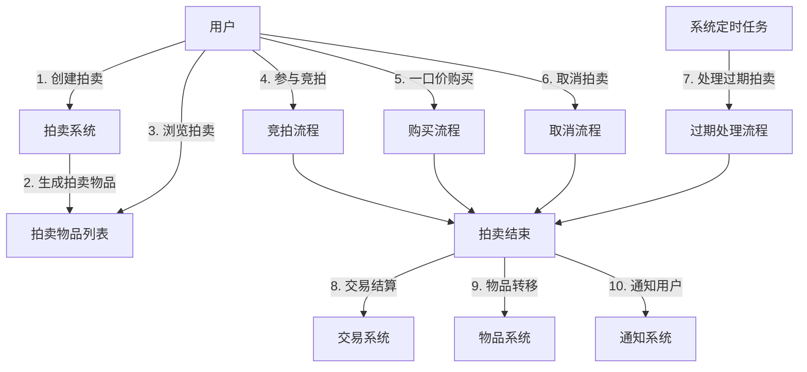
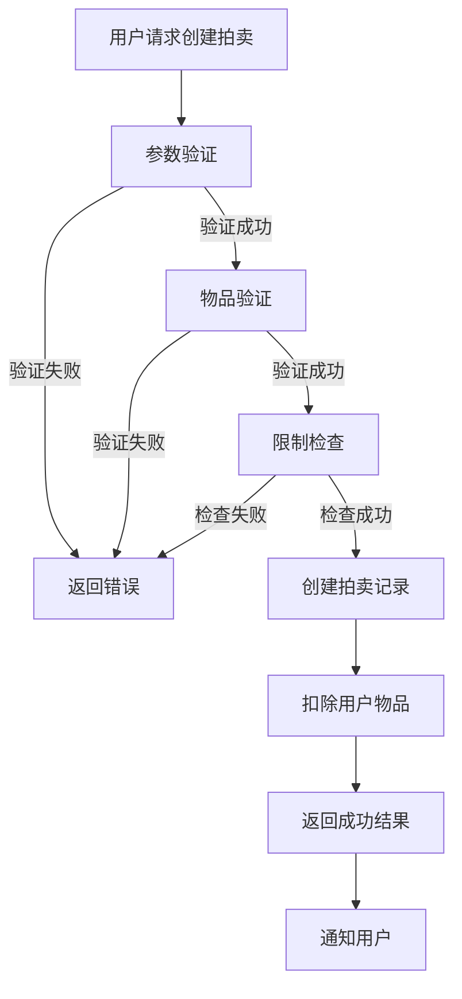
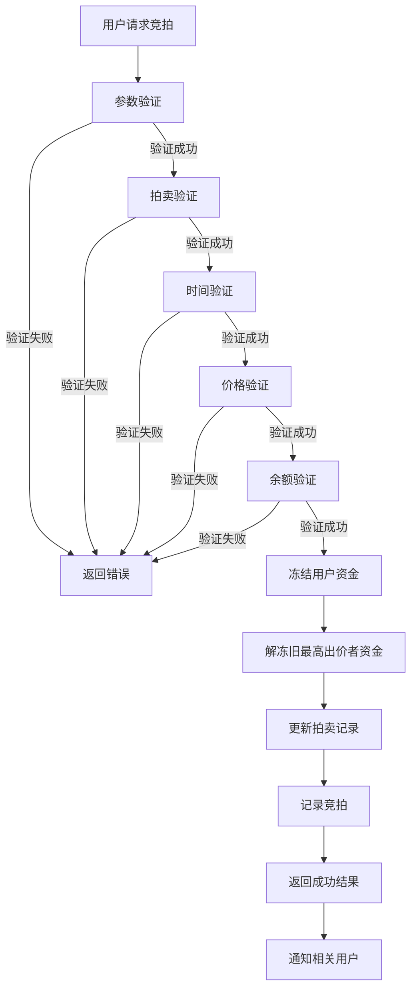
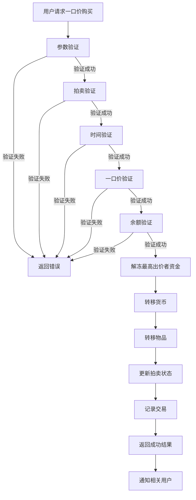
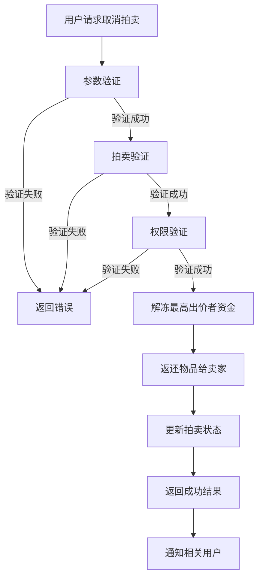
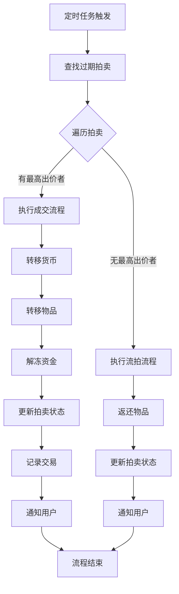
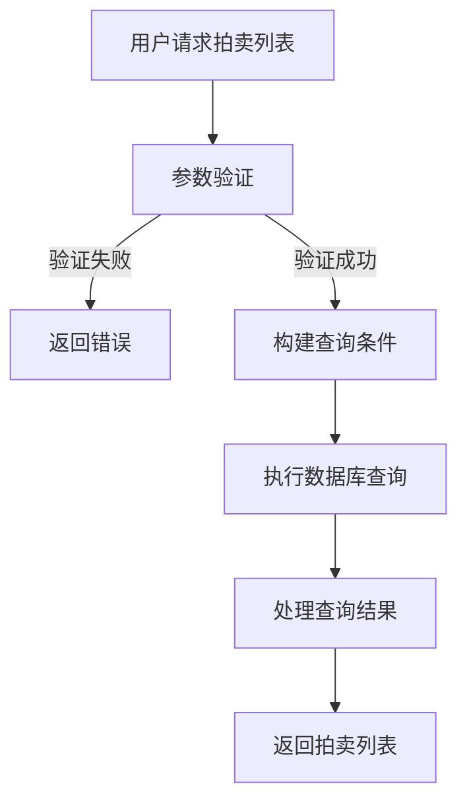
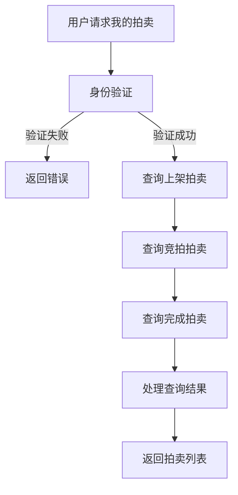

# 拍卖系统 - 业务流程文档

## 1. 概述
本文档描述了拍卖系统的核心业务流程，包括物品拍卖、竞拍、一口价购买、拍卖管理、过期处理等流程。通过标准化的业务流程，确保拍卖系统的各项功能能够正确、安全、高效地执行。

## 2. 流程图

### 2.1 拍卖系统总体流程

## 3. 详细业务流程

### 3.1 创建拍卖流程

**功能说明**：用户将物品上架拍卖，设置起拍价、一口价和拍卖时长。

**流程步骤**：

1. **用户请求**：用户选择物品，设置拍卖参数（起拍价、一口价、时长、分类）
2. **参数验证**：系统验证物品ID、数量、价格等参数是否合法
3. **物品验证**：系统验证用户是否拥有该物品，且数量足够
4. **限制检查**：系统检查用户是否达到最大拍卖物品数量限制
5. **创建拍卖**：系统创建拍卖物品记录，状态为"拍卖中"
6. **物品扣除**：系统从用户背包中扣除相应数量的物品
7. **返回结果**：系统返回拍卖创建成功的结果和拍卖ID
8. **通知用户**：系统通知用户拍卖创建成功

**流程图**：

**关键点**：
- 必须验证用户是否拥有足够数量的物品
- 必须检查用户的拍卖物品数量限制
- 物品扣除和拍卖创建必须在同一个事务中完成，确保数据一致性

### 3.2 竞拍流程

**功能说明**：用户对拍卖物品进行竞拍，出价必须高于当前价格。

**流程步骤**：

1. **用户请求**：用户选择拍卖物品，输入竞拍价格
2. **参数验证**：系统验证拍卖ID和竞拍价格是否合法
3. **拍卖验证**：系统验证拍卖是否存在，状态是否为"拍卖中"
4. **时间验证**：系统验证拍卖是否未过期
5. **价格验证**：系统验证竞拍价格是否高于当前价格，且达到最小加价幅度
6. **余额验证**：系统验证用户是否有足够的货币
7. **冻结资金**：系统冻结用户的竞拍资金
8. **解冻旧资金**：系统解冻上一个最高出价者的资金
9. **更新拍卖**：系统更新拍卖物品的当前价格和最高出价者
10. **记录竞拍**：系统创建竞拍记录
11. **返回结果**：系统返回竞拍成功的结果
12. **通知用户**：系统通知卖家有新的竞拍，通知旧的最高出价者被超越

**流程图**：

**关键点**：
- 必须验证竞拍价格是否高于当前价格，且达到最小加价幅度
- 必须验证用户是否有足够的货币
- 资金冻结和解冻必须在同一个事务中完成，确保资金安全
- 竞拍记录必须详细记录，便于审计和查询

### 3.3 一口价购买流程

**功能说明**：用户以一口价直接购买拍卖物品，立即结束拍卖。

**流程步骤**：

1. **用户请求**：用户选择拍卖物品，点击一口价购买
2. **参数验证**：系统验证拍卖ID是否合法
3. **拍卖验证**：系统验证拍卖是否存在，状态是否为"拍卖中"
4. **时间验证**：系统验证拍卖是否未过期
5. **一口价验证**：系统验证拍卖是否设置了一口价
6. **余额验证**：系统验证用户是否有足够的货币
7. **解冻资金**：系统解冻当前最高出价者的资金
8. **转移货币**：系统从买家账户扣除一口价金额，转入卖家账户
9. **转移物品**：系统将物品从拍卖中转移到买家背包
10. **更新拍卖**：系统更新拍卖状态为"已成交"
11. **记录交易**：系统创建交易记录
12. **返回结果**：系统返回购买成功的结果
13. **通知用户**：系统通知卖家物品已被购买，通知买家购买成功

**流程图**：

**关键点**：
- 必须验证拍卖是否设置了一口价
- 必须验证用户是否有足够的货币
- 货币转移和物品转移必须在同一个事务中完成，确保交易安全
- 必须及时通知相关用户交易结果

### 3.4 取消拍卖流程

**功能说明**：卖家取消正在进行的拍卖，物品返回卖家背包。

**流程步骤**：

1. **用户请求**：卖家请求取消拍卖
2. **参数验证**：系统验证拍卖ID是否合法
3. **拍卖验证**：系统验证拍卖是否存在，状态是否为"拍卖中"
4. **权限验证**：系统验证用户是否是拍卖的卖家
5. **解冻资金**：系统解冻当前最高出价者的资金
6. **返还物品**：系统将物品从拍卖中返还到卖家背包
7. **更新拍卖**：系统更新拍卖状态为"已取消"
8. **返回结果**：系统返回取消成功的结果
9. **通知用户**：系统通知卖家拍卖已取消，通知最高出价者拍卖已被取消

**流程图**：

**关键点**：
- 必须验证用户是否是拍卖的卖家
- 必须解冻最高出价者的资金
- 物品返还和拍卖状态更新必须在同一个事务中完成
- 必须及时通知相关用户取消结果

### 3.5 过期处理流程

**功能说明**：系统定时检查过期的拍卖物品，根据是否有出价者进行不同处理。

**流程步骤**：

1. **定时触发**：系统定时任务触发过期拍卖检查
2. **查找过期拍卖**：系统查询所有状态为"拍卖中"且结束时间已过的拍卖
3. **处理每个拍卖**：
   - **有最高出价者**：执行成交流程
   - **无最高出价者**：执行流拍流程
4. **成交流程**：
   a. 转移货币：从最高出价者账户扣除当前价格，转入卖家账户
   b. 转移物品：将物品从拍卖中转移到最高出价者背包
   c. 解冻资金：解冻最高出价者的资金
   d. 更新拍卖：更新拍卖状态为"已成交"
   e. 记录交易：创建交易记录
   f. 通知用户：通知卖家物品已成交，通知最高出价者拍得物品
5. **流拍流程**：
   a. 返还物品：将物品从拍卖中返还到卖家背包
   b. 更新拍卖：更新拍卖状态为"流拍"
   c. 通知用户：通知卖家物品流拍

**流程图**：

**关键点**：
- 系统必须定时检查过期拍卖，确保及时处理
- 成交流程必须确保货币和物品的安全转移
- 流拍流程必须确保物品正确返还给卖家
- 必须及时通知相关用户处理结果

### 3.6 拍卖查询流程

**功能说明**：用户查询拍卖物品列表，支持分页、分类和排序。

**流程步骤**：

1. **用户请求**：用户请求拍卖列表，可指定分页参数、分类和排序方式
2. **参数验证**：系统验证分页参数是否合法
3. **构建查询**：系统根据参数构建查询条件
4. **执行查询**：系统执行数据库查询，获取拍卖物品列表
5. **处理结果**：系统处理查询结果，计算剩余时间，获取用户名称等
6. **返回结果**：系统返回拍卖物品列表

**流程图**：

**关键点**：
- 必须支持多种排序方式（时间、价格、名称）
- 必须计算拍卖物品的剩余时间
- 必须获取卖家和最高出价者的名称
- 必须支持分页，避免返回过多数据

### 3.7 我的拍卖查询流程

**功能说明**：用户查询自己上架的、参与竞拍的和已完成的拍卖物品。

**流程步骤**：

1. **用户请求**：用户请求"我的拍卖"页面
2. **身份验证**：系统验证用户身份
3. **查询上架拍卖**：系统查询用户上架的、状态为"拍卖中"的物品
4. **查询竞拍拍卖**：系统查询用户参与竞拍的、状态为"拍卖中"的物品
5. **查询完成拍卖**：系统查询用户上架或参与竞拍的、状态为"已成交"或"流拍"的物品
6. **处理结果**：系统处理查询结果，计算剩余时间，获取用户名称等
7. **返回结果**：系统返回三类拍卖物品列表

**流程图**：

**关键点**：
- 必须正确区分用户的不同角色（卖家、竞拍者）
- 必须正确分类不同状态的拍卖物品
- 必须提供详细的拍卖信息，便于用户管理

## 4. 业务规则

### 4.1 拍卖规则

1. **拍卖时长**：支持1小时、6小时、12小时、24小时等多种时长选项
2. **起拍价**：起拍价必须大于0
3. **一口价**：一口价必须大于或等于起拍价，可为0（表示无一口价）
4. **加价幅度**：每次竞拍的加价幅度必须大于等于最小加价幅度（默认100货币单位）
5. **拍卖限制**：每个用户最多同时上架10个拍卖物品
6. **取消限制**：只有卖家可以取消拍卖，且拍卖必须处于"拍卖中"状态
7. **购买限制**：买家不能购买自己上架的拍卖物品
8. **竞拍限制**：用户可以竞拍自己上架的拍卖物品（但系统会阻止最终成交）

### 4.2 交易规则

1. **货币转移**：交易成功后，买家的货币转移给卖家
2. **物品转移**：交易成功后，物品从卖家转移给买家
3. **资金冻结**：竞拍时，系统冻结买家的竞拍资金
4. **资金解冻**：竞拍被超越或拍卖取消时，系统解冻买家的冻结资金
5. **资金使用**：拍卖成交时，系统使用买家的冻结资金完成交易

### 4.3 时间规则

1. **拍卖开始时间**：拍卖创建成功后立即开始
2. **拍卖结束时间**：拍卖开始时间加上拍卖时长
3. **过期处理时间**：系统每1分钟检查一次过期拍卖
4. **时间计算**：所有时间计算以服务器时间为准

### 4.4 通知规则

1. **创建通知**：拍卖创建成功后通知卖家
2. **竞拍通知**：有新竞拍时通知卖家，被超越时通知原最高出价者
3. **购买通知**：一口价购买成功后通知卖家和买家
4. **取消通知**：拍卖取消后通知卖家和最高出价者
5. **成交通知**：拍卖成交后通知卖家和买家
6. **流拍通知**：拍卖流拍后通知卖家

## 5. 异常处理

### 5.1 系统异常

1. **数据库异常**：
   - **处理方式**：记录错误日志，返回系统错误提示
   - **恢复措施**：使用数据库事务，确保数据一致性

2. **Redis异常**：
   - **处理方式**：降级到数据库操作，记录错误日志
   - **恢复措施**：待Redis服务恢复后，重新同步数据

3. **服务调用异常**：
   - **处理方式**：记录错误日志，返回系统错误提示
   - **恢复措施**：重试机制，确保服务调用成功

### 5.2 业务异常

1. **物品不存在**：
   - **错误提示**："物品不存在"
   - **处理方式**：返回错误提示，引导用户重新选择

2. **物品数量不足**：
   - **错误提示**："物品数量不足"
   - **处理方式**：返回错误提示，引导用户调整数量

3. **货币不足**：
   - **错误提示**："货币不足"
   - **处理方式**：返回错误提示，引导用户充值或调整出价

4. **拍卖不存在**：
   - **错误提示**："拍卖不存在"
   - **处理方式**：返回错误提示，引导用户重新选择

5. **拍卖未激活**：
   - **错误提示**："拍卖未激活"
   - **处理方式**：返回错误提示，引导用户选择其他拍卖

6. **拍卖已过期**：
   - **错误提示**："拍卖已过期"
   - **处理方式**：返回错误提示，引导用户选择其他拍卖

7. **权限不足**：
   - **错误提示**："权限不足"
   - **处理方式**：返回错误提示，引导用户登录或确认身份

8. **出价过低**：
   - **错误提示**："出价过低"
   - **处理方式**：返回错误提示，引导用户提高出价

9. **一口价不可用**：
   - **错误提示**："一口价不可用"
   - **处理方式**：返回错误提示，引导用户选择竞拍

10. **拍卖数量限制**：
    - **错误提示**："拍卖数量达到上限"
    - **处理方式**：返回错误提示，引导用户取消部分拍卖后再试

## 6. 性能优化

### 6.1 数据库优化

1. **索引优化**：为常用查询字段添加索引，如拍卖状态、结束时间、卖家ID等
2. **分区优化**：对拍卖物品表按时间分区，提高查询性能
3. **缓存优化**：使用Redis缓存热门拍卖物品和竞拍信息
4. **批量操作**：使用批量操作处理过期拍卖，减少数据库交互次数

### 6.2 业务逻辑优化

1. **异步处理**：通知用户等非关键操作使用异步处理
2. **并发控制**：使用锁机制控制并发竞拍，避免竞态条件
3. **限流措施**：对竞拍接口实施限流，防止恶意请求
4. **预热机制**：系统启动时预热缓存，提高首次访问速度

### 6.3 系统架构优化

1. **微服务架构**：将拍卖系统拆分为独立的微服务，提高系统可靠性和可扩展性
2. **负载均衡**：部署多个拍卖服务实例，使用负载均衡器分发请求
3. **消息队列**：使用消息队列处理异步任务，提高系统吞吐量
4. **监控告警**：实时监控系统性能和异常，及时发现和处理问题

## 7. 安全考虑

### 7.1 防作弊措施

1. **竞拍限制**：限制单个用户的竞拍频率，防止恶意竞拍
2. **价格验证**：服务端验证竞拍价格，防止客户端篡改
3. **时间验证**：服务端验证拍卖时间，防止客户端时间作弊
4. **行为分析**：分析用户竞拍行为，识别异常模式

### 7.2 数据安全

1. **数据加密**：敏感数据加密存储
2. **权限控制**：严格控制数据访问权限
3. **审计日志**：记录所有拍卖相关的操作日志
4. **备份恢复**：定期备份拍卖数据，确保数据安全

### 7.3 接口安全

1. **认证授权**：所有修改操作必须进行身份验证和权限检查
2. **参数验证**：严格验证所有接口输入参数
3. **速率限制**：实施API速率限制，防止恶意请求
4. **HTTPS**：使用HTTPS加密传输数据

## 8. 总结

本文档详细描述了拍卖系统的业务流程，包括创建拍卖、竞拍、一口价购买、取消拍卖、过期处理和查询等流程。通过标准化的业务流程和严格的业务规则，确保拍卖系统的各项功能能够正确、安全、高效地执行。

同时，文档还提供了异常处理、性能优化和安全考虑等方面的指导，为拍卖系统的开发和维护提供了全面的参考。

在实际应用中，还需要根据具体的业务需求和系统环境，对业务流程进行进一步的调整和优化，以确保系统的性能和可靠性。