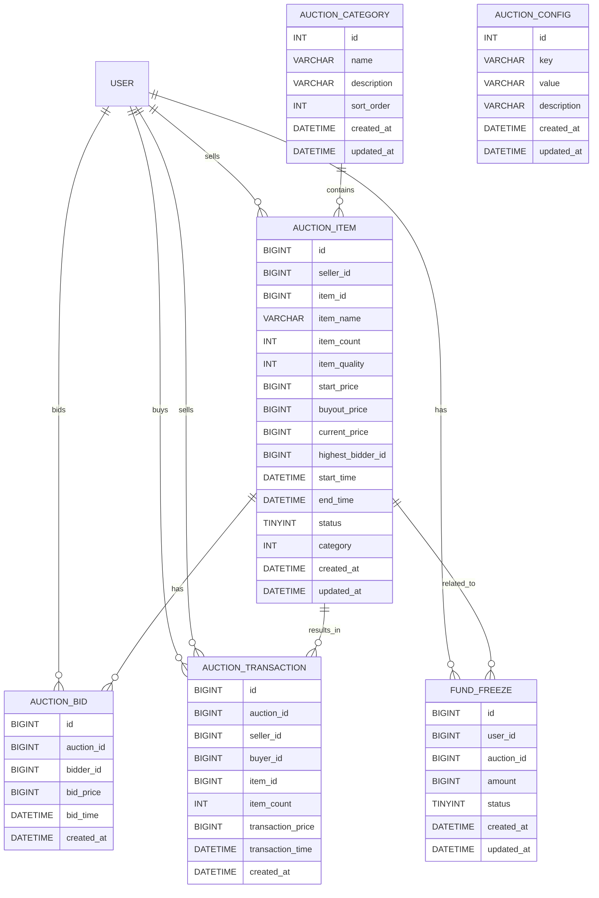

# 拍卖系统 - 数据库设计文档

## 1. 概述
本文档描述了拍卖系统的数据库设计，包括表结构、索引设计、关系模型等。拍卖系统数据库主要用于存储拍卖物品、竞拍记录、交易记录和资金冻结记录等数据，为拍卖系统的正常运行提供数据支持。

## 2. 设计原则

### 2.1 数据完整性
- **主键约束**：每个表都有唯一的主键，确保数据的唯一性
- **外键约束**：建立表之间的关联关系，确保数据的一致性
- **非空约束**：对必要字段设置非空约束，确保数据的完整性
- **检查约束**：对特定字段设置检查约束，确保数据的合法性

### 2.2 性能优化
- **索引设计**：为常用查询字段添加索引，提高查询性能
- **分区设计**：对大表进行分区，提高数据管理和查询性能
- **数据类型**：选择合适的数据类型，减少存储空间和提高查询效率
- **查询优化**：合理设计表结构，减少复杂查询和关联查询

### 2.3 可扩展性
- **模块化设计**：将不同功能的数据存储在不同的表中，便于扩展
- **预留字段**：为可能的业务扩展预留字段
- **命名规范**：使用统一的命名规范，便于维护和理解

### 2.4 安全性
- **数据加密**：对敏感数据进行加密存储
- **权限控制**：严格控制数据库访问权限
- **审计日志**：记录数据库操作日志，便于审计和追踪

## 3. 表结构设计

### 3.1 拍卖物品表 (auction_items)

**表结构**：

| 字段名 | 数据类型 | 约束 | 描述 |
|---------|---------|------|------|
| `id` | `BIGINT UNSIGNED` | `PRIMARY KEY AUTO_INCREMENT` | 拍卖ID |
| `seller_id` | `BIGINT UNSIGNED` | `NOT NULL` | 卖家ID |
| `item_id` | `BIGINT UNSIGNED` | `NOT NULL` | 物品ID |
| `item_name` | `VARCHAR(100)` | `NOT NULL` | 物品名称 |
| `item_count` | `INT` | `NOT NULL` | 物品数量 |
| `item_quality` | `INT` | `NOT NULL` | 物品品质 |
| `start_price` | `BIGINT UNSIGNED` | `NOT NULL` | 起拍价 |
| `buyout_price` | `BIGINT UNSIGNED` | | 一口价 |
| `current_price` | `BIGINT UNSIGNED` | `NOT NULL` | 当前价格 |
| `highest_bidder_id` | `BIGINT UNSIGNED` | | 最高出价者ID |
| `start_time` | `DATETIME` | `NOT NULL` | 开始时间 |
| `end_time` | `DATETIME` | `NOT NULL` | 结束时间 |
| `status` | `TINYINT` | `NOT NULL DEFAULT 0` | 状态（0: 拍卖中, 1: 已成交, 2: 已取消, 3: 流拍） |
| `category` | `INT` | `NOT NULL` | 分类 |
| `created_at` | `DATETIME` | `NOT NULL DEFAULT CURRENT_TIMESTAMP` | 创建时间 |
| `updated_at` | `DATETIME` | `NOT NULL DEFAULT CURRENT_TIMESTAMP ON UPDATE CURRENT_TIMESTAMP` | 更新时间 |

**索引设计**：

| 索引名 | 类型 | 字段 | 描述 |
|---------|------|------|------|
| `PRIMARY` | `PRIMARY KEY` | `id` | 主键索引 |
| `idx_seller_id` | `INDEX` | `seller_id` | 卖家ID索引 |
| `idx_status` | `INDEX` | `status` | 状态索引 |
| `idx_end_time` | `INDEX` | `end_time` | 结束时间索引 |
| `idx_category` | `INDEX` | `category` | 分类索引 |
| `idx_highest_bidder_id` | `INDEX` | `highest_bidder_id` | 最高出价者ID索引 |
| `idx_status_end_time` | `INDEX` | `status, end_time` | 状态和结束时间联合索引 |

### 3.2 竞拍记录表 (auction_bids)

**表结构**：

| 字段名 | 数据类型 | 约束 | 描述 |
|---------|---------|------|------|
| `id` | `BIGINT UNSIGNED` | `PRIMARY KEY AUTO_INCREMENT` | 竞拍记录ID |
| `auction_id` | `BIGINT UNSIGNED` | `NOT NULL` | 拍卖ID |
| `bidder_id` | `BIGINT UNSIGNED` | `NOT NULL` | 出价者ID |
| `bid_price` | `BIGINT UNSIGNED` | `NOT NULL` | 出价金额 |
| `bid_time` | `DATETIME` | `NOT NULL` | 出价时间 |
| `created_at` | `DATETIME` | `NOT NULL DEFAULT CURRENT_TIMESTAMP` | 创建时间 |

**索引设计**：

| 索引名 | 类型 | 字段 | 描述 |
|---------|------|------|------|
| `PRIMARY` | `PRIMARY KEY` | `id` | 主键索引 |
| `idx_auction_id` | `INDEX` | `auction_id` | 拍卖ID索引 |
| `idx_bidder_id` | `INDEX` | `bidder_id` | 出价者ID索引 |
| `idx_auction_bid_time` | `INDEX` | `auction_id, bid_time` | 拍卖ID和出价时间联合索引 |

**外键约束**：

| 外键名 | 字段 | 引用表 | 引用字段 | 约束 |
|---------|------|---------|---------|------|
| `fk_auction_bid_auction` | `auction_id` | `auction_items` | `id` | `ON DELETE CASCADE` |

### 3.3 拍卖交易表 (auction_transactions)

**表结构**：

| 字段名 | 数据类型 | 约束 | 描述 |
|---------|---------|------|------|
| `id` | `BIGINT UNSIGNED` | `PRIMARY KEY AUTO_INCREMENT` | 交易记录ID |
| `auction_id` | `BIGINT UNSIGNED` | `NOT NULL` | 拍卖ID |
| `seller_id` | `BIGINT UNSIGNED` | `NOT NULL` | 卖家ID |
| `buyer_id` | `BIGINT UNSIGNED` | `NOT NULL` | 买家ID |
| `item_id` | `BIGINT UNSIGNED` | `NOT NULL` | 物品ID |
| `item_count` | `INT` | `NOT NULL` | 物品数量 |
| `transaction_price` | `BIGINT UNSIGNED` | `NOT NULL` | 交易金额 |
| `transaction_time` | `DATETIME` | `NOT NULL` | 交易时间 |
| `created_at` | `DATETIME` | `NOT NULL DEFAULT CURRENT_TIMESTAMP` | 创建时间 |

**索引设计**：

| 索引名 | 类型 | 字段 | 描述 |
|---------|------|------|------|
| `PRIMARY` | `PRIMARY KEY` | `id` | 主键索引 |
| `idx_auction_id` | `INDEX` | `auction_id` | 拍卖ID索引 |
| `idx_seller_id` | `INDEX` | `seller_id` | 卖家ID索引 |
| `idx_buyer_id` | `INDEX` | `buyer_id` | 买家ID索引 |
| `idx_transaction_time` | `INDEX` | `transaction_time` | 交易时间索引 |

**外键约束**：

| 外键名 | 字段 | 引用表 | 引用字段 | 约束 |
|---------|------|---------|---------|------|
| `fk_auction_transaction_auction` | `auction_id` | `auction_items` | `id` | `ON DELETE CASCADE` |

### 3.4 资金冻结表 (fund_freezes)

**表结构**：

| 字段名 | 数据类型 | 约束 | 描述 |
|---------|---------|------|------|
| `id` | `BIGINT UNSIGNED` | `PRIMARY KEY AUTO_INCREMENT` | 冻结记录ID |
| `user_id` | `BIGINT UNSIGNED` | `NOT NULL` | 用户ID |
| `auction_id` | `BIGINT UNSIGNED` | `NOT NULL` | 拍卖ID |
| `amount` | `BIGINT UNSIGNED` | `NOT NULL` | 冻结金额 |
| `status` | `TINYINT` | `NOT NULL DEFAULT 0` | 状态（0: 冻结中, 1: 已解冻, 2: 已使用） |
| `created_at` | `DATETIME` | `NOT NULL DEFAULT CURRENT_TIMESTAMP` | 创建时间 |
| `updated_at` | `DATETIME` | `NOT NULL DEFAULT CURRENT_TIMESTAMP ON UPDATE CURRENT_TIMESTAMP` | 更新时间 |

**索引设计**：

| 索引名 | 类型 | 字段 | 描述 |
|---------|------|------|------|
| `PRIMARY` | `PRIMARY KEY` | `id` | 主键索引 |
| `idx_user_id` | `INDEX` | `user_id` | 用户ID索引 |
| `idx_auction_id` | `INDEX` | `auction_id` | 拍卖ID索引 |
| `idx_status` | `INDEX` | `status` | 状态索引 |
| `idx_user_auction` | `INDEX` | `user_id, auction_id` | 用户ID和拍卖ID联合索引 |

**外键约束**：

| 外键名 | 字段 | 引用表 | 引用字段 | 约束 |
|---------|------|---------|---------|------|
| `fk_fund_freeze_auction` | `auction_id` | `auction_items` | `id` | `ON DELETE CASCADE` |

### 3.5 拍卖分类表 (auction_categories)

**表结构**：

| 字段名 | 数据类型 | 约束 | 描述 |
|---------|---------|------|------|
| `id` | `INT UNSIGNED` | `PRIMARY KEY AUTO_INCREMENT` | 分类ID |
| `name` | `VARCHAR(50)` | `NOT NULL` | 分类名称 |
| `description` | `VARCHAR(255)` | | 分类描述 |
| `sort_order` | `INT UNSIGNED` | `NOT NULL DEFAULT 0` | 排序顺序 |
| `created_at` | `DATETIME` | `NOT NULL DEFAULT CURRENT_TIMESTAMP` | 创建时间 |
| `updated_at` | `DATETIME` | `NOT NULL DEFAULT CURRENT_TIMESTAMP ON UPDATE CURRENT_TIMESTAMP` | 更新时间 |

**索引设计**：

| 索引名 | 类型 | 字段 | 描述 |
|---------|------|------|------|
| `PRIMARY` | `PRIMARY KEY` | `id` | 主键索引 |
| `idx_sort_order` | `INDEX` | `sort_order` | 排序顺序索引 |

### 3.6 拍卖配置表 (auction_configs)

**表结构**：

| 字段名 | 数据类型 | 约束 | 描述 |
|---------|---------|------|------|
| `id` | `INT UNSIGNED` | `PRIMARY KEY AUTO_INCREMENT` | 配置ID |
| `key` | `VARCHAR(50)` | `NOT NULL UNIQUE` | 配置键 |
| `value` | `VARCHAR(255)` | `NOT NULL` | 配置值 |
| `description` | `VARCHAR(255)` | | 配置描述 |
| `created_at` | `DATETIME` | `NOT NULL DEFAULT CURRENT_TIMESTAMP` | 创建时间 |
| `updated_at` | `DATETIME` | `NOT NULL DEFAULT CURRENT_TIMESTAMP ON UPDATE CURRENT_TIMESTAMP` | 更新时间 |

**索引设计**：

| 索引名 | 类型 | 字段 | 描述 |
|---------|------|------|------|
| `PRIMARY` | `PRIMARY KEY` | `id` | 主键索引 |
| `idx_key` | `UNIQUE INDEX` | `key` | 配置键唯一索引 |

## 4. 关系模型

### 4.1 实体关系图



### 4.2 关系说明

1. **用户与拍卖物品**：
   - 一个用户可以创建多个拍卖物品（卖家）
   - 一个拍卖物品只能属于一个卖家

2. **用户与竞拍记录**：
   - 一个用户可以参与多个拍卖的竞拍
   - 一个竞拍记录只能属于一个用户

3. **用户与交易记录**：
   - 一个用户可以作为买家参与多个交易
   - 一个用户可以作为卖家参与多个交易
   - 一个交易记录只能有一个买家和一个卖家

4. **用户与资金冻结**：
   - 一个用户可以有多个资金冻结记录
   - 一个资金冻结记录只能属于一个用户

5. **拍卖物品与竞拍记录**：
   - 一个拍卖物品可以有多个竞拍记录
   - 一个竞拍记录只能属于一个拍卖物品

6. **拍卖物品与交易记录**：
   - 一个拍卖物品最多可以有一个交易记录（成功拍卖）
   - 一个交易记录只能属于一个拍卖物品

7. **拍卖物品与资金冻结**：
   - 一个拍卖物品可以有多个资金冻结记录（不同用户的竞拍）
   - 一个资金冻结记录只能属于一个拍卖物品

8. **拍卖分类与拍卖物品**：
   - 一个拍卖分类可以包含多个拍卖物品
   - 一个拍卖物品只能属于一个拍卖分类

## 5. 数据字典

### 5.1 拍卖物品状态 (auction_items.status)

| 状态码 | 描述 |
|---------|------|
| 0 | 拍卖中 |
| 1 | 已成交 |
| 2 | 已取消 |
| 3 | 流拍 |

### 5.2 资金冻结状态 (fund_freezes.status)

| 状态码 | 描述 |
|---------|------|
| 0 | 冻结中 |
| 1 | 已解冻 |
| 2 | 已使用 |

### 5.3 拍卖分类 (auction_categories.id)

| 分类ID | 分类名称 | 描述 |
|---------|---------|------|
| 1 | 武器 | 武器类物品 |
| 2 | 防具 | 防具类物品 |
| 3 | 饰品 | 饰品类物品 |
| 4 | 消耗品 | 消耗品类物品 |
| 5 | 材料 | 材料类物品 |
| 6 | 其他 | 其他类物品 |

### 5.4 拍卖配置 (auction_configs.key)

| 配置键 | 默认值 | 描述 |
|---------|---------|------|
| `max_auction_items_per_user` | 10 | 每个用户最大拍卖物品数 |
| `min_bid_increment` | 100 | 最小加价幅度 |
| `auction_duration_options` | "1,6,12,24" | 拍卖时长选项（小时） |
| `expired_check_interval` | 60 | 过期检查间隔（秒） |
| `cache_ttl` | 300 | 缓存过期时间（秒） |
| `max_concurrent_bids` | 100 | 最大并发竞拍数 |

## 6. 索引优化

### 6.1 核心查询优化

#### 6.1.1 拍卖列表查询

**查询场景**：获取拍卖物品列表，支持分页、分类和排序

**优化策略**：
- 为 `status` 和 `end_time` 字段创建联合索引 `idx_status_end_time`，加速按状态和结束时间的查询
- 为 `category` 字段创建索引 `idx_category`，加速按分类的筛选
- 为 `current_price` 字段创建索引，加速按价格排序的查询
- 为 `item_name` 字段创建索引，加速按名称排序的查询

**示例SQL**：
```sql
SELECT * FROM auction_items 
WHERE status = 0 
AND category = 1 
ORDER BY end_time ASC 
LIMIT 0, 20;
```

#### 6.1.2 过期拍卖查询

**查询场景**：定期查询过期的拍卖物品

**优化策略**：
- 使用 `idx_status_end_time` 联合索引，加速过期拍卖的查询
- 避免全表扫描，只查询状态为拍卖中且结束时间小于当前时间的记录

**示例SQL**：
```sql
SELECT * FROM auction_items 
WHERE status = 0 
AND end_time < NOW();
```

#### 6.1.3 用户拍卖查询

**查询场景**：获取用户上架的拍卖物品、参与竞拍的拍卖物品和已完成的拍卖物品

**优化策略**：
- 为 `seller_id` 字段创建索引 `idx_seller_id`，加速查询用户上架的拍卖
- 为 `highest_bidder_id` 字段创建索引 `idx_highest_bidder_id`，加速查询用户参与竞拍的拍卖
- 为 `status` 字段创建索引 `idx_status`，加速查询已完成的拍卖

**示例SQL**：
```sql
-- 用户上架的拍卖
SELECT * FROM auction_items 
WHERE seller_id = 123 
AND status = 0;

-- 用户参与竞拍的拍卖
SELECT * FROM auction_items 
WHERE highest_bidder_id = 123 
AND status = 0;

-- 用户已完成的拍卖
SELECT * FROM auction_items 
WHERE (seller_id = 123 OR highest_bidder_id = 123) 
AND status IN (1, 3);
```

#### 6.1.4 竞拍记录查询

**查询场景**：获取拍卖的竞拍记录，按时间排序

**优化策略**：
- 为 `auction_id` 和 `bid_time` 字段创建联合索引 `idx_auction_bid_time`，加速按拍卖ID和时间的查询

**示例SQL**：
```sql
SELECT * FROM auction_bids 
WHERE auction_id = 456 
ORDER BY bid_time DESC;
```

### 6.2 索引维护

- **定期分析**：定期使用 `ANALYZE TABLE` 命令分析表，更新索引统计信息
- **定期优化**：定期使用 `OPTIMIZE TABLE` 命令优化表，整理碎片空间
- **监控索引**：监控索引使用情况，移除未使用的索引
- **调整索引**：根据实际查询情况，调整索引设计

## 7. 分区设计

### 7.1 拍卖物品表分区

**分区策略**：按时间范围分区，将不同时间段的拍卖数据存储在不同的分区中

**分区方案**：
- 按 `end_time` 字段分区，每个月一个分区
- 保留最近6个月的活跃分区，历史数据移至归档分区

**分区优势**：
- 提高查询性能，特别是按时间范围的查询
- 便于数据管理，如归档和清理历史数据
- 减少锁的范围，提高并发性能

**示例SQL**：
```sql
CREATE TABLE auction_items (
    -- 字段定义
) PARTITION BY RANGE (UNIX_TIMESTAMP(end_time)) (
    PARTITION p202306 VALUES LESS THAN (UNIX_TIMESTAMP('2023-07-01 00:00:00')),
    PARTITION p202307 VALUES LESS THAN (UNIX_TIMESTAMP('2023-08-01 00:00:00')),
    PARTITION p202308 VALUES LESS THAN (UNIX_TIMESTAMP('2023-09-01 00:00:00')),
    PARTITION p202309 VALUES LESS THAN (UNIX_TIMESTAMP('2023-10-01 00:00:00')),
    PARTITION p202310 VALUES LESS THAN (UNIX_TIMESTAMP('2023-11-01 00:00:00')),
    PARTITION p202311 VALUES LESS THAN (UNIX_TIMESTAMP('2023-12-01 00:00:00')),
    PARTITION p202312 VALUES LESS THAN (MAXVALUE)
);
```

### 7.2 竞拍记录表分区

**分区策略**：按拍卖ID范围分区，将不同拍卖的竞拍记录存储在不同的分区中

**分区优势**：
- 提高查询性能，特别是针对单个拍卖的竞拍记录查询
- 便于数据管理，如删除已完成拍卖的竞拍记录

### 7.3 交易记录表分区

**分区策略**：按时间范围分区，将不同时间段的交易数据存储在不同的分区中

**分区优势**：
- 提高查询性能，特别是按时间范围的交易查询
- 便于数据管理，如归档和清理历史交易数据

## 8. 数据安全

### 8.1 访问控制

- **最小权限原则**：为数据库用户分配最小必要的权限
- **角色管理**：使用角色管理数据库权限，便于权限控制
- **密码策略**：使用强密码策略，定期更换密码
- **网络访问控制**：限制数据库的网络访问范围

### 8.2 数据加密

- **传输加密**：使用SSL/TLS加密数据库连接
- **存储加密**：对敏感数据进行加密存储
- **应用层加密**：在应用层对敏感数据进行加密

### 8.3 备份与恢复

- **定期备份**：定期进行数据库备份，包括全量备份和增量备份
- **备份验证**：定期验证备份的有效性
- **灾难恢复**：制定详细的灾难恢复计划，定期演练
- **异地备份**：将备份数据存储在异地，防止本地灾难

### 8.4 审计与监控

- **审计日志**：开启数据库审计日志，记录所有数据库操作
- **访问监控**：监控数据库访问情况，及时发现异常访问
- **性能监控**：监控数据库性能，及时发现性能问题
- **安全扫描**：定期进行数据库安全扫描，发现安全漏洞

## 9. 性能优化

### 9.1 查询优化

- **避免全表扫描**：使用索引，避免全表扫描
- **合理使用JOIN**：减少复杂的JOIN操作，特别是多表JOIN
- **使用分页查询**：避免一次性查询过多数据
- **合理使用子查询**：优化子查询，避免嵌套过深
- **使用EXPLAIN**：使用EXPLAIN分析查询执行计划，优化查询

### 9.2 存储优化

- **选择合适的数据类型**：根据实际需求选择合适的数据类型
- **避免使用TEXT/BLOB**：尽量避免使用TEXT/BLOB类型，如必须使用，考虑分离存储
- **使用ENUM类型**：对于有限枚举值的字段，使用ENUM类型
- **使用NOT NULL**：对于非空字段，设置NOT NULL约束

### 9.3 事务优化

- **减少事务长度**：尽量减少事务的长度，避免长事务
- **合理使用隔离级别**：根据实际需求选择合适的事务隔离级别
- **避免死锁**：合理设计事务操作顺序，避免死锁
- **使用批量操作**：使用批量操作，减少事务数量

### 9.4 连接优化

- **使用连接池**：使用数据库连接池，减少连接建立和关闭的开销
- **合理设置连接参数**：根据实际需求设置连接超时、最大连接数等参数
- **定期关闭空闲连接**：定期关闭空闲连接，释放资源

## 10. 总结

本文档详细描述了拍卖系统的数据库设计，包括表结构、索引设计、关系模型、分区设计、数据安全和性能优化等方面。该设计遵循了数据完整性、性能优化、可扩展性和安全性的原则，为拍卖系统的正常运行提供了可靠的数据支持。

通过合理的表结构设计和索引优化，拍卖系统可以高效处理大量的拍卖物品、竞拍记录和交易记录，满足高并发场景的需求。同时，通过分区设计和数据安全措施，系统可以更好地管理数据和保障数据安全。

在实际应用中，还需要根据具体的业务需求和系统负载情况，对数据库设计进行进一步的调整和优化，以确保系统的性能和可靠性。