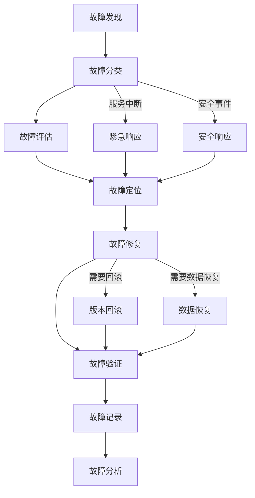

# 拍卖系统 - 监控与维护

## 1. 概述
本文档描述了拍卖系统的监控与维护策略，包括监控指标、监控工具、告警机制、日常维护、故障处理和性能优化等内容。通过建立完善的监控与维护体系，确保拍卖系统的稳定运行和持续优化。

## 2. 监控体系

### 2.1 监控目标

- **系统可用性**：确保拍卖系统的持续可用，及时发现和处理服务中断
- **性能监控**：监控系统性能指标，确保系统响应速度和吞吐量
- **资源使用**：监控服务器、数据库、缓存等资源的使用情况
- **业务指标**：监控拍卖相关的业务指标，如拍卖数量、竞拍次数、交易金额等
- **安全监控**：监控系统安全状况，及时发现和处理安全威胁

### 2.2 监控指标

#### 2.2.1 系统指标

| 指标类别 | 指标名称 | 单位 | 监控频率 | 阈值 | 告警级别 |
|---------|---------|------|---------|------|----------|
| **服务器指标** | CPU使用率 | % | 1分钟 | >80% | 警告 |
| | 内存使用率 | % | 1分钟 | >85% | 警告 |
| | 磁盘使用率 | % | 5分钟 | >90% | 警告 |
| | 磁盘I/O | MB/s | 1分钟 | >80% | 警告 |
| | 网络流量 | MB/s | 1分钟 | >80% | 警告 |
| | 网络连接数 | 个 | 1分钟 | >10000 | 警告 |
| **数据库指标** | CPU使用率 | % | 1分钟 | >80% | 警告 |
| | 内存使用率 | % | 1分钟 | >85% | 警告 |
| | 查询响应时间 | ms | 1分钟 | >500ms | 警告 |
| | 连接数 | 个 | 1分钟 | >500 | 警告 |
| | 慢查询数 | 个/分钟 | 5分钟 | >10 | 警告 |
| | 主从延迟 | s | 1分钟 | >30s | 警告 |
| **Redis指标** | CPU使用率 | % | 1分钟 | >80% | 警告 |
| | 内存使用率 | % | 1分钟 | >85% | 警告 |
| | 命令执行时间 | ms | 1分钟 | >100ms | 警告 |
| | 连接数 | 个 | 1分钟 | >500 | 警告 |
| | 命中率 | % | 1分钟 | <80% | 警告 |

#### 2.2.2 应用指标

| 指标类别 | 指标名称 | 单位 | 监控频率 | 阈值 | 告警级别 |
|---------|---------|------|---------|------|----------|
| **API指标** | 请求量 | 次/分钟 | 1分钟 | - | 信息 |
| | 错误率 | % | 1分钟 | >5% | 警告 |
| | 平均响应时间 | ms | 1分钟 | >500ms | 警告 |
| | 95%响应时间 | ms | 1分钟 | >1000ms | 警告 |
| | 99%响应时间 | ms | 1分钟 | >2000ms | 严重 |
| **gRPC指标** | 请求量 | 次/分钟 | 1分钟 | - | 信息 |
| | 错误率 | % | 1分钟 | >5% | 警告 |
| | 平均响应时间 | ms | 1分钟 | >300ms | 警告 |
| | 95%响应时间 | ms | 1分钟 | >800ms | 警告 |
| **业务指标** | 拍卖创建数 | 个/分钟 | 5分钟 | - | 信息 |
| | 竞拍次数 | 次/分钟 | 5分钟 | - | 信息 |
| | 一口价购买数 | 个/分钟 | 5分钟 | - | 信息 |
| | 交易金额 | 货币单位/分钟 | 5分钟 | - | 信息 |
| | 流拍率 | % | 1小时 | >50% | 警告 |
| | 过期拍卖处理数 | 个/分钟 | 5分钟 | - | 信息 |
| **缓存指标** | 缓存命中率 | % | 1分钟 | <80% | 警告 |
| | 缓存更新频率 | 次/分钟 | 5分钟 | - | 信息 |
| | 缓存大小 | MB | 5分钟 | >80% | 警告 |
| **队列指标** | 队列长度 | 个 | 1分钟 | >1000 | 警告 |
| | 处理延迟 | s | 1分钟 | >30s | 警告 |

#### 2.2.3 安全指标

| 指标类别 | 指标名称 | 单位 | 监控频率 | 阈值 | 告警级别 |
|---------|---------|------|---------|------|----------|
| **安全指标** | 失败登录尝试 | 次/分钟 | 1分钟 | >10 | 警告 |
| | 异常访问模式 | 次/分钟 | 1分钟 | >20 | 警告 |
| | API调用频率 | 次/分钟 | 1分钟 | >1000 | 警告 |
| | 敏感操作次数 | 次/分钟 | 1分钟 | >50 | 警告 |
| | 安全扫描检测 | 次/小时 | 1小时 | >5 | 严重 |

### 2.3 监控工具

#### 2.3.1 核心监控工具

| 工具名称 | 版本 | 用途 | 部署方式 |
|---------|------|------|----------|
| **Prometheus** | 2.40+ | 指标采集和存储 | 容器化部署 |
| **Grafana** | 9.0+ | 指标可视化和仪表盘 | 容器化部署 |
| **Alertmanager** | 0.25+ | 告警管理和通知 | 容器化部署 |
| **Node Exporter** | 1.5+ | 服务器指标采集 | 容器化部署 |
| **MySQL Exporter** | 0.14+ | MySQL指标采集 | 容器化部署 |
| **Redis Exporter** | 1.40+ | Redis指标采集 | 容器化部署 |
| **Blackbox Exporter** | 0.23+ | HTTP/HTTPS监控 | 容器化部署 |
| **Jaeger** | 1.35+ | 分布式追踪 | 容器化部署 |
| **ELK Stack** | 7.17+ | 日志收集和分析 | 容器化部署 |
| **Zabbix** | 6.0+ | 综合监控 | 容器化部署 |

#### 2.3.2 自定义监控

**应用指标暴露**
```go
func setupMetrics() {
    // 注册指标
    httpRequestsTotal = promauto.NewCounterVec(
        prometheus.CounterOpts{
            Name: "auction_service_requests_total",
            Help: "Total number of HTTP requests",
        },
        []string{"endpoint", "method", "status"},
    )
    
    httpRequestDuration = promauto.NewHistogramVec(
        prometheus.HistogramOpts{
            Name:    "auction_service_request_duration_seconds",
            Help:    "HTTP request duration in seconds",
            Buckets: prometheus.DefBuckets,
        },
        []string{"endpoint", "method"},
    )
    
    auctionCreatedTotal = promauto.NewCounter(
        prometheus.CounterOpts{
            Name: "auction_service_auctions_created_total",
            Help: "Total number of auctions created",
        },
    )
    
    bidPlacedTotal = promauto.NewCounter(
        prometheus.CounterOpts{
            Name: "auction_service_bids_placed_total",
            Help: "Total number of bids placed",
        },
    )
    
    // 暴露指标端点
    http.Handle("/metrics", promhttp.Handler())
    go func() {
        http.ListenAndServe(":9090", nil)
    }()
}
```

**业务指标采集**
```go
func recordAuctionMetrics() {
    // 记录拍卖创建
    auctionCreatedTotal.Inc()
    
    // 记录竞拍
    bidPlacedTotal.Inc()
    
    // 记录交易金额
    transactionAmount.WithLabelValues("auction").Add(float64(amount))
}
```

### 2.4 告警机制

#### 2.4.1 告警级别

| 级别 | 描述 | 通知方式 | 响应时间 |
|------|------|---------|----------|
| **严重 (Critical)** | 系统完全不可用，或核心功能失效 | 邮件、短信、电话、Slack | 5分钟内 |
| **警告 (Warning)** | 系统性能下降，或非核心功能失效 | 邮件、Slack | 15分钟内 |
| **信息 (Info)** | 系统状态变化，需要关注但不影响使用 | 邮件 | 24小时内 |

#### 2.4.2 告警通知

**通知渠道**

| 通知渠道 | 适用级别 | 配置方式 | 优点 | 缺点 |
|---------|---------|---------|------|------|
| **邮件** | 所有级别 | SMTP配置 | 详细信息，可附件 | 可能延迟 |
| **短信** | 严重、警告 | 短信API | 实时性好 | 信息简短 |
| **电话** | 严重 | 电话API | 强制响应 | 成本高 |
| **Slack** | 所有级别 | Webhook | 实时性好，可讨论 | 需要安装客户端 |
| **微信** | 所有级别 | 企业微信API | 实时性好，使用广泛 | 需要企业微信 |
| **钉钉** | 所有级别 | Webhook | 实时性好，功能丰富 | 需要安装客户端 |

**告警模板**

```yaml
# 严重级别告警模板
templates:
  - "{{ define "critical.alert" }}{{ .CommonAnnotations.summary }}\n{{ .CommonAnnotations.description }}\n时间: {{ .StartsAt.Format "2006-01-02 15:04:05" }}\n级别: 严重\n服务: {{ .CommonLabels.service }}\n实例: {{ .CommonLabels.instance }}\n{{ end }}"

# 警告级别告警模板
  - "{{ define "warning.alert" }}{{ .CommonAnnotations.summary }}\n{{ .CommonAnnotations.description }}\n时间: {{ .StartsAt.Format "2006-01-02 15:04:05" }}\n级别: 警告\n服务: {{ .CommonLabels.service }}\n实例: {{ .CommonLabels.instance }}\n{{ end }}"

# 信息级别告警模板
  - "{{ define "info.alert" }}{{ .CommonAnnotations.summary }}\n{{ .CommonAnnotations.description }}\n时间: {{ .StartsAt.Format "2006-01-02 15:04:05" }}\n级别: 信息\n服务: {{ .CommonLabels.service }}\n实例: {{ .CommonLabels.instance }}\n{{ end }}"
```

#### 2.4.3 告警处理流程

1. **告警触发**：监控系统检测到指标超过阈值，触发告警
2. **告警聚合**：Alertmanager对告警进行聚合和去重
3. **告警路由**：根据告警级别和标签，路由到不同的通知渠道
4. **通知发送**：通过配置的通知渠道发送告警信息
5. **告警确认**：运维人员确认收到告警
6. **故障处理**：根据故障处理流程处理问题
7. **告警恢复**：问题解决后，告警自动恢复
8. **告警记录**：记录告警历史，用于分析和优化

## 3. 维护策略

### 3.1 日常维护

#### 3.1.1 每日维护

| 维护项目 | 维护内容 | 维护频率 | 维护工具 | 责任人 |
|---------|---------|---------|---------|--------|
| **系统状态检查** | 检查服务器、数据库、缓存等系统状态 | 每日 | Grafana | 运维工程师 |
| **日志检查** | 检查系统日志、应用日志、错误日志 | 每日 | ELK Stack | 运维工程师 |
| **备份检查** | 检查数据库备份、配置备份是否成功 | 每日 | 备份脚本 | 运维工程师 |
| **性能检查** | 检查系统性能指标，如响应时间、吞吐量 | 每日 | Grafana | 运维工程师 |
| **安全检查** | 检查安全日志、异常访问、攻击尝试 | 每日 | 安全工具 | 安全工程师 |

#### 3.1.2 每周维护

| 维护项目 | 维护内容 | 维护频率 | 维护工具 | 责任人 |
|---------|---------|---------|---------|--------|
| **系统更新** | 检查并更新系统补丁、依赖库 | 每周 | 包管理器 | 运维工程师 |
| **数据库优化** | 分析数据库性能，优化索引、查询 | 每周 | MySQL工具 | 数据库工程师 |
| **缓存优化** | 分析缓存使用情况，优化缓存策略 | 每周 | Redis工具 | 运维工程师 |
| **日志清理** | 清理过期日志，释放磁盘空间 | 每周 | 清理脚本 | 运维工程师 |
| **备份验证** | 验证备份的有效性，进行恢复测试 | 每周 | 恢复脚本 | 运维工程师 |
| **性能评估** | 评估系统性能，识别瓶颈 | 每周 | 性能工具 | 性能工程师 |

#### 3.1.3 每月维护

| 维护项目 | 维护内容 | 维护频率 | 维护工具 | 责任人 |
|---------|---------|---------|---------|--------|
| **全面备份** | 进行全量备份，包括系统、数据库、配置 | 每月 | 备份工具 | 运维工程师 |
| **系统审计** | 进行系统安全审计，检查配置合规性 | 每月 | 审计工具 | 安全工程师 |
| **容量规划** | 分析资源使用趋势，进行容量规划 | 每月 | 监控工具 | 运维工程师 |
| **灾难恢复演练** | 进行灾难恢复演练，验证恢复流程 | 每月 | 演练脚本 | 运维团队 |
| **性能测试** | 进行全面性能测试，评估系统容量 | 每月 | 测试工具 | 性能工程师 |
| **文档更新** | 更新监控与维护文档，记录变更 | 每月 | 文档工具 | 运维工程师 |

### 3.2 数据库维护

#### 3.2.1 日常维护

| 维护项目 | 维护内容 | 维护频率 | 维护命令 | 预期结果 |
|---------|---------|---------|---------|----------|
| **索引优化** | 分析查询执行计划，优化索引 | 每周 | `EXPLAIN SELECT * FROM auction_items WHERE status = 0` | 索引被正确使用 |
| **表优化** | 优化表结构，整理碎片 | 每周 | `OPTIMIZE TABLE auction_items` | 表碎片减少 |
| **统计信息更新** | 更新表统计信息 | 每周 | `ANALYZE TABLE auction_items` | 统计信息更新 |
| **慢查询分析** | 分析慢查询日志，优化查询 | 每日 | `pt-query-digest /var/log/mysql/slow-query.log` | 慢查询减少 |
| **连接池优化** | 调整连接池参数 | 每周 | 配置文件调整 | 连接数合理 |
| **备份** | 进行数据库备份 | 每日 | `mysqldump -u root -p auction_db > backup.sql` | 备份文件生成 |

#### 3.2.2 优化策略

**索引优化**

| 表名 | 字段 | 索引类型 | 优化理由 |
|------|------|---------|----------|
| `auction_items` | `status, end_time` | 联合索引 | 加速过期拍卖查询 |
| | `category` | 普通索引 | 加速分类查询 |
| | `current_price` | 普通索引 | 加速价格排序 |
| | `item_name` | 普通索引 | 加速名称排序 |
| | `seller_id` | 普通索引 | 加速卖家查询 |
| | `highest_bidder_id` | 普通索引 | 加速最高出价者查询 |
| `auction_bids` | `auction_id, bid_time` | 联合索引 | 加速竞拍记录查询 |
| | `bidder_id` | 普通索引 | 加速出价者查询 |
| `auction_transactions` | `transaction_time` | 普通索引 | 加速交易时间查询 |
| | `seller_id` | 普通索引 | 加速卖家交易查询 |
| | `buyer_id` | 普通索引 | 加速买家交易查询 |

**查询优化**

| 优化项 | 优化前 | 优化后 | 性能提升 |
|--------|--------|--------|----------|
| **分页查询** | `SELECT * FROM auction_items WHERE status = 0 ORDER BY end_time ASC LIMIT 10000, 20` | `SELECT * FROM auction_items WHERE status = 0 ORDER BY end_time ASC LIMIT 20 OFFSET 10000` | 使用覆盖索引，避免全表扫描 |
| **条件查询** | `SELECT * FROM auction_items WHERE end_time < NOW()` | `SELECT * FROM auction_items WHERE status = 0 AND end_time < NOW()` | 使用联合索引，加速查询 |
| **关联查询** | `SELECT * FROM auction_items a JOIN auction_bids b ON a.id = b.auction_id` | `SELECT a.*, b.bid_price FROM auction_items a JOIN auction_bids b ON a.id = b.auction_id WHERE a.status = 0` | 只查询需要的字段，减少数据传输 |
| **子查询优化** | `SELECT * FROM auction_items WHERE id IN (SELECT auction_id FROM auction_bids WHERE bidder_id = 1)` | `SELECT a.* FROM auction_items a JOIN auction_bids b ON a.id = b.auction_id WHERE b.bidder_id = 1` | 使用JOIN替代子查询，提高性能 |

### 3.3 缓存维护

#### 3.3.1 日常维护

| 维护项目 | 维护内容 | 维护频率 | 维护命令 | 预期结果 |
|---------|---------|---------|---------|----------|
| **缓存使用分析** | 分析缓存使用情况 | 每周 | `redis-cli --latency-history -h host -p port` | 了解缓存性能 |
| **缓存清理** | 清理过期缓存 | 每日 | `redis-cli --scan --pattern "*" | xargs redis-cli del` | 释放内存 |
| **缓存预热** | 预热热点数据 | 启动时 | 缓存预热脚本 | 提高命中率 |
| **内存优化** | 调整内存参数 | 每周 | `CONFIG SET maxmemory 4gb` | 内存使用合理 |
| **持久化检查** | 检查RDB/AOF持久化 | 每日 | `INFO persistence` | 持久化正常 |

#### 3.3.2 优化策略

**缓存策略优化**

| 缓存项 | 缓存键 | 过期时间 | 刷新策略 | 命中率目标 |
|---------|---------|---------|---------|----------|
| **活跃拍卖** | `auction:item:{id}` | 10分钟 | 实时更新 | >95% |
| **拍卖列表** | `auction:list:{category}:{page}:{sort}` | 5分钟 | 定时刷新 | >90% |
| **用户拍卖** | `auction:user:{id}:{type}` | 5分钟 | 实时更新 | >90% |
| **竞拍记录** | `auction:bids:{id}` | 10分钟 | 实时更新 | >85% |
| **系统配置** | `auction:config:{key}` | 1小时 | 配置变更时更新 | 100% |

**内存优化**

| 优化项 | 优化前 | 优化后 | 预期效果 |
|--------|--------|--------|----------|
| **内存上限** | 默认值 | 根据实际情况设置 | 避免内存溢出 |
| **淘汰策略** | `volatile-lru` | `allkeys-lru` | 合理淘汰旧数据 |
| **键名优化** | 长键名 | 短键名 | 减少内存使用 |
| **数据结构** | 字符串存储 | 哈希表存储 | 减少内存使用 |
| **压缩配置** | 关闭 | 开启 | 减少内存使用 |

### 3.4 日志维护

#### 3.4.1 日志管理

| 日志类型 | 存储路径 | 保留时间 | 轮转策略 | 清理方式 |
|---------|---------|---------|---------|----------|
| **系统日志** | `/var/log/syslog` | 7天 | 每日轮转 | 自动清理 |
| **应用日志** | `/var/log/auction-service/` | 30天 | 每日轮转 | 自动清理 |
| **数据库日志** | `/var/log/mysql/` | 14天 | 每日轮转 | 自动清理 |
| **Redis日志** | `/var/log/redis/` | 7天 | 每日轮转 | 自动清理 |
| **Nginx日志** | `/var/log/nginx/` | 7天 | 每日轮转 | 自动清理 |
| **安全日志** | `/var/log/auth.log` | 90天 | 每日轮转 | 自动清理 |

#### 3.4.2 日志分析

**日志分析工具**

| 工具名称 | 用途 | 优点 | 缺点 |
|---------|------|------|------|
| **ELK Stack** | 日志收集、存储、分析 | 功能强大，可扩展 | 资源消耗大 |
| **Graylog** | 日志收集、分析 | 部署简单，查询快 | 功能相对简单 |
| **Splunk** | 日志分析、监控 | 功能强大，可视化好 | 成本高 |
| **Loki** | 日志聚合系统 | 轻量级，与Grafana集成 | 功能相对简单 |
| **Datadog** | 日志分析、监控 | 全栈监控，可视化好 | 成本高 |

**关键日志分析**

| 日志类型 | 分析重点 | 告警条件 | 处理方式 |
|---------|---------|---------|----------|
| **错误日志** | 应用错误、异常堆栈 | 错误率>5% | 分析错误原因，修复问题 |
| **慢查询日志** | 慢SQL语句 | 查询时间>500ms | 优化SQL语句，添加索引 |
| **安全日志** | 失败登录、异常访问 | 失败尝试>10次/分钟 | 分析攻击来源，加强防护 |
| **系统日志** | 系统错误、资源不足 | 系统错误>10次/分钟 | 检查系统状态，修复问题 |
| **应用日志** | 业务异常、操作失败 | 操作失败率>10% | 分析业务逻辑，修复问题 |

## 4. 故障处理

### 4.1 故障分类

| 故障类型 | 描述 | 影响范围 | 处理优先级 |
|---------|------|---------|----------|
| **服务中断** | 拍卖服务完全不可用 | 全部用户 | 最高 |
| **性能下降** | 系统响应缓慢，吞吐量下降 | 部分用户 | 高 |
| **功能异常** | 部分功能失效，如竞拍失败 | 部分用户 | 高 |
| **数据异常** | 数据丢失、数据不一致 | 部分用户 | 高 |
| **安全事件** | 系统被攻击，数据泄露 | 全部用户 | 最高 |
| **资源不足** | 服务器、数据库资源耗尽 | 部分用户 | 中 |

### 4.2 故障处理流程

**故障处理流程图**



**详细处理步骤**

1. **故障发现**：
   - 监控系统告警
   - 用户反馈
   - 运维人员巡检
   - 日志分析

2. **故障分类**：
   - 根据故障现象和影响范围，对故障进行分类
   - 确定故障级别和处理优先级

3. **故障评估**：
   - 评估故障对业务的影响程度
   - 评估故障的紧急程度和处理时间窗口
   - 制定初步的处理方案

4. **故障定位**：
   - 检查系统日志、应用日志、错误日志
   - 检查监控指标，确定异常点
   - 进行针对性的诊断测试
   - 确定故障的根本原因

5. **故障修复**：
   - 根据故障原因，制定修复方案
   - 执行修复操作，如重启服务、调整参数、修复代码等
   - 对于严重故障，考虑启动应急预案

6. **故障验证**：
   - 验证故障是否已修复
   - 测试相关功能是否正常
   - 监控系统指标是否恢复正常

7. **故障记录**：
   - 记录故障的详细信息，包括时间、现象、原因、修复方法等
   - 更新故障记录文档
   - 通知相关人员故障已修复

8. **故障分析**：
   - 分析故障的根本原因
   - 总结故障处理经验和教训
   - 提出改进措施，防止类似故障再次发生

### 4.3 常见故障处理

#### 4.3.1 服务中断

**故障现象**：
- 拍卖服务无法访问
- API请求返回503错误
- 监控系统显示服务宕机

**可能原因**：
- 服务器宕机
- 应用进程崩溃
- 网络故障
- 数据库连接失败
- 配置错误

**处理步骤**：
1. 检查服务器状态：`ping server_ip`
2. 检查应用进程：`ps aux | grep auction-service`
3. 检查应用日志：`tail -f /var/log/auction-service/error.log`
4. 检查数据库连接：`mysql -u user -p`
5. 检查网络连接：`netstat -tuln`
6. 重启服务：`systemctl restart auction-service`
7. 验证服务：`curl http://localhost:8080/health`

#### 4.3.2 性能下降

**故障现象**：
- 系统响应缓慢
- API请求延迟增加
- 监控系统显示CPU/内存使用率高

**可能原因**：
- 服务器资源不足
- 数据库查询缓慢
- 缓存命中率低
- 并发请求过多
- 代码逻辑问题

**处理步骤**：
1. 检查服务器资源：`top`
2. 检查数据库状态：`SHOW PROCESSLIST`
3. 检查慢查询：`pt-query-digest /var/log/mysql/slow-query.log`
4. 检查缓存状态：`redis-cli info`
5. 检查应用日志：`tail -f /var/log/auction-service/access.log`
6. 优化数据库查询：添加索引，优化SQL
7. 优化缓存策略：增加缓存，调整过期时间
8. 调整服务器资源：增加CPU/内存

#### 4.3.3 功能异常

**故障现象**：
- 竞拍失败
- 一口价购买失败
- 拍卖创建失败
- 物品转移失败

**可能原因**：
- 业务逻辑错误
- 数据验证失败
- 外部服务调用失败
- 数据库约束冲突

**处理步骤**：
1. 检查应用日志：`tail -f /var/log/auction-service/error.log`
2. 检查业务逻辑：分析代码流程
3. 检查数据状态：`SELECT * FROM auction_items WHERE id = ?`
4. 检查外部服务：调用外部服务API测试
5. 修复业务逻辑：修改代码，重新部署
6. 验证功能：测试相关功能是否正常

#### 4.3.4 数据异常

**故障现象**：
- 数据丢失
- 数据不一致
- 拍卖状态错误
- 物品数量错误

**可能原因**：
- 数据库事务失败
- 缓存与数据库不一致
- 代码逻辑错误
- 并发操作冲突

**处理步骤**：
1. 检查数据库事务日志：`SHOW BINLOG EVENTS`
2. 检查缓存状态：`redis-cli get auction:item:{id}`
3. 检查应用日志：`tail -f /var/log/auction-service/error.log`
4. 恢复数据：从备份恢复，或手动修复数据
5. 修复代码逻辑：修改并发处理，加强事务管理
6. 验证数据：检查数据一致性

#### 4.3.5 安全事件

**故障现象**：
- 系统被攻击
- 数据泄露
- 异常访问模式
- 大量失败登录尝试

**可能原因**：
- SQL注入攻击
- XSS攻击
- 暴力破解
- 权限提升
- 恶意代码注入

**处理步骤**：
1. 隔离受影响系统：限制网络访问
2. 收集证据：保存日志，记录攻击痕迹
3. 分析攻击来源：`grep "Failed login" /var/log/auth.log`
4. 修复漏洞：更新代码，加强防护
5. 恢复系统：从干净备份恢复
6. 加强监控：增加安全监控，防止再次攻击

## 5. 性能优化

### 5.1 系统优化

#### 5.1.1 服务器优化

| 优化项 | 优化前 | 优化后 | 预期效果 |
|---------|---------|---------|----------|
| **内核参数** | 默认值 | 调整网络、文件系统参数 | 提高系统性能 |
| **文件描述符** | 默认值 | 增加文件描述符限制 | 支持更多连接 |
| **内存管理** | 默认值 | 调整内存分配策略 | 提高内存使用效率 |
| **网络调优** | 默认值 | 调整TCP参数，启用TCP Fast Open | 提高网络性能 |
| **磁盘I/O** | 默认值 | 使用SSD，调整I/O调度器 | 提高磁盘性能 |

**内核参数优化**

```bash
# 网络参数优化
sysctl -w net.core.somaxconn=65535
sysctl -w net.ipv4.tcp_max_syn_backlog=65535
sysctl -w net.ipv4.tcp_fin_timeout=30
sysctl -w net.ipv4.tcp_keepalive_time=1200
sysctl -w net.ipv4.tcp_max_tw_buckets=5000
sysctl -w net.ipv4.tcp_fastopen=3

# 文件系统参数优化
sysctl -w fs.file-max=65536
sysctl -w vm.swappiness=10
sysctl -w vm.overcommit_memory=1
```

#### 5.1.2 应用优化

| 优化项 | 优化前 | 优化后 | 预期效果 |
|---------|---------|---------|----------|
| **代码优化** | 串行处理 | 并行处理，使用goroutine | 提高并发性能 |
| **数据库操作** | 多次单条查询 | 批量查询，使用事务 | 减少数据库交互 |
| **缓存使用** | 不使用缓存 | 合理使用缓存，预热热点数据 | 提高响应速度 |
| **连接池** | 默认配置 | 调整连接池大小，使用连接池 | 减少连接建立开销 |
| **日志级别** | debug | info | 减少日志开销 |
| **依赖管理** | 多个小依赖 | 合并依赖，减少网络请求 | 提高启动速度 |

**Go代码优化**

```go
// 优化前：串行处理
for _, item := range items {
    processItem(item)
}

// 优化后：并行处理
var wg sync.WaitGroup
for _, item := range items {
    wg.Add(1)
    go func(item Item) {
        defer wg.Done()
        processItem(item)
    }(item)
}
wg.Wait()

// 优化前：多次单条查询
for _, id := range ids {
    var item Item
    db.First(&item, id)
}

// 优化后：批量查询
var items []Item
db.Where("id IN ?", ids).Find(&items)

// 优化前：不使用缓存
func getItem(id uint64) (*Item, error) {
    var item Item
    if err := db.First(&item, id).Error; err != nil {
        return nil, err
    }
    return &item, nil
}

// 优化后：使用缓存
func getItem(id uint64) (*Item, error) {
    // 尝试从缓存获取
    key := fmt.Sprintf("item:%d", id)
    if data, err := redis.Get(ctx, key).Result(); err == nil {
        var item Item
        if err := json.Unmarshal([]byte(data), &item); err == nil {
            return &item, nil
        }
    }
    
    // 从数据库获取
    var item Item
    if err := db.First(&item, id).Error; err != nil {
        return nil, err
    }
    
    // 写入缓存
    if data, err := json.Marshal(item); err == nil {
        redis.Set(ctx, key, data, 10*time.Minute)
    }
    
    return &item, nil
}
```

### 5.2 数据库优化

#### 5.2.1 查询优化

| 优化项 | 优化前 | 优化后 | 预期效果 |
|---------|---------|---------|----------|
| **SELECT字段** | `SELECT *` | `SELECT id, name, price` | 减少数据传输 |
| **WHERE条件** | 函数操作字段 | 直接比较字段 | 利用索引 |
| **JOIN操作** | 多表JOIN | 减少JOIN，使用子查询 | 减少查询复杂度 |
| **ORDER BY** | 无索引字段 | 有索引字段 | 利用索引排序 |
| **GROUP BY** | 无索引字段 | 有索引字段 | 利用索引分组 |
| **LIMIT** | 大偏移量 | 使用主键分页 | 提高分页性能 |

**SQL优化示例**

```sql
-- 优化前：使用SELECT *
SELECT * FROM auction_items WHERE status = 0 ORDER BY end_time ASC LIMIT 0, 20;

-- 优化后：只选择需要的字段
SELECT id, item_name, current_price, end_time FROM auction_items WHERE status = 0 ORDER BY end_time ASC LIMIT 0, 20;

-- 优化前：函数操作字段
SELECT * FROM auction_items WHERE DATE(end_time) = CURDATE();

-- 优化后：直接比较字段
SELECT * FROM auction_items WHERE end_time BETWEEN CURDATE() AND CURDATE() + INTERVAL 1 DAY;

-- 优化前：大偏移量分页
SELECT * FROM auction_items ORDER BY id ASC LIMIT 10000, 20;

-- 优化后：使用主键分页
SELECT * FROM auction_items WHERE id > 10000 ORDER BY id ASC LIMIT 20;
```

#### 5.2.2 索引优化

| 优化项 | 优化前 | 优化后 | 预期效果 |
|---------|---------|---------|----------|
| **索引类型** | 普通索引 | 联合索引 | 提高多字段查询性能 |
| **索引字段顺序** | 低基数在前 | 高基数在前 | 提高索引选择性 |
| **覆盖索引** | 无 | 创建包含查询字段的索引 | 避免回表查询 |
| **前缀索引** | 全文索引 | 前缀索引 | 减少索引大小 |
| **索引维护** | 不维护 | 定期重建索引 | 提高索引效率 |

**索引优化示例**

```sql
-- 优化前：单独索引
CREATE INDEX idx_status ON auction_items(status);
CREATE INDEX idx_end_time ON auction_items(end_time);

-- 优化后：联合索引
CREATE INDEX idx_status_end_time ON auction_items(status, end_time);

-- 优化前：无覆盖索引
SELECT id, item_name, current_price FROM auction_items WHERE status = 0;

-- 优化后：创建覆盖索引
CREATE INDEX idx_status_name_price ON auction_items(status, item_name, current_price);

-- 优化前：全文索引
CREATE INDEX idx_item_name ON auction_items(item_name);

-- 优化后：前缀索引
CREATE INDEX idx_item_name ON auction_items(item_name(20));
```

#### 5.2.3 配置优化

| 配置项 | 默认值 | 优化值 | 优化理由 |
|---------|---------|---------|----------|
| **innodb_buffer_pool_size** | 128M | 80%内存 | 提高数据缓存命中率 |
| **innodb_log_file_size** | 48M | 1G | 减少日志切换频率 |
| **innodb_flush_log_at_trx_commit** | 1 | 2 | 提高写入性能（牺牲部分安全性） |
| **innodb_max_dirty_pages_pct** | 75 | 90 | 减少刷盘频率 |
| **max_connections** | 151 | 500 | 支持更多并发连接 |
| **query_cache_size** | 0 | 64M | 缓存查询结果（适用于读多写少场景） |
| **sort_buffer_size** | 256K | 1M | 提高排序性能 |
| **read_buffer_size** | 128K | 512K | 提高顺序读取性能 |
| **read_rnd_buffer_size** | 256K | 1M | 提高随机读取性能 |

### 5.3 缓存优化

#### 5.3.1 缓存策略优化

| 优化项 | 优化前 | 优化后 | 预期效果 |
|---------|---------|---------|----------|
| **缓存粒度** | 粗粒度 | 细粒度 | 提高缓存命中率 |
| **缓存过期策略** | 固定过期 | 动态过期 | 减少缓存过期导致的性能波动 |
| **缓存更新策略** | 写透缓存 | 写回缓存 | 减少写操作的开销 |
| **缓存预热** | 无 | 启动时预热 | 提高系统启动后的命中率 |
| **缓存降级** | 无 | 自动降级 | 提高系统可靠性 |
| **缓存分片** | 单节点 | 多节点 | 提高缓存容量和性能 |

**缓存策略示例**

```go
// 优化前：固定过期时间
func setCache(key string, value interface{}) {
    redis.Set(ctx, key, value, 10*time.Minute)
}

// 优化后：动态过期时间
func setCache(key string, value interface{}) {
    // 根据数据类型设置不同的过期时间
    switch key {
    case strings.HasPrefix(key, "auction:item:"):
        redis.Set(ctx, key, value, 10*time.Minute)
    case strings.HasPrefix(key, "auction:list:"):
        redis.Set(ctx, key, value, 5*time.Minute)
    case strings.HasPrefix(key, "auction:user:"):
        redis.Set(ctx, key, value, 5*time.Minute)
    default:
        redis.Set(ctx, key, value, 1*time.Hour)
    }
}

// 优化前：无缓存预热
func init() {
    // 初始化代码
}

// 优化后：缓存预热
func init() {
    // 初始化代码
    go warmupCache()
}

func warmupCache() {
    // 预热活跃拍卖
    var activeAuctions []AuctionItem
    db.Where("status = 0").Find(&activeAuctions)
    for _, auction := range activeAuctions {
        key := fmt.Sprintf("auction:item:%d", auction.ID)
        data, _ := json.Marshal(auction)
        redis.Set(ctx, key, data, 10*time.Minute)
    }
    
    // 预热热门拍卖列表
    categories := []int{1, 2, 3, 4, 5, 6}
    for _, category := range categories {
        key := fmt.Sprintf("auction:list:%d:1:time", category)
        var auctions []AuctionItem
        db.Where("status = 0 AND category = ?", category).Order("end_time ASC").Limit(20).Find(&auctions)
        data, _ := json.Marshal(auctions)
        redis.Set(ctx, key, data, 5*time.Minute)
    }
}
```

#### 5.3.2 Redis优化

| 配置项 | 默认值 | 优化值 | 优化理由 |
|---------|---------|---------|----------|
| **maxmemory** | 无限制 | 80%内存 | 避免内存溢出 |
| **maxmemory-policy** | volatile-lru | allkeys-lru | 合理淘汰旧数据 |
| **appendonly** | no | yes | 提高数据安全性 |
| **appendfsync** | everysec | everysec | 平衡性能和安全性 |
| **tcp-keepalive** | 0 | 60 | 保持连接活跃 |
| **timeout** | 0 | 300 | 释放空闲连接 |
| **hz** | 10 | 100 | 提高后台任务频率 |
| **repl-backlog-size** | 1mb | 100mb | 提高复制性能 |

### 5.4 应用层优化

#### 5.4.1 API优化

| 优化项 | 优化前 | 优化后 | 预期效果 |
|---------|---------|---------|----------|
| **请求合并** | 多个小请求 | 批量API | 减少网络往返 |
| **响应压缩** | 无压缩 | gzip压缩 | 减少传输数据量 |
| **缓存控制** | 无缓存 | ETag, Cache-Control | 减少重复请求 |
| **分页策略** | 偏移量分页 | 游标分页 | 提高大数据量分页性能 |
| **异步处理** | 同步处理 | 异步处理 | 提高API响应速度 |
| **批量操作** | 单条操作 | 批量操作 | 减少API调用次数 |

**API优化示例**

```go
// 优化前：多个小请求
func getUserItems(w http.ResponseWriter, r *http.Request) {
    userID := r.URL.Query().Get("user_id")
    items, err := getItemList(userID)
    // 返回数据
}

func getUserAuctions(w http.ResponseWriter, r *http.Request) {
    userID := r.URL.Query().Get("user_id")
    auctions, err := getAuctionList(userID)
    // 返回数据
}

// 优化后：批量API
func getUserData(w http.ResponseWriter, r *http.Request) {
    userID := r.URL.Query().Get("user_id")
    
    var wg sync.WaitGroup
    var items []Item
    var auctions []Auction
    var itemsErr, auctionsErr error
    
    wg.Add(1)
    go func() {
        defer wg.Done()
        items, itemsErr = getItemList(userID)
    }()
    
    wg.Add(1)
    go func() {
        defer wg.Done()
        auctions, auctionsErr = getAuctionList(userID)
    }()
    
    wg.Wait()
    
    // 返回合并后的数据
    response := struct {
        Items    []Item    `json:"items"`
        Auctions []Auction `json:"auctions"`
    }{items, auctions}
    
    json.NewEncoder(w).Encode(response)
}

// 优化前：同步处理
func createAuction(w http.ResponseWriter, r *http.Request) {
    // 处理拍卖创建
    // 发送通知
    // 返回结果
}

// 优化后：异步处理
func createAuction(w http.ResponseWriter, r *http.Request) {
    // 处理拍卖创建
    
    // 异步发送通知
    go func() {
        sendNotification(userID, "Auction created successfully")
    }()
    
    // 返回结果
}
```

#### 5.4.2 并发优化

| 优化项 | 优化前 | 优化后 | 预期效果 |
|---------|---------|---------|----------|
| **并发控制** | 全局锁 | 细粒度锁 | 提高并发性能 |
| **线程池** | 无 | 工作池 | 控制并发数量 |
| **连接池** | 默认配置 | 调优配置 | 提高连接利用率 |
| **内存分配** | 频繁小分配 | 对象池 | 减少GC压力 |
| **I/O操作** | 同步I/O | 异步I/O | 提高I/O性能 |

**并发优化示例**

```go
// 优化前：全局锁
var mu sync.Mutex
func processBid(bid Bid) {
    mu.Lock()
    defer mu.Unlock()
    // 处理竞拍
}

// 优化后：细粒度锁
var bidLocks = make(map[uint64]*sync.Mutex)
var lockMu sync.Mutex

func getBidLock(auctionID uint64) *sync.Mutex {
    lockMu.Lock()
    defer lockMu.Unlock()
    if _, ok := bidLocks[auctionID]; !ok {
        bidLocks[auctionID] = &sync.Mutex{}
    }
    return bidLocks[auctionID]
}

func processBid(bid Bid) {
    mu := getBidLock(bid.AuctionID)
    mu.Lock()
    defer mu.Unlock()
    // 处理竞拍
}

// 优化前：无工作池
func processItems(items []Item) {
    for _, item := range items {
        go processItem(item)
    }
}

// 优化后：工作池
func processItems(items []Item) {
    poolSize := 10
    itemChan := make(chan Item, len(items))
    
    // 启动工作协程
    for i := 0; i < poolSize; i++ {
        go func() {
            for item := range itemChan {
                processItem(item)
            }
        }()
    }
    
    // 发送任务
    for _, item := range items {
        itemChan <- item
    }
    close(itemChan)
}
```

## 6. 总结

本文档详细描述了拍卖系统的监控与维护策略，包括监控指标、监控工具、告警机制、日常维护、故障处理和性能优化等内容。通过建立完善的监控与维护体系，可以及时发现和处理系统问题，确保拍卖系统的稳定运行和持续优化。

监控与维护是一个持续的过程，需要不断地调整和优化。随着系统的发展和业务的增长，监控指标和维护策略也需要相应地更新和完善。通过定期的评估和改进，可以不断提高系统的可靠性、可用性和性能，为用户提供更好的服务体验。