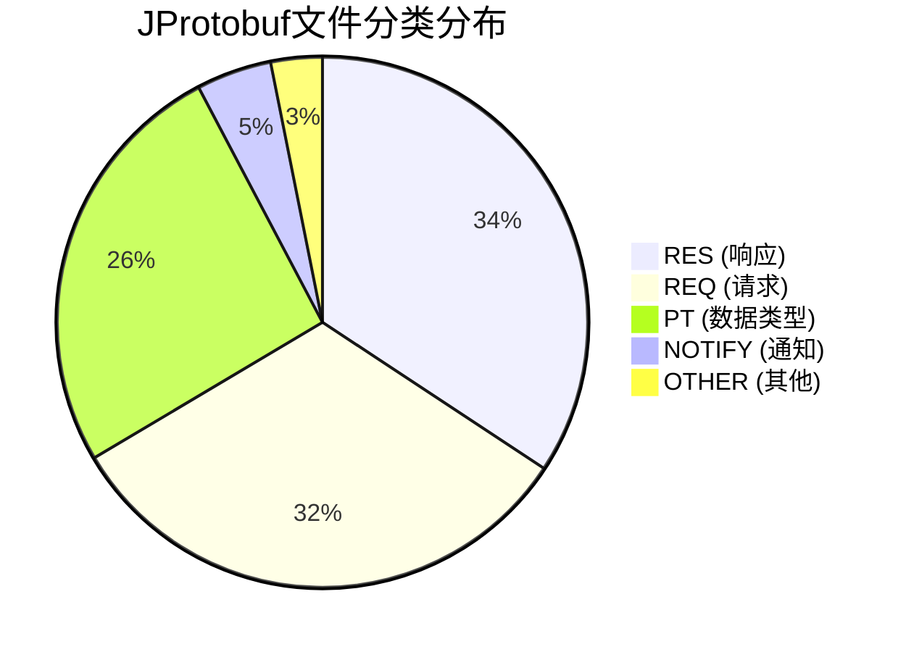
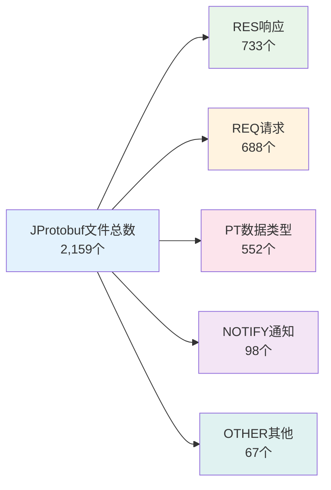
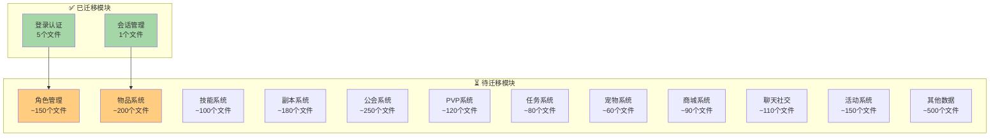

# JProtobuf 迁移总进度报告

**生成时间**: 2026-02-09 18:28:52

---

## 📊 总体统计

### 文件总数: 2,159 个

| 目录 | 文件数 | 说明 |
|------|--------|------|
| Mina Protobuf | 2,138 | 主要消息定义文件 |
| UDP Model | 21 | UDP通信模型文件 |
| Cross Server | 0 | 跨服通信文件 |

### 文件分类统计



---

## 📈 迁移进度

### 当前进度: 0.28%

```mermaid
%%{init: {'theme': 'base', 'themeVariables': { 'primaryColor': '#e1f5fe', 'primaryTextColor': '#01579b', 'primaryBorderColor': '#0288d1', 'lineColor': '#0288d1', 'secondaryColor': '#fff3e0', 'tertiaryColor': '#e8f5e9'}}}%%
gantt
    title 迁移进度时间线
    dateFormat YYYY-MM-DD
    section 批次01-登录认证
    登录认证模块    :done, batch1, 2026-02-08, 2d
    
    section 批次02-会话管理
    会话管理模块    :done, batch2, 2026-02-09, 1d
    
    section 批次03-角色管理
    角色管理模块    :active, batch3, 2026-02-09, 3d
    
    section 剩余批次
    待规划批次      :pending, batch4, after batch3, 40d
```

### 进度概览

```
已完成:     ████░░░░░░░░░░░░░░░░░░░░░░░░░░░░░░░░░░░░  0.28% (6/2,138)
待迁移:     ░░░░░░░░░░░░░░░░░░░░░░░░░░░░░░░░░░░░░░░░  99.72% (2,132/2,138)
```

### 批次完成情况

| 批次 | 模块 | 状态 | 进度 | 优先级 |
|------|------|------|------|--------|
| 01 | 登录认证 | ✅ 完成 | 100% | ⭐⭐⭐⭐⭐ |
| 02 | 会话管理 | ✅ 完成 | 25% | ⭐⭐⭐⭐ |
| 03 | 角色管理 | 🔄 进行中 | 0% | ⭐⭐⭐⭐ |
| 04 | 物品系统 | ⏳ 待开始 | 0% | ⭐⭐⭐⭐ |
| 05 | 技能系统 | ⏳ 待开始 | 0% | ⭐⭐⭐ |
| 06 | 副本系统 | ⏳ 待开始 | 0% | ⭐⭐⭐ |
| 07-10 | 其他系统 | ⏳ 待开始 | 0% | ⭐⭐ |

---

## 📁 文件分类详情

### 按类型分布



### 按模块分布（预估）



---

## ⏱️ 工作量预估

### 总体预估

| 指标 | 数值 |
|------|------|
| 总文件数 | 2,138 个 |
| 建议批次大小 | 50 个文件/批次 |
| 预估总批次 | ~43 个批次 |
| 已完成文件 | 6 个 |
| 待迁移文件 | 2,132 个 |
| 剩余批次 | ~43 个 |

### 按模块工作量估算

| 模块 | 预估文件数 | 预估批次 | 优先级 | 建议完成时间 |
|------|------------|----------|--------|--------------|
| 角色管理 | ~150 | 3 | ⭐⭐⭐⭐ | 1周 |
| 物品系统 | ~200 | 4 | ⭐⭐⭐⭐ | 1.5周 |
| 副本系统 | ~180 | 4 | ⭐⭐⭐ | 1.5周 |
| 公会系统 | ~250 | 5 | ⭐⭐⭐ | 2周 |
| PVP系统 | ~120 | 3 | ⭐⭐⭐ | 1周 |
| 任务系统 | ~80 | 2 | ⭐⭐⭐ | 0.5周 |
| 宠物系统 | ~60 | 2 | ⭐⭐ | 0.5周 |
| 商城系统 | ~90 | 2 | ⭐⭐ | 0.5周 |
| 聊天社交 | ~110 | 3 | ⭐⭐ | 1周 |
| 活动系统 | ~150 | 3 | ⭐⭐ | 1周 |
| 技能系统 | ~100 | 2 | ⭐⭐⭐ | 0.5周 |
| 其他数据 | ~500 | 10 | ⭐ | 3周 |

**预估总工期**: 约 13-15 周（3-4个月）

---

## 🔍 模块详细分析

### 1. 登录认证模块 ✅

- **文件数**: 5
- **状态**: 已完成
- **包含文件**: ChannelInfo, IntrudeMemberInfo, IntrudeInfo, LoginRequest, LoginResponse
- **完成日期**: 2026-02-09

### 2. 会话管理模块 ✅

- **文件数**: 1 (实际迁移1个)
- **状态**: 部分完成
- **包含文件**: PING消息
- **待确认**: SESSION_LOGOUT, HEARTBEAT

### 3. 角色管理模块 🔄

- **预估文件数**: ~150
- **状态**: 进行中
- **包含文件**: CHARACTER_INFO, JOB_INFO, REQ_LOAD_CHARAC 等
- **优先级**: 高

### 4. 物品系统模块 ⏳

- **预估文件数**: ~200
- **状态**: 待开始
- **包含文件**: PT_ITEM, REQ_ITEM_LIST, RES_EQUIP_LIST 等
- **优先级**: 高

### 5-13. 其他模块 ⏳

- 技能系统、副本系统、公会系统、PVP系统、任务系统、宠物系统、商城系统、聊天社交、活动系统
- **状态**: 待规划

---

## 📋 建议的迁移顺序


---

## ⚠️ 注意事项

1. **这是一个庞大的迁移工程**: 2,138 个文件需要迁移，预估需要 3-4 个月完成

2. **建议的批次大小**: 每批次 40-60 个文件，这样可以：
   - 保持可管理的范围
   - 便于测试和验证
   - 减少出错风险

3. **优先迁移核心模块**:
   - 登录认证 ✅
   - 角色管理 🔄
   - 物品系统
   - 技能系统
   - 副本系统

4. **数据类型文件(PT_前缀)较多**: 552 个数据类型文件，可以考虑：
   - 按功能模块分批迁移
   - 或者创建通用的数据类型.proto文件

5. **跨语言通信测试**: 每次迁移后都需要进行 Java ↔ Go 的通信测试

---

## 📊 进度追踪

使用 SQLite 数据库追踪进度：

```bash
# 查看整体进度
python migration_tracker.py progress

# 查看批次详情
python migration_tracker.py batch batch_03

# 列出所有文件
python migration_tracker.py list_files
```

---

**报告生成时间**: 2026-02-09 18:28:52  
**工具版本**: migration_tracker v1.0
