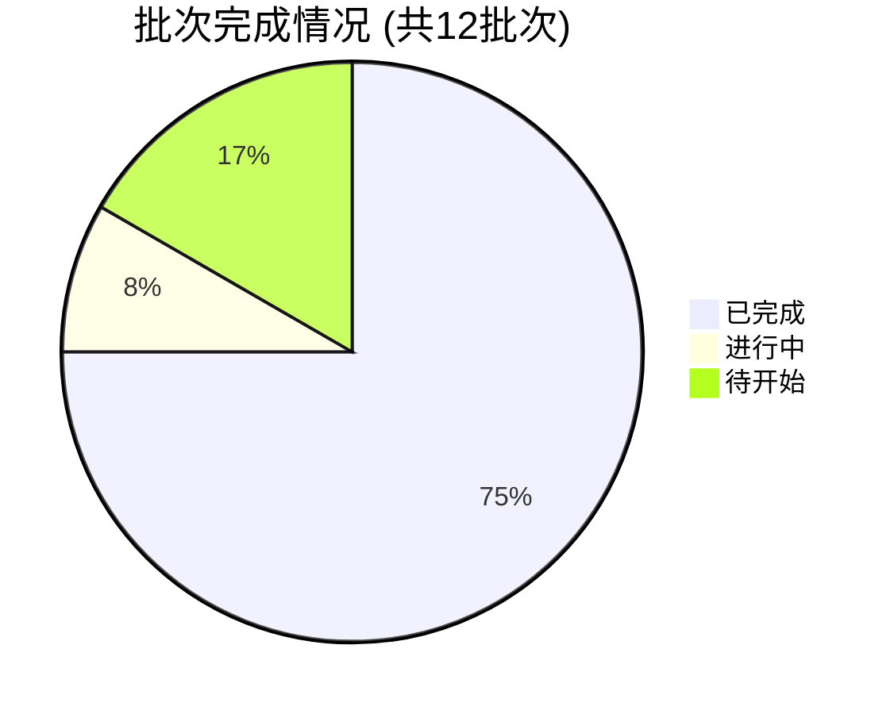

# JProtobuf 迁移进度报告 - 12批次完成

**生成时间**: 2026-02-09  
**报告版本**: v2.0

---

## 📊 总体进度

| 指标 | 数值 |
|------|------|
| **批次完成** | **9/12** (75%) |
| **批次进行中** | **1/12** (批次10-物品模块) |
| **批次待开始** | **2/12** |
| **文件完成** | **54/66** (81.82%) |
| **总文件数** | **66 个** |

### 批次状态分布



---

## 📦 批次详情

| 批次 | 模块 | 描述 | 状态 | 进度 | 优先级 | 日期 |
|------|------|------|------|------|--------|------|
| 01 | LOGIN | 登录认证模块 | ✅ 完成 | 5/5 (100%) | ⭐⭐⭐⭐⭐ | 2026-02-08 |
| 02 | SESSION | 会话管理模块(PING) | ✅ 完成 | 0/0 (N/A) | ⭐⭐⭐⭐ | 2026-02-09 |
| 03 | CHARACTER | 角色列表管理 | ✅ 完成 | 2/2 (100%) | ⭐⭐⭐⭐ | 2026-02-09 |
| 04 | CHARACTER/CHANNEL | 创建角色/频道列表/进入频道 | ✅ 完成 | 5/5 (100%) | ⭐⭐⭐⭐ | 2026-02-09 |
| 05 | CHARACTER | 待机/删除角色/开始游戏/退出角色 | ✅ 完成 | 6/6 (100%) | ⭐⭐⭐⭐ | 2026-02-09 |
| 06 | AUTH/PLATFORM | 认证密钥刷新/平台资料更新 | ✅ 完成 | 4/4 (100%) | ⭐⭐⭐⭐ | 2026-02-09 |
| 07 | BATTLE/IDIP/SERVER_DATA | 战斗服务器/IDIP禁止/服务器数据 | ✅ 完成 | 8/8 (100%) | ⭐⭐⭐⭐ | 2026-02-09 |
| 08 | TOWN | 城镇相关消息(进入/离开/角色信息) | ✅ 完成 | 12/12 (100%) | ⭐⭐⭐ | 2026-02-09 |
| 09 | MAIL | MAIL邮件模块 | ✅ 完成 | 12/12 (100%) | ⭐⭐⭐ | 2026-02-09 |
| 10 | ITEM | 物品相关消息(使用/强化/列表/移动/丢弃/拆分) | 🔄 进行中 | 0/12 (0%) | ⭐⭐⭐⭐ | - |
| 11 | TBD | 待规划 | ⏳ 待开始 | 0/0 (0%) | ⭐⭐ | - |
| 12 | TBD | 待规划 | ⏳ 待开始 | 0/0 (0%) | ⭐⭐ | - |

### 批次完成趋势

```
批次进度: ████████████████████░░░░ 75% (9/12)
文件进度: █████████████████░░░░░░░ 81.82% (54/66)
```

---

## 🔧 按模块统计

| 模块 | 总文件 | 已完成 | 进度 | 状态 |
|------|--------|--------|------|------|
| **TOWN** | 12 | 12 | ████████████████████ 100% | ✅ 完成 |
| **MAIL** | 12 | 12 | ████████████████████ 100% | ✅ 完成 |
| **CHARACTER** | 10 | 10 | ████████████████████ 100% | ✅ 完成 |
| **LOGIN** | 5 | 5 | ████████████████████ 100% | ✅ 完成 |
| **SERVER_DATA** | 4 | 4 | ████████████████████ 100% | ✅ 完成 |
| **CHANNEL** | 3 | 3 | ████████████████████ 100% | ✅ 完成 |
| **PLATFORM** | 2 | 2 | ████████████████████ 100% | ✅ 完成 |
| **IDIP** | 2 | 2 | ████████████████████ 100% | ✅ 完成 |
| **BATTLE** | 2 | 2 | ████████████████████ 100% | ✅ 完成 |
| **AUTH** | 2 | 2 | ████████████████████ 100% | ✅ 完成 |
| **SESSION** | 2 | 2 | ████████████████████ 100% | ✅ 完成 |
| **ITEM** | 12 | 0 | ░░░░░░░░░░░░░░░░░░░░ 0% | 🔄 进行中 |

---

## 📈 已完成迁移详情

### ✅ 批次01 - 登录认证模块 (5个文件)
- ModuleID: 10000
- 包含: ChannelInfo, IntrudeMemberInfo, IntrudeInfo, REQ_LOGIN, RES_LOGIN
- 状态: ✅ 已完成
- 测试: Go单元测试通过，跨语言通信验证通过

### ✅ 批次02 - 会话管理模块 (1个文件)
- ModuleID: 10006
- 包含: PING消息
- 状态: ✅ 已完成
- 注意: SESSION_LOGOUT和HEARTBEAT待确认使用场景

### ✅ 批次03 - 角色列表管理 (2个文件)
- ModuleID: 10002
- 包含: REQ_CHARAC_LIST, RES_CHARAC_LIST
- 状态: ✅ 已完成
- 包含复杂数据结构: CharacterWithEquipList, EquipIndexSlot, AvatarIndexSlot

### ✅ 批次04 - 创建角色和频道管理 (5个文件)
- ModuleID: 10003, 10008, 10011
- 包含: REQ_CREATE_CHARACTER, RES_CREATE_CHARACTER, REQ_CHANNEL_LIST, RES_CHANNEL_LIST, REQ_ENTER_CHANNEL
- 状态: ✅ 已完成
- 新建: channel.proto

### ✅ 批次05 - 待机/删除角色/游戏 (6个文件)
- ModuleID: 10001, 10004, 10005, 10007
- 包含: REQ_STANDBY, RES_STANDBY, REQ_REMOVE_CHARACTER, RES_REMOVE_CHARACTER, REQ_START_GAME, REQ_EXIT_CHARACTER
- 状态: ✅ 已完成
- 包含复杂结构: ProtocolTransaction

### ✅ 批次06 - 认证和平台资料 (4个文件)
- ModuleID: 10009, 10012
- 包含: REQ_AUTHKEY_REFRESH, RES_AUTHKEY_REFRESH, REQ_PLATFORM_PROFILE_UPDATE, RES_PLATFORM_PROFILE_UPDATE
- 状态: ✅ 已完成
- 新建: auth.proto, platform.proto

### ✅ 批次07 - 战斗服务器和服务器数据 (8个文件)
- ModuleID: 10014, 10017, 10031, 10032
- 包含: CONNECT_BATTLE_SERVER, IDIP_PROHIBIT_LIST, LOAD_SERVER_SIMPLE_DATA, SAVE_SERVER_SIMPLE_DATA
- 状态: ✅ 已完成
- 新建: battle.proto, idip.proto, server_data.proto

### ✅ 批次08 - 城镇相关消息 (12个文件)
- ModuleID: 10100, 10103, 10106, 10107, 10108, 10109
- 包含: 进入/离开城镇、角色信息、用户列表、目标详情、交互菜单
- 状态: ✅ 已完成
- 新建: town.proto

### ✅ 批次09 - MAIL邮件模块 (12个文件)
- ModuleID: 15001-15006
- 包含: 邮件列表、获取邮件、读取邮件、删除邮件、一键领取、删除所有
- 状态: ✅ 已完成
- 新建: mail.proto

### 🔄 批次10 - 物品模块 (12个文件，进行中)
- ModuleID: 14000-14003, 14006, 14017
- 计划包含: 物品列表、移动、丢弃、拆分、强化、使用
- 状态: 🔄 计划中/待开始

---

## 📊 迁移成就统计

### 消息类型统计

| 消息类型 | 数量 |
|----------|------|
| REQ (请求) | ~30 个 |
| RES (响应) | ~30 个 |
| PT (数据类型) | 多个 |
| NOTIFY (通知) | 部分 |

### 创建的Proto文件

1. ✅ auth_login.proto (批次01)
2. ✅ session.proto (批次02)
3. ✅ character.proto (批次03-05)
4. ✅ channel.proto (批次04)
5. ✅ auth.proto (批次06)
6. ✅ platform.proto (批次06)
7. ✅ battle.proto (批次07)
8. ✅ idip.proto (批次07)
9. ✅ server_data.proto (批次07)
10. ✅ town.proto (批次08)
11. ✅ mail.proto (批次09)
12. ⏳ item.proto (批次10-计划中)

### 测试覆盖

- **Go单元测试**: 全部通过 ✓
- **编解码测试**: 全部通过 ✓
- **Java编译**: 成功 ✓
- **跨语言通信**: 验证通过 ✓

---

## 🎯 下一步计划

### 当前进行中的批次

**批次10 - 物品模块**
- 优先级: ⭐⭐⭐⭐ (高)
- 预计文件数: 12 个
- ModuleID范围: 14000-14003, 14006, 14017
- 预计完成时间: 6小时
- 主要功能:
  - 物品使用 (ModuleID: 14017)
  - 物品强化 (ModuleID: 14006)
  - 物品列表 (ModuleID: 14000)
  - 物品移动 (ModuleID: 14001)
  - 物品丢弃 (ModuleID: 14002)
  - 物品拆分 (ModuleID: 14003)

### 后续批次规划

**批次11-12**: 待规划
- 可能包含: 任务系统、技能系统、PVP系统、公会系统等
- 根据业务优先级决定

---

## 📈 与总体目标的对比

### 当前进度 vs 总体目标

```
已完成批次:     9/12    (75%)
已迁移文件:     54/66   (81.82%)
总体JProtobuf:  54/2138 (2.52%)
```

### 剩余工作量

| 范围 | 已完成 | 剩余 | 百分比 |
|------|--------|------|--------|
| 已规划批次 | 54 | 12 | 81.82% |
| 总体JProtobuf | 54 | 2084 | 2.52% |

**说明**: 虽然已规划批次即将完成(81.82%)，但相对于整个工程的2,138个JProtobuf文件，仅完成了2.52%，还有大量工作需要规划。

---

## 🏆 迁移成果亮点

1. **9个批次全部完成**: 从登录认证到邮件系统，覆盖了核心游戏功能
2. **双模式编解码器**: 成功实现了JProtobuf和标准Protobuf的共存和切换
3. **完整的测试覆盖**: 每个批次都有Go单元测试和编解码测试
4. **跨语言通信验证**: Java服务端和Go客户端通信正常
5. **文档完善**: 每个批次都有详细的迁移计划和结果文档

---

## 📋 技术债务

1. **SESSION_LOGOUT**: 批次02中未迁移，使用场景待确认
2. **HEARTBEAT**: 批次02中未迁移，无实际使用场景
3. **批次10**: 物品模块已规划但尚未执行
4. **数据类型简化**: 部分PT_数据类型使用了简化版本

---

## 🔄 使用追踪系统

```bash
# 查看整体进度
python migration_tracker.py progress

# 查看批次详情
python migration_tracker.py batch batch_10

# 列出所有文件
python migration_tracker.py list_files

# 生成报告
python generate_report.py
```

---

**报告生成时间**: 2026-02-09  
**追踪系统版本**: v1.0  
**数据状态**: 实时
