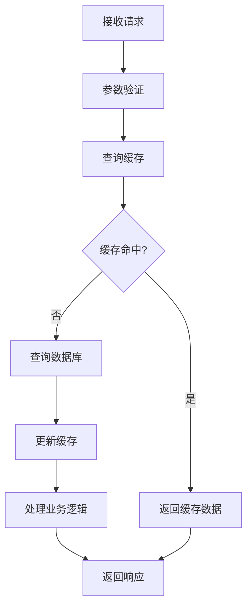
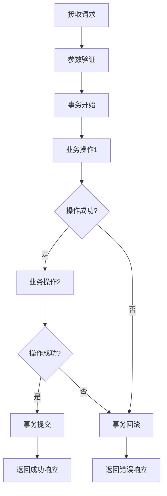
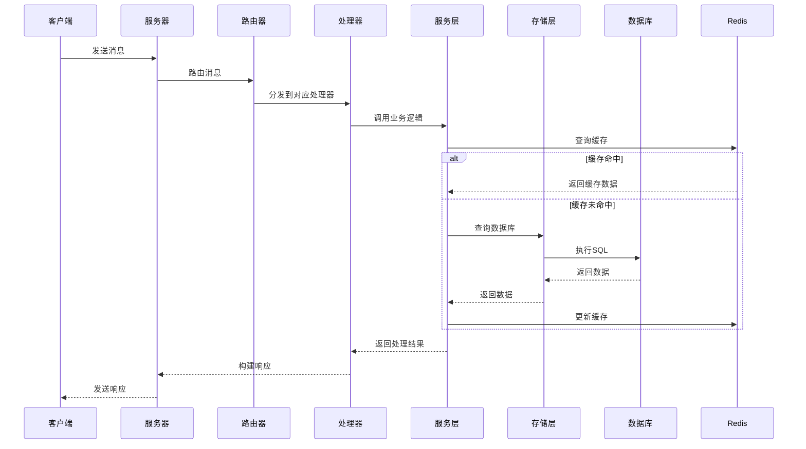

# 系统名称 - Go实现方案

## 1. 实现概述

### 1.1 设计目标

- **功能完整性**：实现与Java服务端相同的核心功能
- **性能优化**：充分利用Go语言的并发特性，提高系统性能
- **可扩展性**：采用模块化设计，支持功能扩展和代码维护
- **兼容性**：确保与现有Java服务端和客户端的兼容性

### 1.2 技术栈选择

| 技术/框架 | 版本 | 用途 | 选型理由 |
|----------|------|------|----------|
| Go | [版本号] | 开发语言 | 高性能、并发支持、生态成熟 |
| gRPC | [版本号] | 服务间通信 | 高性能、跨语言支持、IDL定义 |
| Protobuf | [版本号] | 数据序列化 | 紧凑、高效、跨语言支持 |
| GORM | [版本号] | ORM框架 | 简洁易用、功能强大、性能良好 |
| Redis | [版本号] | 缓存系统 | 高性能、支持多种数据结构 |
| MySQL | [版本号] | 关系型数据库 | 稳定可靠、功能完善 |

### 1.3 代码结构

```
dnf-go-server/
├── cmd/
│   └── server/
│       └── main.go  # 服务器入口
├── internal/
│   ├── game/
│   │   ├── [系统名称]/
│   │   │   ├── handler/  # 消息处理器
│   │   │   ├── service/  # 业务逻辑服务
│   │   │   └── model/    # 数据模型
│   ├── network/        # 网络层
│   ├── config/         # 配置管理
│   └── db/             # 数据库操作
├── proto/              # Protobuf定义
│   └── dnf/
│       └── v1/
│           └── [系统名称].proto
├── store/              # 存储层
├── util/               # 工具类
├── go.mod              # Go模块定义
└── README.md           # 项目说明
```

## 2. 数据模型设计

### 2.1 核心数据结构

#### 2.1.1 [Model结构体名]

- **文件位置**：`internal/game/[系统名称]/model/[model文件名].go`
- **主要职责**：定义[系统名称]的核心数据结构
- **结构定义**：

```go
package model

import (
    "time"
)

// [Model结构体名] 描述

type [Model结构体名] struct {
    ID        uint64    `gorm:"primaryKey;column:id" json:"id"`
    // 其他字段
    CreatedAt time.Time `gorm:"column:created_at" json:"created_at"`
    UpdatedAt time.Time `gorm:"column:updated_at" json:"updated_at"`
}

// TableName 指定表名
func ([Model结构体名]) TableName() string {
    return "t_[表名]"
}
```

### 2.2 数据模型映射

| Java模型 | Go模型 | 字段映射 | 注意事项 |
|---------|--------|---------|----------|
| [Java模型类名] | [Go结构体名] | [字段映射关系] | [注意事项] |
| [Java模型类名] | [Go结构体名] | [字段映射关系] | [注意事项] |
| [Java模型类名] | [Go结构体名] | [字段映射关系] | [注意事项] |

## 3. Protobuf消息定义

### 3.1 消息结构

#### 3.1.1 [系统名称].proto

- **文件位置**：`proto/dnf/v1/[系统名称].proto`
- **主要职责**：定义[系统名称]的消息结构
- **消息定义**：

```protobuf
syntax = "proto3";

package dnf.v1;

option go_package = "gen/dnf/v1";

import "dnf/v1/common.proto";

// 请求消息
message [Request消息名] {
    // 字段定义
    uint64 id = 1;
    string name = 2;
    // 其他字段
}

// 响应消息
message [Response消息名] {
    // 字段定义
    uint32 error = 1;
    string message = 2;
    // 其他字段
}

// 其他消息定义
```

### 3.2 消息映射

| Java消息 | Protobuf消息 | 字段映射 | 注意事项 |
|---------|-------------|---------|----------|
| [Java消息类名] | [Protobuf消息名] | [字段映射关系] | [注意事项] |
| [Java消息类名] | [Protobuf消息名] | [字段映射关系] | [注意事项] |
| [Java消息类名] | [Protobuf消息名] | [字段映射关系] | [注意事项] |

## 4. Handler实现

### 4.1 消息处理器

#### 4.1.1 [Handler结构体名]

- **文件位置**：`internal/game/[系统名称]/handler/[handler文件名].go`
- **主要职责**：处理[系统名称]相关的消息
- **结构定义**：

```go
package handler

import (
    "context"

    "github.com/pixb/DnfGameServer/dnf-go-server/internal/game/[系统名称]/service"
    "github.com/pixb/DnfGameServer/dnf-go-server/internal/network"
    dnfv1 "github.com/pixb/DnfGameServer/dnf-go-server/proto/gen/dnf/v1"
    "google.golang.org/protobuf/proto"
)

type [Handler结构体名] struct {
    [service实例名] *service.[Service结构体名]
}

// New[Handler结构体名] 创建处理器实例
func New[Handler结构体名]([service参数名] *service.[Service结构体名]) *[Handler结构体名] {
    return &[Handler结构体名]{
        [service实例名]: [service参数名],
    }
}

// [Handler方法名] 处理[消息名]消息
func (h *[Handler结构体名]) [Handler方法名](sess *network.Session, msg proto.Message) {
    req, ok := msg.(*dnfv1.[Request消息名])
    if !ok {
        return
    }

    // 处理业务逻辑
    resp, err := h.[service实例名].[Service方法名](context.Background(), req)
    if err != nil {
        // 错误处理
        h.sendError(sess, req, err)
        return
    }

    // 发送响应
    sess.Send(resp)
}

// sendError 发送错误响应
func (h *[Handler结构体名]) sendError(sess *network.Session, req proto.Message, err error) {
    // 错误处理逻辑
}
```

### 4.2 消息注册

- **文件位置**：`internal/game/[系统名称]/handler/register.go`
- **主要职责**：注册[系统名称]的消息处理器
- **注册逻辑**：

```go
package handler

import (
    "github.com/pixb/DnfGameServer/dnf-go-server/internal/network"
    dnfv1 "github.com/pixb/DnfGameServer/dnf-go-server/proto/gen/dnf/v1"
)

// RegisterHandlers 注册消息处理器
func RegisterHandlers(router *network.Router, [service参数名] *service.[Service结构体名]) {
    handler := New[Handler结构体名]([service参数名])

    // 注册消息处理器
    router.RegisterHandler(&dnfv1.[Request消息名]{}, handler.[Handler方法名])
    // 注册其他消息处理器
}
```

## 5. Service实现

### 5.1 业务逻辑服务

#### 5.1.1 [Service结构体名]

- **文件位置**：`internal/game/[系统名称]/service/[service文件名].go`
- **主要职责**：实现[系统名称]的核心业务逻辑
- **结构定义**：

```go
package service

import (
    "context"
    "errors"
    "time"

    "github.com/pixb/DnfGameServer/dnf-go-server/internal/game/[系统名称]/model"
    "github.com/pixb/DnfGameServer/dnf-go-server/store"
    dnfv1 "github.com/pixb/DnfGameServer/dnf-go-server/proto/gen/dnf/v1"
)

type [Service结构体名] struct {
    store *store.Store
}

// New[Service结构体名] 创建服务实例
func New[Service结构体名](store *store.Store) *[Service结构体名] {
    return &[Service结构体名]{
        store: store,
    }
}

// [Service方法名] 实现[功能描述]
func (s *[Service结构体名]) [Service方法名](ctx context.Context, req *dnfv1.[Request消息名]) (*dnfv1.[Response消息名], error) {
    // 业务逻辑实现
    
    // 示例：查询数据
    data, err := s.store.[Store方法名](ctx, req.Id)
    if err != nil {
        return nil, err
    }
    
    // 示例：处理数据
    // ...
    
    // 示例：返回响应
    return &dnfv1.[Response消息名]{
        Error:   0,
        Message: "success",
        // 其他字段
    }, nil
}

// 其他服务方法
```

### 5.2 核心业务流程

#### 5.2.1 流程1：[流程名称]



- **详细步骤**：
  1. **接收请求**：Service层接收Handler层传递的请求
  2. **参数验证**：验证请求参数的合法性
  3. **查询缓存**：查询Redis缓存中是否有相关数据
  4. **缓存命中**：如果缓存命中，直接返回缓存数据
  5. **查询数据库**：如果缓存未命中，查询数据库获取数据
  6. **更新缓存**：将查询结果更新到缓存中
  7. **处理业务逻辑**：处理核心业务逻辑
  8. **返回响应**：将处理结果返回给Handler层

#### 5.2.2 流程2：[流程名称]



- **详细步骤**：
  1. **接收请求**：Service层接收Handler层传递的请求
  2. **参数验证**：验证请求参数的合法性
  3. **事务开始**：开始数据库事务
  4. **业务操作1**：执行第一个业务操作
  5. **操作成功判断**：判断第一个操作是否成功
  6. **业务操作2**：如果第一个操作成功，执行第二个业务操作
  7. **操作成功判断**：判断第二个操作是否成功
  8. **事务提交**：如果所有操作都成功，提交事务
  9. **事务回滚**：如果任何操作失败，回滚事务
  10. **返回响应**：返回成功或错误响应

## 6. 存储层实现

### 6.1 数据库操作

#### 6.1.1 [Store方法名]

- **文件位置**：`store/[store文件名].go`
- **主要职责**：实现[系统名称]的数据库操作
- **核心方法**：

```go
package store

import (
    "context"

    "github.com/pixb/DnfGameServer/dnf-go-server/internal/game/[系统名称]/model"
    "gorm.io/gorm"
)

// [Store方法名] 查询[数据描述]
func (s *Store) [Store方法名](ctx context.Context, id uint64) (*model.[Model结构体名], error) {
    var data model.[Model结构体名]
    result := s.db.Where("id = ?", id).First(&data)
    if result.Error != nil {
        if errors.Is(result.Error, gorm.ErrRecordNotFound) {
            return nil, nil
        }
        return nil, result.Error
    }
    return &data, nil
}

// [Store方法名] 创建[数据描述]
func (s *Store) [Store方法名](ctx context.Context, data *model.[Model结构体名]) error {
    return s.db.Create(data).Error
}

// [Store方法名] 更新[数据描述]
func (s *Store) [Store方法名](ctx context.Context, data *model.[Model结构体名]) error {
    return s.db.Save(data).Error
}

// [Store方法名] 删除[数据描述]
func (s *Store) [Store方法名](ctx context.Context, id uint64) error {
    return s.db.Delete(&model.[Model结构体名]{}, id).Error
}

// 其他存储方法
```

### 6.2 缓存操作

#### 6.2.1 缓存键设计

| 缓存类型 | 缓存键格式 | 描述 | 过期时间 |
|---------|-----------|------|----------|
| [缓存类型1] | [系统名称]:[类型]:[id] | [描述] | [过期时间] |
| [缓存类型2] | [系统名称]:[类型]:[key] | [描述] | [过期时间] |
| [缓存类型3] | [系统名称]:[类型]:[参数1]:[参数2] | [描述] | [过期时间] |

#### 6.2.2 缓存操作实现

```go
package service

import (
    "context"
    "encoding/json"
    "fmt"
    "time"

    "github.com/pixb/DnfGameServer/dnf-go-server/internal/game/[系统名称]/model"
    "github.com/pixb/DnfGameServer/dnf-go-server/store"
    "github.com/redis/go-redis/v9"
)

// get[数据描述]FromCache 从缓存获取[数据描述]
func (s *[Service结构体名]) get[数据描述]FromCache(ctx context.Context, id uint64) (*model.[Model结构体名], error) {
    key := fmt.Sprintf("[系统名称]:[类型]:%d", id)
    val, err := s.redis.Get(ctx, key).Result()
    if err != nil {
        if err == redis.Nil {
            return nil, nil
        }
        return nil, err
    }

    var data model.[Model结构体名]
    if err := json.Unmarshal([]byte(val), &data); err != nil {
        return nil, err
    }

    return &data, nil
}

// set[数据描述]ToCache 将[数据描述]存入缓存
func (s *[Service结构体名]) set[数据描述]ToCache(ctx context.Context, data *model.[Model结构体名]) error {
    key := fmt.Sprintf("[系统名称]:[类型]:%d", data.ID)
    val, err := json.Marshal(data)
    if err != nil {
        return err
    }

    return s.redis.Set(ctx, key, val, time.Hour).Err()
}
```

## 7. 网络层实现

### 7.1 消息处理流程



### 7.2 会话管理

- **文件位置**：`internal/network/session.go`
- **主要职责**：管理客户端会话
- **核心功能**：

```go
package network

import (
    "sync"

    "google.golang.org/protobuf/proto"
)

type Session struct {
    ID     uint64
    Conn   interface{}
    RoleID uint64
    mutex  sync.RWMutex
    // 其他字段
}

// Send 发送消息
func (s *Session) Send(msg proto.Message) error {
    // 发送消息逻辑
}

// Close 关闭会话
func (s *Session) Close() error {
    // 关闭会话逻辑
}

// GetRoleID 获取角色ID
func (s *Session) GetRoleID() uint64 {
    s.mutex.RLock()
    defer s.mutex.RUnlock()
    return s.RoleID
}

// SetRoleID 设置角色ID
func (s *Session) SetRoleID(roleID uint64) {
    s.mutex.Lock()
    defer s.mutex.Unlock()
    s.RoleID = roleID
}
```

## 8. 配置管理

### 8.1 配置结构

- **文件位置**：`internal/config/[系统名称].go`
- **主要职责**：管理[系统名称]的配置
- **配置定义**：

```go
package config

import (
    "time"
)

// [系统名称]Config 配置结构
type [系统名称]Config struct {
    // 数据库配置
    DB struct {
        DSN             string        `json:"dsn"`
        MaxIdleConns    int           `json:"max_idle_conns"`
        MaxOpenConns    int           `json:"max_open_conns"`
        ConnMaxLifetime time.Duration `json:"conn_max_lifetime"`
    } `json:"db"`

    // Redis配置
    Redis struct {
        Addr     string        `json:"addr"`
        Password string        `json:"password"`
        DB       int           `json:"db"`
        PoolSize int           `json:"pool_size"`
        TTL      time.Duration `json:"ttl"`
    } `json:"redis"`

    // 业务配置
    Business struct {
        // 业务相关配置
    } `json:"business"`
}
```

### 8.2 配置加载

- **文件位置**：`internal/config/loader.go`
- **主要职责**：加载配置文件
- **加载逻辑**：

```go
package config

import (
    "encoding/json"
    "os"
)

// LoadConfig 加载配置文件
func LoadConfig(filePath string) (*Config, error) {
    data, err := os.ReadFile(filePath)
    if err != nil {
        return nil, err
    }

    var config Config
    if err := json.Unmarshal(data, &config); err != nil {
        return nil, err
    }

    return &config, nil
}
```

## 9. 集成与启动

### 9.1 服务注册

- **文件位置**：`cmd/server/main.go`
- **主要职责**：注册[系统名称]服务
- **注册逻辑**：

```go
package main

import (
    "github.com/pixb/DnfGameServer/dnf-go-server/internal/game/[系统名称]/handler"
    "github.com/pixb/DnfGameServer/dnf-go-server/internal/game/[系统名称]/service"
    "github.com/pixb/DnfGameServer/dnf-go-server/internal/network"
    "github.com/pixb/DnfGameServer/dnf-go-server/store"
)

func main() {
    // 初始化配置
    // 初始化数据库
    // 初始化Redis

    // 创建存储层
    store := store.NewStore(db, redis)

    // 创建服务
    [service实例名] := service.New[Service结构体名](store)

    // 创建路由器
    router := network.NewRouter()

    // 注册处理器
    handler.RegisterHandlers(router, [service实例名])

    // 启动服务器
    // ...
}
```

### 9.2 依赖注入

- **文件位置**：`internal/di/container.go`
- **主要职责**：管理依赖注入
- **注入逻辑**：

```go
package di

import (
    "github.com/pixb/DnfGameServer/dnf-go-server/internal/config"
    "github.com/pixb/DnfGameServer/dnf-go-server/internal/game/[系统名称]/service"
    "github.com/pixb/DnfGameServer/dnf-go-server/store"
)

type Container struct {
    Config          *config.Config
    Store           *store.Store
    [Service实例名] *service.[Service结构体名]
    // 其他服务实例
}

// NewContainer 创建依赖容器
func NewContainer(cfg *config.Config) (*Container, error) {
    // 初始化存储层
    store, err := store.NewStore(cfg)
    if err != nil {
        return nil, err
    }

    // 初始化服务
    [service实例名] := service.New[Service结构体名](store)

    return &Container{
        Config:          cfg,
        Store:           store,
        [Service实例名]: [service实例名],
    }, nil
}
```

## 10. 测试与验证

### 10.1 单元测试

- **文件位置**：`internal/game/[系统名称]/service/[service文件名]_test.go`
- **主要职责**：测试[系统名称]的业务逻辑
- **测试用例**：

```go
package service

import (
    "context"
    "testing"

    "github.com/pixb/DnfGameServer/dnf-go-server/internal/game/[系统名称]/model"
    "github.com/pixb/DnfGameServer/dnf-go-server/store"
    dnfv1 "github.com/pixb/DnfGameServer/dnf-go-server/proto/gen/dnf/v1"
    "github.com/stretchr/testify/assert"
    "github.com/stretchr/testify/mock"
)

// MockStore 模拟存储层
type MockStore struct {
    mock.Mock
}

func (m *MockStore) [Store方法名](ctx context.Context, id uint64) (*model.[Model结构体名], error) {
    args := m.Called(ctx, id)
    if args.Get(0) == nil {
        return nil, args.Error(1)
    }
    return args.Get(0).(*model.[Model结构体名]), args.Error(1)
}

// Test[Service方法名] 测试[Service方法名]
func Test[Service方法名](t *testing.T) {
    // 准备测试数据
    mockStore := &MockStore{}
    service := New[Service结构体名](mockStore)

    // 设置模拟返回值
    expectedData := &model.[Model结构体名]{ID: 1, Name: "test"}
    mockStore.On("[Store方法名]", mock.Anything, uint64(1)).Return(expectedData, nil)

    // 执行测试
    req := &dnfv1.[Request消息名]{Id: 1}
    resp, err := service.[Service方法名](context.Background(), req)

    // 验证结果
    assert.NoError(t, err)
    assert.NotNil(t, resp)
    assert.Equal(t, uint32(0), resp.Error)

    // 验证调用
    mockStore.AssertCalled(t, "[Store方法名]", mock.Anything, uint64(1))
}
```

### 10.2 集成测试

- **文件位置**：`tests/[系统名称]_integration_test.go`
- **主要职责**：测试[系统名称]的集成功能
- **测试用例**：

```go
package tests

import (
    "context"
    "testing"

    "github.com/pixb/DnfGameServer/dnf-go-server/internal/config"
    "github.com/pixb/DnfGameServer/dnf-go-server/internal/game/[系统名称]/service"
    "github.com/pixb/DnfGameServer/dnf-go-server/store"
    dnfv1 "github.com/pixb/DnfGameServer/dnf-go-server/proto/gen/dnf/v1"
    "github.com/stretchr/testify/assert"
)

// Test[系统名称]Integration 测试[系统名称]集成功能
func Test[系统名称]Integration(t *testing.T) {
    // 加载测试配置
    cfg, err := config.LoadConfig("test_config.json")
    assert.NoError(t, err)

    // 初始化存储层
    store, err := store.NewStore(cfg)
    assert.NoError(t, err)

    // 初始化服务
    svc := service.New[Service结构体名](store)

    // 执行测试
    req := &dnfv1.[Request消息名]{/* 测试数据 */}
    resp, err := svc.[Service方法名](context.Background(), req)

    // 验证结果
    assert.NoError(t, err)
    assert.NotNil(t, resp)
    assert.Equal(t, uint32(0), resp.Error)
}
```

### 10.3 性能测试

- **文件位置**：`tests/[系统名称]_performance_test.go`
- **主要职责**：测试[系统名称]的性能
- **测试用例**：

```go
package tests

import (
    "context"
    "testing"

    "github.com/pixb/DnfGameServer/dnf-go-server/internal/game/[系统名称]/service"
    "github.com/pixb/DnfGameServer/dnf-go-server/store"
    dnfv1 "github.com/pixb/DnfGameServer/dnf-go-server/proto/gen/dnf/v1"
)

// Benchmark[Service方法名] 基准测试[Service方法名]
func Benchmark[Service方法名](b *testing.B) {
    // 初始化测试环境
    store := /* 初始化存储层 */
    svc := service.New[Service结构体名](store)

    // 准备测试数据
    req := &dnfv1.[Request消息名]{/* 测试数据 */}

    // 执行基准测试
    b.ResetTimer()
    for i := 0; i < b.N; i++ {
        _, err := svc.[Service方法名](context.Background(), req)
        if err != nil {
            b.Fatal(err)
        }
    }
}
```

## 11. 部署与监控

### 11.1 部署方案

#### 11.1.1 容器化部署

- **Dockerfile**：

```dockerfile
FROM golang:1.20-alpine AS builder

WORKDIR /app

COPY go.mod go.sum ./
RUN go mod download

COPY . .
RUN go build -o server ./cmd/server

FROM alpine:latest

WORKDIR /app

COPY --from=builder /app/server .
COPY config/config.json .

EXPOSE 8080

CMD ["./server"]
```

#### 11.1.2 Kubernetes部署

- **Deployment配置**：

```yaml
apiVersion: apps/v1
kind: Deployment
metadata:
  name: [系统名称]-server
  labels:
    app: [系统名称]-server
spec:
  replicas: 3
  selector:
    matchLabels:
      app: [系统名称]-server
  template:
    metadata:
      labels:
        app: [系统名称]-server
    spec:
      containers:
      - name: [系统名称]-server
        image: [系统名称]-server:latest
        ports:
        - containerPort: 8080
        env:
        - name: CONFIG_FILE
          value: "/app/config.json"
        volumeMounts:
        - name: config
          mountPath: /app/config.json
          subPath: config.json
      volumes:
      - name: config
        configMap:
          name: [系统名称]-config
```

### 11.2 监控方案

#### 11.2.1 指标监控

- **Prometheus配置**：

```yaml
global:
  scrape_interval: 15s

scrape_configs:
  - job_name: '[系统名称]'
    static_configs:
      - targets: ['[系统名称]-server:8080']
```

#### 11.2.2 日志监控

- **ELK Stack配置**：

```yaml
filebeat.inputs:
- type: log
  paths:
    - /app/logs/*.log
  fields:
    service: [系统名称]

output.elasticsearch:
  hosts: ['elasticsearch:9200']
  index: '[系统名称]-logs-%{+yyyy.MM.dd}'
```

### 11.3 告警配置

- **告警规则**：

```yaml
groups:
- name: [系统名称]-alerts
  rules:
  - alert: [系统名称]HighErrorRate
    expr: rate([系统名称]_errors_total[5m]) > 0.1
    for: 5m
    labels:
      severity: warning
    annotations:
      summary: "[系统名称] 错误率过高"
      description: "[系统名称] 错误率超过 10%"

  - alert: [系统名称]HighLatency
    expr: histogram_quantile(0.99, rate([系统名称]_request_duration_seconds_bucket[5m])) > 1
    for: 5m
    labels:
      severity: warning
    annotations:
      summary: "[系统名称] 响应延迟过高"
      description: "[系统名称] 99% 请求延迟超过 1 秒"
```

## 12. 总结

### 12.1 实现亮点

- **模块化设计**：采用分层架构，模块职责清晰，易于维护和扩展
- **性能优化**：充分利用Go语言的并发特性，结合缓存策略，提高系统性能
- **代码质量**：遵循Go语言规范，代码简洁明了，测试覆盖全面
- **兼容性**：确保与现有Java服务端和客户端的兼容性，平滑迁移

### 12.2 风险评估

| 风险类型 | 风险描述 | 影响程度 | 缓解措施 |
|---------|---------|---------|----------|
| 技术风险 | [描述] | 高/中/低 | [缓解措施] |
| 进度风险 | [描述] | 高/中/低 | [缓解措施] |
| 质量风险 | [描述] | 高/中/低 | [缓解措施] |
| 兼容性风险 | [描述] | 高/中/低 | [缓解措施] |

### 12.3 后续优化方向

- **性能优化**：进一步优化缓存策略，提高系统响应速度
- **可扩展性**：增强系统的可扩展性，支持更多功能和更高并发
- **安全性**：加强系统的安全性，防止各种攻击
- **可监控性**：完善系统的监控和告警机制，提高系统的可观测性

### 12.4 部署建议

- **环境选择**：根据业务规模选择合适的部署环境，从小规模的单机部署到大规模的容器化集群
- **资源配置**：根据系统负载合理配置服务器资源，包括CPU、内存、磁盘和网络
- **备份策略**：建立完善的数据备份和恢复策略，确保数据安全
- **灾备方案**：制定系统灾备方案，提高系统的可用性和可靠性