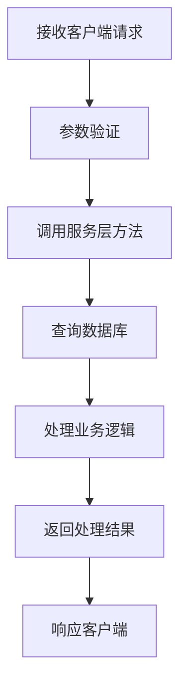
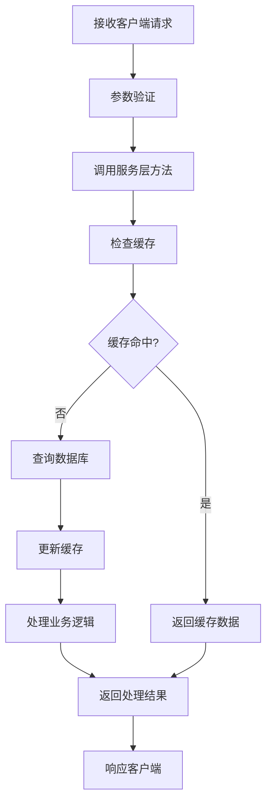
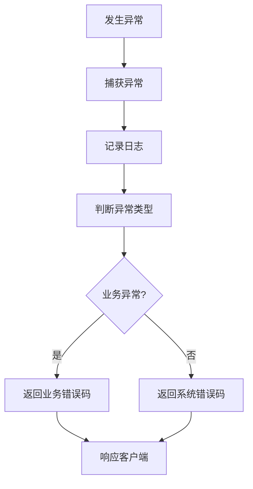

# 系统名称 - Java代码分析

## 1. 代码结构概述

### 1.1 目录结构

```
项目根目录/
├── src/
│   ├── main/
│   │   ├── java/
│   │   │   └── com/dnfm/game/[系统名称]/
│   │   │       ├── controller/  # 控制器层
│   │   │       ├── service/     # 服务层
│   │   │       ├── dao/         # 数据访问层
│   │   │       ├── model/       # 数据模型
│   │   │       ├── config/      # 配置文件
│   │   │       └── util/        # 工具类
│   │   └── resources/           # 资源文件
│   └── test/                    # 测试代码
├── pom.xml                      # Maven配置文件
└── README.md                    # 项目说明
```

### 1.2 模块划分

| 模块名称 | 主要职责 | 文件位置 | 依赖关系 |
|---------|---------|---------|----------|
| 控制器层 | 处理客户端请求和响应 | com/dnfm/game/[系统名称]/controller/ | 依赖服务层 |
| 服务层 | 实现核心业务逻辑 | com/dnfm/game/[系统名称]/service/ | 依赖数据访问层 |
| 数据访问层 | 数据的存储和查询 | com/dnfm/game/[系统名称]/dao/ | 依赖数据模型 |
| 数据模型 | 定义数据结构 | com/dnfm/game/[系统名称]/model/ | 无依赖 |
| 配置模块 | 系统配置 | com/dnfm/game/[系统名称]/config/ | 无依赖 |
| 工具模块 | 通用工具类 | com/dnfm/game/[系统名称]/util/ | 无依赖 |

## 2. 核心类与方法

### 2.1 控制器层

#### 2.1.1 [Controller类名]

- **文件位置**：`com/dnfm/game/[系统名称]/controller/[Controller类名].java`
- **主要职责**：处理[系统名称]相关的客户端请求
- **核心方法**：

| 方法名 | 功能描述 | 参数 | 返回值 | 异常处理 |
|-------|---------|------|--------|----------|
| [方法名1] | [功能描述] | [参数列表] | [返回类型] | [异常处理方式] |
| [方法名2] | [功能描述] | [参数列表] | [返回类型] | [异常处理方式] |
| [方法名3] | [功能描述] | [参数列表] | [返回类型] | [异常处理方式] |

- **代码示例**：

```java
// 示例代码
public class [Controller类名] {
    @RequestMapping("[请求路径]")
    public [返回类型] [方法名](HttpServletRequest request, [参数类型] param) {
        try {
            // 业务逻辑处理
            return [返回值];
        } catch (Exception e) {
            // 异常处理
            return [错误返回值];
        }
    }
}
```

### 2.2 服务层

#### 2.2.1 [Service接口名]

- **文件位置**：`com/dnfm/game/[系统名称]/service/[Service接口名].java`
- **主要职责**：定义[系统名称]的业务逻辑接口
- **核心方法**：

| 方法名 | 功能描述 | 参数 | 返回值 | 异常 |
|-------|---------|------|--------|------|
| [方法名1] | [功能描述] | [参数列表] | [返回类型] | [异常类型] |
| [方法名2] | [功能描述] | [参数列表] | [返回类型] | [异常类型] |
| [方法名3] | [功能描述] | [参数列表] | [返回类型] | [异常类型] |

#### 2.2.2 [ServiceImpl类名]

- **文件位置**：`com/dnfm/game/[系统名称]/service/impl/[ServiceImpl类名].java`
- **主要职责**：实现[Service接口名]接口，提供具体的业务逻辑
- **核心方法**：

| 方法名 | 功能描述 | 实现逻辑 | 性能分析 | 优化建议 |
|-------|---------|---------|----------|----------|
| [方法名1] | [功能描述] | [实现逻辑简述] | [性能分析] | [优化建议] |
| [方法名2] | [功能描述] | [实现逻辑简述] | [性能分析] | [优化建议] |
| [方法名3] | [功能描述] | [实现逻辑简述] | [性能分析] | [优化建议] |

- **代码示例**：

```java
// 示例代码
@Service
public class [ServiceImpl类名] implements [Service接口名] {
    @Autowired
    private [Dao接口名] [dao实例名];

    @Override
    public [返回类型] [方法名]([参数类型] param) throws [异常类型] {
        // 业务逻辑实现
        return [返回值];
    }
}
```

### 2.3 数据访问层

#### 2.3.1 [Dao接口名]

- **文件位置**：`com/dnfm/game/[系统名称]/dao/[Dao接口名].java`
- **主要职责**：定义[系统名称]的数据访问接口
- **核心方法**：

| 方法名 | 功能描述 | 参数 | 返回值 | 异常 |
|-------|---------|------|--------|------|
| [方法名1] | [功能描述] | [参数列表] | [返回类型] | [异常类型] |
| [方法名2] | [功能描述] | [参数列表] | [返回类型] | [异常类型] |
| [方法名3] | [功能描述] | [参数列表] | [返回类型] | [异常类型] |

#### 2.3.2 [DaoImpl类名]

- **文件位置**：`com/dnfm/game/[系统名称]/dao/impl/[DaoImpl类名].java`
- **主要职责**：实现[Dao接口名]接口，提供具体的数据访问逻辑
- **核心方法**：

| 方法名 | 功能描述 | SQL语句 | 性能分析 | 优化建议 |
|-------|---------|---------|----------|----------|
| [方法名1] | [功能描述] | [SQL语句] | [性能分析] | [优化建议] |
| [方法名2] | [功能描述] | [SQL语句] | [性能分析] | [优化建议] |
| [方法名3] | [功能描述] | [SQL语句] | [性能分析] | [优化建议] |

### 2.4 数据模型

#### 2.4.1 [Model类名]

- **文件位置**：`com/dnfm/game/[系统名称]/model/[Model类名].java`
- **主要职责**：定义[系统名称]的数据结构
- **属性列表**：

| 属性名 | 类型 | 描述 | 数据库字段 |
|-------|------|------|------------|
| [属性名1] | [类型] | [描述] | [数据库字段名] |
| [属性名2] | [类型] | [描述] | [数据库字段名] |
| [属性名3] | [类型] | [描述] | [数据库字段名] |
| [属性名4] | [类型] | [描述] | [数据库字段名] |
| [属性名5] | [类型] | [描述] | [数据库字段名] |

- **代码示例**：

```java
// 示例代码
public class [Model类名] {
    private [类型] [属性名1];
    private [类型] [属性名2];
    // getters and setters
}
```

## 3. 业务逻辑分析

### 3.1 核心业务流程

#### 3.1.1 流程1：[流程名称]



- **详细步骤**：
  1. **接收客户端请求**：控制器层接收客户端发送的请求
  2. **参数验证**：验证请求参数的合法性
  3. **调用服务层方法**：控制器层调用服务层的相应方法
  4. **查询数据库**：服务层通过数据访问层查询数据库
  5. **处理业务逻辑**：服务层处理核心业务逻辑
  6. **返回处理结果**：服务层将处理结果返回给控制器层
  7. **响应客户端**：控制器层将处理结果响应给客户端

#### 3.1.2 流程2：[流程名称]



- **详细步骤**：
  1. **接收客户端请求**：控制器层接收客户端发送的请求
  2. **参数验证**：验证请求参数的合法性
  3. **调用服务层方法**：控制器层调用服务层的相应方法
  4. **检查缓存**：服务层检查缓存中是否有相关数据
  5. **缓存命中**：如果缓存命中，直接返回缓存数据
  6. **查询数据库**：如果缓存未命中，通过数据访问层查询数据库
  7. **更新缓存**：将查询结果更新到缓存中
  8. **处理业务逻辑**：服务层处理核心业务逻辑
  9. **返回处理结果**：服务层将处理结果返回给控制器层
  10. **响应客户端**：控制器层将处理结果响应给客户端

### 3.2 异常处理

#### 3.2.1 异常类型

| 异常类型 | 描述 | 处理方式 | 影响范围 |
|---------|------|---------|----------|
| [异常类型1] | [描述] | [处理方式] | [影响范围] |
| [异常类型2] | [描述] | [处理方式] | [影响范围] |
| [异常类型3] | [描述] | [处理方式] | [影响范围] |

#### 3.2.2 异常处理流程



- **详细步骤**：
  1. **发生异常**：系统运行过程中发生异常
  2. **捕获异常**：通过try-catch捕获异常
  3. **记录日志**：将异常信息记录到日志中
  4. **判断异常类型**：判断异常是业务异常还是系统异常
  5. **返回业务错误码**：如果是业务异常，返回相应的业务错误码
  6. **返回系统错误码**：如果是系统异常，返回系统错误码
  7. **响应客户端**：将错误信息响应给客户端

## 4. 性能分析

### 4.1 性能瓶颈

| 瓶颈点 | 描述 | 影响程度 | 优化建议 |
|-------|------|---------|----------|
| [瓶颈点1] | [描述] | 高/中/低 | [优化建议] |
| [瓶颈点2] | [描述] | 高/中/低 | [优化建议] |
| [瓶颈点3] | [描述] | 高/中/低 | [优化建议] |

### 4.2 资源使用情况

#### 4.2.1 内存使用

- **内存占用**：[内存占用情况]
- **内存泄漏**：[是否存在内存泄漏]
- **优化建议**：[内存使用优化建议]

#### 4.2.2 CPU使用

- **CPU占用**：[CPU占用情况]
- **CPU密集操作**：[CPU密集操作分析]
- **优化建议**：[CPU使用优化建议]

#### 4.2.3 数据库使用

- **连接池使用**：[连接池使用情况]
- **查询性能**：[查询性能分析]
- **优化建议**：[数据库使用优化建议]

#### 4.2.4 网络使用

- **网络延迟**：[网络延迟情况]
- **网络带宽**：[网络带宽使用情况]
- **优化建议**：[网络使用优化建议]

## 5. 代码质量分析

### 5.1 代码规范

- **命名规范**：[命名规范执行情况]
- **注释规范**：[注释规范执行情况]
- **代码风格**：[代码风格执行情况]

### 5.2 代码复杂度

| 类/方法 | 复杂度 | 分析 | 优化建议 |
|---------|--------|------|----------|
| [类/方法名1] | [复杂度值] | [分析] | [优化建议] |
| [类/方法名2] | [复杂度值] | [分析] | [优化建议] |
| [类/方法名3] | [复杂度值] | [分析] | [优化建议] |

### 5.3 代码冗余

| 冗余代码 | 位置 | 分析 | 优化建议 |
|---------|------|------|----------|
| [冗余代码描述1] | [文件位置] | [分析] | [优化建议] |
| [冗余代码描述2] | [文件位置] | [分析] | [优化建议] |
| [冗余代码描述3] | [文件位置] | [分析] | [优化建议] |

### 5.4 潜在问题

| 问题类型 | 描述 | 位置 | 严重程度 | 修复建议 |
|---------|------|------|----------|----------|
| [问题类型1] | [描述] | [文件位置] | 高/中/低 | [修复建议] |
| [问题类型2] | [描述] | [文件位置] | 高/中/低 | [修复建议] |
| [问题类型3] | [描述] | [文件位置] | 高/中/低 | [修复建议] |

## 6. 优化建议

### 6.1 架构优化

- **模块化设计**：[模块化设计优化建议]
- **依赖管理**：[依赖管理优化建议]
- **分层架构**：[分层架构优化建议]

### 6.2 性能优化

- **缓存优化**：[缓存策略优化建议]
- **数据库优化**：[数据库查询优化建议]
- **代码优化**：[代码执行效率优化建议]
- **并发优化**：[并发处理优化建议]

### 6.3 安全性优化

- **输入验证**：[输入验证优化建议]
- **权限控制**：[权限控制优化建议]
- **数据加密**：[数据加密优化建议]
- **日志审计**：[日志审计优化建议]

### 6.4 可维护性优化

- **代码规范**：[代码规范优化建议]
- **文档完善**：[文档完善建议]
- **测试覆盖**：[测试覆盖优化建议]
- **错误处理**：[错误处理优化建议]

## 7. Go实现参考

### 7.1 数据模型映射

| Java模型 | Go模型 | 字段映射 | 注意事项 |
|---------|--------|---------|----------|
| [Java模型类名] | [Go结构体名] | [字段映射关系] | [注意事项] |
| [Java模型类名] | [Go结构体名] | [字段映射关系] | [注意事项] |
| [Java模型类名] | [Go结构体名] | [字段映射关系] | [注意事项] |

### 7.2 业务逻辑映射

| Java方法 | Go方法 | 逻辑映射 | 注意事项 |
|---------|--------|---------|----------|
| [Java方法名] | [Go方法名] | [逻辑映射关系] | [注意事项] |
| [Java方法名] | [Go方法名] | [逻辑映射关系] | [注意事项] |
| [Java方法名] | [Go方法名] | [逻辑映射关系] | [注意事项] |

### 7.3 API接口映射

| Java接口 | Go接口 | 参数映射 | 返回值映射 |
|---------|--------|---------|----------|
| [Java接口名] | [Go接口名] | [参数映射关系] | [返回值映射关系] |
| [Java接口名] | [Go接口名] | [参数映射关系] | [返回值映射关系] |
| [Java接口名] | [Go接口名] | [参数映射关系] | [返回值映射关系] |

### 7.4 性能优化参考

- **缓存策略**：[Go实现中的缓存策略参考]
- **数据库操作**：[Go实现中的数据库操作参考]
- **并发处理**：[Go实现中的并发处理参考]
- **内存管理**：[Go实现中的内存管理参考]

## 8. 总结

### 8.1 代码分析总结

- **代码结构**：[代码结构分析总结]
- **核心功能**：[核心功能实现情况]
- **性能表现**：[性能表现分析总结]
- **代码质量**：[代码质量分析总结]

### 8.2 Go实现建议

- **架构设计**：[Go实现的架构设计建议]
- **模块划分**：[Go实现的模块划分建议]
- **技术选型**：[Go实现的技术选型建议]
- **性能优化**：[Go实现的性能优化建议]

### 8.3 风险评估

| 风险类型 | 风险描述 | 影响程度 | 缓解措施 |
|---------|---------|---------|----------|
| 技术风险 | [描述] | 高/中/低 | [缓解措施] |
| 进度风险 | [描述] | 高/中/低 | [缓解措施] |
| 质量风险 | [描述] | 高/中/低 | [缓解措施] |

### 8.4 后续工作

- **代码重构**：[需要重构的代码]
- **性能优化**：[需要优化的性能问题]
- **功能完善**：[需要完善的功能]
- **测试覆盖**：[需要增加的测试用例]