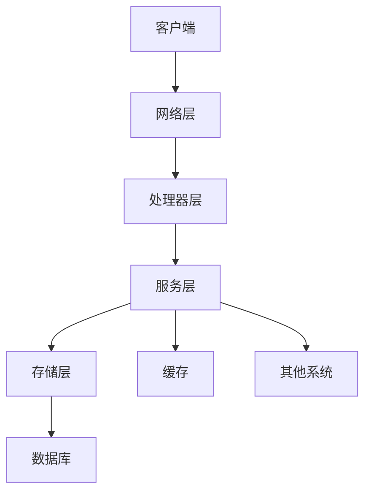
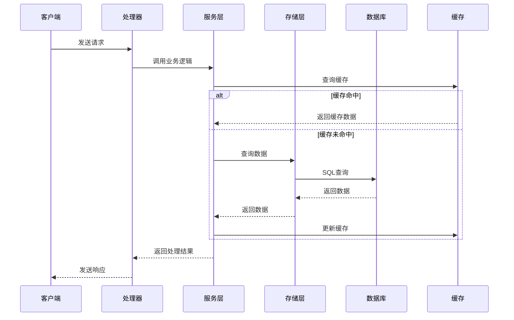

# 系统名称 - 系统概述

## 1. 系统简介

### 1.1 系统定义

[系统名称]是游戏中的[系统类型]系统，用于[系统主要功能描述]。通过[系统核心机制]，为玩家提供[系统价值和意义]。

### 1.2 系统定位

- **在游戏中的地位**：[描述系统在游戏整体架构中的位置和重要性]
- **与其他系统的关系**：[描述与其他系统的交互和依赖关系]
- **目标用户群体**：[描述系统面向的玩家群体]

### 1.3 设计目标

- **功能目标**：[描述系统需要实现的核心功能]
- **性能目标**：[描述系统的性能要求，如响应时间、并发处理能力等]
- **可维护性目标**：[描述系统的可维护性要求，如代码可读性、模块化程度等]
- **可扩展性目标**：[描述系统的可扩展性要求，如支持新功能的添加、配置的调整等]

## 2. 核心功能

### 2.1 功能列表

| 功能模块 | 功能描述 | 优先级 | 状态 |
|---------|---------|--------|------|
| 功能模块1 | [功能描述] | 高/中/低 | 已实现/未实现 |
| 功能模块2 | [功能描述] | 高/中/低 | 已实现/未实现 |
| 功能模块3 | [功能描述] | 高/中/低 | 已实现/未实现 |
| 功能模块4 | [功能描述] | 高/中/低 | 已实现/未实现 |
| 功能模块5 | [功能描述] | 高/中/低 | 已实现/未实现 |

### 2.2 核心功能详细描述

#### 2.2.1 功能模块1

- **功能名称**：[功能模块名称]
- **功能描述**：[详细描述功能的具体内容和实现方式]
- **用户操作流程**：[描述用户使用该功能的操作步骤]
- **系统处理流程**：[描述系统处理该功能的内部流程]
- **异常处理**：[描述系统对异常情况的处理方式]

#### 2.2.2 功能模块2

- **功能名称**：[功能模块名称]
- **功能描述**：[详细描述功能的具体内容和实现方式]
- **用户操作流程**：[描述用户使用该功能的操作步骤]
- **系统处理流程**：[描述系统处理该功能的内部流程]
- **异常处理**：[描述系统对异常情况的处理方式]

#### 2.2.3 功能模块3

- **功能名称**：[功能模块名称]
- **功能描述**：[详细描述功能的具体内容和实现方式]
- **用户操作流程**：[描述用户使用该功能的操作步骤]
- **系统处理流程**：[描述系统处理该功能的内部流程]
- **异常处理**：[描述系统对异常情况的处理方式]

## 3. 系统架构

### 3.1 整体架构

### 3.2 模块划分

| 模块名称 | 主要职责 | 核心类/文件 | 依赖关系 |
|---------|---------|------------|----------|
| 网络层 | 处理客户端请求和响应 | [核心类/文件] | [依赖的模块或服务] |
| 处理器层 | 解析和处理业务消息 | [核心类/文件] | [依赖的模块或服务] |
| 服务层 | 实现核心业务逻辑 | [核心类/文件] | [依赖的模块或服务] |
| 存储层 | 数据的存储和查询 | [核心类/文件] | [依赖的模块或服务] |

### 3.3 核心流程图

## 4. 技术栈

### 4.1 开发语言

- **Java**：[版本号]，用于现有服务端业务逻辑
- **Go**：[版本号]，用于新开发的服务端业务逻辑

### 4.2 框架和库

| 技术/框架 | 版本 | 用途 | 来源 |
|----------|------|------|------|
| Spring Boot | [版本号] | Java服务端框架 | 现有 |
| gRPC | [版本号] | 跨语言服务调用 | 新增 |
| Protobuf | [版本号] | 数据序列化 | 新增 |
| GORM | [版本号] | Go语言ORM框架 | 新增 |
| Redis | [版本号] | 缓存系统 | 现有 |
| MySQL | [版本号] | 关系型数据库 | 现有 |

### 4.3 工具和环境

| 工具 | 版本 | 用途 |
|------|------|------|
| Git | [版本号] | 版本控制 |
| Jenkins | [版本号] | 持续集成/持续部署 |
| Docker | [版本号] | 容器化部署 |
| Prometheus | [版本号] | 监控系统 |
| Grafana | [版本号] | 监控数据可视化 |

## 5. 依赖关系

### 5.1 内部依赖

| 依赖系统 | 依赖类型 | 依赖描述 | 影响范围 |
|---------|---------|---------|----------|
| 系统1 | 强依赖/弱依赖 | [描述依赖的具体内容和方式] | [描述依赖对系统的影响范围] |
| 系统2 | 强依赖/弱依赖 | [描述依赖的具体内容和方式] | [描述依赖对系统的影响范围] |
| 系统3 | 强依赖/弱依赖 | [描述依赖的具体内容和方式] | [描述依赖对系统的影响范围] |

### 5.2 外部依赖

| 依赖服务 | 依赖类型 | 依赖描述 | 影响范围 |
|---------|---------|---------|----------|
| 服务1 | 强依赖/弱依赖 | [描述依赖的具体内容和方式] | [描述依赖对系统的影响范围] |
| 服务2 | 强依赖/弱依赖 | [描述依赖的具体内容和方式] | [描述依赖对系统的影响范围] |
| 服务3 | 强依赖/弱依赖 | [描述依赖的具体内容和方式] | [描述依赖对系统的影响范围] |

## 6. 性能优化

### 6.1 优化目标

- **响应时间**：[描述系统的响应时间目标]
- **并发处理能力**：[描述系统的并发处理能力目标]
- **资源利用率**：[描述系统的资源利用率目标]
- **扩展性**：[描述系统的扩展性目标]

### 6.2 优化策略

#### 6.2.1 缓存策略

- **缓存类型**：[描述使用的缓存类型，如Redis、本地缓存等]
- **缓存策略**：[描述缓存的更新策略，如LRU、TTL等]
- **缓存键设计**：[描述缓存键的设计规则]
- **缓存失效处理**：[描述缓存失效时的处理方式]

#### 6.2.2 数据库优化

- **索引设计**：[描述数据库索引的设计和优化]
- **查询优化**：[描述SQL查询的优化策略]
- **连接池配置**：[描述数据库连接池的配置]
- **批量操作**：[描述批量操作的使用场景和实现方式]

#### 6.2.3 代码优化

- **算法优化**：[描述核心算法的优化策略]
- **数据结构优化**：[描述数据结构的选择和优化]
- **并发控制**：[描述并发控制的实现方式]
- **内存管理**：[描述内存使用的优化策略]

### 6.3 性能监控

- **监控指标**：[描述需要监控的性能指标]
- **监控工具**：[描述使用的监控工具和配置]
- **告警机制**：[描述性能异常时的告警机制]
- **性能分析**：[描述性能分析的方法和工具]

## 7. 安全性

### 7.1 安全威胁

- **数据泄露**：[描述可能的数据泄露风险]
- **注入攻击**：[描述可能的注入攻击风险]
- **跨站脚本**：[描述可能的跨站脚本攻击风险]
- **认证绕过**：[描述可能的认证绕过风险]
- **权限提升**：[描述可能的权限提升风险]

### 7.2 安全措施

#### 7.2.1 数据安全

- **数据加密**：[描述数据加密的实现方式]
- **数据脱敏**：[描述数据脱敏的实现方式]
- **访问控制**：[描述数据访问控制的实现方式]

#### 7.2.2 接口安全

- **接口认证**：[描述接口认证的实现方式]
- **接口授权**：[描述接口授权的实现方式]
- **请求限流**：[描述请求限流的实现方式]
- **参数验证**：[描述参数验证的实现方式]

#### 7.2.3 系统安全

- **防火墙配置**：[描述防火墙的配置]
- **安全补丁**：[描述安全补丁的管理策略]
- **日志审计**：[描述日志审计的实现方式]
- **漏洞扫描**：[描述漏洞扫描的频率和方式]

## 8. 扩展性

### 8.1 功能扩展性

- **模块化设计**：[描述系统的模块化设计]
- **插件机制**：[描述系统的插件机制]
- **配置驱动**：[描述系统的配置驱动设计]

### 8.2 水平扩展性

- **服务拆分**：[描述服务的拆分策略]
- **负载均衡**：[描述负载均衡的实现方式]
- **分布式部署**：[描述分布式部署的架构]

### 8.3 垂直扩展性

- **数据库分片**：[描述数据库分片的策略]
- **缓存集群**：[描述缓存集群的配置]
- **计算资源扩展**：[描述计算资源的扩展策略]

## 9. 总结

### 9.1 系统特点

- **功能特点**：[总结系统的功能特点]
- **技术特点**：[总结系统的技术特点]
- **性能特点**：[总结系统的性能特点]
- **安全特点**：[总结系统的安全特点]

### 9.2 实施计划

- **阶段一**：[描述第一阶段的实施内容和目标]
- **阶段二**：[描述第二阶段的实施内容和目标]
- **阶段三**：[描述第三阶段的实施内容和目标]

### 9.3 风险评估

| 风险类型 | 风险描述 | 影响程度 | 缓解措施 |
|---------|---------|---------|----------|
| 技术风险 | [描述技术风险] | 高/中/低 | [描述缓解措施] |
| 进度风险 | [描述进度风险] | 高/中/低 | [描述缓解措施] |
| 质量风险 | [描述质量风险] | 高/中/低 | [描述缓解措施] |
| 资源风险 | [描述资源风险] | 高/中/低 | [描述缓解措施] |

### 9.4 未来规划

- **功能扩展**：[描述未来可能的功能扩展]
- **技术升级**：[描述未来可能的技术升级]
- **性能优化**：[描述未来可能的性能优化]
- **生态建设**：[描述未来可能的生态建设]